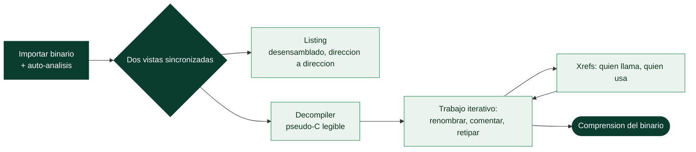

# Clase 131 — Ghidra para ingeniería inversa

> Parte: **5 — Explotación de sistemas y binarios** · Fuente: *Andriesse, Practical Binary Analysis* · docs de la NSA/Ghidra
> ⏱️ Duración estimada: **130 min** · Nivel: **Intermedio**

---

## 🎯 Objetivo

Aprender a usar **Ghidra**, el framework libre de ingeniería inversa de la NSA, para desensamblar y
**decompilar** binarios a pseudo-C legible. Verás cómo crear un proyecto, navegar por funciones,
renombrar variables, corregir tipos y usar el decompilador para entender la lógica de un `crackme`
mucho más rápido que leyendo ensamblador puro.

> ⚠️ **Ética:** analiza solo binarios propios/autorizados.

## 📚 Resultados de aprendizaje

Al finalizar, el alumno podrá:

1. **Crear** un proyecto Ghidra e importar/analizar un binario.
2. **Navegar** entre listing (ASM) y decompiler (pseudo-C).
3. **Renombrar** funciones/variables y **retipar** datos para mejorar la lectura.
4. **Seguir** referencias cruzadas (xrefs) hacia y desde una función.
5. **Automatizar** tareas con scripts (Python/Jython).

## 🗺️ Temas

| # | Tema | Por qué importa |
| --- | --- | --- |
| 1 | Proyecto e importación | Punto de partida |
| 2 | Auto-análisis | Ghidra reconstruye funciones y tipos |
| 3 | Listing vs Decompiler | ASM detallado vs C legible |
| 4 | Renombrar y comentar | Documentar hallazgos |
| 5 | Retipado de estructuras | Legibilidad de structs/arrays |
| 6 | Xrefs | Rastrear flujo de datos y llamadas |
| 7 | Bookmarks y symbol tree | Organizar el análisis |
| 8 | Scripting (GhidraScript) | Automatizar y extraer |

## 🧠 Explicación en profundidad

### El decompilador libre que cambió la ingeniería inversa

**Ghidra** es la suite de ingeniería inversa desarrollada por la NSA y liberada como código abierto
en 2019, y su aparición democratizó una capacidad que antes costaba miles de dólares: un
**decompilador** de calidad profesional. Su valor central es precisamente ese: además de
**desensamblar** (mostrar el ensamblador), Ghidra **decompila**, es decir, reconstruye una
aproximación en **pseudo-C** del código original. Leer `if (strcmp(input, "s3cr3t") == 0)` es
incomparablemente más rápido que descifrar veinte instrucciones de ensamblador que hacen lo mismo, y
por eso el decompilador es la herramienta que hace la RE abordable para quien no vive en el
ensamblador. Ghidra es multiplataforma, gratuito y soporta multitud de arquitecturas, lo que lo ha
convertido en la puerta de entrada estándar a la disciplina.

### El flujo: proyecto, importación y auto-análisis

El trabajo en Ghidra empieza creando un **proyecto** (que agrupa uno o varios binarios) e
**importando** el ejecutable. Al importarlo, Ghidra ofrece ejecutar el **auto-análisis**: una batería
de analizadores que identifican funciones, resuelven referencias, reconocen cadenas, detectan
patrones de código de librería y —crucialmente— generan la decompilación. Este paso automático hace
la mayor parte del trabajo pesado y deja el binario listo para explorar. Conviene entender que el
auto-análisis es **heurístico**: acierta casi siempre, pero puede equivocarse (marcar como datos algo
que es código, o al revés), y parte de la destreza es corregirlo cuando se desvía.



### Las dos vistas y el trabajo iterativo de dar sentido

Ghidra presenta dos vistas **sincronizadas**: el **Listing** (el desensamblado, dirección a
dirección, con todo el detalle) y el **Decompiler** (el pseudo-C). Se navega principalmente por el
decompilador y se recurre al listing cuando hace falta precisión. Pero la RE no es leer pasivamente:
es un proceso **iterativo de anotación** en el que el analista **añade el significado que el
compilador borró**. Se **renombra** una función `FUN_00401230` a `validar_password` cuando se entiende
qué hace; se **comenta** una sección oscura; y —la técnica más potente— se **retipan estructuras**:
decirle a Ghidra que cierto puntero es en realidad un `struct usuario *` con campos concretos hace
que el decompilador reescriba todos los accesos crípticos (`*(int *)(param+8)`) como accesos legibles
(`usuario->edad`). Cada anotación mejora la decompilación de las siguientes, y el binario se va
volviendo comprensible a medida que se documenta.

### Xrefs, navegación y scripting

La herramienta de navegación más usada son las **referencias cruzadas** (*xrefs*): dado una función,
una cadena o una variable, Ghidra muestra **quién la llama y quién la usa**. Es la brújula de la RE
por objetivos de la clase 130: si se busca cómo se valida una contraseña, se localiza la cadena del
mensaje de error con `strings`, se busca su xref para ver **qué función la referencia**, y desde ahí
se sube por las xrefs hasta el punto de decisión. El **symbol tree** y los **bookmarks** organizan el
trabajo en binarios grandes. Y para tareas repetitivas —desofuscar cientos de cadenas cifradas,
renombrar en lote, extraer datos—, Ghidra ofrece **scripting** (GhidraScript, en Java o Python), que
automatiza lo que sería inviable a mano. La lección es que Ghidra no "resuelve" el binario por ti:
es un entorno donde el analista, apoyado en un decompilador potente y en las xrefs, **reconstruye
iterativamente** el significado del programa, y esa reconstrucción documentada es el producto de la
ingeniería inversa.

## 📖 Definiciones y características

- **Ghidra:** SRE framework de código abierto con decompilador propio. *Clave:* gratuito y
  multiplataforma; el decompilador rivaliza con IDA.
- **Decompilador:** genera pseudo-C a partir del ensamblado. *Clave:* mejora enormemente al renombrar y
  retipar variables.
- **Listing:** vista de desensamblado con direcciones, bytes y comentarios. *Clave:* fuente de verdad
  cuando el decompilador se equivoca.
- **Xref (cross-reference):** enlace entre una dirección y quienes la referencian. *Clave:* `Ctrl+Shift+F`
  para ver quién llama a una función.
- **Symbol Tree / Data Type Manager:** paneles para funciones, imports/exports y tipos. *Clave:*
  definir structs mejora todo el decompilado.
- **GhidraScript:** API para automatizar (Python/Jython o Java). *Clave:* util para desofuscar o
  extraer cadenas en lote.

## 📔 Glosario

| Término | Definición concisa |
|---------|--------------------|
| Ghidra | Suite de RE libre de la NSA, con decompilador |
| Desensamblar | Mostrar el ensamblador del binario |
| Decompilar | Reconstruir pseudo-C del código original |
| Pseudo-C | Aproximación en C que produce el decompilador |
| Proyecto | Agrupación de binarios en Ghidra |
| Auto-análisis | Analizadores que identifican funciones y generan la decompilación |
| Heurístico | El auto-análisis acierta casi siempre pero puede fallar |
| Listing | Vista de desensamblado, dirección a dirección |
| Decompiler | Vista de pseudo-C legible |
| Renombrar / comentar | Añadir el significado que el compilador borró |
| Retipar estructuras | Declarar tipos para que la decompilación sea legible |
| Xref | Referencia cruzada: quién llama o usa algo |
| Symbol tree / bookmarks | Organización del trabajo en binarios grandes |
| GhidraScript | Scripting para automatizar tareas de RE |

## 🧰 Herramientas y preparación

```bash
# Requiere JDK; descarga Ghidra desde el sitio oficial:
# https://ghidra-sre.org/  (o el repo de GitHub de la NSA)
# Descomprime y ejecuta:
./ghidraRun
```

Ten a mano un `crackme` de práctica (por ejemplo, el de la clase 130).

## 🧪 Laboratorio guiado

> Entorno propio.

1. Crea un proyecto no compartido (`File → New Project`), importa el `crackme` y acepta el **auto-análisis**.

2. En el Symbol Tree abre `main`; observa el panel Decompiler (pseudo-C) junto al Listing.

3. Localiza la comparación de la clave. Renombra variables genéricas (`local_28` → `input`,
   `uVar1` → `len`) con `L` para clarificar la lógica.

4. Sigue las xrefs de la cadena del prompt: haz doble clic en la string en Defined Strings y usa
   `References → Show References to`.

5. Retipa un buffer como `char[32]` para que el decompilador muestre la clave esperada de forma legible.

6. Deduce la contraseña/serial válido a partir del pseudo-C (comparación, transformación, longitud).

7. (Opcional) Escribe un GhidraScript en Python que liste todas las funciones que llaman a `strcmp`.

8. Verifica tu hipótesis ejecutando el `crackme` con la clave deducida.

## ✍️ Ejercicios

1. Renombra y comenta `main` hasta que el pseudo-C sea autoexplicativo.
2. Define una `struct` para un objeto que el binario usa y aplícala.
3. Usa xrefs para encontrar todas las llamadas a la función de validación.
4. Extrae con un script la lista de imports del binario.
5. Compara el Listing y el Decompiler en una función donde difieran.
6. Exporta un informe/anotaciones del análisis.

## 📝 Reto verificable

Usando solo Ghidra (sin ejecutar hasta el final), deduce la clave válida de un `crackme` y luego
compruébala ejecutándolo.

**Criterio de aceptación:** el `crackme` acepta la clave que dedujiste del pseudo-C, y documentas en
comentarios de Ghidra cómo llegaste a ella.

## ⚠️ Errores comunes

| Síntoma / mensaje | Causa y cómo arreglar |
| --- | --- |
| Decompilado ilegible | Renombra/retipa variables; define structs |
| Ghidra no arranca | Falta JDK compatible; instala el JDK requerido |
| Funciones no reconocidas | Reejecuta auto-análisis o define funciones manualmente |
| El decompilador "miente" | Contrasta con el Listing (ASM) real |
| Strings no aparecen | Están cifradas; combínalo con análisis dinámico |

## ❓ Preguntas frecuentes

**❓ ¿Ghidra o IDA?** Ghidra es gratuito y muy capaz; IDA es el estándar comercial. Aprende ambos si
puedes (IDA/radare2 en la clase 132).

**❓ ¿El decompilado es fiable?** Es una aproximación; para detalles finos (offsets, flags) confía en
el Listing.

**❓ ¿Puedo automatizar?** Sí, con GhidraScript o el modo headless (`analyzeHeadless`) para lotes.

## 🔗 Referencias

- Ghidra (NSA) — <https://ghidra-sre.org/>
- Ghidra en GitHub — <https://github.com/NationalSecurityAgency/ghidra>
- Andriesse, D. *Practical Binary Analysis*. No Starch Press.
- The Ghidra Book (Eagle & Nance), No Starch Press.

## 📥 Material descargable

- 📄 [Guía en PDF](./clase-131-guia.pdf) — versión imprimible de esta clase.
- 🎞️ [Presentación (PPTX)](./clase-131-presentacion.pptx) — deck para proyectar en clase.

## ⬅️ Clase anterior

[Clase 130 — Ingeniería inversa: introducción](../130-ingenieria-inversa-introduccion/README.md)

## ➡️ Siguiente clase

[Clase 132 — IDA Pro y radare2](../132-ida-pro-y-radare2/README.md)
