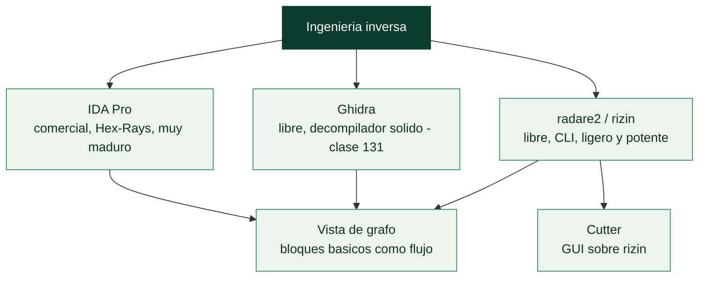

# Clase 132 — IDA Pro y radare2

> Parte: **5 — Explotación de sistemas y binarios** · Fuente: *Eagle, The IDA Pro Book* · docs de radare2/rizin
> ⏱️ Duración estimada: **120 min** · Nivel: **Intermedio**

---

## 🎯 Objetivo

Conocer los otros dos pilares del reversing: **IDA Pro** (estándar comercial, con Hex-Rays) y
**radare2/rizin** (framework libre de línea de comandos, con Cutter como GUI). Aprenderás a moverte por
un binario en ambos, a comparar sus filosofías (GUI vs REPL) y a elegir la herramienta según la tarea.

> ⚠️ **Ética:** solo binarios propios/autorizados.

## 📚 Resultados de aprendizaje

Al finalizar, el alumno podrá:

1. **Navegar** un binario en IDA (grafos, pseudo-C de Hex-Rays, xrefs).
2. **Analizar** el mismo binario en radare2 con los comandos esenciales.
3. **Comparar** flujos de trabajo GUI (IDA/Cutter) vs REPL (r2).
4. **Renombrar/anotar** en ambas herramientas.
5. **Automatizar** con r2pipe.

## 🗺️ Temas

| # | Tema | Por qué importa |
| --- | --- | --- |
| 1 | IDA: vista de grafo y pseudo-C | Análisis visual potente |
| 2 | Hex-Rays decompiler | C legible en IDA |
| 3 | radare2: modelo de comandos | Todo desde el teclado |
| 4 | aaa / afl / pdf en r2 | Análisis y desensamblado |
| 5 | Modo visual y grafo en r2 | `V`, `VV` |
| 6 | Cutter (GUI de r2/rizin) | Puente para quien viene de GUI |
| 7 | Anotar y renombrar | Documentar el análisis |
| 8 | r2pipe / scripting | Automatización |

## 🧠 Explicación en profundidad

### El estándar comercial y la navaja de código abierto

Ghidra no es la única herramienta de RE, y conocer el ecosistema completo hace al analista más
versátil. **IDA Pro** es el desensamblador comercial que fue durante décadas el estándar de la
industria: su decompilador **Hex-Rays** es referencia por su calidad, su análisis es muy maduro y su
ecosistema de plugins es enorme. Su inconveniente es el **precio** (caro, aunque existe una versión
gratuita limitada), razón por la que Ghidra ganó tanta tracción. **radare2** (y su sucesor rizin) es
el extremo opuesto: una suite de RE **libre, ligera y basada en línea de comandos**, extraordinariamente
potente pero con una **curva de aprendizaje pronunciada** por su modelo de comandos denso. Los tres
—Ghidra, IDA, radare2— hacen esencialmente lo mismo (desensamblar, decompilar, navegar), y la elección
depende del presupuesto, la preferencia y la tarea; un profesional se maneja al menos con dos.



### IDA y la vista de grafo: leer el flujo de control

La aportación conceptual de IDA que conviene interiorizar es la **vista de grafo**: en lugar de
mostrar el código como una lista lineal de instrucciones, lo presenta como un **diagrama de bloques
básicos** conectados por flechas que representan los saltos —cada bloque es una secuencia sin saltos,
y las flechas muestran las bifurcaciones (`if`/`else`) y los bucles—. Esta visualización del **flujo
de control** hace evidente de un vistazo la estructura de una función: dónde están las decisiones, los
bucles, los caminos de error. Todas las herramientas modernas (Ghidra, radare2) la ofrecen, pero fue
IDA quien la popularizó, y es la forma natural de entender una función compleja. Su decompilador
**Hex-Rays** complementa el grafo con el pseudo-C, igual que Ghidra.

### radare2: el modelo de comandos y sus verbos

**radare2** funciona con un lenguaje de **comandos cortos y componibles** que sorprende al principio
pero es muy eficiente una vez asimilado. La secuencia canónica de arranque es **`aaa`** (analizar
todo: funciones, referencias, cadenas), tras la cual **`afl`** lista las funciones encontradas,
**`pdf`** (*print disassembly function*) desensambla la función actual, y **`s`** (*seek*) mueve el
cursor a una dirección. El **modo visual** (`V`) y el **modo grafo** (`VV`) ofrecen navegación
interactiva similar a la de IDA. La filosofía de r2 es que **todo es un comando** y los comandos se
combinan, lo que lo hace idóneo para automatizar y para trabajar sobre servidores sin interfaz
gráfica. Para quien prefiere una GUI, **Cutter** es una interfaz gráfica construida sobre rizin que
ofrece la potencia de r2 con una experiencia visual más cercana a IDA/Ghidra.

### Anotar, renombrar y automatizar con r2pipe

Como en Ghidra, el trabajo en cualquiera de estas herramientas es **iterativo y anotado**: se
renombran funciones y variables (en r2, comandos como `afn` para renombrar una función), se añaden
comentarios (`CC`), se marcan estructuras, y cada anotación clarifica el análisis. La automatización
llega con **r2pipe**, una API que permite **controlar radare2 desde un script** (Python, JavaScript y
otros): se envían comandos de r2 y se recibe su salida como datos, lo que abre la puerta a análisis
programáticos —extraer todas las cadenas cifradas y descifrarlas, buscar patrones en cientos de
funciones, generar informes—. IDA tiene su equivalente (IDAPython) y Ghidra el suyo (GhidraScript). La
lección de la clase es que **la RE profesional combina herramientas**: se puede triar con radare2 en
la línea de comandos, decompilar en Ghidra para leer el pseudo-C, y usar Hex-Rays de IDA cuando su
decompilación sea superior en un caso concreto; dominar el ecosistema, no una sola herramienta, es lo
que distingue al analista experimentado.

## 📖 Definiciones y características

- **IDA Pro:** desensamblador/decompilador comercial líder. *Clave:* Hex-Rays produce pseudo-C de alta
  calidad; existe IDA Free con capacidades limitadas.
- **radare2 / rizin:** framework libre orientado a comandos. *Clave:* curva pronunciada pero muy potente
  y scriptable; rizin es un fork con Cutter.
- **Cutter:** GUI para radare2/rizin. *Clave:* facilita la transición desde IDA/Ghidra.
- **Grafo de control de flujo (CFG):** representación visual de bloques y saltos. *Clave:* IDA y r2
  (`VV`) lo muestran para entender la lógica.
- **r2pipe:** API para pilotar r2 desde Python. *Clave:* automatiza extracción y análisis en lote.

## 📔 Glosario

| Término | Definición concisa |
|---------|--------------------|
| IDA Pro | Desensamblador comercial estándar de la industria |
| Hex-Rays | Decompilador de IDA, referencia de calidad |
| radare2 / rizin | Suite de RE libre, ligera y de línea de comandos |
| Cutter | GUI construida sobre rizin |
| Vista de grafo | Código como bloques básicos conectados por saltos |
| Bloque básico | Secuencia de instrucciones sin saltos |
| Flujo de control | Estructura de decisiones y bucles de una función |
| aaa | Comando de r2: analizar todo |
| afl | Lista las funciones encontradas |
| pdf | Desensambla la función actual |
| s (seek) | Mueve el cursor a una dirección |
| Modo visual / grafo | Navegación interactiva en r2 (`V` / `VV`) |
| r2pipe | API para controlar r2 desde un script |
| IDAPython | Scripting de IDA |

## 🧰 Herramientas y preparación

```bash
# radare2
git clone https://github.com/radareorg/radare2 && radare2/sys/install.sh
# o: sudo apt install radare2
pip install r2pipe
# IDA Free: descargar desde hex-rays.com (opcional)
# Cutter: https://cutter.re/
```

## 🧪 Laboratorio guiado

> Entorno propio.

1. Abre el `crackme` en radare2 y analiza:

   ```bash
   r2 -A ./crackme      # -A ejecuta aaa (análisis)
   [0x...]> afl         # lista funciones
   [0x...]> s main; pdf # desensambla main
   [0x...]> VV @ main   # grafo interactivo (q para salir)
   ```

2. Renombra y comenta en r2:

   ```text
   afvn old_name input     ; renombrar variable
   CCu "clave se compara aqui" @ 0x...   ; comentario
   ```

3. Busca cadenas y sus xrefs:

   ```text
   izz            ; todas las strings
   axt @ str.Enter_password   ; quién referencia esa string
   ```

4. Si tienes IDA Free/Cutter, abre el mismo binario, ejecuta el análisis y compara la vista de grafo y
   el pseudo-C con lo que viste en r2.

5. Deduce la clave válida en cualquiera de las dos y verifícala ejecutando el binario.

6. Automatiza con r2pipe: script Python que imprima todas las funciones y sus tamaños:

   ```python
   import r2pipe
   r = r2pipe.open("./crackme"); r.cmd("aaa")
   for f in r.cmdj("aflj"): print(f["name"], f["size"])
   ```

## ✍️ Ejercicios

1. Lista y comenta las diferencias de flujo IDA (GUI) vs r2 (REPL).
2. Usa `pdc` (pseudo-decompile) de r2 y compáralo con Hex-Rays.
3. Renombra tres variables en Cutter y en r2 puro.
4. Extrae con r2pipe todas las llamadas a `strcmp`.
5. Navega el CFG en `VV` e identifica el bloque de "éxito".
6. Exporta el análisis a un proyecto de r2 (`Ps`).

## 📝 Reto verificable

Analiza un `crackme` con radare2 (sin GUI) y deduce la clave válida usando solo comandos de r2.

**Criterio de aceptación:** obtienes la clave correcta trabajando desde la consola de r2 y documentas
los comandos usados (`afl`, `pdf`, `izz`, `axt`, etc.).

## ⚠️ Errores comunes

| Síntoma / mensaje | Causa y cómo arreglar |
| --- | --- |
| `afl` vacío | No corriste el análisis; usa `-A` o `aaa` |
| Te pierdes en r2 | Empieza con `?` y `V`/`VV`; ve incrementando comandos |
| pseudo-C de r2 pobre | Usa Cutter/Ghidra para decompilar; r2 brilla en control fino |
| IDA Free no decompila esa arch | Hex-Rays por arquitectura es limitado en Free |
| Cambios no persisten | Guarda el proyecto (`Ps`) o la base de IDA (.idb) |

## ❓ Preguntas frecuentes

**❓ ¿Cuál aprendo primero?** Ghidra (gratis, decompilador) para entender; r2 para control y scripting;
IDA si tu entorno lo usa.

**❓ ¿radare2 o rizin?** rizin es un fork más estable con Cutter integrado; los comandos son casi
idénticos.

**❓ ¿Puedo combinar herramientas?** Sí: es común triage con r2, decompilar con Ghidra/IDA y depurar con
GDB.

## 🔗 Referencias

- Eagle, C. *The IDA Pro Book, 2e*. No Starch Press.
- radare2 book — <https://book.rada.re/>
- Cutter — <https://cutter.re/>
- Hex-Rays / IDA — <https://hex-rays.com/>

## 📥 Material descargable

- 📄 [Guía en PDF](./clase-132-guia.pdf) — versión imprimible de esta clase.
- 🎞️ [Presentación (PPTX)](./clase-132-presentacion.pptx) — deck para proyectar en clase.

## ⬅️ Clase anterior

[Clase 131 — Ghidra para ingeniería inversa](../131-ghidra-para-ingenieria-inversa/README.md)

## ➡️ Siguiente clase

[Clase 133 — Análisis estático de binarios](../133-analisis-estatico-de-binarios/README.md)
