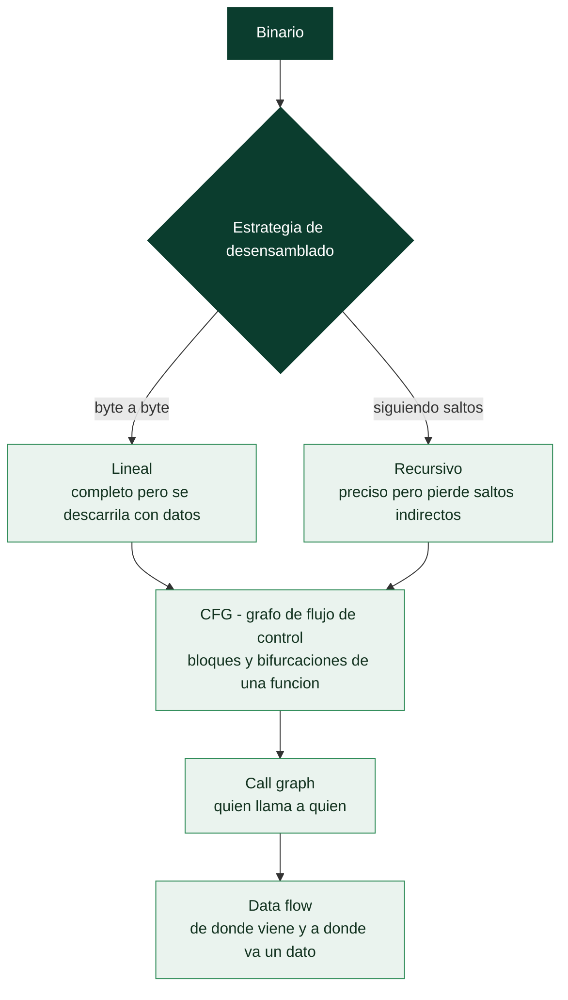

# Clase 133 — Análisis estático de binarios

> Parte: **5 — Explotación de sistemas y binarios** · Fuente: *Andriesse, Practical Binary Analysis*
> ⏱️ Duración estimada: **120 min** · Nivel: **Avanzado**

---

## 🎯 Objetivo

Profundizar en el **análisis estático**: entender un binario sin ejecutarlo. Estudiarás el desensamblado
(lineal vs recursivo), la reconstrucción del grafo de control de flujo (CFG) y de llamadas (call graph),
el análisis de flujo de datos elemental y los límites del enfoque estático frente a código ofuscado o
generado dinámicamente. Es la base rigurosa del reversing profesional.

> ⚠️ **Ética:** solo binarios propios/autorizados.

## 📚 Resultados de aprendizaje

Al finalizar, el alumno podrá:

1. **Distinguir** desensamblado lineal y recursivo y sus fallos típicos.
2. **Reconstruir** el CFG y el call graph de una función.
3. **Aplicar** análisis de flujo de datos básico (def-use, propagación de constantes).
4. **Reconocer** los límites del análisis estático (packing, JIT, indirect calls).
5. **Combinar** herramientas (objdump, Ghidra, capstone) para un análisis reproducible.

## 🗺️ Temas

| # | Tema | Por qué importa |
| --- | --- | --- |
| 1 | Desensamblado lineal | Simple pero se confunde con datos |
| 2 | Desensamblado recursivo | Sigue el flujo; más preciso |
| 3 | CFG (control flow graph) | Estructura lógica de la función |
| 4 | Call graph | Relaciones entre funciones |
| 5 | Data flow básico | Rastrear valores y constantes |
| 6 | Detección de funciones | Prólogos y heurísticas |
| 7 | Límites: packing, indirección | Cuándo el estático no basta |
| 8 | capstone/pyelftools | Automatizar el análisis |

## 🧠 Explicación en profundidad

### Entender sin ejecutar, y los límites de hacerlo

El **análisis estático** examina un binario **sin ejecutarlo**, razonando sobre su código. Sus
ventajas son grandes: es **seguro** (no se ejecuta código potencialmente malicioso, crucial para
malware), da una **visión completa** de todos los caminos posibles del programa (no solo los que se
ejecutan en una corrida concreta), y no requiere el entorno exacto del binario. Su reto es que hay que
**deducir el comportamiento** de un código que puede ser enorme y del que se ha borrado el significado.
Esta clase sistematiza los conceptos que estructuran ese análisis, que las herramientas de las clases
anteriores implementan.

### Los dos algoritmos de desensamblado, y por qué importa

Antes de leer código hay que **desensamblarlo**, y hay dos estrategias con propiedades opuestas. El
**desensamblado lineal** recorre los bytes **de principio a fin**, interpretando cada uno como una
instrucción tras la anterior. Es simple y completo, pero se **descarrila** cuando encuentra datos
mezclados con código (una tabla de saltos, una cadena embebida): los interpreta como instrucciones y
a partir de ahí desensambla basura. El **desensamblado recursivo** sigue el **flujo de control**:
empieza en un punto de entrada y sigue los saltos y llamadas, desensamblando solo lo que es
alcanzable como código. Es mucho más preciso —no confunde datos con código— pero puede **perderse
código** al que solo se llega por saltos indirectos (un puntero a función calculado en ejecución), que
no puede seguir estáticamente. Las herramientas modernas combinan ambos con heurísticas, y entender
esta tensión explica por qué a veces un desensamblador "no ve" una función o muestra basura.



### Los grafos que estructuran el análisis

Sobre el desensamblado se construyen las abstracciones que hacen navegable un binario. El **CFG**
(*Control Flow Graph*) representa una función como el grafo de sus **bloques básicos** y las
bifurcaciones entre ellos —es la vista de grafo de la clase 132, formalizada—; muestra la estructura
de decisiones y bucles. El **call graph** sube un nivel: representa **qué función llama a qué**,
dando el mapa de la arquitectura del programa. Y el **análisis de flujo de datos** (*data flow*)
sigue **de dónde viene y a dónde va un valor** —por ejemplo, rastrear si la entrada del usuario llega
sin validar a una función peligrosa, que es la base del *taint analysis* de la clase 137—. Estos tres
—CFG, call graph, data flow— son el andamiaje conceptual del análisis estático, y las herramientas los
calculan automáticamente.

### Detección de funciones, límites y librerías

Un problema práctico del análisis estático es **identificar las funciones** en un binario stripped:
sin símbolos, hay que reconocer dónde empieza y acaba cada función por sus prólogos/epílogos y por las
llamadas, lo que las herramientas hacen con heurísticas (y a veces fallan). Un caso especial son las
**funciones de librería** enlazadas estáticamente: un binario puede incluir el código de `printf`,
`malloc` y cientos de funciones de libc, que abruman el análisis; técnicas como **FLIRT** (en IDA) o
las firmas de Ghidra las **reconocen y etiquetan** para que el analista se concentre en el código
propio. Los **límites** del análisis estático son importantes y honestos: la **ofuscación** y el
**packing** (clase 135) lo dificultan enormemente —un binario empaquetado no revela su código real
hasta que se ejecuta y se desempaqueta—, y la **indirección** (saltos y llamadas calculados en
ejecución) esconde caminos que solo el análisis dinámico revela. Para automatizar tareas de análisis
estático a bajo nivel existen librerías como **capstone** (motor de desensamblado) y **pyelftools**
(parseo de ELF), que permiten construir herramientas propias. La lección es que el análisis estático
es potente y seguro pero **incompleto por naturaleza**, y por eso se complementa con el dinámico de la
clase 134.

## 📖 Definiciones y características

- **Desensamblado lineal:** decodifica byte a byte de inicio a fin. *Clave:* rápido, pero interpreta
  datos incrustados como código (errores de sincronización).
- **Desensamblado recursivo:** sigue saltos/llamadas desde el entry point. *Clave:* más preciso; puede
  perder código alcanzado solo por saltos indirectos.
- **CFG:** grafo de bloques básicos y aristas de salto. *Clave:* revela bucles, ramas y estructura.
- **Call graph:** grafo de qué función llama a cuál. *Clave:* ayuda a priorizar funciones interesantes.
- **Análisis def-use:** dónde se define y usa un valor. *Clave:* base para propagación de constantes y
  detección de datos controlados por el usuario.
- **Límites del estático:** packing, cifrado, self-modifying code, saltos indirectos. *Clave:* exigen
  complementar con análisis dinámico (clase 134).

## 📔 Glosario

| Término | Definición concisa |
|---------|--------------------|
| Análisis estático | Examinar el binario sin ejecutarlo |
| Desensamblado lineal | Recorre los bytes en orden; se descarrila con datos |
| Desensamblado recursivo | Sigue el flujo de control; pierde saltos indirectos |
| Descarrilamiento | Interpretar datos como instrucciones |
| Salto indirecto | Destino calculado en ejecución; invisible en estático |
| CFG | Grafo de flujo de control de una función |
| Bloque básico | Secuencia sin saltos |
| Call graph | Grafo de qué función llama a qué |
| Data flow | Seguir de dónde viene y a dónde va un valor |
| Detección de funciones | Reconocer límites de función en un binario stripped |
| FLIRT / firmas | Reconocer funciones de librería enlazadas |
| Packing | Empaquetado que oculta el código hasta ejecutarse |
| capstone / pyelftools | Librerías para construir herramientas de análisis |
| Límite del estático | Ofuscación e indirección lo hacen incompleto |

## 🧰 Herramientas y preparación

```bash
pip install capstone pyelftools
sudo apt install -y binutils
# Ghidra para CFG/decompilado (clase 131)
```

## 🧪 Laboratorio guiado

> Entorno propio.

1. Compara desensamblado lineal vs recursivo en un binario con datos incrustados:

   ```bash
   objdump -d crackme          # lineal (GNU)
   # En Ghidra/IDA/r2 el análisis es recursivo: contrasta la función donde difieren
   ```

2. Reconstruye el CFG de `main` en Ghidra (Window → Function Graph) e identifica bucles y ramas de
   éxito/fracaso.

3. Escribe un desensamblador mínimo con capstone para ver cómo se decodifican instrucciones:

   ```python
   from capstone import *
   from elftools.elf.elffile import ELFFile
   f = ELFFile(open("crackme","rb"))
   text = f.get_section_by_name(".text")
   code, addr = text.data(), text["sh_addr"]
   md = Cs(CS_ARCH_X86, CS_MODE_64)
   for i in md.disasm(code, addr):
       print(f"0x{i.address:x}:\t{i.mnemonic}\t{i.op_str}")
   ```

4. Haz un análisis def-use manual de la variable de entrada: dónde se lee (`scanf`), dónde se compara,
   qué transformación sufre.

5. Empaqueta un binario con `upx` y muestra que el desensamblado estático solo ve el stub (límite del
   estático):

   ```bash
   upx -9 crackme -o crackme.packed
   objdump -d crackme.packed | head    # apenas el descompresor
   ```

6. Documenta qué preguntas quedan sin responder por estático y requerirán dinámico.

## ✍️ Ejercicios

1. Encuentra un caso donde el desensamblado lineal se desincronice.
2. Dibuja el CFG de una función con un bucle y una condición.
3. Construye el call graph parcial de un binario pequeño.
4. Usa capstone para contar cuántas instrucciones `call` hay en `.text`.
5. Detecta con `upx -t`/entropía si un binario está empacado.
6. Identifica un salto indirecto (`jmp rax`) y explica por qué complica el estático.

## 📝 Reto verificable

Con capstone y pyelftools, escribe un script que liste todas las instrucciones `call` de `.text` con
su dirección y, cuando sea directo, la función destino.

**Criterio de aceptación:** el script imprime las llamadas directas resueltas correctamente
(verificable contra `objdump -d`) y marca las indirectas como "no resueltas".

## ⚠️ Errores comunes

| Síntoma / mensaje | Causa y cómo arreglar |
| --- | --- |
| Desensamblado "basura" a mitad | Datos incrustados; usa análisis recursivo (Ghidra/r2) |
| Faltan funciones en el CFG | Alcanzadas por saltos indirectos; complementa con dinámico |
| capstone no decodifica | Modo/arquitectura equivocados (32 vs 64) |
| Binario "vacío" en objdump | Está empacado (UPX u otro); desempácalo primero |
| Call destino incorrecto | Confundes dirección relativa con absoluta |

## ❓ Preguntas frecuentes

**❓ ¿Estático o dinámico?** El estático da visión global sin ejecutar; el dinámico revela lo que solo
ocurre en runtime. Se complementan.

**❓ ¿Cómo detecto packing?** Alta entropía, pocas secciones, imports mínimos, o firmas conocidas
(`upx`).

**❓ ¿Puedo resolver saltos indirectos estáticamente?** A veces con análisis de valores; en general
requieren ejecución/emulación.

## 🔗 Referencias

- Andriesse, D. *Practical Binary Analysis*, caps. 5-8. No Starch Press.
- Capstone Engine — <https://www.capstone-engine.org/>
- pyelftools — <https://github.com/eliben/pyelftools>
- UPX — <https://upx.github.io/>

## 📥 Material descargable

- 📄 [Guía en PDF](./clase-133-guia.pdf) — versión imprimible de esta clase.
- 🎞️ [Presentación (PPTX)](./clase-133-presentacion.pptx) — deck para proyectar en clase.

## ⬅️ Clase anterior

[Clase 132 — IDA Pro y radare2](../132-ida-pro-y-radare2/README.md)

## ➡️ Siguiente clase

[Clase 134 — Análisis dinámico y debugging de binarios](../134-analisis-dinamico-y-debugging-de-binarios/README.md)
