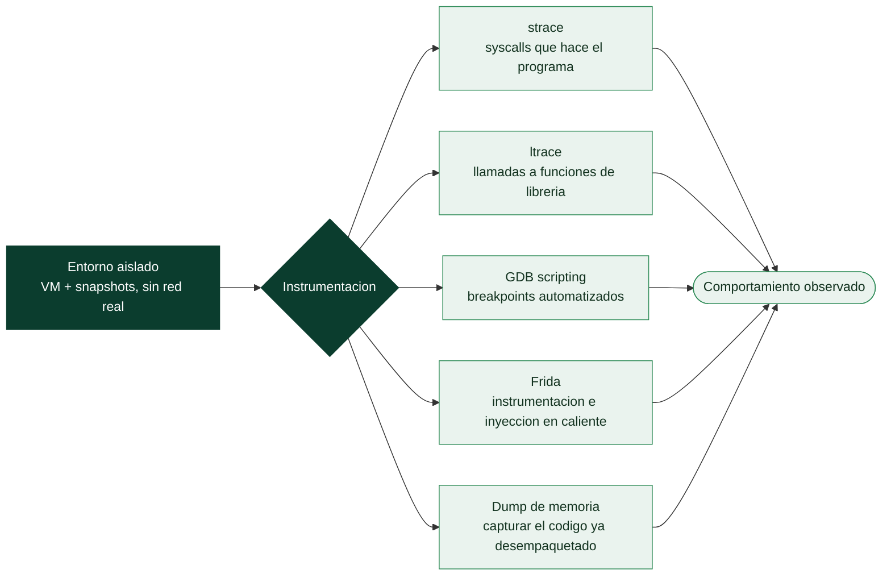

# Clase 134 — Análisis dinámico y debugging de binarios

> Parte: **5 — Explotación de sistemas y binarios** · Fuente: *Andriesse, Practical Binary Analysis*
> ⏱️ Duración estimada: **120 min** · Nivel: **Avanzado**

---

## 🎯 Objetivo

Observar el binario **en ejecución** para revelar lo que el análisis estático no puede: valores en
runtime, rutas realmente tomadas, cadenas descifradas, llamadas a librería y syscalls. Combinarás
`ltrace`/`strace`, GDB con scripting, tracing con Frida y emulación selectiva, cerrando el ciclo
estático↔dinámico del reversing.

> ⚠️ **Ética:** ejecuta binarios desconocidos solo en una VM aislada (sin red hacia producción,
> snapshots antes/después). Solo binarios propios/autorizados.

## 📚 Resultados de aprendizaje

Al finalizar, el alumno podrá:

1. **Trazar** llamadas a librería y syscalls con `ltrace`/`strace`.
2. **Automatizar** GDB con breakpoints condicionales y scripts.
3. **Instrumentar** funciones en runtime con Frida.
4. **Descifrar** cadenas/lógica que solo aparecen al ejecutar.
5. **Aislar** el entorno de análisis con seguridad.

## 🗺️ Temas

| # | Tema | Por qué importa |
| --- | --- | --- |
| 1 | Aislamiento (VM/snapshots) | Ejecutar sin riesgo |
| 2 | strace (syscalls) | Qué pide al kernel |
| 3 | ltrace (funciones de librería) | Argumentos reales de `strcmp`, etc. |
| 4 | GDB scripting | Breakpoints condicionales, hooks |
| 5 | Frida | Instrumentación dinámica flexible |
| 6 | Dump de memoria | Extraer cadenas descifradas |
| 7 | Emulación (Unicorn/qiling) | Ejecutar fragmentos sin todo el entorno |
| 8 | Cierre estático↔dinámico | Metodología combinada |

## 🧠 Explicación en profundidad

### Ver el programa en marcha, con red de seguridad

El **análisis dinámico** complementa al estático **ejecutando** el binario y observando su
comportamiento real. Su ventaja es enorme: muestra **lo que el programa hace de verdad** —qué
ficheros abre, qué conexiones hace, qué memoria toca, cómo se desempaqueta— sin tener que deducirlo del
código, y atraviesa la ofuscación que frena al análisis estático (un binario empaquetado, al
ejecutarse, **revela su código real** en memoria). Su limitación es que solo observa los caminos que
**efectivamente se ejecutan** en esa corrida, no todos los posibles. Y tiene un riesgo que define su
metodología: **ejecutar código potencialmente malicioso**, de ahí que el primer requisito, no
negociable, sea el **aislamiento**.

### El aislamiento: la regla que no se salta

Antes de ejecutar cualquier binario desconocido —y siempre en el análisis de malware (Parte 6)— se
monta un **entorno aislado**: una **máquina virtual** dedicada, sin acceso a datos reales, idealmente
sin red o con una red simulada, y con **snapshots** ([Clase 004](../../parte-0-fundamentos-y-prerrequisitos/004-montaje-del-laboratorio-virtualizacion-kali-snapshots-y-aislamiento-de-red/README.md)) para volver a un estado
limpio en segundos tras cada ejecución. Ejecutar malware en la máquina de trabajo es el error que
convierte al analista en la primera víctima. Con el laboratorio aislado, el análisis dinámico es
seguro; sin él, es una imprudencia.



### Observar las llamadas: strace, ltrace y GDB

Las herramientas de observación se ordenan por el nivel que vigilan. **`strace`** intercepta y registra
todas las **llamadas al sistema** que hace el programa —abrir un fichero, crear un socket, leer, escribir,
ejecutar otro programa—, dando una imagen clara de cómo el binario **interactúa con el sistema
operativo**: para malware, `strace` a menudo revela de golpe su propósito (crea un fichero de
persistencia, conecta a un C2, cifra ficheros). **`ltrace`** hace lo análogo un nivel más arriba,
registrando las **llamadas a funciones de librería** (`strcmp`, `malloc`, funciones de cifrado), lo
que puede mostrar, por ejemplo, la contraseña que un programa compara o la clave que usa. Y **GDB**
(clase 118), con scripting, permite **automatizar** la observación: poner breakpoints en funciones de
interés y volcar automáticamente sus argumentos cada vez que se llaman, convirtiendo el depurador en un
instrumento de análisis además de de exploiting.

### Frida, dumps y el cierre del ciclo

La herramienta más versátil del análisis dinámico moderno es **Frida**, un framework de
**instrumentación dinámica** que permite **inyectar código propio (en JavaScript) en un proceso en
marcha**: interceptar cualquier función, ver y modificar sus argumentos y su valor de retorno, y
alterar el comportamiento en caliente sin recompilar. Frida es omnipresente en el análisis de apps
móviles y de software con protecciones, porque permite, por ejemplo, **saltarse una comprobación de
licencia o de root** cambiando en vivo lo que una función devuelve. El **dump de memoria** —capturar el
contenido de la memoria del proceso en un momento dado— resuelve el problema del *packing*: se deja que
el binario se desempaquete a sí mismo en memoria y luego se **vuelca el código ya desempaquetado** para
analizarlo estáticamente. Para casos donde ejecutar el binario completo es inviable o peligroso, la
**emulación** (**Unicorn**, **Qiling**) ejecuta fragmentos de código en un entorno simulado y
controlado. El mensaje de la clase, y el que cierra el bloque de RE, es el **ciclo estático↔dinámico**:
el análisis estático da el mapa completo pero opaco; el dinámico confirma qué caminos se recorren de
verdad y revela lo que estaba oculto (código desempaquetado, valores calculados); y el analista
**alterna** entre ambos —lee estáticamente una función sospechosa, pone un breakpoint para ver sus
datos reales, vuelve al estático con esa información— hasta reconstruir el comportamiento del binario.

## 📖 Definiciones y características

- **Análisis dinámico:** estudio del binario mientras corre. *Clave:* revela datos y rutas que el
  estático no ve.
- **strace / ltrace:** trazan syscalls y llamadas a librerías con sus argumentos. *Clave:* `ltrace`
  muestra el `strcmp(input, "clave")` directamente.
- **Breakpoint condicional:** se detiene solo si una condición se cumple. *Clave:* `break f if x==0x41`
  evita paradas inútiles.
- **Frida:** toolkit de instrumentación dinámica con scripts JS. *Clave:* hookea funciones y modifica
  su comportamiento en vivo.
- **Emulación selectiva (Unicorn/Qiling):** ejecutar solo una porción del binario. *Clave:* útil para
  desofuscar rutinas sin todo el entorno.
- **Dump de memoria:** volcar regiones para recuperar cadenas descifradas. *Clave:* en GDB con
  `dump memory`.

## 📔 Glosario

| Término | Definición concisa |
|---------|--------------------|
| Análisis dinámico | Ejecutar el binario y observar su comportamiento |
| Aislamiento | VM dedicada con snapshots para ejecutar con seguridad |
| Snapshot | Estado guardado al que volver tras cada ejecución |
| strace | Registra las llamadas al sistema del programa |
| ltrace | Registra las llamadas a funciones de librería |
| GDB scripting | Automatizar breakpoints y volcado de argumentos |
| Frida | Instrumentación dinámica; inyecta código en un proceso vivo |
| Interceptar función | Ver y modificar argumentos y retorno en caliente |
| Dump de memoria | Capturar el código ya desempaquetado |
| Desempaquetado en memoria | El binario revela su código real al ejecutarse |
| Emulación | Ejecutar código en un entorno simulado (Unicorn, Qiling) |
| Camino ejecutado | El dinámico solo ve los caminos que corren |
| Ciclo estático↔dinámico | Alternar entre ambos para reconstruir el comportamiento |
| Bypass en caliente | Alterar una comprobación cambiando el retorno en vivo |

## 🧰 Herramientas y preparación

```bash
sudo apt install -y strace ltrace gdb
pip install frida-tools unicorn qiling
```

Usa una **VM aislada** con snapshot previo. Nunca ejecutes muestras desconocidas en tu host.

## 🧪 Laboratorio guiado

> Entorno propio / VM aislada.

1. Traza syscalls y llamadas de librería del `crackme`:

   ```bash
   strace -f ./crackme            # open/read/write, etc.
   ltrace ./crackme               # a menudo revela strcmp(input, "SECRET")
   ```

2. Si `ltrace` muestra la comparación, ya tienes la clave. Si está ofuscada, sigue con GDB.

3. GDB con breakpoint condicional y hook automático:

   ```gdb
   break strcmp
   commands
     printf "cmp: %s vs %s\n", $rdi, $rsi
     continue
   end
   run
   ```

4. Instrumenta con Frida para interceptar una función y leer sus argumentos sin recompilar:

   ```javascript
   // hook.js
   Interceptor.attach(Module.getExportByName(null, "strcmp"), {
     onEnter(args){ console.log("strcmp", args[0].readUtf8String(), args[1].readUtf8String()); }
   });
   ```

   ```bash
   frida -f ./crackme -l hook.js
   ```

5. Vuelca memoria para extraer una cadena descifrada en runtime (`dump memory out.bin $addr $addr+64`).

6. (Opcional) Emula una rutina de descifrado con Unicorn/Qiling para obtener la salida sin el binario
   completo.

7. Verifica la clave deducida ejecutando el `crackme`.

## ✍️ Ejercicios

1. Encuentra la clave de un `crackme` usando solo `ltrace`.
2. Escribe un script GDB que registre cada `strcmp` sin detenerse.
3. Hookea con Frida una función y modifica su valor de retorno.
4. Diferencia qué revela `strace` frente a `ltrace`.
5. Emula una función pequeña con Qiling y compara con la ejecución real.
6. Extrae una cadena descifrada de memoria con `dump memory`.

## 📝 Reto verificable

Deduce la clave de un `crackme` que descifra su comparación en runtime, usando análisis dinámico
(ltrace, GDB o Frida).

**Criterio de aceptación:** obtienes la clave correcta y explicas con qué herramienta/hook la
capturaste en el momento de la comparación.

## ⚠️ Errores comunes

| Síntoma / mensaje | Causa y cómo arreglar |
| --- | --- |
| `ltrace` no muestra nada | Binario estático o anti-ltrace; usa GDB/Frida |
| Frida "cannot find module" | Nombre de export incorrecto; usa `null` para el binario principal |
| Breakpoint condicional nunca dispara | Condición mal escrita; revisa el registro |
| Ejecutas malware en el host | ¡Riesgo! Usa VM aislada con snapshot |
| Cadena vacía en el dump | Rango/offset erróneo; ajusta con `x/s` antes |

## ❓ Preguntas frecuentes

**❓ ¿ltrace o strace?** `ltrace` para funciones de librería (más legible); `strace` para syscalls
(útil cuando no hay imports dinámicos claros).

**❓ ¿Frida solo para móvil?** No: funciona en Linux/Windows/macOS y es excelente para desktop y CTF.

**❓ ¿Cuándo emular?** Cuando quieres ejecutar una rutina de descifrado aislada sin montar todo el
entorno del binario.

## 🔗 Referencias

- Andriesse, D. *Practical Binary Analysis*, cap. 9. No Starch Press.
- Frida — <https://frida.re/>
- Qiling Framework — <https://qiling.io/>
- Unicorn Engine — <https://www.unicorn-engine.org/>

## 📥 Material descargable

- 📄 [Guía en PDF](./clase-134-guia.pdf) — versión imprimible de esta clase.
- 🎞️ [Presentación (PPTX)](./clase-134-presentacion.pptx) — deck para proyectar en clase.

## ⬅️ Clase anterior

[Clase 133 — Análisis estático de binarios](../133-analisis-estatico-de-binarios/README.md)

## ➡️ Siguiente clase

[Clase 135 — Ofuscación y técnicas anti-reversing](../135-ofuscacion-y-tecnicas-anti-reversing/README.md)
