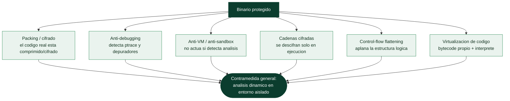

# Clase 135 — Ofuscación y técnicas anti-reversing

> Parte: **5 — Explotación de sistemas y binarios** · Fuente: *Eilam, Reversing* · *Practical Binary Analysis*
> ⏱️ Duración estimada: **120 min** · Nivel: **Avanzado**

---

## 🎯 Objetivo

Entender las técnicas que dificultan el reversing —**packing**, cifrado de cadenas, **anti-debugging**,
detección de VM, aplanamiento de flujo (control-flow flattening), virtualización de código— y aprender
a **derrotarlas** con desempaquetado, parcheo y análisis dinámico. Este conocimiento sirve tanto para
analizar malware (Parte 6) como para proteger tu propio software.

> ⚠️ **Ética:** analiza solo binarios propios/autorizados o muestras en laboratorio aislado.

## 📚 Resultados de aprendizaje

Al finalizar, el alumno podrá:

1. **Clasificar** técnicas de ofuscación y anti-reversing.
2. **Detectar** packing por entropía, secciones e imports.
3. **Desempaquetar** un binario (UPX y unpacking genérico con dump en runtime).
4. **Neutralizar** chequeos anti-debugging (`ptrace`, timing) con parcheo.
5. **Reconocer** control-flow flattening y virtualización.

## 🗺️ Temas

| # | Tema | Por qué importa |
| --- | --- | --- |
| 1 | Packing y cifrado | Ocultan el código real |
| 2 | Entropía como indicador | Detección rápida |
| 3 | Anti-debugging (ptrace) | Impide adjuntar debugger |
| 4 | Anti-VM / anti-sandbox | Evade análisis automático |
| 5 | Cadenas cifradas | Nada útil en `strings` |
| 6 | Control-flow flattening | CFG ilegible |
| 7 | Virtualización de código | El nivel más duro |
| 8 | Contramedidas | Dump, parcheo, dinámico |

## 🧠 Explicación en profundidad

### La otra cara: dificultar deliberadamente el análisis

Si la ingeniería inversa reconstruye el significado de un binario, la **ofuscación** y las técnicas
**anti-reversing** existen para **impedirlo o encarecerlo**. Las usan tanto el software legítimo
(protección de propiedad intelectual, DRM, antitrampas) como —sobre todo— el **malware** (Parte 6),
que quiere resistir el análisis para sobrevivir más tiempo. Conocerlas es imprescindible por dos
razones simétricas: para **reconocerlas y derrotarlas** al analizar código protegido, y para
**entender el juego del gato y el ratón** que define el análisis de malware moderno. Ninguna técnica
es infalible —todas se pueden vencer con tiempo y con análisis dinámico— pero elevan el coste, que es
su objetivo.



### Packing y cifrado: esconder el código hasta el último momento

La técnica más común es el **packing**: el código real del programa se **comprime o cifra**, y el
binario que se distribuye contiene solo un pequeño **desempaquetador** (*stub*) que, al ejecutarse,
**descomprime/descifra el código real en memoria** y salta a él. El efecto sobre el análisis estático
es demoledor: al abrir el binario en Ghidra solo se ve el stub, no la lógica real —que no existe en el
fichero, solo aparece en memoria durante la ejecución—. Un **indicador** revelador es la **entropía**:
el código cifrado o comprimido tiene entropía alta (parece aleatorio, como en la [Clase 064](../../parte-4-seguridad-de-aplicaciones-web/README.md)),
así que una sección de entropía anormalmente alta delata packing. La **contramedida** es el análisis
dinámico de la clase 134: dejar que el binario se desempaquete a sí mismo y **volcar la memoria** ya
desempaquetada. Packers conocidos como UPX se deshacen con un comando; los personalizados requieren
localizar el punto donde termina el desempaquetado (el *OEP*, original entry point) y volcar ahí.

### Detectar al analista: anti-debugging y anti-VM

Un segundo grupo de técnicas **detecta que está siendo analizado** y cambia de comportamiento —el
malware, por ejemplo, no ejecuta su carga maliciosa si se sabe observado, para no revelarla—. El
**anti-debugging** detecta la presencia de un depurador: en Linux, la técnica clásica es que el
programa intente hacer **`ptrace`** sobre sí mismo (solo un proceso puede trazar a otro, así que si el
propio programa consigue trazarse es que **no** hay un depurador enganchado; si falla, hay uno). El
**anti-VM / anti-sandbox** busca señales de que se ejecuta en una máquina virtual o en un sandbox
automático (nombres de dispositivos característicos de VMware/VirtualBox, poca RAM, ausencia de
actividad de usuario, tiempo acelerado) y, si las encuentra, **se comporta de forma inocua** para
engañar al análisis automatizado. Las contramedidas son parchear estas comprobaciones (con Frida o un
depurador) o usar entornos de análisis endurecidos que oculten su naturaleza.

### Ofuscar la lógica y las cadenas, y las contramedidas

El último grupo ataca la **comprensibilidad** del código que sí se ve. Las **cadenas cifradas**
—almacenar textos (URLs de C2, mensajes, claves) cifrados y descifrarlos solo en tiempo de ejecución—
neutralizan el reconocimiento rápido con `strings`, y la contramedida es encontrar la rutina de
descifrado y aplicarla (a mano, con scripting o dinámicamente). El **control-flow flattening**
transforma la estructura lógica de una función —sus `if`/bucles anidados— en una gran máquina de
estados con un dispatcher central, de modo que el CFG (clase 133) se vuelve un amasijo ilegible que
oculta el flujo real; herramientas de desofuscación y el análisis dinámico ayudan a reconstruirlo. Y la
más extrema, la **virtualización de código**, traduce las instrucciones a un **bytecode propio** que
solo un intérprete embebido en el binario entiende: el analista ya no ve x86, sino una máquina virtual
inventada que primero hay que reversar entera —es la protección más costosa de vencer, usada en
DRM comercial y en malware avanzado—. La lección conjunta, y la que cierra el bloque de RE, es que la
ofuscación **eleva el coste pero no lo hace infinito**: casi todo cede ante el análisis dinámico en un
entorno aislado, porque **en algún momento el código tiene que ejecutarse de verdad**, y ahí se le
puede observar. El anti-reversing y su derrota son un juego iterativo, y ganar la partida es cuestión
de paciencia y de las herramientas adecuadas.

## 📖 Definiciones y características

- **Packing:** comprime/cifra el binario y lo descomprime en memoria al ejecutar. *Clave:* el estático
  solo ve el stub; hay que dumpear tras el unpacking.
- **Entropía:** medida de aleatoriedad; secciones empacadas/cifradas tienen entropía alta (~8). *Clave:*
  primer indicador de ofuscación.
- **Anti-debugging:** detecta debuggers (p. ej. `ptrace(PTRACE_TRACEME)` que falla si ya hay uno).
  *Clave:* se neutraliza parcheando el chequeo o con `LD_PRELOAD`.
- **Anti-VM:** busca artefactos de virtualización (drivers, MAC, timing). *Clave:* frecuente en malware
  para evadir sandboxes.
- **Control-flow flattening:** transforma el CFG en un gran switch/dispatcher. *Clave:* rompe la
  linealidad; se ataca con análisis simbólico/dinámico.
- **Virtualización:** el código se traduce a un bytecode propio interpretado por una VM embebida.
  *Clave:* la defensa más costosa de revertir.

## 📔 Glosario

| Término | Definición concisa |
|---------|--------------------|
| Ofuscación | Técnicas para dificultar el análisis del binario |
| Anti-reversing | Medidas que impiden o encarecen la RE |
| Packing | Comprimir/cifrar el código; un stub lo revela en memoria |
| Stub / desempaquetador | Código que descomprime el binario real al ejecutarse |
| Entropía | Aleatoriedad; alta indica cifrado o compresión |
| OEP | Original entry point; donde termina el desempaquetado |
| UPX | Packer común que se deshace con un comando |
| Anti-debugging | Detecta la presencia de un depurador |
| ptrace | Syscall usada para detectar depuradores en Linux |
| Anti-VM / anti-sandbox | Detecta el entorno de análisis y se inhibe |
| Cadenas cifradas | Textos descifrados solo en ejecución; evaden `strings` |
| Control-flow flattening | Aplana la lógica en una máquina de estados |
| Virtualización de código | Bytecode propio con intérprete embebido |
| Contramedida dinámica | El código acaba ejecutándose y ahí se observa |

## 🧰 Herramientas y preparación

```bash
sudo apt install -y upx binutils
pip install angr        # ejecución simbólica (deofuscación)
# ent o un script python para entropía
```

Trabaja en **VM aislada** con snapshots si manipulas muestras reales.

## 🧪 Laboratorio guiado

> Entorno propio / VM aislada.

1. Detecta packing por entropía y secciones:

   ```bash
   upx -t crackme.packed 2>/dev/null && echo "empacado con UPX"
   python3 - <<'PY'
   import math,sys
   d=open("crackme.packed","rb").read()
   from collections import Counter
   c=Counter(d); H=-sum(n/len(d)*math.log2(n/len(d)) for n in c.values())
   print("entropia:",round(H,2))   # ~7.9 sugiere empaquetado/cifrado
   PY
   ```

2. Desempaqueta UPX y verifica que ahora ves el código real:

   ```bash
   upx -d crackme.packed -o crackme.unpacked
   objdump -d crackme.unpacked | head
   ```

3. Neutraliza anti-debugging basado en `ptrace`: identifica el chequeo en Ghidra y **parchea** el salto
   (invierte `je`↔`jne`) o intercepta `ptrace` con Frida devolviendo 0.

4. Descifra cadenas en runtime: pon un breakpoint tras la rutina de descifrado y dumpea memoria
   (`dump memory strings.bin $addr $addr+0x200`).

5. Enfréntate a control-flow flattening con angr (ejecución simbólica) para hallar la entrada que llega
   al estado "éxito":

   ```python
   import angr
   p = angr.Project("crackme.unpacked", auto_load_libs=False)
   sm = p.factory.simulation_manager(p.factory.entry_state())
   sm.explore(find=lambda s: b"Correcto" in s.posix.dumps(1))
   print(sm.found[0].posix.dumps(0))   # entrada que produce el éxito
   ```

6. Documenta qué técnica encontraste y cómo la venciste.

## ✍️ Ejercicios

1. Calcula la entropía de un binario normal y de uno empacado; compara.
2. Desempaqueta un UPX y confirma con `objdump` que ves más funciones.
3. Parchea un chequeo `ptrace` para permitir el debugging.
4. Intercepta el anti-debug con Frida sin modificar el binario.
5. Resuelve un crackme con angr y explica sus límites (state explosion).
6. Identifica el dispatcher de un binario con control-flow flattening.

## 📝 Reto verificable

Toma un `crackme` empacado con anti-debugging y consigue analizarlo: desempácalo, neutraliza el
anti-debug y deduce la clave.

**Criterio de aceptación:** logras adjuntar un debugger pese al anti-debug (parcheo o Frida) y obtienes
la clave válida del binario desempacado.

## ⚠️ Errores comunes

| Síntoma / mensaje | Causa y cómo arreglar |
| --- | --- |
| El programa muere al adjuntar GDB | Anti-debug con `ptrace`; parchea o hookea |
| `upx -d` falla | No es UPX o está modificado; usa dump en runtime |
| angr no termina | State explosion; acota con hooks/constraints |
| Entropía alta pero no es packing | Puede ser datos comprimidos legítimos; verifica secciones |
| Parcheo rompe el binario | Cambiaste tamaño; parchea solo bytes de opcode equivalentes |

## ❓ Preguntas frecuentes

**❓ ¿Se puede revertir cualquier ofuscación?** En teoría sí con esfuerzo suficiente; la virtualización
puede requerir semanas.

**❓ ¿angr es una bala de plata?** No: sufre explosión de estados; úsalo con acotaciones y para
funciones concretas.

**❓ ¿Ofuscar mi software lo hace seguro?** Aumenta el coste del atacante, pero no sustituye a una buena
arquitectura de seguridad.

## 🔗 Referencias

- Eilam, E. *Reversing: Secrets of Reverse Engineering*. Wiley.
- Andriesse, D. *Practical Binary Analysis*, cap. 12-13. No Starch Press.
- angr — <https://angr.io/>
- Ollydbg/UPX y técnicas anti-debug (Peter Ferrie, "The Ultimate Anti-Debugging Reference").

## 📥 Material descargable

- 📄 [Guía en PDF](./clase-135-guia.pdf) — versión imprimible de esta clase.
- 🎞️ [Presentación (PPTX)](./clase-135-presentacion.pptx) — deck para proyectar en clase.

## ⬅️ Clase anterior

[Clase 134 — Análisis dinámico y debugging de binarios](../134-analisis-dinamico-y-debugging-de-binarios/README.md)

## ➡️ Siguiente clase

[Clase 136 — Fuzzing con AFL++ y libFuzzer](../136-fuzzing-con-afl-y-libfuzzer/README.md)
