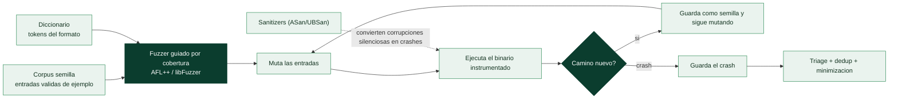

# Clase 136 — Fuzzing con AFL++ y libFuzzer

> Parte: **5 — Explotación de sistemas y binarios** · Fuente: *Andriesse, Practical Binary Analysis* · docs AFL++/LLVM
> ⏱️ Duración estimada: **140 min** · Nivel: **Avanzado**

---

## 🎯 Objetivo

Descubrir vulnerabilidades automáticamente mediante **fuzzing**: alimentar a un programa con miles de
entradas mutadas guiadas por cobertura hasta provocar crashes. Aprenderás a compilar objetivos con
instrumentación, a lanzar campañas con **AFL++** y **libFuzzer**, a combinar con sanitizers (ASan/UBSan)
y a triar y minimizar los crashes encontrados.

> ⚠️ **Ética:** fuzzea software propio, open source con permiso o dentro de programas autorizados.
> Reporta hallazgos de forma responsable.

## 📚 Resultados de aprendizaje

Al finalizar, el alumno podrá:

1. **Explicar** el fuzzing guiado por cobertura y por qué es efectivo.
2. **Instrumentar** un objetivo con `afl-cc`/`-fsanitize=fuzzer`.
3. **Lanzar** campañas AFL++ con corpus semilla y diccionarios.
4. **Escribir** un harness libFuzzer (`LLVMFuzzerTestOneInput`).
5. **Triar y minimizar** crashes reproducibles.

## 🗺️ Temas

| # | Tema | Por qué importa |
| --- | --- | --- |
| 1 | Fuzzing guiado por cobertura | Encuentra rutas profundas |
| 2 | Instrumentación (AFL/SanCov) | Retroalimenta al mutador |
| 3 | Corpus semilla | Buen punto de partida |
| 4 | Diccionarios | Tokens del formato objetivo |
| 5 | Sanitizers (ASan/UBSan) | Detectan bugs silenciosos |
| 6 | libFuzzer y harness | Fuzzing in-process rápido |
| 7 | Triage y dedup de crashes | Del ruido al bug real |
| 8 | Minimización (tmin/casr) | Caso mínimo reproducible |

## 🧠 Explicación en profundidad

### Encontrar bugs bombardeando el programa con entradas

El **fuzzing** es la técnica automatizada más productiva para **descubrir vulnerabilidades**: consiste
en alimentar un programa con **enormes cantidades de entradas generadas automáticamente** —muchas
malformadas o aleatorias— y observar cuáles provocan un **crash**, porque un crash suele indicar un
fallo de memoria (buffer overflow, UAF, integer overflow) potencialmente explotable. Su enorme valor
está en que **encuentra casos que un humano nunca probaría**: entradas absurdas, tamaños extremos,
combinaciones inesperadas. El fuzzing ha descubierto miles de vulnerabilidades en software crítico
—navegadores, librerías de imágenes, parsers, kernels— y es hoy una parte estándar del desarrollo
seguro y de la investigación ofensiva.

### El salto que lo cambió todo: fuzzing guiado por cobertura

El fuzzing "tonto" —enviar bytes aleatorios— encuentra pocos bugs, porque casi ninguna entrada
aleatoria pasa de las primeras comprobaciones del programa. La revolución fue el **fuzzing guiado por
cobertura**, del que **AFL** (*American Fuzzy Lop*) y su sucesor **AFL++** son el estándar. La idea es
brillante: se **instrumenta** el binario para que informe **qué caminos de código ejecuta** cada
entrada, y el fuzzer usa esa señal como brújula —cuando una entrada llega a un **camino nuevo** del
programa, se guarda como semilla valiosa y se **muta** para explorar aún más allá—. Así el fuzzer
"aprende" a construir entradas que penetran cada vez más profundo, evolucionando desde datos triviales
hasta entradas que atraviesan parsers complejos. La instrumentación se añade al compilar (AFL) o con
sanitizadores de cobertura (SanCov), y es lo que separa el fuzzing moderno del bombardeo ciego.



### Los ingredientes que multiplican la eficacia

Un fuzzing productivo no es solo lanzar AFL: depende de varios elementos. El **corpus semilla** —un
conjunto de entradas **válidas** de ejemplo (imágenes reales si se fuzzea un decodificador de imágenes,
PDFs reales si es un lector de PDF)— da al fuzzer un punto de partida realista desde el que mutar, en
lugar de empezar de cero. Los **diccionarios** aportan los **tokens** del formato (palabras clave,
magic bytes, etiquetas) para que el fuzzer los combine, esencial en formatos estructurados que
requieren palabras concretas. Y —crítico— los **sanitizers**: **AddressSanitizer (ASan)** y
**UBSanitizer (UBSan)** de las clases 127–128 **convierten corrupciones silenciosas en crashes
inmediatos y detallados**. Sin ellos, un buffer overflow que escribe unos bytes de más quizá no
crashea (solo corrompe memoria que no se usa aún), y el fuzzer no lo detecta; con ASan, ese mismo
overflow crashea al instante con un informe preciso. Fuzzear **siempre** con sanitizers es la práctica
que multiplica los hallazgos.

### libFuzzer, harness y el trabajo con los crashes

Hay dos estilos de fuzzing. AFL++ fuzzea el binario **completo** a través de su entrada estándar o
ficheros. **libFuzzer** es un fuzzing **in-process** y dirigido: el desarrollador escribe un **harness**
—una pequeña función que recibe los bytes del fuzzer y llama a la **función concreta** que se quiere
probar—, lo que permite fuzzear una librería componente a componente con enorme velocidad. Escribir
buenos harness es una habilidad en sí misma y la base del fuzzing continuo (OSS-Fuzz de Google fuzzea
así miles de proyectos). El fuzzing produce muchos crashes, y el trabajo no acaba ahí: el **triage y la
deduplicación** agrupan los miles de crashes por su **causa raíz** (muchos crashes distintos pueden ser
el mismo bug), y la **minimización** (`afl-tmin`, `casr`) reduce cada entrada que provoca un crash a su
**forma mínima** —los pocos bytes esenciales—, lo que facilita enormemente entender y reportar el bug.
La lección de la clase es que el fuzzing es la forma más escalable de encontrar los bugs de memoria de
toda esta parte: no reemplaza el análisis humano, pero **genera el material** —los crashes— que luego
se analiza y se convierte en exploits (clase 138) o en parches.

## 📖 Definiciones y características

- **Fuzzing:** generación masiva de entradas para provocar fallos. *Clave:* el guiado por cobertura
  prioriza entradas que exploran código nuevo.
- **Instrumentación de cobertura:** el compilador inserta contadores por rama. *Clave:* AFL++ los usa
  para saber qué mutaciones son "interesantes".
- **Corpus semilla:** conjunto inicial de entradas válidas. *Clave:* acelera el descubrimiento al partir
  de casos realistas.
- **Diccionario:** lista de tokens/keywords del formato. *Clave:* ayuda a superar comprobaciones de
  magic bytes.
- **libFuzzer:** motor in-process de LLVM con harness `LLVMFuzzerTestOneInput`. *Clave:* muy rápido para
  librerías/funciones.
- **Triage/minimización:** clasificar crashes por causa y reducir el input al mínimo. *Clave:* `afl-tmin`,
  ASan backtrace, `casr` para dedup.

## 📔 Glosario

| Término | Definición concisa |
|---------|--------------------|
| Fuzzing | Alimentar el programa con muchas entradas para provocar crashes |
| Crash | Fallo que suele indicar una corrupción de memoria explotable |
| Guiado por cobertura | El fuzzer usa qué código se ejecuta como brújula |
| AFL / AFL++ | Fuzzer estándar guiado por cobertura |
| Instrumentación | Añadir al binario el reporte de caminos ejecutados |
| Camino nuevo | Entrada que alcanza código no visto; se guarda como semilla |
| Corpus semilla | Entradas válidas de ejemplo desde las que mutar |
| Diccionario | Tokens del formato que el fuzzer combina |
| Sanitizer (ASan/UBSan) | Convierte corrupciones silenciosas en crashes claros |
| libFuzzer | Fuzzing in-process, dirigido a una función |
| Harness | Función que conecta el fuzzer con el código objetivo |
| Triage / dedup | Agrupar crashes por su causa raíz |
| Minimización | Reducir una entrada de crash a su forma mínima |
| OSS-Fuzz | Servicio de fuzzing continuo de proyectos abiertos |

## 🧰 Herramientas y preparación

```bash
# AFL++
sudo apt install -y afl++    # o compilar desde github.com/AFLplusplus/AFLplusplus
# libFuzzer viene con clang
clang --version
```

## 🧪 Laboratorio guiado

> Entorno propio.

1. Objetivo vulnerable `parser.c` (tiene un overflow deliberado):

   ```c
   #include <stdio.h>
   #include <string.h>
   void parse(const char *s){ char b[16]; if(s[0]=='F' && s[1]=='U') strcpy(b, s); }
   int main(int c, char**v){ char buf[256]; FILE*f=fopen(v[1],"rb"); int n=fread(buf,1,255,f); buf[n]=0; parse(buf); }
   ```

2. Compila con instrumentación AFL++ + ASan y prepara el corpus:

   ```bash
   afl-cc -fsanitize=address -o parser_afl parser.c
   mkdir in && printf 'FUabc' > in/seed
   afl-fuzz -i in -o out -- ./parser_afl @@
   ```

3. Observa el panel de AFL++: paths, crashes únicos, ejecuciones/seg. En minutos deberían aparecer
   crashes en `out/default/crashes/`.

4. Reproduce y tría un crash con ASan para ver el `stack-buffer-overflow`:

   ```bash
   ./parser_afl out/default/crashes/id:000000*    # ASan imprime el backtrace
   ```

5. Minimiza el caso: `afl-tmin -i <crash> -o crash_min -- ./parser_afl @@`.

6. Escribe un harness libFuzzer para la función `parse`:

   ```c
   extern void parse(const char*);
   int LLVMFuzzerTestOneInput(const unsigned char *d, unsigned long n){
       char *s = malloc(n+1); memcpy(s,d,n); s[n]=0; parse(s); free(s); return 0; }
   ```

   ```bash
   clang -g -fsanitize=fuzzer,address harness.c parser.c -o fz && ./fz -runs=100000
   ```

7. Añade un diccionario con el token `"FU"` y compara la velocidad de descubrimiento.

## ✍️ Ejercicios

1. Crea un corpus semilla mejor y mide el impacto en cobertura.
2. Escribe un diccionario para un formato con magic bytes y compáralo sin él.
3. Corre AFL++ en modo persistente y mide ejecuciones/seg.
4. Tría tres crashes y determina si son el mismo bug.
5. Minimiza un crash con `afl-tmin` y explica qué eliminó.
6. Escribe un harness libFuzzer para una función de parsing propia.

## 📝 Reto verificable

Encuentra y reproduce un crash en un objetivo instrumentado, minimiza el caso y explica la causa raíz
con el backtrace de ASan.

**Criterio de aceptación:** entregas un input mínimo que provoca el crash de forma determinista y el
reporte de ASan que identifica el tipo de bug (p. ej. `stack-buffer-overflow`).

## ⚠️ Errores comunes

| Síntoma / mensaje | Causa y cómo arreglar |
| --- | --- |
| 0 crashes tras horas | Corpus/diccionario pobres; el fuzzer no supera un check |
| "suboptimal, core dumps" | Ajusta `core_pattern` como indica AFL al arrancar |
| Crashes no reproducibles | Falta ASan o hay no-determinismo (tiempo/aleatorio) |
| Muy pocas ejec/seg | Objetivo lento; usa modo persistente/in-process |
| Todos los crashes iguales | Falta dedup; usa triage por backtrace/casr |

## ❓ Preguntas frecuentes

**❓ ¿AFL++ o libFuzzer?** AFL++ para binarios/CLI y black-box con QEMU; libFuzzer para funciones de
librería in-process. A menudo se usan ambos.

**❓ ¿Necesito el código fuente?** No siempre: AFL++ tiene modo QEMU/frida para binarios sin fuente,
aunque más lento.

**❓ ¿Y si no hay crashes?** Mejora semillas y diccionario, añade sanitizers y aumenta el tiempo;
también considera assertions.

## 🔗 Referencias

- AFL++ — <https://github.com/AFLplusplus/AFLplusplus>
- libFuzzer (LLVM) — <https://llvm.org/docs/LibFuzzer.html>
- Andriesse, D. *Practical Binary Analysis*. No Starch Press.
- OSS-Fuzz — <https://github.com/google/oss-fuzz>

## 📥 Material descargable

- 📄 [Guía en PDF](./clase-136-guia.pdf) — versión imprimible de esta clase.
- 🎞️ [Presentación (PPTX)](./clase-136-presentacion.pptx) — deck para proyectar en clase.

## ⬅️ Clase anterior

[Clase 135 — Ofuscación y técnicas anti-reversing](../135-ofuscacion-y-tecnicas-anti-reversing/README.md)

## ➡️ Siguiente clase

[Clase 137 — Descubrimiento de vulnerabilidades en código](../137-descubrimiento-de-vulnerabilidades-en-codigo/README.md)
