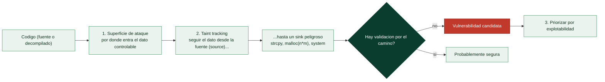

# Clase 137 — Descubrimiento de vulnerabilidades en código

> Parte: **5 — Explotación de sistemas y binarios** · Fuente: *Dowd, McDonald, Schuh, The Art of Software Security Assessment*
> ⏱️ Duración estimada: **120 min** · Nivel: **Avanzado**

---

## 🎯 Objetivo

Aprender a **encontrar vulnerabilidades** de forma sistemática combinando auditoría manual de código,
análisis estático automatizado (SAST) y razonamiento sobre superficies de ataque. Complementa el fuzzing
(clase 136) con la revisión dirigida que detecta bugs lógicos y patrones peligrosos que el fuzzer no
alcanza fácilmente. Cerrarás con la práctica de **divulgación responsable**.

> ⚠️ **Ética:** audita código propio, open source o con autorización. Reporta de forma responsable
> (coordinated disclosure), nunca publiques 0-days de terceros sin proceso.

## 📚 Resultados de aprendizaje

Al finalizar, el alumno podrá:

1. **Modelar** la superficie de ataque de un componente (entradas, confianza, límites).
2. **Auditar** código C/C++ buscando patrones peligrosos (memoria, enteros, formato).
3. **Aplicar** SAST (clang-analyzer, cppcheck, Semgrep, CodeQL) e interpretar hallazgos.
4. **Priorizar** por explotabilidad e impacto.
5. **Redactar** un reporte y seguir un proceso de divulgación responsable.

## 🗺️ Temas

| # | Tema | Por qué importa |
| --- | --- | --- |
| 1 | Superficie de ataque y fuentes de entrada | Dónde entran los datos no confiables |
| 2 | Patrones peligrosos en C/C++ | Dónde suelen estar los bugs |
| 3 | Taint / seguimiento de datos | Del input a la operación peligrosa |
| 4 | SAST (cppcheck, clang, Semgrep) | Automatizar la detección |
| 5 | CodeQL | Consultas semánticas de vulns |
| 6 | Falsos positivos/negativos | Interpretar con criterio |
| 7 | Priorización por explotabilidad | Enfocar el esfuerzo |
| 8 | Reporte y disclosure | Cerrar el ciclo con ética |

## 🧠 Explicación en profundidad

### Buscar el fallo en el código, no solo en el binario en marcha

El fuzzing (clase 136) encuentra bugs **ejecutando**; esta clase aborda el descubrimiento por
**análisis del código** —fuente o decompilado— buscando los patrones que conducen a vulnerabilidades.
Ambos enfoques son complementarios: el fuzzing es ciego pero incansable; el análisis de código es
dirigido pero requiere criterio humano. Un cazador de vulnerabilidades competente usa los dos, y el
punto de partida de ambos es el mismo: identificar la **superficie de ataque** —**por dónde entran
datos que el atacante controla** (entrada de red, ficheros, argumentos, variables de entorno)— porque
una vulnerabilidad solo importa si es alcanzable desde una entrada controlable.

### Los patrones peligrosos que hay que reconocer

Buena parte del análisis de código es reconocer **patrones que fallan de forma conocida**, muchos ya
vistos en esta parte. En C/C++: las **funciones de copia sin límite** (`strcpy`, `sprintf`, `gets`,
`memcpy` con tamaño controlado por el usuario, clase 119); los **cálculos de tamaño** susceptibles de
**integer overflow** antes de un `malloc` o una copia (clase 128); el **manejo de memoria** que puede
dejar punteros colgantes (`free` seguido de uso, clase 127); las **format strings** con formato
controlado (clase 125); y los **índices de array** sin comprobar. Reconocer estos patrones al leer
código —propio, ajeno o decompilado— es el instinto que se entrena, y es lo que hace que un revisor
experimentado detecte en segundos un fallo que pasaría desapercibido a un lector casual.



### Taint tracking: seguir el dato desde la fuente al sink

La técnica conceptual central es el **taint analysis** (seguimiento de datos "contaminados"), la misma
idea del DOM XSS de la [Clase 097](../../parte-4-seguridad-de-aplicaciones-web/097-xss-almacenado-y-basado-en-dom/README.md) aplicada a binarios. Se marca como **contaminado** (*tainted*)
todo dato que viene de una **fuente** controlable por el atacante (*source*: `recv`, `read`, `argv`) y
se **rastrea su propagación** por el programa —a qué variables se copia, en qué cálculos entra— hasta
ver si llega **sin validar** a un **sink peligroso** (una función de copia, un cálculo de tamaño, un
`system`). Un dato contaminado que alcanza un sink peligroso sin pasar por una comprobación adecuada es
una **vulnerabilidad candidata**. Este modelo *source → propagación → sink* es la columna vertebral del
análisis de vulnerabilidades tanto manual como automatizado.

### SAST, CodeQL y el trabajo con los resultados

El análisis se automatiza con herramientas **SAST** (*Static Application Security Testing*, la misma
familia de la [Clase 115](../../parte-4-seguridad-de-aplicaciones-web/115-secure-coding-y-defensa-de-aplicaciones-web/README.md) pero a nivel de C/C++ y binarios). Las clásicas —**cppcheck**, el
analizador estático de **clang**, **Semgrep**— buscan patrones peligrosos por reglas. La más potente
para descubrimiento serio es **CodeQL**, que trata el código como una **base de datos consultable**: se
escriben **queries** que expresan "encuéntrame todo dato que fluya desde `recv` hasta `strcpy` sin pasar
por una comprobación de longitud", y CodeQL las resuelve sobre todo el código —es taint tracking
programable a escala, y ha encontrado vulnerabilidades reales en proyectos enormes—. Toda herramienta
automática produce **falsos positivos** (marca como bug algo que no lo es) y **falsos negativos** (no ve
bugs reales), así que sus resultados son un **punto de partida** que un humano verifica, no un veredicto.
El paso final es la **priorización por explotabilidad**: no todos los bugs son iguales —uno alcanzable
remotamente sin autenticación importa mucho más que uno que requiere condiciones improbables—, y centrar
el esfuerzo en lo explotable es lo que hace productivo el trabajo. Y cuando se encuentra algo real, se
aplica la **divulgación responsable** de la [Clase 025](../../parte-0-fundamentos-y-prerrequisitos/025-etica-legalidad-alcance-y-divulgacion-responsable/README.md): reportar en privado al fabricante,
dar tiempo para corregir, coordinar la publicación —la ética que separa la investigación de la
actividad delictiva—.

## 📖 Definiciones y características

- **Superficie de ataque:** conjunto de puntos donde entran datos no confiables. *Clave:* prioriza
  parsers, IPC, red y ficheros.
- **Análisis de taint:** rastrea datos controlados por el usuario hasta operaciones sensibles (`memcpy`,
  índices, `system`). *Clave:* fuente→sumidero.
- **SAST:** análisis estático de seguridad sobre el código. *Clave:* rápido y escalable, pero genera
  falsos positivos.
- **CodeQL:** motor que trata el código como base de datos consultable. *Clave:* permite escribir queries
  para clases de bugs (p. ej. desbordamientos).
- **Divulgación responsable:** reportar al vendor y coordinar el arreglo antes de publicar. *Clave:*
  respeta plazos y a los usuarios.
- **Explotabilidad:** qué tan factible es convertir el bug en impacto real. *Clave:* guía la
  priorización (no todo bug es crítico).

## 📔 Glosario

| Término | Definición concisa |
|---------|--------------------|
| Descubrimiento de vulnerabilidades | Encontrar fallos analizando el código |
| Superficie de ataque | Por dónde entran datos controlables por el atacante |
| Fuente (source) | Origen de un dato controlable (`recv`, `read`, `argv`) |
| Patrón peligroso | Construcción con fallo conocido (strcpy, malloc(n*m)…) |
| Taint tracking | Rastrear la propagación de un dato contaminado |
| Dato contaminado (tainted) | Valor que procede de una fuente no confiable |
| Sink peligroso | Punto donde un dato contaminado causa daño |
| Vulnerabilidad candidata | Source que alcanza un sink sin validación |
| SAST | Análisis estático de seguridad del código |
| cppcheck / clang / Semgrep | Herramientas SAST por patrones |
| CodeQL | Consultar el código como una base de datos |
| Query | Consulta que expresa un patrón de vulnerabilidad |
| Falso positivo / negativo | Alerta falsa / bug real no detectado |
| Priorización por explotabilidad | Centrarse en los bugs realmente alcanzables |

## 🧰 Herramientas y preparación

```bash
sudo apt install -y cppcheck clang-tools
pip install semgrep
# CodeQL CLI: descargar de github.com/github/codeql-cli-binaries
```

## 🧪 Laboratorio guiado

> Entorno propio.

1. Modela la superficie de ataque de un proyecto C pequeño: lista funciones que reciben datos externos
   (argv, ficheros, red) y márcalas como fuentes.

2. Ejecuta SAST y compara resultados:

   ```bash
   cppcheck --enable=all --inconclusive src/ 2> cppcheck.txt
   scan-build make            # clang static analyzer
   semgrep --config p/c src/
   ```

3. Sigue una advertencia real (p. ej. `memcpy` con tamaño controlado) desde la fuente del dato hasta el
   sumidero, confirmando si es explotable o falso positivo.

4. Escribe una consulta CodeQL sencilla que localice llamadas a `strcpy` con origen no acotado (o parte
   de una query de ejemplo del repo de CodeQL) y ejecútala sobre la base del proyecto.

5. Prioriza los hallazgos en una tabla: bug, fuente, sumidero, explotabilidad (alta/media/baja), impacto.

6. Redacta un mini-reporte de una vulnerabilidad como si fueras a enviarlo al mantenedor: descripción,
   PoC mínima, versiones afectadas, mitigación y una propuesta de plazo de divulgación.

## ✍️ Ejercicios

1. Dibuja el diagrama de superficie de ataque de un servicio que lee de red.
2. Encuentra manualmente un `sprintf` sin límite y explica el riesgo.
3. Compara los hallazgos de cppcheck vs Semgrep en el mismo código.
4. Escribe una regla Semgrep que detecte `gets(`.
5. Clasifica 5 hallazgos por explotabilidad e impacto.
6. Redacta el cuerpo de un reporte de divulgación responsable.

## 📝 Reto verificable

Audita un proyecto C pequeño (propio o open source con permiso), identifica una vulnerabilidad real,
demuéstrala con una PoC mínima y redacta el reporte de divulgación.

**Criterio de aceptación:** entregas la ubicación exacta del bug (archivo:línea), una PoC que lo
dispara y un reporte con impacto, versiones y mitigación propuesta.

## ⚠️ Errores comunes

| Síntoma / mensaje | Causa y cómo arreglar |
| --- | --- |
| SAST ahoga en falsos positivos | Filtra por severidad y valida con taint manual |
| No encuentras nada | No modelaste bien la superficie de ataque; empieza por los parsers |
| CodeQL no compila la base | La query necesita una DB creada con `codeql database create` |
| Reportas sin PoC | Debilita el reporte; incluye reproducción mínima |
| Publicas un 0-day de terceros | Viola la ética; sigue disclosure coordinada |

## ❓ Preguntas frecuentes

**❓ ¿SAST reemplaza al fuzzing?** No: SAST ve patrones sin ejecutar; fuzzing ejecuta y halla bugs de
runtime. Son complementarios.

**❓ ¿Cómo reporto responsablemente?** Contacta al vendor/security.txt, aporta PoC, acuerda plazo
(p. ej. 90 días) y coordina la publicación.

**❓ ¿Todo hallazgo es una CVE?** No: muchos son de baja explotabilidad o requieren condiciones
irreales; prioriza.

## 🔗 Referencias

- Dowd, McDonald, Schuh. *The Art of Software Security Assessment*. Addison-Wesley.
- CodeQL — <https://codeql.github.com/>
- Semgrep — <https://semgrep.dev/>
- security.txt / disclosure — <https://securitytxt.org/>

## 📥 Material descargable

- 📄 [Guía en PDF](./clase-137-guia.pdf) — versión imprimible de esta clase.
- 🎞️ [Presentación (PPTX)](./clase-137-presentacion.pptx) — deck para proyectar en clase.

## ⬅️ Clase anterior

[Clase 136 — Fuzzing con AFL++ y libFuzzer](../136-fuzzing-con-afl-y-libfuzzer/README.md)

## ➡️ Siguiente clase

[Clase 138 — Desarrollo de exploits moderno](../138-desarrollo-de-exploits-moderno/README.md)
