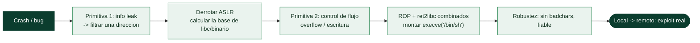

# Clase 138 — Desarrollo de exploits moderno

> Parte: **5 — Explotación de sistemas y binarios** · Fuente: *The Shellcoder's Handbook* · docs pwntools
> ⏱️ Duración estimada: **140 min** · Nivel: **Experto**

---

## 🎯 Objetivo

Integrar todo lo aprendido en un flujo de **desarrollo de exploits moderno**: encadenar primitivas
(info leak → cálculo de bases → escritura/control de flujo → ROP → shell), automatizar con **pwntools**,
manejar la libc correcta y escribir exploits fiables y reutilizables. Verás cómo se combinan las
técnicas para derrotar NX+ASLR+PIE+canary en un objetivo realista de laboratorio.

> ⚠️ **Ética:** solo binarios propios o retos de CTF autorizados.

## 📚 Resultados de aprendizaje

Al finalizar, el alumno podrá:

1. **Diseñar** una cadena de explotación por primitivas (leak → base → control).
2. **Automatizar** el exploit con pwntools (ELF, ROP, libc, tubes).
3. **Resolver** la libc correcta y calcular bases dinámicamente.
4. **Encadenar** ROP/ret2libc con un info leak para vencer ASLR/PIE.
5. **Robustecer** el exploit (reintentos, badchars, entorno estable).

## 🗺️ Temas

| # | Tema | Por qué importa |
| --- | --- | --- |
| 1 | Pensar por primitivas | Estructura mental del exploit |
| 2 | Info leak → base | Vencer ASLR/PIE |
| 3 | Cálculo de direcciones dinámico | Independencia de la versión |
| 4 | ROP + ret2libc combinados | Ejecución bajo NX |
| 5 | pwntools avanzado | Automatización real |
| 6 | libc-database / ret2dlresolve | Cuando no conoces la libc |
| 7 | Robustez y badchars | Que funcione siempre |
| 8 | Local → remoto | Retos en servidor |

## 🧠 Explicación en profundidad

### Pensar por primitivas: la mentalidad del exploiting moderno

Esta clase integra todo lo anterior en la disciplina de **convertir un crash en un exploit fiable**
contra un sistema con todas las mitigaciones activas. El cambio de mentalidad que la define es
**pensar por primitivas** en lugar de por técnicas aisladas. Una **primitiva** es una capacidad
elemental que una vulnerabilidad concede: un **info leak** (leer memoria/una dirección), una
**escritura arbitraria** (escribir un valor donde se quiera), un **control de flujo** (fijar RIP). El
exploiting moderno consiste en **encadenar primitivas** para escalar desde "el programa crashea" hasta
"ejecuto lo que quiero": primero conseguir un leak, con él derrotar ASLR, con las direcciones montar
una escritura o un control de flujo, y con eso ejecutar una cadena ROP. Ver una vulnerabilidad como "me
da tal primitiva" y preguntarse "¿qué me falta y cómo lo consigo?" es lo que permite construir exploits
donde ninguna técnica individual basta.



### El info leak como llave maestra, y el cálculo dinámico de direcciones

Contra ASLR y PIE (clase 122), **casi ningún exploit moderno funciona sin un info leak**, y por eso
conseguirlo es a menudo la parte más difícil y creativa. Un leak es cualquier primitiva que **revele una
dirección real** en tiempo de ejecución: un format string (clase 125), un UAF que imprime memoria
reciclada, un overflow que hace que el programa devuelva más datos de los debidos. Con **una sola
dirección filtrada** se abre todo, gracias al **cálculo dinámico de direcciones**: como las distancias
**dentro** de una región (libc, el binario) son fijas y solo cambia la base, filtrar la dirección de una
función permite calcular la base (dirección − offset conocido) y de ahí **derivar cualquier otra
dirección** de esa región. El exploit deja de usar direcciones fijas y pasa a **calcularlas en tiempo de
ejecución** a partir del leak —lo que lo hace funcionar pese a ASLR—.

### Combinar técnicas y las herramientas que lo hacen manejable

Un exploit moderno rara vez usa una sola técnica: **combina** las de toda la parte. Un caso típico
encadena un leak para obtener la base de libc, y luego una cadena **ROP** (clase 124) que mezcla
gadgets del binario con **ret2libc** (clase 123) para llamar a `system` o montar un `execve`. Construir
esto a mano sería inviable; **pwntools** lo hace manejable con su instrumental avanzado: el objeto
**`ELF`** parsea binario y libc dando símbolos y offsets, **`ROP`** ensambla cadenas de gadgets,
**`DynELF`** resuelve símbolos remotos a través de un leak, y **`fmtstr_payload`** genera payloads de
format string. Dos utilidades resuelven un problema recurrente: **libc-database** (o `libc.rip`)
**identifica la versión exacta de libc** del objetivo a partir de un par de direcciones filtradas —clave
porque los offsets difieren entre versiones—, y **ret2dlresolve** permite resolver funciones **sin un
leak previo** abusando del enlazador dinámico, útil cuando no hay forma fácil de filtrar libc.

### Robustez y el salto a remoto

La diferencia entre un exploit de laboratorio y uno profesional es la **fiabilidad**. Un exploit real
debe manejar los **badchars** (bytes prohibidos que romperían el payload, clase 121), funcionar de forma
**consistente** (no una vez de cada diez), y —el paso decisivo— saltar de **local a remoto**. Un exploit
que funciona en `process()` local puede fallar en `remote()` por diferencias sutiles: la versión de libc
del servidor (de ahí libc-database), variaciones del entorno, condiciones de la red. Cerrar esa brecha
—hacer que el exploit funcione de forma fiable contra el objetivo real, no solo contra la copia de
laboratorio— es lo que distingue el desarrollo de exploits serio, y es la culminación de todo lo
aprendido en la parte: sin la comprensión del stack, las mitigaciones, ROP, el heap y el análisis, no se
llega hasta aquí. Como siempre, todo se practica **solo sobre objetivos propios o autorizados**.

## 📖 Definiciones y características

- **Primitiva de explotación:** capacidad atómica (leer, escribir, controlar flujo). *Clave:* los
  exploits se construyen encadenando primitivas.
- **Info leak:** filtra una dirección para derrotar ASLR/PIE. *Clave:* imprescindible en objetivos
  modernos.
- **Cálculo de base dinámico:** `base = leak - offset`. *Clave:* hace el exploit robusto entre corridas.
- **ret2dlresolve:** técnica que fuerza al enlazador dinámico a resolver un símbolo (p. ej. `system`)
  sin conocer libc. *Clave:* útil sin leak de libc.
- **pwntools tubes:** abstracción de I/O (`process`, `remote`, `recvuntil`, `sendlineafter`). *Clave:*
  el mismo exploit sirve local y remoto.
- **Robustez:** manejo de badchars, alineación, timing y reintentos. *Clave:* un exploit que solo
  funciona a veces no sirve.

## 📔 Glosario

| Término | Definición concisa |
|---------|--------------------|
| Desarrollo de exploits | Convertir un crash en un exploit fiable |
| Primitiva | Capacidad elemental que concede una vulnerabilidad |
| Info leak | Primitiva que revela una dirección en ejecución |
| Escritura arbitraria | Primitiva de escribir un valor donde se quiera |
| Control de flujo | Primitiva de fijar RIP |
| Encadenar primitivas | Combinar capacidades para escalar el exploit |
| Cálculo dinámico de direcciones | Derivar direcciones a partir de un leak |
| Base de región | Dirección de inicio; las distancias internas son fijas |
| ROP + ret2libc | Combinación típica de técnicas modernas |
| ELF / ROP / DynELF | Instrumental avanzado de pwntools |
| libc-database | Identifica la versión de libc por direcciones filtradas |
| ret2dlresolve | Resolver funciones sin leak, abusando del enlazador |
| Robustez | Fiabilidad del exploit; sin badchars, consistente |
| Local → remoto | Hacer que el exploit funcione contra el objetivo real |

## 🧰 Herramientas y preparación

```bash
pip install pwntools ROPgadget
# libc-database para identificar libc por un leak
git clone https://github.com/niklasb/libc-database
```

## 🧪 Laboratorio guiado

> Entorno propio.

1. Reconocimiento del objetivo (binario de reto con NX+PIE+ASLR, sin canary o con canary a filtrar):

   ```bash
   checksec ./target
   ```

2. Estructura el exploit en pwntools con una plantilla reutilizable:

   ```python
   from pwn import *
   exe = context.binary = ELF("./target")
   libc = ELF("./libc.so.6")
   def conn():
       return remote(args.HOST, int(args.PORT)) if args.REMOTE else process(exe.path)
   io = conn()
   ```

3. **Primitiva 1 — leak:** usa la vulnerabilidad para filtrar una dirección de libc (GOT/stack) y
   calcula la base:

   ```python
   leak = u64(io.recvline().strip().ljust(8, b"\x00"))
   libc.address = leak - libc.symbols["puts"]
   log.success(f"libc @ {hex(libc.address)}")
   ```

4. **Primitiva 2 — control de flujo:** construye una cadena ROP con la base ya conocida para
   `system("/bin/sh")` o un one_gadget, cuidando la alineación.

5. Si el binario es PIE, filtra también su base y usa `exe.address = code_leak - offset`.

6. Si no conoces la libc, identifícala por el leak con `libc-database` o aplica `ret2dlresolve`
   (`rop.ret2dlresolve(...)` en pwntools).

7. Robustece: envuelve en un bucle de reintentos, evita badchars y estabiliza el entorno (`env`, ASLR).
   Prueba `./exploit.py REMOTE HOST=... PORT=...` contra un `socat` local.

## ✍️ Ejercicios

1. Escribe una plantilla pwntools que alterne local/remoto con `args.REMOTE`.
2. Identifica una libc desconocida a partir de un leak con libc-database.
3. Añade filtrado de canary vía un leak previo.
4. Sustituye `system` por un one_gadget válido y verifica constraints.
5. Implementa ret2dlresolve en un binario sin leak de libc.
6. Añade lógica de reintento y mide la fiabilidad en 20 corridas.

## 📝 Reto verificable

Desarrolla un exploit completo contra un binario de laboratorio con NX+ASLR (y PIE si te atreves) que
obtenga shell filtrando la base de libc en runtime.

**Criterio de aceptación:** `./exploit.py` da shell interactiva de forma fiable (≥ 8/10 corridas) con
ASLR activado, calculando la base dinámicamente.

## ⚠️ Errores comunes

| Síntoma / mensaje | Causa y cómo arreglar |
| --- | --- |
| Base de libc incorrecta | libc equivocada; identifícala con el leak |
| Funciona local, no remoto | Diferencias de libc/entorno; usa la del servidor |
| Crash intermitente | Badchars o alineación; revisa el payload |
| one_gadget no da shell | No se cumplen sus constraints; prueba otro |
| Leak desalineado | Falta `ljust(8,\x00)` o offset del leak erróneo |

## ❓ Preguntas frecuentes

**❓ ¿Siempre necesito un leak?** Con ASLR/PIE, casi siempre. Sin leak, técnicas como ret2dlresolve o
partial overwrite pueden ayudar.

**❓ ¿Cómo sé qué libc usa el reto?** Por un leak + libc-database, o porque el reto la proporciona.

**❓ ¿Un exploit debe ser 100% fiable?** Apunta a la máxima fiabilidad; en CTF basta con que funcione
consistentemente contra el servidor.

## 🔗 Referencias

- pwntools — <https://docs.pwntools.com/>
- libc-database — <https://github.com/niklasb/libc-database>
- ret2dlresolve (pwntools) — <https://docs.pwntools.com/en/stable/rop/ret2dlresolve.html>
- The Shellcoder's Handbook, 2e. Wiley.

## 📥 Material descargable

- 📄 [Guía en PDF](./clase-138-guia.pdf) — versión imprimible de esta clase.
- 🎞️ [Presentación (PPTX)](./clase-138-presentacion.pptx) — deck para proyectar en clase.

## ⬅️ Clase anterior

[Clase 137 — Descubrimiento de vulnerabilidades en código](../137-descubrimiento-de-vulnerabilidades-en-codigo/README.md)

## ➡️ Siguiente clase

[Clase 139 — Kernel exploitation: introducción](../139-kernel-exploitation-introduccion/README.md)
