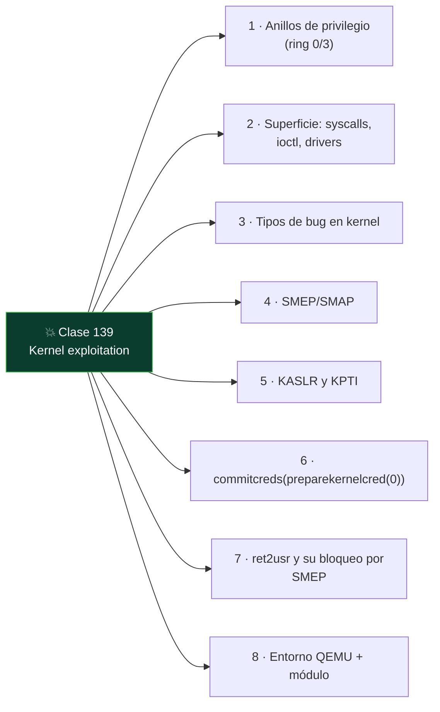

# Clase 139 — Kernel exploitation: introducción

<!-- cabecera:inicio -->

<div align="center">

[](../README.md)
[](../../README.md)
[](../../README.md)
[](../../README.md)

</div>

> 🗂️ Parte: **5 — Explotación de sistemas y binarios** · 📖 Fuente: *A Guide to Kernel Exploitation (Perla & Oldani)* · docs del kernel Linux
> ⏱️ Duración estimada: **150 min** · 🎚️ Nivel: **Experto**

<!-- cabecera:fin -->

---

## 🎯 Objetivo

Dar el salto de user-space a **kernel-space**: entender por qué explotar el kernel implica escalada de
privilegios total, qué superficie ofrecen los drivers y syscalls, y cómo se aplican las técnicas de
corrupción de memoria en un contexto con sus propias mitigaciones (SMEP, SMAP, KASLR, KPTI). Practicarás
en un módulo vulnerable propio dentro de una VM, con el objetivo clásico de `commit_creds(prepare_kernel_cred(0))`.

> ⚠️ **Ética:** exclusivamente en tu VM de laboratorio con un módulo que tú compilas. Un exploit de
> kernel puede colgar o corromper el sistema; usa snapshots. Nunca contra sistemas ajenos.

## 📚 Resultados de aprendizaje

Al finalizar, el alumno podrá:

1. **Explicar** la separación user/kernel y por qué el impacto es máximo.
2. **Identificar** superficie de ataque: syscalls, drivers/ioctl, /proc, netlink.
3. **Describir** las mitigaciones de kernel: SMEP, SMAP, KASLR, KPTI, stack canaries.
4. **Explicar** la técnica `prepare_kernel_cred` + `commit_creds` para root.
5. **Montar** un entorno de práctica con QEMU y un módulo vulnerable.

## 🗺️ Temas

<!-- mapa:inicio -->



<!-- mapa:fin -->

| # | Tema | Por qué importa |
| --- | --- | --- |
| 1 | Anillos de privilegio (ring 0/3) | Frontera user/kernel |
| 2 | Superficie: syscalls, ioctl, drivers | Dónde entra el atacante |
| 3 | Tipos de bug en kernel | UAF, overflow, race, refcount |
| 4 | SMEP/SMAP | Impiden ejecutar/leer user desde kernel |
| 5 | KASLR y KPTI | Aleatorización y aislamiento de tablas |
| 6 | commit_creds(prepare_kernel_cred(0)) | Camino canónico a root |
| 7 | ret2usr y su bloqueo por SMEP | Técnica y contramedida |
| 8 | Entorno QEMU + módulo | Práctica segura |

## 📖 Definiciones y características

- **Kernel-space (ring 0):** contexto con acceso total al hardware y a la memoria. *Clave:* un bug aquí
  suele significar control total del sistema.
- **Superficie de ataque del kernel:** syscalls, `ioctl` de drivers, sistemas de ficheros, red. *Clave:*
  los drivers de terceros son foco frecuente.
- **SMEP/SMAP:** impiden ejecutar (SMEP) o acceder (SMAP) a memoria de usuario desde el kernel. *Clave:*
  bloquean el clásico ret2usr; se evaden con ROP en kernel.
- **KASLR:** aleatoriza la base del kernel. *Clave:* requiere un leak de una dirección de kernel.
- **KPTI:** separa las tablas de páginas de user y kernel (mitiga Meltdown). *Clave:* obliga a un retorno
  cuidadoso a user-space (`swapgs`, `iretq`, trampolines KPTI).
- **commit_creds/prepare_kernel_cred:** funciones del kernel que, encadenadas, otorgan credenciales de
  root al proceso. *Clave:* objetivo estándar del payload de escalada.

## 🧰 Herramientas y preparación

```bash
sudo apt install -y qemu-system-x86 build-essential
# Kernel + initramfs de práctica (p. ej. los de retos "kernel pwn")
# Módulo vulnerable propio compilado contra los headers del kernel de la VM
```

Trabaja en QEMU (no en tu host). Toma un snapshot antes de cada intento.

## 🧪 Laboratorio guiado

> Entorno propio: VM/QEMU con módulo vulnerable que tú compilas.

1. Compila un módulo de práctica con un `copy_from_user` sin acotar (bug deliberado) que exponga un
   `ioctl`/`write` vulnerable. Cárgalo con `insmod` en la VM.

2. Arranca la VM en QEMU con parámetros conocidos para controlar las mitigaciones (para el primer
   ejercicio puedes desactivar KASLR con `nokaslr` y observar direcciones estables):

   ```bash
   qemu-system-x86_64 -kernel bzImage -initrd initramfs.cpio.gz \
     -append "console=ttyS0 nokaslr" -nographic
   ```

3. Desde user-space, escribe un programa que abra el device y dispare el overflow del módulo,
   controlando el flujo de ejecución del kernel.

4. Construye el payload de escalada: una cadena que ejecute
   `commit_creds(prepare_kernel_cred(0))` y luego retorne limpiamente a user-space (guardando el estado
   con `swapgs`/`iretq`).

5. Verifica la escalada: tras el exploit, ejecuta `id` y confirma `uid=0(root)`.

6. Reintroduce mitigaciones (KASLR, SMEP) y comenta qué primitiva adicional (leak, kernel ROP) haría
   falta para vencerlas.

## ✍️ Ejercicios

1. Enumera cuatro fuentes de superficie de ataque de un kernel Linux.
2. Explica por qué SMEP rompe el ret2usr y cómo se evade con kernel ROP.
3. Describe el papel de `prepare_kernel_cred(0)` y `commit_creds`.
4. Configura QEMU con y sin `nokaslr` y compara direcciones.
5. Explica qué complica KPTI en el retorno a user-space.
6. Identifica un CVE reciente de driver Linux y resume su clase de bug.

## 📝 Reto verificable

En tu VM con un módulo vulnerable propio, logra escalada de privilegios a root mediante
`commit_creds(prepare_kernel_cred(0))`, con KASLR desactivado para el primer intento.

**Criterio de aceptación:** tras ejecutar tu exploit, un `id` en la VM muestra `uid=0(root)` y el
sistema sigue estable (retorno limpio a user-space).

## ⚠️ Errores comunes

| Síntoma / mensaje | Causa y cómo arreglar |
| --- | --- |
| Kernel panic / VM colgada | Retorno a user-space mal hecho; guarda/restaura estado (swapgs/iretq) |
| "no funciona" con KASLR | Necesitas un leak de dirección de kernel |
| SMEP fault al saltar a user | Usa kernel ROP en vez de ret2usr |
| Direcciones cambian cada boot | KASLR activo; añade `nokaslr` para aprender |
| `insmod` falla | Módulo compilado contra otros headers; usa los del kernel de la VM |

## ❓ Preguntas frecuentes

**❓ ¿Por qué practicar en QEMU y no en el host?** Un fallo de kernel puede colgar o corromper el
sistema; QEMU con snapshots te da un entorno desechable.

**❓ ¿Kernel pwn es mucho más difícil?** Tiene más mitigaciones y menos margen de error, pero las bases
(corrupción de memoria, ROP) son las mismas.

**❓ ¿Por dónde sigo?** Retos de "kernel pwn" (pwn.college, kernelctf) y lectura del código de drivers
simples.

## 🔗 Referencias

- Perla, E. & Oldani, M. *A Guide to Kernel Exploitation*. Syngress.
- Linux kernel security docs — <https://www.kernel.org/doc/html/latest/security/>
- pwn.college (kernel) — <https://pwn.college/>
- lkmidas, "Learning Linux Kernel Exploitation" — <https://lkmidas.github.io/>

## 📥 Material descargable

- 📄 [Guía en PDF](./clase-139-guia.pdf) — versión imprimible de esta clase.
- 🎞️ [Presentación (PPTX)](./clase-139-presentacion.pptx) — deck para proyectar en clase.

## ⬅️ Clase anterior

[Clase 138 — Desarrollo de exploits moderno](../138-desarrollo-de-exploits-moderno/README.md)

## ➡️ Siguiente clase

[Clase 140 — CTFs de pwn e ingeniería inversa](../140-ctfs-de-pwn-e-ingenieria-inversa/README.md)
