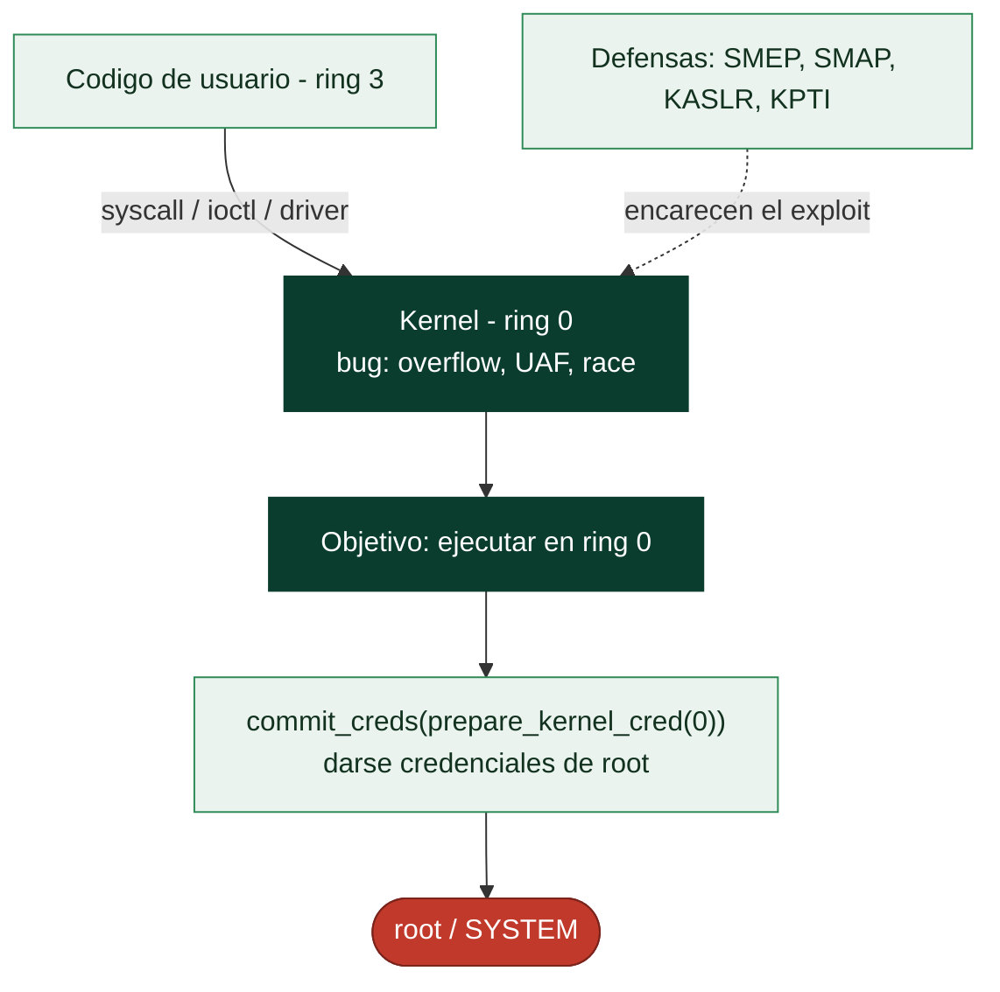

# Clase 139 — Kernel exploitation: introducción

> Parte: **5 — Explotación de sistemas y binarios** · Fuente: *A Guide to Kernel Exploitation (Perla & Oldani)* · docs del kernel Linux
> ⏱️ Duración estimada: **150 min** · Nivel: **Experto**

---

## 🎯 Objetivo

Dar el salto de user-space a **kernel-space**: entender por qué explotar el kernel implica escalada de
privilegios total, qué superficie ofrecen los drivers y syscalls, y cómo se aplican las técnicas de
corrupción de memoria en un contexto con sus propias mitigaciones (SMEP, SMAP, KASLR, KPTI). Practicarás
en un módulo vulnerable propio dentro de una VM, con el objetivo clásico de `commit_creds(prepare_kernel_cred(0))`.

> ⚠️ **Ética:** exclusivamente en tu VM de laboratorio con un módulo que tú compilas. Un exploit de
> kernel puede colgar o corromper el sistema; usa snapshots. Nunca contra sistemas ajenos.

## 📚 Resultados de aprendizaje

Al finalizar, el alumno podrá:

1. **Explicar** la separación user/kernel y por qué el impacto es máximo.
2. **Identificar** superficie de ataque: syscalls, drivers/ioctl, /proc, netlink.
3. **Describir** las mitigaciones de kernel: SMEP, SMAP, KASLR, KPTI, stack canaries.
4. **Explicar** la técnica `prepare_kernel_cred` + `commit_creds` para root.
5. **Montar** un entorno de práctica con QEMU y un módulo vulnerable.

## 🗺️ Temas

| # | Tema | Por qué importa |
| --- | --- | --- |
| 1 | Anillos de privilegio (ring 0/3) | Frontera user/kernel |
| 2 | Superficie: syscalls, ioctl, drivers | Dónde entra el atacante |
| 3 | Tipos de bug en kernel | UAF, overflow, race, refcount |
| 4 | SMEP/SMAP | Impiden ejecutar/leer user desde kernel |
| 5 | KASLR y KPTI | Aleatorización y aislamiento de tablas |
| 6 | commit_creds(prepare_kernel_cred(0)) | Camino canónico a root |
| 7 | ret2usr y su bloqueo por SMEP | Técnica y contramedida |
| 8 | Entorno QEMU + módulo | Práctica segura |

## 🧠 Explicación en profundidad

### El objetivo definitivo: comprometer el núcleo

La **explotación del kernel** aplica todo lo aprendido al blanco de mayor valor: el **núcleo del
sistema operativo**, que se ejecuta en el nivel de privilegio máximo. La diferencia fundamental está en
los **anillos de privilegio** del procesador: el código de usuario corre en **ring 3** (sin
privilegios), y el kernel en **ring 0** (control total del hardware, de la memoria de todos los
procesos, de todo). Un exploit de userland (clases anteriores) da control de **un proceso**; un exploit
de kernel da control del **sistema entero** —es la escalada de privilegios definitiva, de un usuario
normal a root o SYSTEM, saltándose todos los controles—. Por eso los bugs de kernel son los más
codiciados y los mejor pagados, y por eso el kernel invierte tanto en defenderse.

### La superficie de ataque: donde el kernel toca al usuario

El kernel está aislado, pero **tiene que recibir peticiones del código de usuario**, y esa frontera es
su superficie de ataque. Los puntos de contacto son las **llamadas al sistema** (syscalls, la [Clase
023](../../parte-0-fundamentos-y-prerrequisitos/023-sistemas-operativos-procesos-memoria-y-syscalls/README.md)), las operaciones **`ioctl`** (el canal genérico para hablar con drivers), y sobre todo los
**drivers de dispositivo** —que son, con diferencia, la mayor fuente de bugs de kernel, porque hay
miles, a menudo de terceros y peor auditados que el núcleo central—. Los **tipos de bug** son los
mismos de toda la parte (overflows, UAF, integer overflows, condiciones de carrera) pero **en el
contexto del kernel**, donde un fallo no crashea un proceso sino que puede corromper el sistema entero
o, explotado, entregar ring 0.



### El objetivo del payload y las defensas específicas del kernel

Mientras que un exploit de userland busca lanzar `/bin/sh`, un exploit de kernel busca **darse
privilegios de root desde ring 0**, y en Linux el patrón canónico es una llamada: **`commit_creds(
prepare_kernel_cred(0))`**, que crea unas credenciales de root y las asigna al proceso actual —tras lo
cual, de vuelta en userland, el proceso **es** root—. El kernel se defiende con mitigaciones análogas a
las de userland pero propias. **SMEP** (*Supervisor Mode Execution Prevention*) impide que el kernel
**ejecute código que está en memoria de usuario** —bloquea el ataque clásico **ret2usr**, que redirigía
la ejecución del kernel a un payload colocado en userland—. **SMAP** (*Supervisor Mode Access
Prevention*) impide que el kernel **acceda** a memoria de usuario sin permiso explícito. **KASLR** es el
ASLR del kernel (aleatoriza dónde se carga el propio kernel, exigiendo un leak de kernel para derrotarlo).
Y **KPTI** (*Kernel Page-Table Isolation*, introducido contra Meltdown) separa las tablas de páginas de
usuario y kernel. Estas defensas convierten la explotación de kernel en una versión más difícil de la de
userland: hace falta un leak de kernel para KASLR, técnicas para sortear SMEP/SMAP, y ROP en el propio
kernel.

### El entorno de práctica y el porqué de la clase

Practicar explotación de kernel de forma segura exige un montaje específico: se usa **QEMU** para
ejecutar un kernel Linux en una máquina virtual, con un **módulo de kernel deliberadamente vulnerable**
cargado como objetivo, de modo que un crash tumba la VM y no el sistema del analista —el aislamiento de
la clase 134 llevado al extremo, porque un fallo aquí es catastrófico—. El desarrollo del exploit combina
todo lo de la parte (ROP, leaks, primitivas) adaptado a las peculiaridades del kernel: la transición
entre anillos, la recuperación limpia a userland tras ganar privilegios (para no colgar el sistema), y el
manejo de las estructuras internas del kernel. La lección de la clase es doble: **conceptualmente**, que
la explotación de kernel es la aplicación de los mismos principios al objetivo de máximo privilegio,
donde un solo bug entrega el sistema entero; y **prácticamente**, que es un dominio avanzado que
recompensa el dominio de todo lo anterior. Es también la razón de peso para las defensas de kernel de la
Parte 8 y para mantener el kernel actualizado: un bug de kernel explotable es la llave del reino.

## 📖 Definiciones y características

- **Kernel-space (ring 0):** contexto con acceso total al hardware y a la memoria. *Clave:* un bug aquí
  suele significar control total del sistema.
- **Superficie de ataque del kernel:** syscalls, `ioctl` de drivers, sistemas de ficheros, red. *Clave:*
  los drivers de terceros son foco frecuente.
- **SMEP/SMAP:** impiden ejecutar (SMEP) o acceder (SMAP) a memoria de usuario desde el kernel. *Clave:*
  bloquean el clásico ret2usr; se evaden con ROP en kernel.
- **KASLR:** aleatoriza la base del kernel. *Clave:* requiere un leak de una dirección de kernel.
- **KPTI:** separa las tablas de páginas de user y kernel (mitiga Meltdown). *Clave:* obliga a un retorno
  cuidadoso a user-space (`swapgs`, `iretq`, trampolines KPTI).
- **commit_creds/prepare_kernel_cred:** funciones del kernel que, encadenadas, otorgan credenciales de
  root al proceso. *Clave:* objetivo estándar del payload de escalada.

## 📔 Glosario

| Término | Definición concisa |
|---------|--------------------|
| Kernel exploitation | Explotar el núcleo del sistema operativo |
| Anillo de privilegio | Nivel del procesador: ring 3 usuario, ring 0 kernel |
| Ring 0 | Máximo privilegio; control total del sistema |
| Superficie de kernel | syscalls, ioctl y drivers |
| Driver | Mayor fuente de bugs de kernel |
| commit_creds(prepare_kernel_cred(0)) | Patrón para darse root desde el kernel |
| SMEP | Impide al kernel ejecutar memoria de usuario |
| ret2usr | Ataque que SMEP bloquea |
| SMAP | Impide al kernel acceder a memoria de usuario |
| KASLR | ASLR del kernel; exige un leak de kernel |
| KPTI | Aísla las tablas de páginas de usuario y kernel |
| Leak de kernel | Filtrar una dirección para derrotar KASLR |
| QEMU + módulo | Entorno de práctica aislado para kernel |
| Recuperación a userland | Volver limpio tras ganar privilegios |

## 🧰 Herramientas y preparación

```bash
sudo apt install -y qemu-system-x86 build-essential
# Kernel + initramfs de práctica (p. ej. los de retos "kernel pwn")
# Módulo vulnerable propio compilado contra los headers del kernel de la VM
```

Trabaja en QEMU (no en tu host). Toma un snapshot antes de cada intento.

## 🧪 Laboratorio guiado

> Entorno propio: VM/QEMU con módulo vulnerable que tú compilas.

1. Compila un módulo de práctica con un `copy_from_user` sin acotar (bug deliberado) que exponga un
   `ioctl`/`write` vulnerable. Cárgalo con `insmod` en la VM.

2. Arranca la VM en QEMU con parámetros conocidos para controlar las mitigaciones (para el primer
   ejercicio puedes desactivar KASLR con `nokaslr` y observar direcciones estables):

   ```bash
   qemu-system-x86_64 -kernel bzImage -initrd initramfs.cpio.gz \
     -append "console=ttyS0 nokaslr" -nographic
   ```

3. Desde user-space, escribe un programa que abra el device y dispare el overflow del módulo,
   controlando el flujo de ejecución del kernel.

4. Construye el payload de escalada: una cadena que ejecute
   `commit_creds(prepare_kernel_cred(0))` y luego retorne limpiamente a user-space (guardando el estado
   con `swapgs`/`iretq`).

5. Verifica la escalada: tras el exploit, ejecuta `id` y confirma `uid=0(root)`.

6. Reintroduce mitigaciones (KASLR, SMEP) y comenta qué primitiva adicional (leak, kernel ROP) haría
   falta para vencerlas.

## ✍️ Ejercicios

1. Enumera cuatro fuentes de superficie de ataque de un kernel Linux.
2. Explica por qué SMEP rompe el ret2usr y cómo se evade con kernel ROP.
3. Describe el papel de `prepare_kernel_cred(0)` y `commit_creds`.
4. Configura QEMU con y sin `nokaslr` y compara direcciones.
5. Explica qué complica KPTI en el retorno a user-space.
6. Identifica un CVE reciente de driver Linux y resume su clase de bug.

## 📝 Reto verificable

En tu VM con un módulo vulnerable propio, logra escalada de privilegios a root mediante
`commit_creds(prepare_kernel_cred(0))`, con KASLR desactivado para el primer intento.

**Criterio de aceptación:** tras ejecutar tu exploit, un `id` en la VM muestra `uid=0(root)` y el
sistema sigue estable (retorno limpio a user-space).

## ⚠️ Errores comunes

| Síntoma / mensaje | Causa y cómo arreglar |
| --- | --- |
| Kernel panic / VM colgada | Retorno a user-space mal hecho; guarda/restaura estado (swapgs/iretq) |
| "no funciona" con KASLR | Necesitas un leak de dirección de kernel |
| SMEP fault al saltar a user | Usa kernel ROP en vez de ret2usr |
| Direcciones cambian cada boot | KASLR activo; añade `nokaslr` para aprender |
| `insmod` falla | Módulo compilado contra otros headers; usa los del kernel de la VM |

## ❓ Preguntas frecuentes

**❓ ¿Por qué practicar en QEMU y no en el host?** Un fallo de kernel puede colgar o corromper el
sistema; QEMU con snapshots te da un entorno desechable.

**❓ ¿Kernel pwn es mucho más difícil?** Tiene más mitigaciones y menos margen de error, pero las bases
(corrupción de memoria, ROP) son las mismas.

**❓ ¿Por dónde sigo?** Retos de "kernel pwn" (pwn.college, kernelctf) y lectura del código de drivers
simples.

## 🔗 Referencias

- Perla, E. & Oldani, M. *A Guide to Kernel Exploitation*. Syngress.
- Linux kernel security docs — <https://www.kernel.org/doc/html/latest/security/>
- pwn.college (kernel) — <https://pwn.college/>
- lkmidas, "Learning Linux Kernel Exploitation" — <https://lkmidas.github.io/>

## 📥 Material descargable

- 📄 [Guía en PDF](./clase-139-guia.pdf) — versión imprimible de esta clase.
- 🎞️ [Presentación (PPTX)](./clase-139-presentacion.pptx) — deck para proyectar en clase.

## ⬅️ Clase anterior

[Clase 138 — Desarrollo de exploits moderno](../138-desarrollo-de-exploits-moderno/README.md)

## ➡️ Siguiente clase

[Clase 140 — CTFs de pwn e ingeniería inversa](../140-ctfs-de-pwn-e-ingenieria-inversa/README.md)
