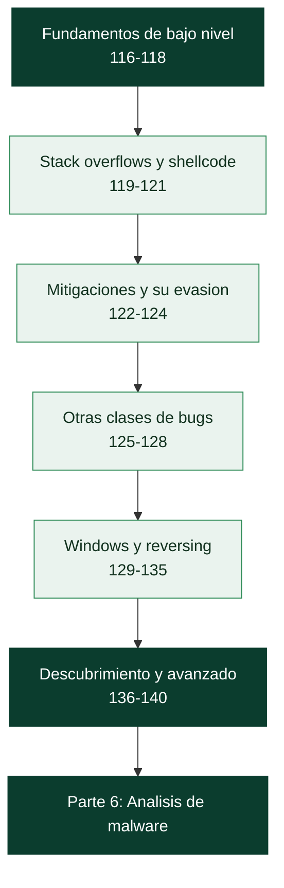

# Parte 5 — Explotación de sistemas y binarios

> [⬅️ Volver al programa](../../README.md) · [📚 Índice completo](../README.md) · [⏭️ Parte siguiente](../parte-6-analisis-de-malware/README.md)

**25 clases** · rango 116–140 · Assembly, buffer overflows, ROP, heap, fuzzing e ingeniería inversa

**Fuentes de referencia de esta parte:**

- Jon Erickson — *Hacking: The Art of Exploitation, 2nd Edition* (No Starch Press).
- Dennis Andriesse — *Practical Binary Analysis* (No Starch Press).
- Anley, Heasman, Lindner, Richarte — *The Shellcoder's Handbook, 2nd Edition* (Wiley).
- Bratus, Locasto et al. y la comunidad — *Nightmare* / *pwn.college* como currículos abiertos de explotación.
- Intel — *Intel 64 and IA-32 Architectures Software Developer's Manual* (referencia de arquitectura).
- System V Application Binary Interface — *AMD64 Architecture Processor Supplement* (convenciones de llamada).

---

## 🎯 ¿De qué trata esta parte?

Esta parte baja al nivel más profundo de la seguridad ofensiva: la memoria de un proceso, el
juego de registros de la CPU y los bytes de un binario compilado. Aquí aprenderás cómo un
programa escrito en C se convierte en instrucciones máquina, dónde viven el stack y el heap,
y por qué un simple error al copiar datos puede darle a un atacante el control del flujo de
ejecución. Es el corazón del *binary exploitation* (pwn) y de la ingeniería inversa.

Importa porque las vulnerabilidades de corrupción de memoria siguen siendo, décadas después,
una de las clases de fallos más críticas: alimentan exploits de kernel, cadenas de 0-day en
navegadores y escapes de sandbox. Entender cómo funcionan por dentro te convierte en mejor
defensor (sabes qué mitigar y por qué), mejor desarrollador (escribes código que no rompe la
memoria) y mejor investigador (descubres y reportas fallos antes que los adversarios).

Sirve a pentesters que quieren ir más allá de la web, a analistas de malware que necesitan leer
ensamblador, a investigadores de vulnerabilidades y a cualquiera que aspire a competir en CTFs
de categoría *pwn* y *reversing*. El recorrido va de los fundamentos de la arquitectura x86/x64
hasta técnicas modernas de ROP, explotación de heap, fuzzing con AFL++ e introducción al kernel.

> ⚠️ **Nota ética.** Todo el contenido ofensivo de esta parte se practica exclusivamente en
> **laboratorios propios** (máquinas virtuales aisladas, binarios que tú compilas, retos de CTF
> con permiso) o con **autorización explícita por escrito**. Desarrollar o desplegar exploits
> contra sistemas de terceros sin consentimiento es ilegal en la mayoría de jurisdicciones.

## 🧩 Problemas que resuelve

- Leer y razonar sobre código ensamblador x86/x64 para entender qué hace un binario sin fuente.
- Depurar procesos a nivel de instrucción y examinar el estado exacto de memoria y registros.
- Identificar y explotar corrupciones de memoria: stack overflow, format string, heap, integer bugs.
- Evadir mitigaciones modernas (ASLR, DEP/NX, canarios, PIE) con ret2libc y ROP.
- Realizar ingeniería inversa de binarios con Ghidra, IDA y radare2 para análisis y CTFs.
- Descubrir vulnerabilidades desconocidas mediante fuzzing y auditoría de código.
- Construir exploits reproducibles y automatizados con pwntools.

## 🎓 Resultados de aprendizaje

Al terminar la parte, el alumno podrá:

1. Explicar la arquitectura x86/x64: registros, modos, el stack y las convenciones de llamada.
2. Depurar binarios con GDB+pwndbg y con radare2, inspeccionando memoria, stack y registros.
3. Diagnosticar y explotar un stack buffer overflow controlando `RIP`/`EIP`.
4. Escribir shellcode funcional y minimizar bytes nulos.
5. Describir y evadir ASLR, DEP/NX, stack canaries y PIE con ret2libc y cadenas ROP.
6. Explotar format strings, use-after-free, double free e integer overflows en laboratorio.
7. Aplicar ingeniería inversa con Ghidra/IDA/radare2 y automatizar análisis dinámico.
8. Encontrar bugs con fuzzing (AFL++/libFuzzer) y construir exploits con pwntools.

## 🧱 Prerrequisitos

Esta es la parte más técnica del programa; conviene traer estos cimientos firmes:

| Necesitas tener claro… | Dónde se cubre |
|---|---|
| CPU, registros, pila y el marco de llamada | [Clase 024](../parte-0-fundamentos-y-prerrequisitos/024-arquitectura-de-computadores-cpu-registros-y-memoria/README.md) |
| Procesos, memoria virtual y syscalls | [Clase 023](../parte-0-fundamentos-y-prerrequisitos/023-sistemas-operativos-procesos-memoria-y-syscalls/README.md) |
| Encoding: hex, binario, bytes | [Clase 020](../parte-0-fundamentos-y-prerrequisitos/020-sistemas-de-numeracion-y-encoding-binario-hex-base64-y-url/README.md) |
| Python para escribir exploits (pwntools) | [Clase 015](../parte-0-fundamentos-y-prerrequisitos/015-python-para-seguridad-fundamentos-del-lenguaje/README.md) |
| Laboratorio aislado con snapshots | [Clase 004](../parte-0-fundamentos-y-prerrequisitos/004-montaje-del-laboratorio-virtualizacion-kali-snapshots-y-aislamiento-de-red/README.md) |
| Metodología ofensiva y ética | [Parte 3](../parte-3-hacking-etico-y-pentesting-metodologia/README.md) · [Clase 025](../parte-0-fundamentos-y-prerrequisitos/025-etica-legalidad-alcance-y-divulgacion-responsable/README.md) |

Además, **saber programar en C** es aquí un requisito real, no un adorno: hay que reconocer un `strcpy` peligroso, entender un puntero colgante y leer el pseudo-C de un decompilador.

## 🧭 Cómo recorrer esta parte

**El orden es estricto y acumulativo, más que en ninguna otra parte.** No se puede explotar un buffer overflow (119) sin entender el stack (117); no se puede hacer ROP (124) sin haber visto las mitigaciones que lo motivan (122); y el desarrollo de exploits moderno (138) integra literalmente todo lo anterior. Recórrela en orden, y no pases de una clase hasta que su laboratorio te salga: esta es una parte de **hacer**, no de leer.

**El ritmo.** La parte suma unas **50 h 10 min** de trabajo guiado, y aquí el tiempo de laboratorio (repetir exploits, resolver retos) puede duplicar esa cifra —es normal y es donde se aprende—. A dos horas al día son unas **seis semanas**, pero el ritmo real lo marca cuánto tardes en que cada exploit funcione.

**El método, clase a clase.**

1. Lee **🎯 Objetivo** y **📚 Resultados de aprendizaje**.
2. Lee **🧠 Explicación en profundidad** antes de tocar GDB. En esta parte el *porqué* es todo: un exploit que se copia sin entender falla al primer cambio de versión, offset o mitigación.
3. Prepara el laboratorio de **🧰 Herramientas y preparación** (GDB+pwndbg, pwntools, Ghidra, un binario vulnerable que tú compilas).
4. Haz el **🧪 Laboratorio guiado**: escribe el exploit, y cuando falle —fallará— depúralo hasta entender por qué. Ese ciclo *es* el aprendizaje.
5. Resuelve **✍️ Ejercicios** y el **📝 Reto verificable**, casi siempre un binario que hay que explotar.
6. Repasa el **📔 Glosario**: la densidad de términos y siglas es la más alta del programa (RIP, RSP, GOT/PLT, ROP, UAF, ASLR, SMEP).

> ⚠️ **Uso ético y legal.** Todo aquí se practica sobre **binarios que tú compilas**, máquinas virtuales aisladas o **retos de CTF autorizados** (clase 140). Nunca contra software o sistemas de terceros sin permiso escrito. La explotación de kernel (139) se practica en una VM con QEMU precisamente porque un fallo es catastrófico. Repasa la [Clase 025](../parte-0-fundamentos-y-prerrequisitos/025-etica-legalidad-alcance-y-divulgacion-responsable/README.md).

## 🧱 Anatomía de una clase

Las 25 clases siguen el **estándar pedagógico profundo** del programa:

| Sección | Qué contiene | Para qué la usas |
|---|---|---|
| 🎯 Objetivo | Qué sabrás hacer al terminar y por qué importa | Decidir si necesitas la clase |
| 📚 Resultados de aprendizaje | Lista verificable de capacidades concretas | Autoevaluarte al final |
| 🗺️ Temas | Cada tema con el porqué de su inclusión | Ubicarte antes de leer |
| 🧠 Explicación en profundidad | El mecanismo a nivel de memoria y registros, con diagramas | Entender, no copiar exploits |
| 📖 Definiciones y características | Cada término desarrollado con su relevancia | Consulta puntual |
| 📔 Glosario | Términos, siglas e instrucciones de la clase | Repaso rápido |
| 🧰 Herramientas y preparación | Qué instalar y qué binario compilar | Antes del laboratorio |
| 🧪 Laboratorio guiado | Exploit paso a paso contra un binario propio | Donde de verdad se aprende |
| ✍️ Ejercicios · 📝 Reto verificable | Práctica propia y un binario que explotar | Consolidar y demostrar |
| ⚠️ Errores comunes · ❓ Preguntas frecuentes | Fallos reales (offset, alineación, badchars) y dudas | Cuando el exploit no funciona |
| 🔗 Referencias | Erickson, Andriesse, pwn.college, manuales de Intel | Profundizar |

El CI del repositorio verifica que ninguna clase de esta parte pierda las secciones **🧠 Explicación en profundidad** ni **📔 Glosario**.

## 🗺️ Estructura temática

| Bloque | Clases | Contenido | Tiempo |
| --- | --- | --- | --- |
| Fundamentos de bajo nivel | 116–118 | Arquitectura, stack/registros/ABI, debugging con GDB+pwndbg | ≈ 5 h 50 |
| Stack overflows y shellcode | 119–121 | Teoría, explotación práctica y escritura de shellcode | ≈ 6 h 30 |
| Mitigaciones y su evasión | 122–124 | ASLR/DEP/canaries/PIE, ret2libc y ROP | ≈ 6 h 30 |
| Otras clases de bugs | 125–128 | Format string, heap, UAF/double free, integer overflows | ≈ 8 h |
| Windows y reversing | 129–135 | SEH, RE, Ghidra, IDA/radare2, estático/dinámico, anti-reversing | ≈ 13 h 40 |
| Descubrimiento y avanzado | 136–140 | Fuzzing, hallazgo de vulns, exploits modernos, kernel, CTFs | ≈ 11 h |

## 📖 Guía capítulo a capítulo

### ⚙️ Bloque 1 · Fundamentos de bajo nivel — clases 116 a 118

- **[116 · Arquitectura x86/x64 y ensamblador](116-arquitectura-x86-x64-y-lenguaje-ensamblador/README.md)** · 120 min — Pensar como la CPU: registros (RIP controla la ejecución), endianness, las dos sintaxis, y las instrucciones que hay que reconocer. Con `gcc -S` para aprender a leer ASM.
- **[117 · El stack, los registros y las convenciones de llamada](117-el-stack-los-registros-y-las-convenciones-de-llamada/README.md)** · 120 min — La estructura donde ocurre la explotación. `call`/`ret` y el marco de pila, System V AMD64 (RDI, RSI, RDX…), y los detalles que rompen exploits: red zone y alineación a 16 bytes.
- **[118 · Debugging con GDB y pwndbg](118-debugging-con-gdb-y-pwndbg/README.md)** · 110 min — El microscopio de la explotación. Breakpoints, `x/`, `vmmap`, `telescope`, y `cyclic` para hallar el offset. Con la trampa de que GDB desactiva ASLR por defecto.

### 💥 Bloque 2 · Stack overflows y shellcode — clases 119 a 121

- **[119 · Buffer overflow en stack: teoría](119-buffer-overflow-en-stack-teoria/README.md)** · 100 min — El fallo fundacional: escribir más allá del buffer hasta la dirección de retorno. El offset, las funciones peligrosas de C, y el panorama de mitigaciones que motiva el resto de la parte.
- **[120 · Buffer overflow: explotación práctica](120-buffer-overflow-en-stack-explotacion-practica/README.md)** · 140 min — De la teoría al exploit. `ret2win`, `p64` y el orden de bytes, el error de alineación que desconcierta, y pwntools para saltar de local a remoto.
- **[121 · Escritura de shellcode](121-escritura-de-shellcode/README.md)** · 130 min — El código que ejecutar tras controlar RIP. La syscall `execve`, el enemigo del byte nulo, y por qué el shellcode-en-la-pila clásico ya no funciona (NX).

### 🛡️ Bloque 3 · Mitigaciones y su evasión — clases 122 a 124

- **[122 · Protecciones modernas: ASLR, DEP/NX, canaries y PIE](122-protecciones-modernas-aslr-dep-nx-stack-canaries-y-pie/README.md)** · 110 min — Por qué el exploit clásico ya no funciona: cuatro capas de defensa encadenadas. `checksec` y RELRO, y cómo cada defensa dicta una técnica de bypass.
- **[123 · Bypass de protecciones: ret2libc](123-bypass-de-protecciones-ret2libc/README.md)** · 130 min — Si no puedes inyectar código, usa el que ya está cargado. El info leak vía GOT/PLT, el cálculo de la base de libc, el gadget `pop rdi`, y la alineación otra vez.
- **[124 · Return-Oriented Programming (ROP)](124-return-oriented-programming-rop/README.md)** · 140 min — Programar con trozos del programa. Los gadgets, `ret` como pegamento, ret2syscall, y el stack pivot. La técnica que define la explotación moderna.

### 🔬 Bloque 4 · Otras clases de bugs — clases 125 a 128

- **[125 · Vulnerabilidades de format string](125-vulnerabilidades-de-format-string/README.md)** · 120 min — Cuando el usuario controla la cadena de formato. `%p` para leer la pila (y el canario), `%n` para escribir en memoria arbitraria, y la sobrescritura de la GOT.
- **[126 · Explotación de heap: fundamentos](126-explotacion-de-heap-fundamentos/README.md)** · 130 min — Otra región, otra clase de bugs. Chunks y metadatos, tcache y bins, y cómo engañar al allocator manipulando sus listas de libres.
- **[127 · Heap: use-after-free y double free](127-heap-use-after-free-y-double-free/README.md)** · 140 min — Usar lo que ya devolviste. El puntero colgante y el secuestro de vtable, el tcache poisoning, y las mitigaciones (tcache key, safe-linking) y ASan.
- **[128 · Integer overflows y errores aritméticos](128-integer-overflows-y-errores-aritmeticos/README.md)** · 100 min — El bug que no crashea pero prepara el desastre. Wrap-around, signed/unsigned, truncamiento, y el overflow en el cálculo del tamaño que habilita un heap overflow.

### 🪟 Bloque 5 · Windows y reversing — clases 129 a 135

- **[129 · Explotación en Windows: manejo de SEH](129-explotacion-en-windows-manejo-de-seh/README.md)** · 130 min — La vía propia de Windows: secuestrar la cadena de manejadores de excepciones. El SEH overwrite, el gadget `POP POP RET`, `mona.py`, y SafeSEH/SEHOP.
- **[130 · Ingeniería inversa: introducción](130-ingenieria-inversa-introduccion/README.md)** · 110 min — Entender un programa sin su fuente. Los formatos ELF y PE, símbolos y stripping, el triaje con `file`/`strings`, y estático vs dinámico con metodología por objetivos.
- **[131 · Ghidra](131-ghidra-para-ingenieria-inversa/README.md)** · 130 min — El decompilador libre que democratizó la RE. Proyecto y auto-análisis, las dos vistas, el trabajo iterativo de anotar (renombrar, retipar), y las xrefs como brújula.
- **[132 · IDA Pro y radare2](132-ida-pro-y-radare2/README.md)** · 120 min — El estándar comercial y la navaja libre. La vista de grafo del flujo de control, el modelo de comandos de r2 (`aaa`, `afl`, `pdf`), Cutter y el scripting con r2pipe.
- **[133 · Análisis estático de binarios](133-analisis-estatico-de-binarios/README.md)** · 120 min — Entender sin ejecutar. Desensamblado lineal vs recursivo, CFG/call graph/data flow, la detección de funciones, y los límites (packing, indirección).
- **[134 · Análisis dinámico y debugging](134-analisis-dinamico-y-debugging-de-binarios/README.md)** · 120 min — Ver el programa en marcha, con aislamiento obligatorio. `strace`/`ltrace`, Frida para instrumentar en caliente, dump de memoria y el ciclo estático↔dinámico.
- **[135 · Ofuscación y anti-reversing](135-ofuscacion-y-tecnicas-anti-reversing/README.md)** · 120 min — La otra cara: dificultar el análisis. Packing y entropía, anti-debugging (ptrace) y anti-VM, cadenas cifradas, control-flow flattening y virtualización de código.

### 🎯 Bloque 6 · Descubrimiento y avanzado — clases 136 a 140

- **[136 · Fuzzing con AFL++ y libFuzzer](136-fuzzing-con-afl-y-libfuzzer/README.md)** · 140 min — Encontrar bugs bombardeando el programa. El fuzzing guiado por cobertura, corpus semilla y diccionarios, los sanitizers que hacen visibles los crashes, y el triaje.
- **[137 · Descubrimiento de vulnerabilidades en código](137-descubrimiento-de-vulnerabilidades-en-codigo/README.md)** · 120 min — Buscar el fallo en el código. La superficie de ataque, los patrones peligrosos, el taint tracking (source → sink) y CodeQL, con priorización por explotabilidad.
- **[138 · Desarrollo de exploits moderno](138-desarrollo-de-exploits-moderno/README.md)** · 140 min — La síntesis: pensar por primitivas. El info leak como llave, el cálculo dinámico de direcciones, ROP + ret2libc combinados, libc-database, y la robustez local→remoto.
- **[139 · Kernel exploitation: introducción](139-kernel-exploitation-introduccion/README.md)** · 150 min — El objetivo definitivo: comprometer el núcleo. Anillos de privilegio, la superficie (syscalls, ioctl, drivers), `commit_creds`, y las defensas SMEP/SMAP/KASLR/KPTI.
- **[140 · CTFs de pwn e ingeniería inversa](140-ctfs-de-pwn-e-ingenieria-inversa/README.md)** · 130 min — El campo de entrenamiento de la parte. Formatos y categorías, el flujo de un reto, la plantilla pwntools, la gestión de la libc del reto, y los writeups.

## 🧰 Qué tendrás al terminar

- La capacidad de **leer ensamblador x86/x64** y depurar un binario a nivel de instrucción con GDB+pwndbg.
- Exploits funcionales de **stack overflow, format string, heap (UAF/double free) e integer overflow** en laboratorio.
- El dominio de las **mitigaciones modernas** y de cómo evadirlas: **ret2libc** y cadenas **ROP** con info leaks.
- Un flujo de **ingeniería inversa** con Ghidra/IDA/radare2, combinando análisis estático y dinámico.
- La habilidad de **descubrir bugs** con fuzzing (AFL++) y auditoría de código (CodeQL).
- Exploits **robustos y automatizados con pwntools** que saltan de local a remoto, del tipo que resuelve un reto de CTF.

## 🚦 ¿Puedo saltarme clases?

Casi no. Esta parte es una escalera: cada peldaño se apoya en el anterior. Sáltate una clase solo si respondes de memoria a su pregunta de control:

| Si dominas… | Pregunta de control | Si titubeas |
|---|---|---|
| Stack (117) | ¿En qué registros van los 3 primeros argumentos en x64 System V? | Haz 117 |
| Overflow (119) | ¿Qué es el "offset" y por qué controlar RIP es el objetivo? | Haz 119 |
| Mitigaciones (122) | ¿Por qué NX obliga a reutilizar código en vez de inyectarlo? | Haz 122 |
| ROP (124) | ¿Por qué `ret` es el "pegamento" que encadena los gadgets? | Haz 124 |
| Heap (126) | ¿Cómo enlaza el tcache sus chunks libres y por qué importa? | Haz 126 |
| Exploit dev (138) | ¿Por qué casi ningún exploit moderno funciona sin un info leak? | Haz 138 |

## 🔗 Referencias de la parte

- Erickson, J. *Hacking: The Art of Exploitation, 2e*. No Starch Press — <https://nostarch.com/hacking2.htm>
- Andriesse, D. *Practical Binary Analysis*. No Starch Press — <https://practicalbinaryanalysis.com/>
- Anley et al. *The Shellcoder's Handbook, 2e*. Wiley.
- pwn.college — currículo abierto de explotación — <https://pwn.college/>
- Nightmare (guyinatuxedo) — <https://guyinatuxedo.github.io/>
- System V AMD64 ABI — <https://gitlab.com/x86-psABIs/x86-64-ABI>

## ▶️ Empezar

[Clase 116 — Arquitectura x86/x64 y lenguaje ensamblador](116-arquitectura-x86-x64-y-lenguaje-ensamblador/README.md)
