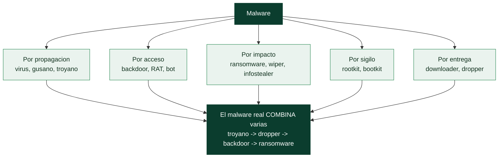

# Clase 141 — Introducción al malware: tipos y taxonomía

> Parte: **6 — Análisis de malware** · Fuente: *Practical Malware Analysis* (Sikorski & Honig)
> ⏱️ Duración estimada: **75 min** · Nivel: **Fundamentos**

---

## 🎯 Objetivo

Construir el vocabulario y el mapa mental del analista: qué es el malware, cómo se clasifica por comportamiento y por objetivo, qué distingue una familia de una variante, y cómo encaja cada tipo en el ciclo de vida de un ataque. Al final de la clase el alumno sabrá nombrar con precisión lo que observa, algo imprescindible antes de tocar una sola muestra.

## 📚 Resultados de aprendizaje

Al finalizar, el alumno podrá:

1. **Distinguir** los grandes tipos de malware por propagación, persistencia y objetivo.
2. **Clasificar** una amenaza usando taxonomías por comportamiento y por familia.
3. **Relacionar** cada tipo con fases de MITRE ATT&CK y del ciclo de intrusión.
4. **Explicar** la diferencia entre familia, variante, campaña y actor.
5. **Interpretar** nombres de detección de la industria (p. ej. `Trojan:Win32/Emotet`).

## 🗺️ Temas

| # | Tema | Por qué importa |
|---|------|-----------------|
| 1 | Definición de malware y de "código malicioso" | Fija el alcance de la disciplina |
| 2 | Virus, gusanos y troyanos | Diferencian el mecanismo de propagación |
| 3 | Backdoors, RATs y bots | Base del control remoto y las botnets |
| 4 | Ransomware, wipers e infostealers | Los de mayor impacto económico hoy |
| 5 | Rootkits, bootkits y downloaders/droppers | Persistencia y entrega por etapas |
| 6 | Familia vs variante vs campaña | Evita confundir muestra con amenaza |
| 7 | Convenciones de nombres (CARO, vendors) | Traduce el veredicto de un AV |
| 8 | Mapeo a MITRE ATT&CK | Lenguaje común de TTPs |

## 🧠 Explicación en profundidad

### Clasificar por comportamiento, no por nombre comercial

El **malware** —*software malicioso*— es cualquier programa diseñado para dañar, acceder sin
autorización o interferir con un sistema. La taxonomía importa porque **el tipo de malware dicta cómo
se analiza y cómo se responde**: un ransomware exige recuperar datos y romper la cadena de cifrado, un
infostealer exige rotar credenciales, un rootkit exige forense de kernel. Pero conviene entender que
las categorías clásicas **describen función, no forma**, y que el malware real casi siempre **combina
varias**: un troyano que instala un backdoor que descarga un ransomware. La clasificación es una
herramienta para razonar, no cajones estancos.

Las categorías por **mecanismo de propagación** distinguen tres clásicos: un **virus** se inserta en
otro programa y se propaga cuando ese programa se ejecuta; un **gusano** (*worm*) se propaga **solo**,
sin intervención humana, explotando vulnerabilidades de red; y un **troyano** se disfraza de software
legítimo para que el usuario lo ejecute. Estas tres describen *cómo llega*, no *qué hace* después.

### Por lo que hace: acceso, impacto y sigilo

Las categorías por **capacidad** son las que orientan la respuesta. Los de **acceso remoto**: un
**backdoor** deja una puerta abierta para volver a entrar; un **RAT** (*Remote Access Trojan*) da
control interactivo completo del sistema; un **bot** enrola la máquina en una **botnet** controlada en
masa. Los de **impacto**: el **ransomware** cifra los datos y pide rescate; un **wiper** los destruye
sin posibilidad de recuperación (a veces disfrazado de ransomware); un **infostealer** roba
credenciales, cookies y carteras. Los de **sigilo**: un **rootkit** oculta su presencia manipulando el
sistema operativo (Parte 5 y clase 151); un **bootkit** se carga antes que el propio SO. Y los de
**entrega**, que son el primer eslabón: un **downloader** descarga la carga real desde Internet, y un
**dropper** la lleva incrustada y la deposita en disco —ambos son la avanzadilla que trae al malware
de verdad—.

### Familia, variante y campaña: el vocabulario de la atribución

Tres términos organizan cómo se habla del malware en la práctica profesional. Una **familia** es un
linaje de malware que comparte código base y autoría (Emotet, TrickBot, WannaCry). Una **variante** es
una versión modificada de una familia —mismo ADN, cambios de funcionalidad o de evasión—. Y una
**campaña** es una operación concreta que usa cierto malware contra ciertos objetivos en cierto
periodo. Distinguirlos es esencial para la *threat intelligence* (clase 157): dos muestras distintas
pueden ser variantes de la misma familia (y por tanto contarse como el mismo actor), o malware
distinto usado en la misma campaña.

### Los nombres son un caos, y ATT&CK pone orden

Aquí una advertencia práctica: **los nombres del malware son un desastre**. Cada fabricante de
antivirus bautiza las muestras a su manera (las convenciones **CARO** intentaron estandarizarlo con
poco éxito), de modo que una misma muestra puede llamarse `Trojan.Win32.Emotet`, `TrojanBanker.Geodo`
y `Win32/Kovter` según el vendor —consultar varias fuentes (VirusTotal, clase 143) y no fiarse de un
solo nombre es la norma—. Lo que sí ofrece un lenguaje común es **MITRE ATT&CK**: en lugar de discutir
cómo se llama el malware, se describe **qué hace** en términos de **tácticas y técnicas**
estandarizadas (persistencia T1547, inyección T1055, exfiltración T1041). Mapear el comportamiento de
una muestra a ATT&CK —el objetivo de casi todo el análisis de esta parte— es lo que convierte un
análisis en algo comunicable, comparable y accionable para la defensa, y por eso ATT&CK es el hilo que
recorre toda la Parte 6.

## 📖 Definiciones y características

- **Virus:** código que se inserta en otros archivos o programas y depende de que el usuario ejecute el huésped. Característica clave: **infección de un portador**.
- **Gusano (worm):** se propaga solo por red explotando vulnerabilidades o credenciales, sin portador. Característica clave: **auto-propagación**.
- **Troyano:** se disfraza de software legítimo para que el usuario lo ejecute. Característica clave: **engaño de entrega**.
- **RAT / backdoor:** provee control remoto persistente al atacante. Característica clave: **acceso interactivo**.
- **Dropper / downloader:** entrega o descarga la carga real en etapas. Característica clave: **entrega multi-fase**.
- **Ransomware:** cifra o bloquea datos y exige rescate. Característica clave: **extorsión**.
- **Rootkit:** oculta procesos, archivos o conexiones al sistema y al analista. Característica clave: **sigilo**.

## 📔 Glosario

| Término | Definición concisa |
|---------|--------------------|
| Malware | Software diseñado para dañar o acceder sin autorización |
| Virus | Se inserta en otro programa y se propaga al ejecutarlo |
| Gusano (worm) | Se propaga solo, sin intervención humana |
| Troyano | Se disfraza de software legítimo |
| Backdoor | Deja una puerta abierta para volver a entrar |
| RAT | Troyano de acceso remoto interactivo |
| Bot / botnet | Máquina enrolada en una red controlada en masa |
| Ransomware | Cifra los datos y pide rescate |
| Wiper | Destruye datos sin recuperación posible |
| Infostealer | Roba credenciales, cookies y carteras |
| Rootkit / bootkit | Oculta su presencia / se carga antes que el SO |
| Downloader / dropper | Descarga / deposita la carga maliciosa real |
| Familia / variante / campaña | Linaje / versión / operación concreta |
| Convenciones CARO | Estándar de nombres poco seguido por los vendors |
| MITRE ATT&CK | Lenguaje común de tácticas y técnicas |

## 🧰 Herramientas y preparación

No se ejecutan muestras en esta clase; es conceptual, pero se prepara el terreno:

- Cuenta gratuita en **VirusTotal** y acceso de lectura a **MalwareBazaar** (abuse.ch) para consultar metadatos y familias (sin descargar binarios todavía).
- La matriz **MITRE ATT&CK** abierta en el navegador (`attack.mitre.org`).
- Un cuaderno (Markdown/Obsidian) para tu glosario personal de familias.

> ⚠️ **Nota ética y de seguridad:** todo el trabajo con muestras reales de esta parte se hace **solo en una VM aislada, sin red**. Nunca ejecutes ni descargues binarios reales fuera del laboratorio, ni en tu equipo de trabajo. En esta clase solo consultamos metadatos públicos.

## 🧪 Laboratorio guiado

Ejercicio de clasificación **sin ejecutar nada** (solo lectura de inteligencia pública):

1. Abre MalwareBazaar y filtra por `tag:Emotet`. Anota: tipo declarado, formato de archivo y familia.
2. Toma tres nombres de detección distintos del mismo hash en VirusTotal (p. ej. Microsoft, Kaspersky, ESET). Escribe qué parte del nombre indica plataforma, tipo y familia.
3. En MITRE ATT&CK, localiza la página de **Emotet** (Software S0367) y lista 5 técnicas asociadas con su ID (p. ej. `T1566` Phishing).
4. Repite el ejercicio con una familia de **ransomware** (p. ej. LockBit) y otra de **infostealer** (p. ej. RedLine).
5. Construye una tabla comparativa: familia · tipo · vector de entrada · objetivo · 3 TTPs.
6. Redacta un párrafo distinguiendo, para una de ellas, **familia**, **variante** y **campaña**.

## ✍️ Ejercicios

1. Clasifica 8 descripciones cortas de amenazas en su tipo correcto.
2. Explica por qué un mismo malware puede ser "troyano" y "downloader" a la vez.
3. Traduce tres nombres de detección de vendors a lenguaje llano.
4. Dibuja el ciclo de intrusión y coloca cada tipo de malware en su fase típica.
5. Investiga y resume una campaña real reciente, indicando actor sospechado y familia.
6. Propón criterios para decidir si dos muestras pertenecen a la misma familia.

## 📝 Reto verificable

Elige una familia de malware activa y produce una **ficha de una página** con: tipo, vector, objetivo, 5 TTPs de ATT&CK con ID, y 3 IOCs públicos.
**Criterio de aceptación:** la ficha permite a un compañero, sin conocer la familia, explicar qué hace y en qué fase del ataque interviene, y cada TTP tiene su ID `Txxxx` correcto.

## ⚠️ Errores comunes

| Síntoma / mensaje | Causa y cómo arreglar |
|-------------------|------------------------|
| Confundir gusano con virus | Revisa si necesita portador; el gusano se propaga solo |
| Tratar un nombre de AV como "la familia" | Los vendors no coinciden; usa el consenso y ATT&CK |
| Llamar "virus" a todo | Reserva el término para código que infecta portadores |
| Mezclar variante y campaña | Variante = versión del código; campaña = operación en el tiempo |
| Descargar la muestra "para verla" | En esta clase NO se descarga; solo metadatos públicos |

## ❓ Preguntas frecuentes

**❓ ¿La taxonomía es exclusiva?** No. El malware moderno es modular: un dropper entrega un RAT que despliega ransomware. Se clasifica por su rol dominante y sus capacidades.

**❓ ¿Por qué cada antivirus le pone un nombre distinto?** No hay un estándar universal adoptado; existió CARO pero los vendors mantienen sus propias convenciones. Por eso el analista usa hashes e IDs de ATT&CK.

**❓ ¿Necesito ejecutar la muestra para clasificarla?** No para un triaje inicial. Metadatos, strings e inteligencia pública suelen bastar para una primera clasificación.

## 🔗 Referencias

- Sikorski & Honig, *Practical Malware Analysis*, cap. 1.
- MITRE ATT&CK — Software. <https://attack.mitre.org/software/>
- MalwareBazaar (abuse.ch). <https://bazaar.abuse.ch>
- Microsoft — Malware naming. <https://learn.microsoft.com/microsoft-365/security/intelligence/malware-naming>

## 📥 Material descargable

- 📄 [Guía en PDF](./clase-141-guia.pdf) — versión imprimible de esta clase.
- 🎞️ [Presentación (PPTX)](./clase-141-presentacion.pptx) — deck para proyectar en clase.

## ⬅️ Clase anterior

[Clase 140 — CTFs de pwn e ingeniería inversa](../../parte-5-explotacion-de-sistemas-y-binarios/140-ctfs-de-pwn-e-ingenieria-inversa/README.md)

## ➡️ Siguiente clase

[Clase 142 — Laboratorio seguro de análisis de malware](../142-laboratorio-seguro-de-analisis-de-malware/README.md)
