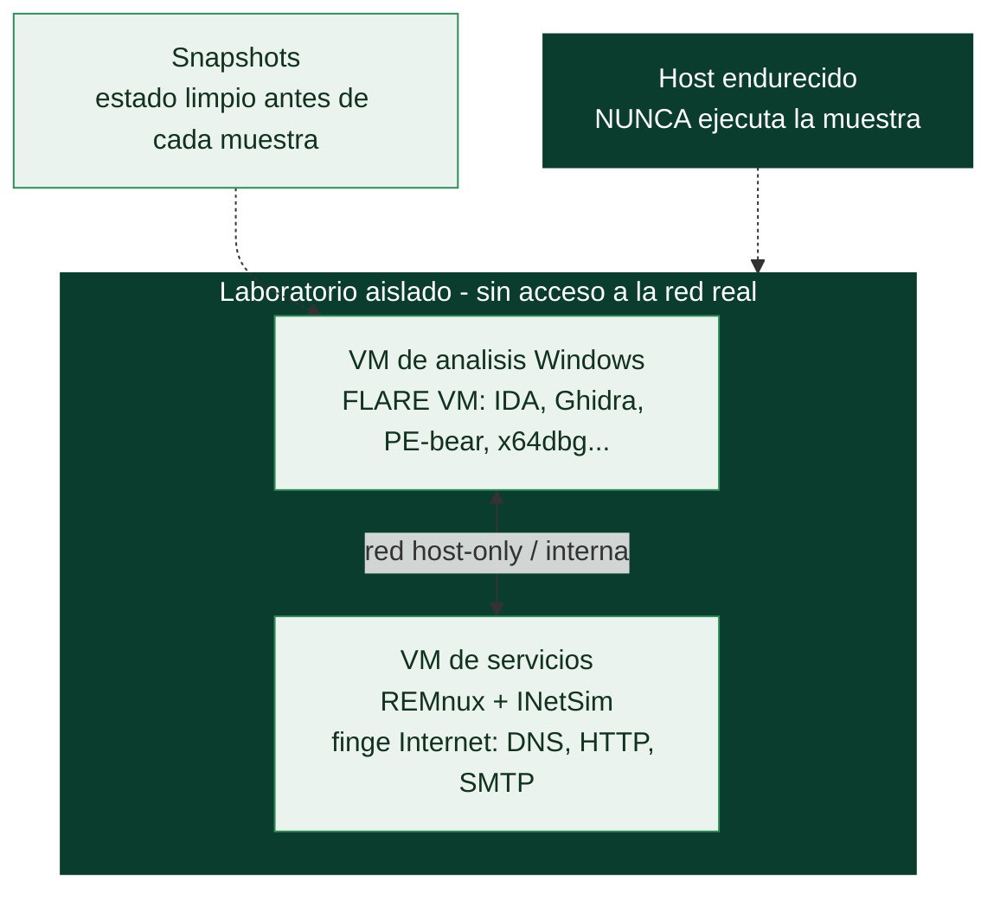

# Clase 142 — Laboratorio seguro de análisis de malware

> Parte: **6 — Análisis de malware** · Fuente: *Learning Malware Analysis* (Monnappa K. A.)
> ⏱️ Duración estimada: **120 min** · Nivel: **Fundamentos**

---

## 🎯 Objetivo

Montar un laboratorio de análisis **aislado, reversible y controlado** donde ejecutar muestras reales sin riesgo de fuga a la red ni al host. El alumno terminará con una VM Windows de análisis, una VM Linux que simula servicios de red, snapshots limpios y un procedimiento de manejo de muestras que impide accidentes.

## 📚 Resultados de aprendizaje

Al finalizar, el alumno podrá:

1. **Diseñar** una topología de laboratorio con red interna (host-only) sin salida a Internet.
2. **Configurar** snapshots y restauración para volver a un estado limpio en segundos.
3. **Preparar** una VM de víctima con herramientas de análisis y sin Guest Additions vulnerables.
4. **Simular** servicios de red (DNS, HTTP) con INetSim/FakeNet para engañar al malware.
5. **Manejar** muestras de forma segura (cifrado, contraseña `infected`, transferencia controlada).

## 🗺️ Temas

| # | Tema | Por qué importa |
|---|------|-----------------|
| 1 | Aislamiento de red (host-only / internal) | Evita que la muestra llame a casa o infecte la LAN |
| 2 | Snapshots y estado limpio | Permite repetir el análisis sin reinstalar |
| 3 | VM de análisis Windows (FLARE VM) | Entorno con todas las herramientas |
| 4 | VM de servicios (REMnux + INetSim) | Responde a las peticiones del malware |
| 5 | Manejo seguro de muestras | Impide ejecuciones accidentales |
| 6 | Anti-detección de VM del malware | El malware puede negarse a correr en VM |
| 7 | Higiene del host | El host nunca toca la muestra |

## 🧠 Explicación en profundidad

### Analizar malware sin infectarte: la regla que precede a todo

Antes de examinar una sola muestra hay que montar un entorno donde el malware pueda ejecutarse **sin
escapar ni causar daño real**. Esto no es una recomendación, es el requisito absoluto de la disciplina:
el analista trabaja a diario con código diseñado para infectar, robar y propagarse, y un descuido lo
convierte en la primera víctima —o en el vector que infecta a su organización—. El laboratorio de
análisis de malware es la versión extrema del laboratorio aislado de la [Clase 004](../../parte-0-fundamentos-y-prerrequisitos/004-montaje-del-laboratorio-virtualizacion-kali-snapshots-y-aislamiento-de-red/README.md), y su
diseño se rige por dos principios: **aislamiento** (el malware no puede llegar a nada real) y
**reversibilidad** (volver a un estado limpio tras cada ejecución).

### La arquitectura de dos VMs: análisis y servicios

El montaje canónico usa **dos máquinas virtuales** conectadas por una **red aislada** (host-only o
interna, **sin ruta a Internet ni a la red doméstica**). La primera es la **VM de análisis Windows**,
donde se ejecuta y estudia la muestra; se usa **FLARE VM**, una distribución que instala de golpe todo
el instrumental (IDA, Ghidra, x64dbg, PE-bear, Process Monitor, y decenas de herramientas más). La
segunda es la **VM de servicios**, típicamente **REMnux** (una distro Linux de análisis de malware) con
**INetSim** corriendo: INetSim **finge ser Internet** —responde a las peticiones DNS, HTTP, SMTP e IRC
que haga el malware con respuestas simuladas—, lo que permite **observar el comportamiento de red**
(a qué C2 intenta conectar, qué descarga) **sin dar acceso real a la red**. El malware cree que habla
con su servidor; en realidad habla con INetSim, y el analista lo captura todo con Wireshark.

### Snapshots: el botón de deshacer

La **reversibilidad** se consigue con **snapshots**: se toma una instantánea de la VM en estado limpio
**antes** de detonar cada muestra, y tras el análisis se **restaura** en segundos, borrando toda la
infección. Esto es lo que permite analizar muestra tras muestra sin acumular contaminación y sin
reinstalar el sistema. Un flujo típico: snapshot limpio → detonar muestra → observar → recolectar
artefactos → restaurar snapshot → siguiente muestra. Sin snapshots, cada análisis dejaría la VM en un
estado sucio e impredecible.

### Los dos enemigos del laboratorio: la evasión y el descuido

Dos amenazas complican el trabajo. La primera es que **el malware detecta que está siendo analizado**:
muchas familias comprueban si corren en una VM (buscan dispositivos de VMware/VirtualBox, poca RAM,
nombres de usuario típicos de sandbox) y, si lo detectan, **no ejecutan su carga maliciosa** para no
revelarla —la anti-VM de la [Clase 135](../../parte-5-explotacion-de-sistemas-y-binarios/135-ofuscacion-y-tecnicas-anti-reversing/README.md)—. Contramedidas: endurecer la VM para que parezca real
(cambiar nombres de dispositivo, añadir RAM, simular actividad de usuario), o usar entornos de análisis
diseñados para ocultarse. La segunda amenaza es el **error humano**, y aquí la disciplina es
innegociable: **higiene del host** (el sistema anfitrión nunca ejecuta la muestra y está actualizado y
segmentado), **manejo seguro de las muestras** (se guardan cifradas o comprimidas con contraseña —el
convenio es `infected`— para que no se ejecuten por accidente ni las detecte el antivirus del host), y
la certeza de que **el aislamiento de red es real** (verificado, no supuesto). Un laboratorio de
malware mal montado no es un laboratorio: es una infección esperando a ocurrir, y por eso esta clase
precede a todo el análisis de la parte.

## 📖 Definiciones y características

- **Snapshot:** foto del estado completo de la VM. Característica clave: **restauración instantánea** a limpio.
- **Red host-only / internal:** red virtual sin ruta a Internet ni al host. Característica clave: **contención**.
- **FLARE VM:** distribución de herramientas de análisis sobre Windows (Mandiant). Característica clave: **arsenal preinstalado**.
- **REMnux:** distro Linux para análisis de malware y forense. Característica clave: **servicios y utilidades listas**.
- **INetSim / FakeNet-NG:** simulan Internet (DNS, HTTP/S, FTP…) para capturar tráfico del malware. Característica clave: **engaño de red**.
- **Detección de sandbox:** técnicas del malware para saber si está en VM. Característica clave: **evasión del análisis**.

## 📔 Glosario

| Término | Definición concisa |
|---------|--------------------|
| Laboratorio aislado | Entorno donde el malware no puede escapar ni dañar |
| Aislamiento de red | Host-only o interna, sin ruta a Internet real |
| Reversibilidad | Volver a un estado limpio tras cada ejecución |
| VM de análisis | Máquina donde se ejecuta y estudia la muestra |
| FLARE VM | Distribución Windows con el instrumental de análisis |
| VM de servicios | Máquina que simula los servicios de red |
| REMnux | Distro Linux de análisis de malware |
| INetSim | Simula Internet (DNS, HTTP, SMTP) para el malware |
| Snapshot | Instantánea limpia a la que restaurar la VM |
| Detonar | Ejecutar la muestra para observar su comportamiento |
| Anti-VM | El malware detecta el entorno de análisis y se inhibe |
| Endurecer la VM | Hacer que la VM parezca un sistema real |
| Higiene del host | El anfitrión nunca ejecuta la muestra y está protegido |
| Manejo seguro | Guardar muestras cifradas (contraseña `infected`) |

## 🧰 Herramientas y preparación

- **Hypervisor:** VirtualBox o VMware Workstation.
- **VM de análisis:** Windows 10 + **FLARE VM** (`https://github.com/mandiant/flare-vm`).
- **VM de servicios:** **REMnux** (`https://remnux.org`) con **INetSim** o **FakeNet-NG**.
- Herramientas de captura: **Wireshark**, **Process Monitor**, **Process Hacker**.
- Descompresor con soporte de contraseña (7-Zip) para muestras cifradas.

> ⚠️ **Nota ética y de seguridad:** todo el análisis con muestras reales se hace **exclusivamente en esta VM aislada, sin red hacia Internet**. Nunca ejecutes una muestra en el host, nunca conectes la VM de análisis a tu LAN real y guarda las muestras siempre comprimidas y con contraseña. Trabaja solo con muestras que tengas derecho a analizar.

## 🧪 Laboratorio guiado

1. Crea dos VMs: `WIN-ANALYSIS` (Windows) y `LINUX-SERVICES` (REMnux). Asígnalas a una **red interna** llamada `labnet`; ninguna tiene adaptador NAT/bridge.
2. En `LINUX-SERVICES` fija IP estática (p. ej. `10.0.0.1`) y en `WIN-ANALYSIS` pon gateway y DNS apuntando a `10.0.0.1`.
3. Instala FLARE VM en Windows siguiendo su script de instalación. Reinicia y verifica que aparecen las herramientas.
4. En REMnux arranca INetSim: `sudo inetsim` y confirma que responde HTTP/DNS. Alternativa en Windows: `fakenet` dentro de la propia VM de análisis.
5. Desde `WIN-ANALYSIS`, prueba `nslookup ejemplo.com` y `curl http://ejemplo.com`; deben resolver y responder gracias a INetSim, **sin** Internet real.
6. Toma un **snapshot limpio** de cada VM llamado `base-clean`.
7. Verifica el aislamiento: intenta `ping 8.8.8.8` desde Windows; **debe fallar**. Si responde, corrige la red antes de continuar.
8. Documenta el procedimiento de manejo de muestra: recibir en ZIP con contraseña `infected`, copiar a la VM por carpeta compartida de solo lectura o unidad temporal, y **restaurar snapshot** al terminar.

## ✍️ Ejercicios

1. Explica por qué NAT o bridge están prohibidos en la VM de análisis.
2. Configura FakeNet-NG y compara su salida con INetSim.
3. Enumera 5 artefactos que un malware puede usar para detectar VirtualBox.
4. Documenta un runbook de "restauración a limpio" en menos de 6 pasos.
5. Crea un snapshot antes y después de una ejecución simulada (usa un binario inocuo).
6. Diseña una regla de firewall del hypervisor que garantice el aislamiento.

## 📝 Reto verificable

Entrega un laboratorio funcional donde una petición HTTP desde la VM de análisis sea respondida por tu VM de servicios y **ninguna** petición llegue a Internet.
**Criterio de aceptación:** una captura de Wireshark muestra la resolución DNS y la respuesta HTTP servidas por `10.0.0.1`, y `ping` a una IP pública falla por timeout.

## ⚠️ Errores comunes

| Síntoma / mensaje | Causa y cómo arreglar |
|-------------------|------------------------|
| El malware "llama a casa" de verdad | Adaptador NAT/bridge activo; cámbialo a red interna |
| INetSim no responde | Servicio no iniciado o IP/DNS mal configurados en la víctima |
| La muestra no se ejecuta | Detección de VM; añade ofuscación de artefactos o usa bare-metal controlado |
| Snapshot no restaura la red | El estado de red no se guardó; recrea el snapshot con la VM apagada |
| Carpeta compartida propaga la infección | Móntala de solo lectura o desactívala durante la ejecución |

## ❓ Preguntas frecuentes

**❓ ¿Puedo analizar en mi PC si tengo cuidado?** No. Un descuido basta para cifrar tus datos o infectar la red. Usa siempre VM desechable.

**❓ ¿VirtualBox o VMware?** Ambos sirven. VMware suele resistir mejor ciertas detecciones; VirtualBox es gratuito. Lo esencial es el aislamiento y los snapshots.

**❓ ¿Y si el malware detecta la VM y no corre?** Es común. Puedes reforzar el enmascaramiento de artefactos, usar sandboxes comerciales o, para casos avanzados, un entorno bare-metal aislado físicamente.

## 🔗 Referencias

- Monnappa K. A., *Learning Malware Analysis*, cap. 1.
- FLARE VM (Mandiant). <https://github.com/mandiant/flare-vm>
- REMnux. <https://remnux.org>
- INetSim. <https://www.inetsim.org>
- FakeNet-NG. <https://github.com/mandiant/flare-fakenet-ng>

## 📥 Material descargable

- 📄 [Guía en PDF](./clase-142-guia.pdf) — versión imprimible de esta clase.
- 🎞️ [Presentación (PPTX)](./clase-142-presentacion.pptx) — deck para proyectar en clase.

## ⬅️ Clase anterior

[Clase 141 — Introducción al malware: tipos y taxonomía](../141-introduccion-al-malware-tipos-y-taxonomia/README.md)

## ➡️ Siguiente clase

[Clase 143 — Análisis estático básico](../143-analisis-estatico-basico/README.md)
