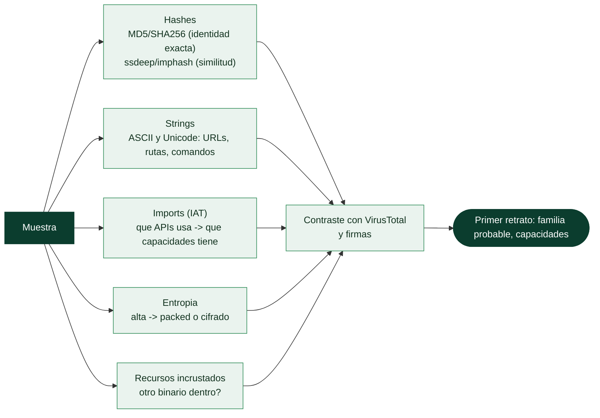

# Clase 143 — Análisis estático básico

> Parte: **6 — Análisis de malware** · Fuente: *Practical Malware Analysis* (Sikorski & Honig)
> ⏱️ Duración estimada: **90 min** · Nivel: **Fundamentos**

---

## 🎯 Objetivo

Extraer el máximo de información de una muestra **sin ejecutarla**: hashes, strings, imports, entropía, recursos y firmas. El análisis estático básico es el primer filtro del triaje: en minutos permite decidir si la muestra es interesante, con qué familia se relaciona y qué capacidades sugiere su código.

## 📚 Resultados de aprendizaje

Al finalizar, el alumno podrá:

1. **Calcular** y usar hashes (MD5, SHA-256, imphash) para identificar y buscar la muestra.
2. **Extraer** e interpretar strings ASCII/Unicode como pistas de comportamiento.
3. **Leer** la tabla de imports para inferir capacidades por las APIs que usa.
4. **Estimar** entropía para sospechar packing o cifrado.
5. **Buscar** IOCs e inteligencia previa antes de tocar la muestra dinámicamente.

## 🗺️ Temas

| # | Tema | Por qué importa |
|---|------|-----------------|
| 1 | Hashes y fuzzy hashing (ssdeep) | Identidad de la muestra y similitud |
| 2 | imphash | Agrupa muestras por su tabla de imports |
| 3 | Strings ASCII/Unicode | Dominios, rutas, comandos, mensajes |
| 4 | Tabla de imports (APIs) | Revela capacidades (red, cripto, inyección) |
| 5 | Entropía y detección de packers | Alta entropía sugiere empaquetado/cifrado |
| 6 | Recursos incrustados | Payloads o configuraciones ocultas |
| 7 | Firmas y VirusTotal | Consenso e inteligencia previa |

## 🧠 Explicación en profundidad

### Aprender de la muestra sin ejecutarla

El **análisis estático básico** extrae información de una muestra **sin ejecutarla**, y es siempre el
primer paso: es seguro (no hay riesgo de infección), rápido, y a menudo revela lo suficiente para
clasificar la muestra o decidir cómo seguir. Su lógica es exprimir el fichero —sus metadatos, sus
cadenas, su estructura— antes de la parte peligrosa y costosa de detonarlo o desensamblarlo. Cada
técnica de esta clase da una pista, y juntas dibujan un primer retrato de la muestra.

### Hashes: identidad exacta y similitud

El primer gesto es calcular el **hash** de la muestra. Un **hash criptográfico** (SHA-256, MD5) es la
**huella dactilar exacta** ([Clase 051](../../parte-2-criptografia-aplicada/051-funciones-hash-sha-2-sha-3-y-sus-propiedades/README.md)): sirve para identificar la muestra sin ambigüedad,
buscarla en bases de datos y compartir IOCs. Pero tiene un límite: **cambiar un solo byte cambia todo
el hash**, así que dos variantes casi idénticas de la misma familia tienen hashes completamente
distintos. Por eso existen los **hashes difusos** (*fuzzy hashing*): **ssdeep** calcula un hash que
mide **similitud** —dos muestras parecidas dan hashes parecidos—, lo que permite **agrupar variantes**
de una misma familia. Y el **imphash** es un hash de la **tabla de imports** de un PE: como el conjunto
de APIs que usa un malware suele mantenerse entre variantes, muestras con el mismo imphash a menudo son
la misma familia o el mismo compilador/packer —una pista de agrupación muy usada—.

### Strings e imports: qué dice y qué puede hacer

Las **cadenas de texto** legibles (**strings**, tanto ASCII como Unicode, porque Windows usa UTF-16)
son sorprendentemente reveladoras: URLs de C2, rutas de ficheros, claves de registro, mensajes de
error, comandos, nombres de mutex. Un vistazo a las strings a menudo delata de golpe qué hace la
muestra —o revela que están **cifradas** (pocas strings legibles), lo que ya es información: la muestra
está protegida—. La **tabla de imports** (la IAT del PE, clase 145) lista **qué funciones de la API de
Windows** llama el malware, y eso mapea directamente a **capacidades**: si importa `CreateRemoteThread`
y `WriteProcessMemory`, hace **inyección de código**; si importa `CryptEncrypt`, cifra (¿ransomware?);
si importa `InternetOpenUrl`, se comunica por red; si importa `RegSetValueEx`, toca el registro
(¿persistencia?). Leer los imports es leer las intenciones de la muestra antes de ejecutarla.

### Entropía, recursos y el contraste con VirusTotal

La **entropía** —la medida de aleatoriedad de los bytes, [Clase 135](../../parte-5-explotacion-de-sistemas-y-binarios/135-ofuscacion-y-tecnicas-anti-reversing/README.md)— es el indicador clave de
**packing**: el código normal tiene entropía moderada, pero el código comprimido o cifrado tiene
entropía muy alta (cercana a 8), así que una sección de entropía anómala delata que la muestra está
**empaquetada** y que el análisis estático verá poco hasta desempaquetarla (clase 147). Los **recursos
incrustados** de un PE pueden esconder **otro binario** (un dropper que lleva su carga dentro), un
documento señuelo o datos de configuración —extraerlos revela la siguiente etapa—. Finalmente, todo
esto se contrasta con **VirusTotal**: subir el hash (no la muestra, si es sensible) devuelve las
detecciones de decenas de motores antivirus, los nombres de familia (con la advertencia de la clase 141
sobre su inconsistencia), y relaciones con otras muestras. VirusTotal es un multiplicador enorme del
análisis estático, pero con dos cautelas: **subir la muestra la hace pública** (un problema con malware
dirigido o con datos sensibles, mejor buscar solo por hash), y **una detección baja no significa que
sea benigna** (puede ser nueva). El resultado de toda esta clase es un primer retrato —familia probable,
capacidades, si está packed— que decide los siguientes pasos: análisis dinámico (144) si se quiere ver
comportamiento, o desensamblado (146) si se quiere entender el código.

## 📖 Definiciones y características

- **Hash criptográfico:** huella única (SHA-256) de la muestra. Característica clave: **identidad exacta**.
- **imphash:** hash de la tabla de imports. Característica clave: **agrupa variantes** con el mismo compilador/estructura.
- **ssdeep (fuzzy hash):** mide similitud entre archivos. Característica clave: **detecta parecidos**, no idénticos.
- **String:** secuencia de caracteres legible en el binario. Característica clave: **pistas de comportamiento**.
- **Entropía:** medida de aleatoriedad (0–8 bits/byte). Característica clave: **>7 sugiere packing/cifrado**.
- **Import:** función de una DLL que el binario usa. Característica clave: **infiere capacidades**.

## 📔 Glosario

| Término | Definición concisa |
|---------|--------------------|
| Análisis estático | Examinar la muestra sin ejecutarla |
| Hash criptográfico | Huella exacta (SHA-256); un byte cambia todo |
| Fuzzy hashing (ssdeep) | Hash de similitud; agrupa variantes parecidas |
| imphash | Hash de la tabla de imports; agrupa por APIs usadas |
| Strings | Cadenas legibles (ASCII y Unicode); revelan intenciones |
| Unicode / UTF-16 | Codificación de cadenas en Windows |
| Tabla de imports (IAT) | APIs que usa el binario; mapea a capacidades |
| CreateRemoteThread | Import típico de inyección de código |
| Entropía | Aleatoriedad; alta indica packing o cifrado |
| Packing | Empaquetado que oculta el código real |
| Recursos incrustados | Binarios o datos escondidos dentro del PE |
| VirusTotal | Servicio que agrega detecciones de múltiples motores |
| Subir vs buscar por hash | Subir hace pública la muestra; buscar por hash no |
| IOC | Indicador de compromiso (hash, URL, mutex) |

## 🧰 Herramientas y preparación

- **PEStudio** y **CFF Explorer / PE-bear** para cabeceras, imports, recursos.
- **strings** (Sysinternals) o `floss` (extrae strings ofuscados).
- **pestr**, **pehash**, **ssdeep**, `capa` (Mandiant) para capacidades.
- **DIE (Detect It Easy)** y **PEiD** para detección de packer/compilador.
- Consulta en **VirusTotal** y **MalwareBazaar** por hash.

> ⚠️ **Nota ética y de seguridad:** aunque el análisis estático **no ejecuta** la muestra, trabájala igualmente dentro de la VM aislada. Un doble clic accidental o una vista previa del explorador pueden detonarla. Mantén la extensión visible y nunca la ejecutes fuera del lab.

## 🧪 Laboratorio guiado

Trabaja sobre una muestra de referencia en tu VM aislada (por ejemplo la que uses en toda la parte):

1. Calcula hashes: `sha256sum muestra.bin`, `ssdeep muestra.bin`. Guarda ambos en tu ficha.
2. Extrae strings: `floss muestra.bin > strings.txt`. Busca URLs, rutas (`C:\Users\...`), claves de registro, comandos y mensajes.
3. En PEStudio, abre la muestra y revisa: **imports** marcados como sospechosos (`CreateRemoteThread`, `WinExec`, `InternetOpen`, `CryptEncrypt`), **timestamp** de compilación, y **imphash**.
4. Calcula entropía por sección con DIE. Anota si `.text` o una sección extra supera ~7.0 (indicio de packing).
5. Ejecuta `capa muestra.bin` para obtener capacidades mapeadas a ATT&CK (p. ej. "encrypt data", "create process").
6. Busca el SHA-256 en VirusTotal y MalwareBazaar: anota familia sugerida, número de detecciones y relaciones.
7. Redacta una hipótesis: tipo probable, capacidades y si parece empaquetado (a confirmar en la siguiente clase).

## ✍️ Ejercicios

1. Explica qué capacidad sugiere cada una de 6 APIs importadas.
2. Compara el imphash de dos muestras y decide si podrían ser de la misma familia.
3. Interpreta un `strings.txt` y extrae 5 IOCs candidatos.
4. Justifica por qué una entropía de 7.9 en `.rsrc` es sospechosa.
5. Usa `capa` y traduce 3 reglas disparadas a lenguaje llano.
6. Documenta por qué el timestamp de compilación puede estar falseado.

## 📝 Reto verificable

Produce una **ficha de triaje estático** de una muestra con: hashes (incl. imphash y ssdeep), 8 strings relevantes clasificados, 6 imports con su implicación, veredicto de packing con entropía, y familia sugerida por VT.
**Criterio de aceptación:** cada afirmación de capacidad está respaldada por un import o string concreto citado en la ficha, y el veredicto de packing incluye el valor de entropía observado.

## ⚠️ Errores comunes

| Síntoma / mensaje | Causa y cómo arreglar |
|-------------------|------------------------|
| "No hay strings útiles" | Muestra empaquetada; los strings aparecen tras desempacar |
| Confiar en el timestamp de PE | Es falsificable; no lo uses como prueba fuerte |
| Pocos imports visibles | Imports resueltos dinámicamente; revisa `GetProcAddress`/`LoadLibrary` |
| Entropía alta = siempre malware | Muchos instaladores legítimos también se comprimen; correlaciona |
| Subir la muestra a VT sin permiso | Puede filtrar información sensible; consulta por hash primero |

## ❓ Preguntas frecuentes

**❓ ¿El análisis estático basta?** Para triaje sí, pero packing y resolución dinámica de APIs limitan lo que ves. Se complementa con análisis dinámico y desensamblado.

**❓ ¿Por qué usar imphash?** Porque agrupa muestras compiladas de forma similar aunque cambien strings o payload, útil para pivotar en inteligencia.

**❓ ¿Debo subir la muestra a VirtualTotal?** Consulta primero por hash. Subir el binario lo hace público para otros y puede alertar al atacante.

## 🔗 Referencias

- Sikorski & Honig, *Practical Malware Analysis*, cap. 1.
- Mandiant `capa`. <https://github.com/mandiant/capa>
- FLOSS. <https://github.com/mandiant/flare-floss>
- Detect It Easy. <https://github.com/horsicq/Detect-It-Easy>
- ssdeep. <https://ssdeep-project.github.io/ssdeep/>

## 📥 Material descargable

- 📄 [Guía en PDF](./clase-143-guia.pdf) — versión imprimible de esta clase.
- 🎞️ [Presentación (PPTX)](./clase-143-presentacion.pptx) — deck para proyectar en clase.

## ⬅️ Clase anterior

[Clase 142 — Laboratorio seguro de análisis de malware](../142-laboratorio-seguro-de-analisis-de-malware/README.md)

## ➡️ Siguiente clase

[Clase 144 — Análisis dinámico básico y sandboxing](../144-analisis-dinamico-basico-y-sandboxing/README.md)
