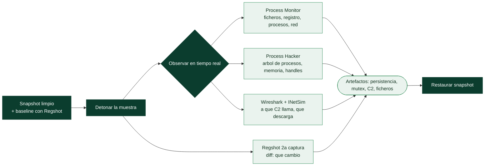

# Clase 144 — Análisis dinámico básico y sandboxing

> Parte: **6 — Análisis de malware** · Fuente: *Learning Malware Analysis* (Monnappa K. A.)
> ⏱️ Duración estimada: **120 min** · Nivel: **Intermedio**

---

## 🎯 Objetivo

Observar el malware **en ejecución** dentro del laboratorio aislado para registrar qué hace: procesos que crea, archivos y claves de registro que toca, y tráfico de red que genera. El alumno aprenderá a instrumentar el sistema, detonar la muestra de forma controlada y extraer IOCs de comportamiento, además de aprovechar sandboxes automatizados.

## 📚 Resultados de aprendizaje

Al finalizar, el alumno podrá:

1. **Instrumentar** la VM con monitores de proceso, archivo, registro y red.
2. **Detonar** una muestra de forma controlada y capturar su actividad.
3. **Identificar** persistencia, procesos hijos, mutex y artefactos de archivo/registro.
4. **Capturar** y leer el tráfico C2 usando servicios simulados.
5. **Interpretar** el informe de un sandbox automatizado (Cuckoo/CAPE/online).

## 🗺️ Temas

| # | Tema | Por qué importa |
|---|------|-----------------|
| 1 | Baseline y snapshot previo | Permite comparar antes/después |
| 2 | Process Monitor / Process Hacker | Ve procesos, hilos, handles en vivo |
| 3 | Regshot y comparación de estado | Detecta cambios en disco y registro |
| 4 | Captura de red (Wireshark + INetSim) | Revela C2, dominios, patrones |
| 5 | Mutex y marcadores de infección | Evitan doble infección; buen IOC |
| 6 | Sandboxes automatizados | Escalan el triaje |
| 7 | Anti-análisis dinámico | El malware puede detectar y evadir |

## 🧠 Explicación en profundidad

### Detonar la muestra y observar qué hace

El **análisis dinámico básico** **ejecuta** la muestra en el laboratorio aislado (clase 142) y observa
su **comportamiento**: qué ficheros crea, qué claves de registro toca, qué procesos lanza, con qué
servidores intenta comunicarse. Su ventaja sobre el estático es directa: muestra **lo que el malware
hace de verdad**, atravesando el packing y la ofuscación que ocultan el código —un binario empaquetado
no revela sus strings al análisis estático, pero al ejecutarse **actúa**, y esa acción se puede
observar—. Su límite: solo se ve lo que ocurre en **esa** ejecución (el malware puede tener ramas que no
se activan sin cierta fecha, cierto argumento o cierta respuesta del C2), y hay riesgo real, de ahí el
aislamiento.

### La metodología del baseline: comparar antes y después

La técnica central del análisis dinámico es la **comparación de estado**: capturar una **línea base**
(*baseline*) del sistema limpio, detonar la muestra, y capturar el estado después para ver **qué
cambió**. Este diferencial es lo que aísla la actividad del malware del ruido normal del sistema.

### Las herramientas de observación

Cuatro herramientas cubren la observación básica. **Process Monitor** (ProcMon, de Sysinternals) es el
caballo de batalla: registra en tiempo real **cada operación** de ficheros, registro, procesos y red
que hace el sistema, con filtros para aislar la actividad de la muestra —muestra exactamente qué
ficheros crea, qué claves de registro escribe (¿persistencia?), qué procesos lanza—. **Process Hacker**
(o Process Explorer) muestra el **árbol de procesos** en vivo: qué proceso creó a cuál, con qué
privilegios corre cada uno, qué hay en su memoria y qué *handles* tiene abiertos —clave para ver
inyección de código y procesos hijos—. **Regshot** implementa el baseline de registro: toma una foto
del registro antes, otra después, y **muestra el diff** —las claves que el malware añadió o modificó,
a menudo su mecanismo de persistencia—. Y para la red, **Wireshark** captura el tráfico mientras
**INetSim** (clase 142) responde fingiendo ser Internet, revelando a qué dominios/IPs intenta conectar
el malware y qué protocolo usa, sin dar acceso real.

### Los marcadores de infección y los sandboxes automáticos

El análisis dinámico busca **artefactos** concretos que son a la vez comprensión y IOCs. El **mutex**
(*mutant*) es uno especialmente útil: mucho malware crea un **mutex con un nombre fijo** al infectar,
para **no infectar dos veces** la misma máquina —comprobar si ya existe le dice "aquí ya estoy"—; ese
nombre de mutex es un IOC excelente (identifica la familia) y a la vez una vía de "vacunación" (crear el
mutex previamente engaña al malware para que crea que ya infectó y no actúe). Otros artefactos: los
ficheros creados, las claves de persistencia, los dominios de C2. Todo este proceso manual se puede
**automatizar** con **sandboxes** (Cuckoo/CAPE, Any.Run, Joe Sandbox, Hybrid Analysis): detonan la
muestra en un entorno instrumentado y generan un **informe automático** de comportamiento en minutos
—rápido para triaje de volumen—. Su límite es el mismo enemigo de la clase 142: el **anti-análisis
dinámico**, malware que detecta el sandbox (por su entorno artificial, la ausencia de interacción
humana, el tiempo acelerado) y **se comporta de forma inocua** para engañarlo. Por eso el análisis
dinámico manual —más lento pero controlable— sigue siendo indispensable, y el analista experto
**combina** el sandbox automático para triar con la observación manual para los casos que importan y
para el malware que evade la automatización.

## 📖 Definiciones y características

- **Análisis dinámico:** estudio del malware ejecutándolo. Característica clave: **comportamiento observable**.
- **Mutex:** objeto de sincronización que el malware crea para no reinfectar. Característica clave: **IOC estable**.
- **Sandbox:** entorno automatizado que ejecuta y reporta la muestra. Característica clave: **triaje a escala**.
- **Persistencia:** mecanismo para sobrevivir al reinicio (Run key, servicio, tarea). Característica clave: **continuidad**.
- **IOC de comportamiento:** artefacto observado (archivo, clave, dominio). Característica clave: **detección posterior**.

## 📔 Glosario

| Término | Definición concisa |
|---------|--------------------|
| Análisis dinámico | Ejecutar la muestra y observar su comportamiento |
| Baseline | Estado del sistema limpio para comparar |
| Comparación de estado | Diferencial antes/después que aísla la actividad |
| Process Monitor (ProcMon) | Registra operaciones de ficheros, registro, procesos, red |
| Process Hacker | Muestra el árbol de procesos, memoria y handles |
| Regshot | Diff del registro antes y después |
| Wireshark + INetSim | Captura de red con Internet simulado |
| Artefacto | Cambio observable que sirve de comprensión e IOC |
| Mutex | Marcador que el malware crea para no reinfectar |
| Vacunación | Crear el mutex para engañar al malware |
| Persistencia | Mecanismo para sobrevivir al reinicio |
| Sandbox automático | Entorno que genera un informe de comportamiento |
| Cuckoo / CAPE / Any.Run | Sandboxes de análisis de malware |
| Anti-análisis dinámico | Malware que detecta el sandbox y se inhibe |

## 🧰 Herramientas y preparación

- **Process Monitor (ProcMon)** y **Process Hacker / Process Explorer**.
- **Regshot** (snapshot de registro y sistema de archivos antes/después).
- **Wireshark** + **INetSim/FakeNet-NG** (de la clase 142).
- **Autoruns** (Sysinternals) para persistencia.
- Sandbox: **CAPEv2** o **Cuckoo** local; online: **Any.Run**, **Hybrid Analysis** (con precauciones de confidencialidad).

> ⚠️ **Nota ética y de seguridad:** detonar malware real solo se hace en la VM aislada sin salida a Internet, con snapshot previo y restauración posterior. Nunca subas muestras confidenciales a sandboxes públicos sin autorización, pues quedan expuestas a terceros. Restaura `base-clean` después de cada ejecución.

## 🧪 Laboratorio guiado

1. Restaura el snapshot `base-clean`. Verifica que el aislamiento de red sigue activo y que INetSim responde.
2. Prepara la instrumentación: abre **ProcMon** (con filtro por el nombre del proceso), **Process Hacker**, **Wireshark** capturando en la interfaz de `labnet`, y toma un **Regshot** inicial.
3. Detona la muestra con privilegios normales. Observa en Process Hacker los procesos hijos y las inyecciones (hilos remotos).
4. Deja correr ~60–120 s. Toma el **segundo Regshot** y compara: archivos creados, claves `Run`, servicios o tareas programadas nuevas.
5. En ProcMon, filtra por `Operation is RegSetValue` y por `CreateFile` para localizar persistencia y drops. Anota rutas y claves.
6. Revisa Wireshark: dominios consultados (respondidos por INetSim), URIs HTTP, user-agents, patrones de beacon. Extrae IOCs de red.
7. Identifica el **mutex** creado (Process Hacker → Handles → Mutant). Anótalo como IOC.
8. Corre la misma muestra en un sandbox local (CAPE) y compara su informe con tus observaciones manuales.
9. Restaura `base-clean`.

## ✍️ Ejercicios

1. Diferencia inyección de código de simple creación de proceso a partir de lo visto en Process Hacker.
2. Documenta la persistencia hallada y cómo eliminarla.
3. Extrae 5 IOCs de red del pcap y clasifícalos (DNS, HTTP, IP).
4. Explica por qué el mutex es un buen indicador de detección.
5. Compara tu análisis manual con el informe del sandbox: ¿qué se le escapó a cada uno?
6. Diseña un filtro de ProcMon reutilizable para triaje.

## 📝 Reto verificable

Entrega un **informe de comportamiento** de una muestra con: árbol de procesos, persistencia (clave/servicio/tarea), archivos creados, mutex e IOCs de red, todo respaldado por capturas.
**Criterio de aceptación:** cada IOC listado aparece en una evidencia (ProcMon/Regshot/Wireshark) referenciada, y el informe indica cómo se detectaría y eliminaría la persistencia.

## ⚠️ Errores comunes

| Síntoma / mensaje | Causa y cómo arreglar |
|-------------------|------------------------|
| La muestra "no hace nada" | Detecta VM o espera C2; usa servicios simulados y desactiva artefactos de VM |
| ProcMon con ruido inmanejable | Aplica filtros por proceso y operación antes de detonar |
| Sin tráfico en Wireshark | Interfaz equivocada o INetSim caído; captura en `labnet` |
| Persistencia no encontrada | Revisa Autoruns además de las claves Run; hay decenas de ASEPs |
| Reinfección al repetir | No restauraste snapshot; vuelve a `base-clean` |

## ❓ Preguntas frecuentes

**❓ ¿Análisis dinámico reemplaza al estático?** No, se complementan. El dinámico ve comportamiento real pero puede no cubrir ramas condicionadas por fecha o C2.

**❓ ¿Puedo confiar en un sandbox online?** Es rápido pero público: no subas muestras sensibles. Además el malware puede detectar sandboxes conocidos y no ejecutar la carga.

**❓ ¿Qué hago si necesita Internet real?** Simula el C2 con INetSim/redirección, o replica el servidor. Nunca des salida real a la muestra desde el lab.

## 🔗 Referencias

- Monnappa K. A., *Learning Malware Analysis*, cap. 3–4.
- Sysinternals (ProcMon, Autoruns, Process Explorer). <https://learn.microsoft.com/sysinternals/>
- CAPEv2. <https://github.com/kevoreilly/CAPEv2>
- Any.Run. <https://any.run>

## 📥 Material descargable

- 📄 [Guía en PDF](./clase-144-guia.pdf) — versión imprimible de esta clase.
- 🎞️ [Presentación (PPTX)](./clase-144-presentacion.pptx) — deck para proyectar en clase.

## ⬅️ Clase anterior

[Clase 143 — Análisis estático básico](../143-analisis-estatico-basico/README.md)

## ➡️ Siguiente clase

[Clase 145 — El formato PE de Windows](../145-el-formato-pe-de-windows/README.md)
