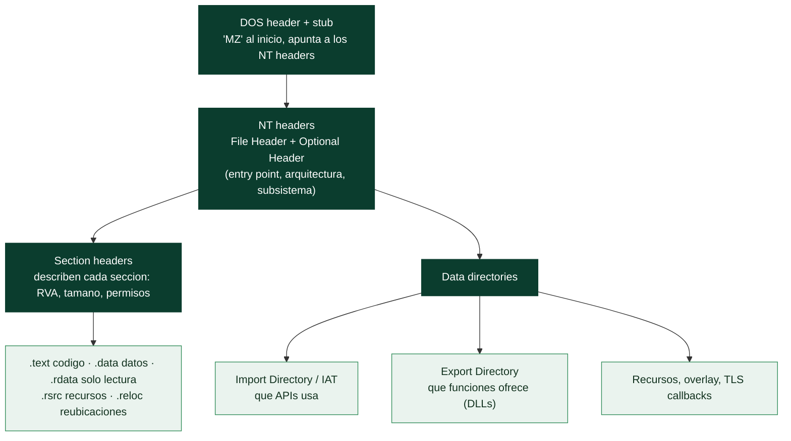

# Clase 145 — El formato PE de Windows

> Parte: **6 — Análisis de malware** · Fuente: *Windows Internals* (Yosifovich et al.) y *Practical Malware Analysis*
> ⏱️ Duración estimada: **110 min** · Nivel: **Intermedio**

---

## 🎯 Objetivo

Entender el **Portable Executable (PE)**, el formato de los ejecutables y DLLs de Windows, con el detalle que necesita un analista: cómo se organizan las cabeceras y secciones, cómo el cargador mapea el archivo en memoria, cómo se resuelven imports y exports, y qué anomalías delatan malware o packing. Este conocimiento es la base para el desensamblado y el unpacking.

## 📚 Resultados de aprendizaje

Al finalizar, el alumno podrá:

1. **Recorrer** la estructura PE: DOS header, NT headers, secciones y directorios de datos.
2. **Explicar** la diferencia entre offset en disco (raw) y dirección virtual (RVA/VA).
3. **Analizar** la IAT/import directory para inferir capacidades.
4. **Detectar** anomalías: secciones con nombres raros, entropía alta, entry point fuera de `.text`.
5. **Relacionar** overlay, recursos y TLS callbacks con técnicas de malware.

## 🗺️ Temas

| # | Tema | Por qué importa |
|---|------|-----------------|
| 1 | DOS header y stub | Punto de entrada al formato; firma `MZ` |
| 2 | NT headers (File + Optional) | Metadatos, entry point, subsystem |
| 3 | Section headers y secciones | `.text`, `.data`, `.rsrc`, packers |
| 4 | RVA vs raw offset | Traducir direcciones entre disco y memoria |
| 5 | Import Directory / IAT | Capacidades y resolución de APIs |
| 6 | Export Directory | Relevante en DLLs maliciosas |
| 7 | Recursos, overlay y TLS callbacks | Payloads ocultos y ejecución temprana |

## 🧠 Explicación en profundidad

### El formato de todo ejecutable de Windows

El **PE** (*Portable Executable*) es el formato de los `.exe`, `.dll`, `.sys` y demás ejecutables de
Windows —el equivalente al ELF de Linux ([Clase 130](../../parte-5-explotacion-de-sistemas-y-binarios/130-ingenieria-inversa-introduccion/README.md))—. Entender su estructura es
fundamental para el análisis de malware por una razón práctica: **el PE guarda muchísima información
sobre el binario en sus cabeceras**, y saber leerla revela capacidades, pistas de packing, marcas de
tiempo, y anomalías que delatan manipulación. Además, técnicas avanzadas de malware (inyección,
process hollowing, unpacking) **manipulan directamente la estructura PE**, así que entenderla es
prerrequisito para reconocerlas.

### De la cabecera MZ a los NT headers

Todo PE empieza con el **DOS header**, un vestigio de compatibilidad que comienza con los dos bytes
mágicos **`MZ`** (iniciales de Mark Zbikowski) y contiene un pequeño **stub** que imprime "This program
cannot be run in DOS mode" si se ejecuta en DOS. Su único campo relevante hoy apunta a los **NT
headers**, que son el corazón de la estructura. Los NT headers se dividen en el **File Header**
(arquitectura —x86/x64—, número de secciones, marca de tiempo de compilación —a menudo falsificada por
el malware—) y el **Optional Header** (mal llamado "opcional", porque es esencial): contiene el **entry
point** (la dirección donde empieza la ejecución —clave para el unpacking, clase 147—), la dirección
base preferida, el **subsistema** (GUI o consola), y los punteros a los *data directories*.

### RVA vs raw offset: la conversión que confunde a todos

Un concepto que hay que dominar y que causa constante confusión: la diferencia entre **RVA** (*Relative
Virtual Address*) y **raw offset**. En **disco**, las secciones del PE están dispuestas de una forma
(alineadas a un tamaño de fichero); en **memoria**, cuando el PE se carga, están en otra (alineadas a
páginas, en direcciones distintas). Una **RVA** es un desplazamiento respecto a la base **en memoria**;
un **raw offset** es un desplazamiento **en el fichero**. Las cabeceras del PE usan RVAs, pero para
localizar algo en el fichero en disco hay que **convertir la RVA a raw offset** usando los section
headers (que dan la correspondencia entre ambas para cada sección). Herramientas como PE-bear, PEview o
`pefile` (Python) hacen esta conversión, pero entenderla es lo que evita perderse al navegar un PE a
mano.

### Las secciones, la IAT y las anomalías que delatan malware

El PE se divide en **secciones**, cada una descrita por un **section header** (nombre, RVA, tamaño,
permisos). Las convencionales: **`.text`** (código ejecutable), **`.data`** (datos con valor),
**`.rdata`** (datos de solo lectura, incluye imports), **`.rsrc`** (recursos), **`.reloc`**
(reubicaciones). La estructura más importante para el análisis es la **Import Directory** y su **IAT**
(*Import Address Table*): la tabla de **qué funciones de qué DLLs** usa el binario —leerla revela las
capacidades, como en la clase 143—. La **Export Directory** hace lo inverso (qué funciones ofrece una
DLL). Y aquí está el valor forense del PE: **las anomalías delatan malware**. Secciones con nombres
raros o no estándar, una sección `.text` con permiso de escritura (código automodificable, típico de
packers), **entropía alta** en una sección (packing), una IAT sospechosamente pequeña (el malware
**resuelve las APIs dinámicamente** en ejecución para ocultar qué usa, clase 146), una marca de tiempo
imposible, un **overlay** (datos añadidos al final del fichero, fuera de las secciones —a menudo la
carga cifrada de un dropper—), o **TLS callbacks** (código que se ejecuta **antes** del entry point,
usado para anti-debug). Reconocer estas anomalías al inspeccionar el PE es una de las habilidades más
rentables del análisis estático, porque un PE "raro" cuenta su historia antes de desensamblar una sola
instrucción.

## 📖 Definiciones y características

- **PE:** formato de ejecutables/DLL de Windows. Característica clave: **mapeo por secciones**.
- **Entry point (AddressOfEntryPoint):** primera instrucción ejecutada. Característica clave: en packers, **apunta al stub**.
- **RVA:** offset relativo a la base de imagen en memoria. Característica clave: **≠ offset en disco**.
- **IAT (Import Address Table):** tabla que el cargador rellena con direcciones de APIs. Característica clave: **infiere funcionalidad**.
- **Overlay:** datos anexos tras la última sección. Característica clave: **payload/config incrustado**.
- **TLS callback:** función ejecutada antes del entry point. Característica clave: **anti-debug/ejecución temprana**.

## 📔 Glosario

| Término | Definición concisa |
|---------|--------------------|
| PE | Portable Executable; formato de ejecutables de Windows |
| DOS header / MZ | Cabecera inicial con los bytes mágicos `MZ` |
| Stub DOS | Mensaje "cannot be run in DOS mode" |
| NT headers | File Header + Optional Header; núcleo del PE |
| File Header | Arquitectura, nº de secciones, marca de tiempo |
| Optional Header | Entry point, base, subsistema, data directories |
| Entry point | Dirección donde empieza la ejecución |
| RVA | Desplazamiento relativo en memoria |
| Raw offset | Desplazamiento en el fichero en disco |
| Sección | Bloque del PE (.text, .data, .rsrc, .reloc) |
| Import Directory / IAT | Tabla de APIs que usa el binario |
| Export Directory | Funciones que ofrece una DLL |
| Overlay | Datos añadidos al final, fuera de las secciones |
| TLS callback | Código ejecutado antes del entry point; anti-debug |
| Anomalía PE | Sección rara, entropía alta, IAT mínima: delata malware |

## 🧰 Herramientas y preparación

- **PE-bear**, **CFF Explorer**, **PEStudio** para inspección visual.
- **pefile** (Python) para análisis programático.
- **Detect It Easy** para entropía y detección de compilador/packer.
- **Ghidra**/x64dbg para ver el mapeo en memoria (siguientes clases).

> ⚠️ **Nota ética y de seguridad:** el estudio del PE es estático, pero si abres muestras reales hazlo en la VM aislada. Para practicar la estructura puedes usar binarios legítimos del sistema (calc.exe, notepad.exe) sin riesgo.

## 🧪 Laboratorio guiado

Practica primero con un binario legítimo y luego con una muestra en la VM:

1. Abre `notepad.exe` en PE-bear. Localiza la firma `MZ`, el `e_lfanew` y salta a los NT headers.
2. En Optional Header anota: `AddressOfEntryPoint`, `ImageBase`, `Subsystem` (GUI/CLI) y `SizeOfImage`.
3. Recorre la tabla de secciones: nombres, tamaños raw vs virtual, y características (ejecutable/escribible). Observa que `.text` es RX y `.data` RW.
4. Con `pefile`, imprime imports: `for e in pe.DIRECTORY_ENTRY_IMPORT: print(e.dll)`. Relaciona DLLs con capacidades (`ws2_32.dll` → red).
5. Traduce una RVA a offset de disco con `pe.get_offset_from_rva(rva)` y verifica con PE-bear.
6. Ahora abre una **muestra empaquetada**: observa nombres de sección atípicos (`UPX0`, `.packed`), entropía alta y una IAT mínima. Anota estas señales de packing.
7. Busca **overlay** (datos tras la última sección) y **TLS callbacks**; documenta si existen.

## ✍️ Ejercicios

1. Explica cómo el cargador usa las section headers para mapear el archivo.
2. Dado un RVA, calcula el raw offset a mano usando la tabla de secciones.
3. Compara la IAT de un binario normal con la de uno empaquetado.
4. Identifica 3 nombres de sección típicos de packers conocidos.
5. Escribe un script `pefile` que marque secciones con entropía > 7.0.
6. Investiga cómo se abusa de los TLS callbacks para anti-debug.

## 📝 Reto verificable

Con `pefile`, genera un **reporte PE automatizado** de una muestra: entry point, secciones con entropía, imports por DLL, presencia de overlay y TLS callbacks, y un veredicto de "probable packing" justificado.
**Criterio de aceptación:** el script corre sobre cualquier PE de entrada y su veredicto de packing coincide con lo que muestra Detect It Easy en al menos dos muestras de prueba.

## ⚠️ Errores comunes

| Síntoma / mensaje | Causa y cómo arreglar |
|-------------------|------------------------|
| Confundir RVA con offset de disco | Usa la tabla de secciones para traducir; no son iguales |
| Entry point fuera de `.text` | Señal de packing; el stub vive en otra sección |
| IAT casi vacía | Imports resueltos en runtime; espera resolverlos tras desempacar |
| Ignorar el overlay | Muchos droppers guardan la carga ahí; revísalo siempre |
| Fiarse del nombre de sección | Es arbitrario; correlaciónalo con permisos y entropía |

## ❓ Preguntas frecuentes

**❓ ¿Por qué importa tanto el PE para malware?** Porque packing, inyección y persistencia manipulan directamente la estructura PE; entenderla es requisito para desempacar y desensamblar.

**❓ ¿Qué es la ImageBase y por qué cambia?** Es la dirección preferida de carga. Con ASLR el binario se reubica y las direcciones reales difieren de las estáticas; por eso trabajamos con RVAs.

**❓ ¿Los .NET usan PE?** Sí, pero con un directorio CLR y bytecode gestionado; su análisis usa herramientas como dnSpy, distintas de las de PE nativo.

## 🔗 Referencias

- Yosifovich et al., *Windows Internals*, cap. sobre imagen de procesos.
- Microsoft — PE Format. <https://learn.microsoft.com/windows/win32/debug/pe-format>
- pefile. <https://github.com/erocarrera/pefile>
- Sikorski & Honig, *Practical Malware Analysis*, cap. 1 y apéndice PE.

## 📥 Material descargable

- 📄 [Guía en PDF](./clase-145-guia.pdf) — versión imprimible de esta clase.
- 🎞️ [Presentación (PPTX)](./clase-145-presentacion.pptx) — deck para proyectar en clase.

## ⬅️ Clase anterior

[Clase 144 — Análisis dinámico básico y sandboxing](../144-analisis-dinamico-basico-y-sandboxing/README.md)

## ➡️ Siguiente clase

[Clase 146 — Análisis con IDA y Ghidra aplicado a malware](../146-analisis-con-ida-y-ghidra-aplicado-a-malware/README.md)
