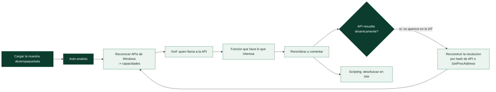

# Clase 146 — Análisis con IDA y Ghidra aplicado a malware

> Parte: **6 — Análisis de malware** · Fuente: *Practical Malware Analysis* (Sikorski & Honig)
> ⏱️ Duración estimada: **140 min** · Nivel: **Avanzado**

---

## 🎯 Objetivo

Usar un desensamblador/decompilador para leer el código del malware y reconstruir su lógica: identificar la función `main`, seguir el grafo de llamadas, reconocer patrones de APIs, renombrar y anotar, y llegar al decompilado en pseudo-C. Ghidra (gratuito) e IDA son las herramientas centrales del análisis estático avanzado.

## 📚 Resultados de aprendizaje

Al finalizar, el alumno podrá:

1. **Cargar** una muestra en Ghidra/IDA y navegar el desensamblado y el decompilado.
2. **Localizar** funciones relevantes por strings, imports y referencias cruzadas.
3. **Anotar** el análisis: renombrar funciones/variables y aplicar tipos.
4. **Reconocer** patrones de código (bucles de cifrado, resolución dinámica de APIs, C2).
5. **Extraer** configuración e IOCs directamente del código.

## 🗺️ Temas

| # | Tema | Por qué importa |
|---|------|-----------------|
| 1 | Carga y auto-análisis | Punto de partida del RE |
| 2 | Vistas: disasm, decompiler, graph | Distintos niveles de abstracción |
| 3 | Xrefs (referencias cruzadas) | Navegar de un string/API a su uso |
| 4 | Renombrado y comentarios | Hace legible un binario hostil |
| 5 | Reconocimiento de APIs y patrones | Identifica funcionalidad rápido |
| 6 | Resolución dinámica de APIs | Malware oculta imports en runtime |
| 7 | Scripting (Ghidra/IDAPython) | Automatiza tareas repetitivas |

## 🧠 Explicación en profundidad

### Cuando el estático y el dinámico no bastan: leer el código

El **análisis estático avanzado** —desensamblar y decompilar la muestra con IDA o Ghidra ([Clases
131–132](../../parte-5-explotacion-de-sistemas-y-binarios/131-ghidra-para-ingenieria-inversa/README.md))— es el nivel más profundo y costoso del análisis de malware, y se recurre a él
cuando las preguntas exigen entender **exactamente** qué hace el código: cómo cifra un ransomware, qué
algoritmo usa un DGA, cómo desofusca sus cadenas, qué condiciones activan una rama. La ingeniería
inversa de la Parte 5 se aplica aquí, pero con un adversario que **quiere** dificultar el análisis, de
ahí las técnicas específicas de esta clase.

### El flujo, adaptado al malware

El trabajo empieza como en la Parte 5: **cargar** la muestra (ya desempaquetada, clase 147, si estaba
packed), dejar que el **auto-análisis** identifique funciones y genere la decompilación, y navegar por
las **vistas** (desensamblado, decompilador, grafo). Pero el análisis de malware es especialmente
**dirigido por objetivos**: rara vez se lee la muestra entera; se busca responder una pregunta
concreta. La brújula son las **referencias cruzadas** (*xrefs*) y las **APIs de Windows**: se localiza
una API interesante —`CryptEncrypt`, `CreateRemoteThread`, `InternetOpenUrl`— y se mira **quién la
llama** (xref), lo que lleva directamente a la función que hace lo que interesa. Y el trabajo, como
siempre en RE, es **iterativo y anotado**: se renombran funciones (`FUN_00401230` → `cifrar_ficheros`)
y se comentan hallazgos, construyendo comprensión que mejora el análisis de lo siguiente.

### Las APIs de Windows como mapa de intenciones

El malware de Windows **habla con el sistema operativo a través de la API de Windows**, y reconocer los
patrones de APIs es lo que traduce ensamblador opaco en comportamiento comprensible. Ciertas
combinaciones son firmas de técnicas conocidas: `VirtualAllocEx` + `WriteProcessMemory` +
`CreateRemoteThread` es **inyección de código en otro proceso**; `OpenProcess` + `VirtualAllocEx` sobre
un proceso creado suspendido es **process hollowing**; `RegSetValueEx` en una clave `Run` es
**persistencia**; `CryptAcquireContext` + `CryptEncrypt` es **cifrado** (ransomware). Un analista
experimentado reconoce estas cadenas de un vistazo, y ese vocabulario de APIs —qué hace cada una, qué
combinaciones significan qué técnica— es buena parte de lo que distingue el análisis de malware de la
RE genérica.

### La contramedida del malware: resolución dinámica de APIs

El malware sabe que sus imports lo delatan (clase 143), así que los oculta con **resolución dinámica de
APIs**: en lugar de importar `CreateRemoteThread` normalmente (lo que aparecería en la IAT), la
**resuelve en tiempo de ejecución** —típicamente cargando la DLL con `LoadLibrary` y obteniendo la
dirección de la función con `GetProcAddress`, a menudo **buscándola por un hash de su nombre** en lugar
de por el nombre en claro, para que ni siquiera aparezca la cadena—. El efecto: la IAT del malware se
ve casi vacía, y el desensamblado muestra llamadas a direcciones calculadas en vez de a APIs con
nombre. Reconstruir qué API se está llamando —invirtiendo el algoritmo de hashing y precalculando los
hashes de todas las APIs para hacer una tabla de correspondencia— es una de las tareas más frecuentes y
características del análisis de malware avanzado (y la clase 158 la automatiza con emulación). El
**scripting** (GhidraScript, IDAPython) es indispensable para estas tareas repetitivas: desofuscar
cientos de cadenas cifradas aplicando la rutina de descifrado que se ha identificado, resolver todas
las APIs por hash de golpe, o anotar el binario en lote. La lección de la clase es que el análisis de
código de malware es RE de la Parte 5 más un **catálogo de técnicas del adversario** (resolución
dinámica, ofuscación de cadenas, anti-análisis) que hay que reconocer y revertir, y el scripting es lo
que lo hace escalable.

## 📖 Definiciones y características

- **Desensamblado:** traducción de bytes a instrucciones ASM. Característica clave: **vista exacta** de la ejecución.
- **Decompilador:** reconstruye pseudo-C desde el ASM. Característica clave: **lectura rápida**, aproximada.
- **Xref:** referencia cruzada a una dirección/símbolo. Característica clave: **navegación por uso**.
- **Resolución dinámica de API:** `LoadLibrary`+`GetProcAddress` en runtime. Característica clave: **oculta capacidades** al análisis estático.
- **API hashing:** resolver APIs por hash del nombre. Característica clave: **evasión** de detección por strings.

## 📔 Glosario

| Término | Definición concisa |
|---------|--------------------|
| Análisis estático avanzado | Desensamblar y decompilar la muestra |
| Auto-análisis | Identificación automática de funciones |
| Dirigido por objetivos | Buscar responder una pregunta, no leer todo |
| Xref | Referencia cruzada: quién llama a algo |
| API de Windows | Interfaz por la que el malware habla con el SO |
| Patrón de APIs | Combinación que revela una técnica conocida |
| Inyección de código | VirtualAllocEx + WriteProcessMemory + CreateRemoteThread |
| Process hollowing | Vaciar un proceso suspendido y reemplazar su código |
| Resolución dinámica de APIs | Obtener funciones en ejecución para ocultarlas |
| GetProcAddress | Resuelve la dirección de una función por nombre |
| API hashing | Buscar la API por un hash de su nombre |
| IAT vacía | Síntoma de resolución dinámica |
| GhidraScript / IDAPython | Scripting para tareas repetitivas |
| Desofuscación en lote | Aplicar la rutina de descifrado a muchas cadenas |

## 🧰 Herramientas y preparación

- **Ghidra** (NSA, gratuito) con su decompilador integrado.
- **IDA Free/Pro** con Hex-Rays (si se dispone).
- **x64dbg** para correlacionar estático con dinámico (clase posterior).
- Scripts: **Ghidra Scripts**, **IDAPython**, y plugins como **capa explorer**.

> ⚠️ **Nota ética y de seguridad:** el desensamblado es estático y no ejecuta la muestra, pero cárgala siempre desde la VM aislada. Nunca ejecutes la muestra desde el desensamblador (evita "run/debug" con binarios reales fuera del entorno controlado).

## 🧪 Laboratorio guiado

1. Crea un proyecto en Ghidra e importa la muestra. Deja que el auto-análisis termine.
2. En la ventana de **Symbol Tree/Functions**, localiza el entry point y navega hasta la función que parece `main`.
3. Abre **Defined Strings**. Elige un string revelador (URL, mensaje, clave de registro) y usa **xref** para saltar a la función que lo usa.
4. Estudia esa función en el **decompilador**. Renómbrala (p. ej. `contact_c2`) y comenta el propósito de sus variables.
5. Busca imports sospechosos (`InternetConnect`, `CryptEncrypt`, `CreateRemoteThread`) y desde ellos sigue xrefs a las rutinas que los invocan.
6. Si la IAT está casi vacía, localiza el patrón `GetProcAddress`/API hashing y documenta cómo resuelve funciones.
7. Identifica un posible bucle de descifrado de configuración: reconoce XOR/rotaciones y anota la clave.
8. Exporta un resumen: funciones clave renombradas, capacidades encontradas e IOCs extraídos del código.

## ✍️ Ejercicios

1. Explica la diferencia entre lo que ves en disasm y en el decompilador para una misma función.
2. Usa xrefs para trazar el camino desde un string C2 hasta su envío por red.
3. Reconoce y documenta un algoritmo simple de descifrado (XOR de un byte).
4. Renombra 5 funciones y justifica cada nombre.
5. Escribe un script Ghidra/IDAPython que liste todas las llamadas a `GetProcAddress`.
6. Explica cómo el API hashing dificulta el análisis y cómo lo resolverías.

## 📝 Reto verificable

Entrega un proyecto de Ghidra **anotado** de una muestra con al menos 5 funciones renombradas, la rutina de C2 identificada y la configuración/IOCs extraídos del código, más un breve informe.
**Criterio de aceptación:** otra persona puede abrir el proyecto y, siguiendo tus nombres y comentarios, explicar cómo la muestra contacta su C2 sin partir de cero.

## ⚠️ Errores comunes

| Síntoma / mensaje | Causa y cómo arreglar |
|-------------------|------------------------|
| Decompilado incoherente | Muestra empaquetada; desempácala antes de desensamblar |
| No aparece `main` | Runtime del compilador; localiza `main` desde `WinMain`/CRT |
| Faltan nombres de API | API hashing o resolución dinámica; reconstruye la tabla |
| Xrefs vacíos en un string | El string se construye en runtime; búscalo en el decompilado |
| Perderse en el grafo | Trabaja desde strings/imports hacia dentro, no al revés |

## ❓ Preguntas frecuentes

**❓ ¿Ghidra o IDA?** Ambos son excelentes. Ghidra es gratuito y su decompilador es muy bueno; IDA Pro es el estándar comercial. Aprende el flujo, no solo la herramienta.

**❓ ¿Debo leer todo el binario?** No. El análisis dirigido por objetivos (encontrar C2, cifrado, persistencia) es mucho más eficiente que leer linealmente.

**❓ ¿Cómo trato el API hashing?** Reconoce el algoritmo de hash, precomputa hashes de APIs comunes y mapea; hay scripts públicos que automatizan esto.

## 🔗 Referencias

- Sikorski & Honig, *Practical Malware Analysis*, cap. 5–7.
- Ghidra. <https://ghidra-sre.org>
- Hex-Rays IDA. <https://hex-rays.com>
- Ghidra Scripting API. <https://ghidra.re/ghidra_docs/api/>

## 📥 Material descargable

- 📄 [Guía en PDF](./clase-146-guia.pdf) — versión imprimible de esta clase.
- 🎞️ [Presentación (PPTX)](./clase-146-presentacion.pptx) — deck para proyectar en clase.

## ⬅️ Clase anterior

[Clase 145 — El formato PE de Windows](../145-el-formato-pe-de-windows/README.md)

## ➡️ Siguiente clase

[Clase 147 — Ofuscación, packing y unpacking](../147-ofuscacion-packing-y-unpacking/README.md)
