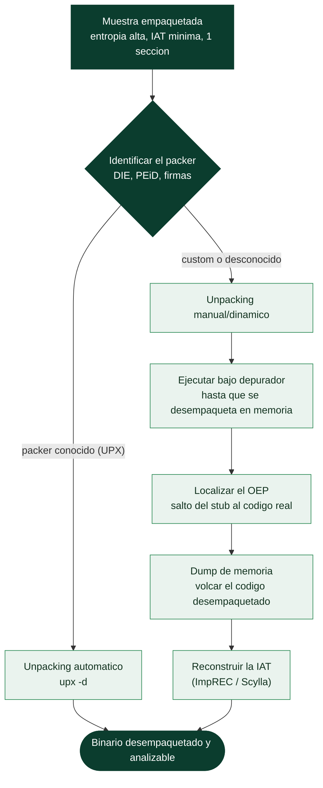

# Clase 147 — Ofuscación, packing y unpacking

> Parte: **6 — Análisis de malware** · Fuente: *Practical Malware Analysis* (Sikorski & Honig)
> ⏱️ Duración estimada: **130 min** · Nivel: **Avanzado**

---

## 🎯 Objetivo

Vencer las defensas que el malware usa contra el análisis. El alumno aprenderá a reconocer ofuscación, packing y anti-análisis; a identificar el packer; y a desempacar la muestra (automática y manualmente) para hacer un **dump** del código real desde memoria, reconstruir la IAT y continuar el análisis.

## 📚 Resultados de aprendizaje

Al finalizar, el alumno podrá:

1. **Distinguir** ofuscación, packing y protección virtualizada.
2. **Identificar** el packer con firmas y por comportamiento.
3. **Desempacar** con herramientas automáticas (p. ej. UPX) cuando aplique.
4. **Realizar** unpacking manual: localizar el OEP, dumpear y reparar la IAT.
5. **Detectar y neutralizar** técnicas anti-debug/anti-VM básicas.

## 🗺️ Temas

| # | Tema | Por qué importa |
|---|------|-----------------|
| 1 | Ofuscación vs packing vs virtualización | Enfoques de análisis distintos |
| 2 | Identificación de packers | Define la estrategia de unpacking |
| 3 | Unpacking automático (UPX y otros) | Vía rápida cuando el packer es conocido |
| 4 | OEP (Original Entry Point) | Punto donde termina el stub |
| 5 | Dump de memoria | Extrae el código desempacado |
| 6 | Reconstrucción de IAT | Necesaria para un dump analizable |
| 7 | Anti-debug / anti-VM | Impiden la depuración |

## 🧠 Explicación en profundidad

### Casi todo el malware está empaquetado

La inmensa mayoría del malware real llega **empaquetado** (*packed*): su código real está comprimido o
cifrado, y el fichero solo contiene un pequeño **desempaquetador** (*stub*) que, al ejecutarse,
reconstruye el código en memoria y salta a él ([Clase 135](../../parte-5-explotacion-de-sistemas-y-binarios/135-ofuscacion-y-tecnicas-anti-reversing/README.md)). El packing sirve dos propósitos al
atacante: **evadir la detección** por firmas (el antivirus no ve el código malicioso, solo el stub) y
**dificultar el análisis** estático. La consecuencia para el analista es que **hasta que no se
desempaqueta, el análisis estático ve poco o nada** —strings cifradas, IAT mínima, una sola sección de
entropía alta—. **Desempaquetar** (*unpacking*) es, por tanto, un paso previo obligatorio para la
mayoría del análisis de código, y esta clase enseña a hacerlo.

### Tres niveles de protección

Conviene distinguir tres grados. La **ofuscación** transforma el código para hacerlo ilegible pero lo
mantiene como código (cadenas cifradas, control-flow flattening, nombres sin sentido). El **packing**
va más allá: **comprime o cifra el binario entero** y lo reconstruye en ejecución —el código real no
existe en el fichero, solo aparece en memoria—. La **virtualización** es el extremo: traduce el código
a un **bytecode propio** que solo un intérprete embebido entiende, la protección más costosa de vencer.
La mayoría del malware usa packing; la ofuscación es habitual sobre el código ya desempaquetado; la
virtualización se reserva para amenazas avanzadas.

### Identificar el packer y el caso fácil

El primer paso es **identificar el packer**, con herramientas como **DIE** (Detect It Easy) o PEiD, que
reconocen firmas de packers conocidos. Si es un packer estándar y bien documentado —el ejemplo canónico
es **UPX**—, el unpacking es trivial: `upx -d muestra.exe` lo revierte, porque UPX es un compresor
legítimo con desempaquetador oficial. Pero el malware serio usa **packers personalizados** (a veces
UPX modificado a propósito para que el `-d` no funcione) o packers comerciales complejos, y ahí hace
falta el unpacking manual o dinámico.

### El unpacking manual: OEP, dump y reconstrucción de la IAT

El unpacking genérico se apoya en una idea universal: **el malware, para ejecutarse, tiene que
desempaquetarse a sí mismo en memoria**, así que si se le deja hacerlo bajo observación y luego se
**captura la memoria**, se obtiene el código real. El flujo tiene tres pasos clave. Primero, **localizar
el OEP** (*Original Entry Point*): el punto donde el stub termina de desempaquetar y **salta al código
original** —se encuentra ejecutando bajo un depurador (x64dbg) y buscando ese salto característico, o
poniendo un breakpoint en la transición de una sección a otra—. Segundo, el **dump de memoria**: una vez
que la ejecución está en el OEP con el código ya desempaquetado en memoria, se **vuelca** ese proceso a
un nuevo fichero. Tercero, y a menudo el más delicado, **reconstruir la IAT**: el binario volcado tiene
las direcciones de las APIs resueltas en memoria pero le falta una tabla de imports válida, así que hay
que reconstruirla con herramientas como **Scylla** o ImpREC, que analizan las llamadas y regeneran la
Import Directory. El resultado es un binario **desempaquetado y analizable** estáticamente. Todo esto se
complica con las **defensas anti-debug y anti-VM** (clase 135) que el packer añade —comprobaciones de
`IsDebuggerPresent`, de timing, de dispositivos de VM— que hay que parchear o evadir para que la muestra
llegue a desempaquetarse. La clase 158 muestra cómo **automatizar** el unpacking con emulación, pero
entender el proceso manual —OEP, dump, IAT— es lo que permite abordar los casos que ninguna herramienta
automática resuelve, que son precisamente los del malware que más importa analizar.

## 📖 Definiciones y características

- **Packer:** comprime/cifra el binario y añade un stub que lo restaura en memoria. Característica clave: **código real oculto en disco**.
- **OEP:** primera instrucción del programa original tras el stub. Característica clave: **punto de dump**.
- **Dumping:** volcar la imagen desempacada desde memoria. Característica clave: **recupera el código real**.
- **IAT rebuild:** reconstruir imports tras el dump. Característica clave: **binario analizable**.
- **Anti-debug:** técnicas para detectar depuradores (`IsDebuggerPresent`, timing). Característica clave: **frena el análisis dinámico**.
- **Virtualización (VMProtect/Themida):** convierte código en bytecode propio. Característica clave: **unpacking muy difícil**.

## 📔 Glosario

| Término | Definición concisa |
|---------|--------------------|
| Packing | Comprimir/cifrar el binario; un stub lo reconstruye |
| Stub | Desempaquetador que revela el código en ejecución |
| Ofuscación | Hacer el código ilegible manteniéndolo como código |
| Virtualización | Traducir a bytecode propio con intérprete |
| Unpacking | Recuperar el código real del malware empaquetado |
| DIE / PEiD | Herramientas que identifican el packer |
| UPX | Packer estándar; se revierte con `upx -d` |
| Packer personalizado | Requiere unpacking manual o dinámico |
| OEP | Original Entry Point; donde el stub salta al código real |
| Dump de memoria | Volcar el código ya desempaquetado |
| Reconstrucción de IAT | Regenerar la tabla de imports del binario volcado |
| Scylla / ImpREC | Herramientas de reconstrucción de la IAT |
| x64dbg | Depurador usado para el unpacking manual |
| Anti-debug / anti-VM | Defensas del packer que hay que evadir |

## 🧰 Herramientas y preparación

- **Detect It Easy / PEiD** para identificar packer.
- **UPX** (`upx -d`) para packers conocidos.
- **x64dbg** con plugins **Scylla** (dump + IAT) y **ScyllaHide** (anti-anti-debug).
- **PE-bear** para revisar el resultado; **Ghidra** para continuar el análisis.

> ⚠️ **Nota ética y de seguridad:** el unpacking implica **ejecutar** el stub del malware bajo depurador. Hazlo solo en la VM aislada, con snapshot previo y sin red. Aunque paras en el OEP, el proceso ya se ejecuta parcialmente: restaura `base-clean` al terminar.

## 🧪 Laboratorio guiado

Caso A — packer conocido (UPX):

1. Confirma con DIE que la muestra está empaquetada con UPX.
2. Desempaca: `upx -d muestra.exe -o muestra_unpacked.exe`.
3. Verifica en PE-bear que la IAT y las secciones vuelven a ser normales y reanaliza en Ghidra.

Caso B — unpacking manual genérico:

4. Restaura snapshot. Carga la muestra en **x64dbg** con **ScyllaHide** activo (perfil anti-anti-debug).
5. Pon un breakpoint en APIs típicas del final del stub (`VirtualAlloc`, `VirtualProtect`) para atrapar la escritura del código desempacado.
6. Sigue la ejecución hasta el salto al **OEP** (cambio brusco de sección, `jmp/call` a la región recién escrita). Detente ahí.
7. Con **Scylla**: haz *Dump* del proceso y luego *IAT Autosearch* + *Get Imports* + *Fix Dump* para reconstruir imports.
8. Abre el dump reparado en PE-bear/Ghidra y confirma que ahora hay strings, imports y código legibles.
9. Documenta el OEP, el método usado y las diferencias antes/después. Restaura `base-clean`.

## ✍️ Ejercicios

1. Explica por qué un binario empaquetado muestra pocos strings e imports.
2. Compara unpacking automático vs manual: cuándo usar cada uno.
3. Identifica el OEP en un ejemplo y justifica tu decisión.
4. Enumera 4 técnicas anti-debug y cómo las neutraliza ScyllaHide.
5. Reconstruye la IAT de un dump y verifica que Ghidra resuelve nombres.
6. Investiga por qué VMProtect/Themida requieren otras técnicas.

## 📝 Reto verificable

Desempaca una muestra empaquetada y entrega el **dump reparado** con su IAT reconstruida, más un informe con el OEP, el método y evidencia de que el código ya es legible (strings/imports visibles).
**Criterio de aceptación:** el dump abre en Ghidra mostrando imports resueltos y strings que no eran visibles en el binario original, y el informe indica el OEP con su dirección.

## ⚠️ Errores comunes

| Síntoma / mensaje | Causa y cómo arreglar |
|-------------------|------------------------|
| El proceso se cierra al depurar | Anti-debug activo; usa ScyllaHide y evita detección |
| Dump no ejecuta / IAT rota | Falta reparar imports; usa Scylla IAT Autosearch + Fix |
| No encuentro el OEP | Usa breakpoints en `VirtualProtect`/tension entre secciones |
| `upx -d` falla | UPX modificado a mano; desempaca manualmente |
| Dump sin strings | Detuviste antes del OEP; avanza hasta que se descifre todo |

## ❓ Preguntas frecuentes

**❓ ¿Todo malware está empaquetado?** No todo, pero es muy común para evadir AV y análisis. La alta entropía y la IAT mínima son las primeras señales.

**❓ ¿Puedo evitar ejecutar para desempacar?** Para packers simples sí (estático/emulación). Para packers reales suele hacer falta ejecutar el stub bajo control; por eso el aislamiento es crítico.

**❓ ¿Qué hago con Themida/VMProtect?** Son protecciones de virtualización; el unpacking clásico no basta. Se recurre a emulación, dumping parcial y análisis de comportamiento.

## 🔗 Referencias

- Sikorski & Honig, *Practical Malware Analysis*, cap. 18 (packers y unpacking).
- x64dbg. <https://x64dbg.com>
- Scylla. <https://github.com/NtQuery/Scylla>
- ScyllaHide. <https://github.com/x64dbg/ScyllaHide>
- UPX. <https://upx.github.io>

## 📥 Material descargable

- 📄 [Guía en PDF](./clase-147-guia.pdf) — versión imprimible de esta clase.
- 🎞️ [Presentación (PPTX)](./clase-147-presentacion.pptx) — deck para proyectar en clase.

## ⬅️ Clase anterior

[Clase 146 — Análisis con IDA y Ghidra aplicado a malware](../146-analisis-con-ida-y-ghidra-aplicado-a-malware/README.md)

## ➡️ Siguiente clase

[Clase 148 — Análisis de comportamiento](../148-analisis-de-comportamiento/README.md)
