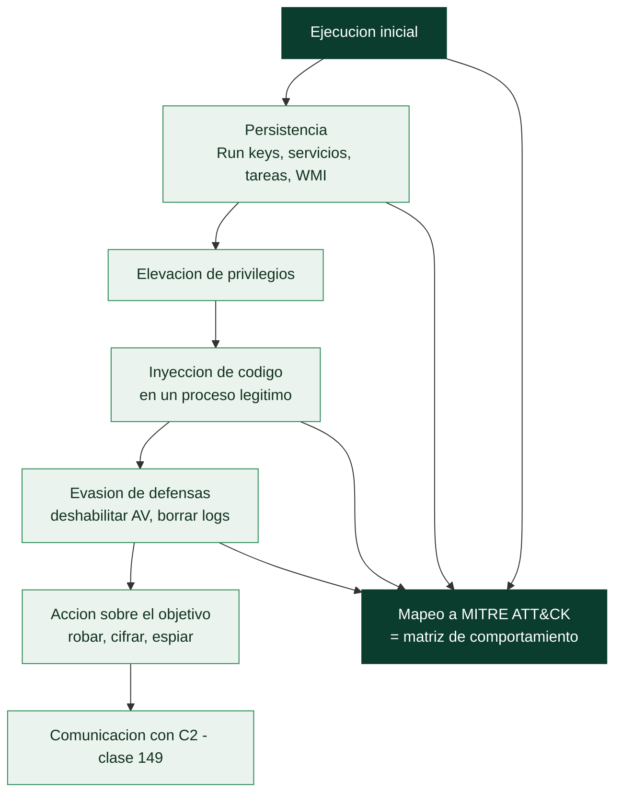

# Clase 148 — Análisis de comportamiento

> Parte: **6 — Análisis de malware** · Fuente: *Learning Malware Analysis* (Monnappa K. A.) y MITRE ATT&CK
> ⏱️ Duración estimada: **120 min** · Nivel: **Avanzado**

---

## 🎯 Objetivo

Reconstruir el **comportamiento completo** de una muestra y mapearlo a MITRE ATT&CK: persistencia, escalada, evasión de defensas, inyección de código, movimiento y exfiltración. Se integran análisis dinámico, forense de memoria y desensamblado para pasar de "hace cosas" a un relato estructurado de TTPs que alimenta detección y respuesta.

## 📚 Resultados de aprendizaje

Al finalizar, el alumno podrá:

1. **Mapear** las acciones observadas a tácticas y técnicas de ATT&CK con su ID.
2. **Identificar** mecanismos de persistencia y priorizar los más sigilosos.
3. **Reconocer** técnicas de inyección de código (DLL/APC/hollowing).
4. **Correlacionar** memoria, procesos y red para un relato coherente.
5. **Producir** una matriz de comportamiento reutilizable en detección.

## 🗺️ Temas

| # | Tema | Por qué importa |
|---|------|-----------------|
| 1 | Ciclo de vida del malware en el host | Da estructura al análisis |
| 2 | Persistencia (Run keys, servicios, tareas, WMI) | Continuidad tras reinicio |
| 3 | Inyección de código (varias técnicas) | Evasión y ejecución en otro proceso |
| 4 | Evasión de defensas | Deshabilita AV/logs, vive en memoria |
| 5 | Forense de memoria con Volatility | Ve lo que el disco oculta |
| 6 | Mapeo a MITRE ATT&CK | Lenguaje común de detección |
| 7 | Matriz de comportamiento | Convierte análisis en detecciones |

## 🧠 Explicación en profundidad

### De las acciones sueltas al comportamiento como sistema

El **análisis de comportamiento** integra las observaciones dinámicas (clase 144) y estáticas en una
comprensión del malware **como un sistema con un ciclo de vida**: cómo llega, cómo se afianza, qué hace
para lograr su objetivo, y cómo evade la detección. En lugar de una lista de acciones aisladas ("crea
este fichero, toca esta clave"), se construye una **matriz de comportamiento** que mapea cada acción a
una **táctica y técnica de MITRE ATT&CK**, lo que convierte el análisis en algo comparable con otras
muestras y accionable para la defensa. El ciclo de vida típico —ejecución inicial, establecimiento de
persistencia, elevación de privilegios, evasión, acción sobre el objetivo, comunicación con C2— da el
esqueleto para organizar lo observado.

### Persistencia: cómo sobrevive al reinicio

La **persistencia** es una de las primeras cosas que hace el malware y una de las más reveladoras,
porque deja artefactos concretos y detectables. Las técnicas coinciden con las de la [Clase 082](../../parte-3-hacking-etico-y-pentesting-metodologia/082-persistencia-en-sistemas-comprometidos/README.md)
vistas ahora desde el lado del análisis: las **Run keys** del registro (ejecutan un programa al iniciar
sesión), los **servicios** (arrancan con el sistema con privilegios), las **tareas programadas**, y la
**suscripción a eventos WMI** (persistencia *fileless* y sigilosa). Identificar el mecanismo de
persistencia de una muestra es doble valor: es comprensión (cómo se afianza) y es un **IOC accionable**
(dónde buscar la infección en otros sistemas, y qué eliminar para erradicarla). ProcMon y Regshot
(clase 144) revelan estos artefactos durante la detonación.

### Inyección de código y evasión: esconderse en lo legítimo

La técnica que define al malware sofisticado es la **inyección de código**: en lugar de ejecutarse como
su propio proceso (visible y sospechoso), el malware **inyecta su código en un proceso legítimo**
(`explorer.exe`, `svchost.exe`, el navegador) y se ejecuta **dentro de él**, camuflándose. Hay muchas
variantes —inyección de DLL clásica, process hollowing (vaciar un proceso suspendido y reemplazar su
contenido), APC injection, process doppelgänging— pero todas comparten el objetivo de **ejecutarse bajo
la identidad de un proceso de confianza**, lo que evade detecciones que se fijan en qué procesos
existen. La **evasión de defensas** completa el cuadro: deshabilitar el antivirus, borrar los logs
(anti-forense, [Clase 084](../../parte-3-hacking-etico-y-pentesting-metodologia/084-anti-forense-y-borrado-de-huellas-concepto-y-limites/README.md)), detectar el entorno de análisis, o usar técnicas de "living off the
land" (clase 159). Reconocer la inyección en el análisis dinámico (un proceso legítimo que de repente
hace conexiones de red o toca ficheros que no debería) y en el estático (los patrones de API de la
clase 146) es central.

### Forense de memoria: ver lo que el disco no muestra

Aquí entra la herramienta que cierra la clase: la **forense de memoria** con **Volatility**. Como el
malware moderno vive en memoria (inyectado, packed, fileless), un volcado de RAM contiene lo que el
disco no: el **código desempaquetado**, los procesos ocultos, el código inyectado en procesos
legítimos, las conexiones de red activas, las claves de descifrado. Volatility analiza ese volcado y
extrae —con sus *plugins*— la lista de procesos (incluidos los ocultos), las conexiones de red, el código
inyectado (`malfind` detecta regiones de memoria ejecutables anómalas), los handles, y mucho más. Es
indispensable para el malware que no deja rastro en disco. El producto final de toda la clase es la
**matriz de comportamiento** mapeada a ATT&CK: una tabla que dice, para cada táctica (ejecución,
persistencia, evasión, C2, impacto), qué técnica concreta usa la muestra —Emotet usa T1547.001 para
persistir, T1055 para inyectar, T1071 para C2—. Esa matriz es el entregable que hace el análisis
comunicable, comparable entre muestras y directamente útil para que el equipo de defensa (Parte 8)
construya detecciones.

## 📖 Definiciones y características

- **Persistencia:** mecanismo para sobrevivir reinicios. Característica clave: **múltiples ASEPs** posibles.
- **Process injection:** ejecutar código en otro proceso. Característica clave: **evasión y camuflaje**.
- **Process hollowing:** vaciar un proceso legítimo y sustituir su imagen. Característica clave: **suplantación**.
- **DLL injection / APC injection:** cargar código vía DLL o colas APC. Característica clave: **ejecución remota** en un proceso.
- **TTP:** táctica, técnica y procedimiento. Característica clave: **abstracción estable** frente a IOCs volátiles.

## 📔 Glosario

| Término | Definición concisa |
|---------|--------------------|
| Análisis de comportamiento | Entender el malware como sistema con ciclo de vida |
| Ciclo de vida | Ejecución, persistencia, evasión, objetivo, C2 |
| Matriz de comportamiento | Acciones mapeadas a tácticas y técnicas ATT&CK |
| Persistencia | Mecanismo para sobrevivir al reinicio |
| Run keys / servicios / tareas / WMI | Vectores de persistencia |
| Inyección de código | Ejecutar dentro de un proceso legítimo |
| Process hollowing | Vaciar un proceso suspendido y reemplazar su código |
| APC injection | Inyección mediante colas de procedimientos asíncronos |
| Evasión de defensas | Deshabilitar AV, borrar logs, detectar análisis |
| Forense de memoria | Analizar un volcado de RAM |
| Volatility | Framework de forense de memoria |
| malfind | Plugin que detecta código inyectado en memoria |
| Proceso oculto | Proceso que un rootkit esconde; visible en memoria |
| MITRE ATT&CK | Taxonomía a la que se mapea el comportamiento |

## 🧰 Herramientas y preparación

- **ProcMon**, **Process Hacker**, **Autoruns** (persistencia y actividad).
- **Volatility 3** para análisis de memoria (`pslist`, `malfind`, `dlllist`, `handles`).
- **Ghidra/x64dbg** para confirmar la técnica en el código.
- Matriz **MITRE ATT&CK** abierta como referencia.

> ⚠️ **Nota ética y de seguridad:** la detonación y captura de memoria se realizan en la VM aislada con snapshot. Estudiar técnicas de inyección o persistencia es para **defender y detectar**; nunca despliegues estas técnicas fuera de sistemas propios y autorizados.

## 🧪 Laboratorio guiado

1. Restaura `base-clean` e instrumenta la VM (ProcMon, Process Hacker, Wireshark, INetSim).
2. Detona la muestra y captura un volcado de memoria (snapshot de RAM del hypervisor o `winpmem`).
3. Con **Volatility 3**: `windows.pslist` y `windows.pstree` para el árbol de procesos; localiza procesos hijos anómalos.
4. Ejecuta `windows.malfind` para hallar regiones de memoria RWX inyectadas y procesos "huecos" (hollowing). Anota PIDs.
5. Con `windows.dlllist` y `windows.handles`, identifica DLLs inyectadas y el mutex de infección.
6. Localiza la persistencia: `Autoruns` en vivo + `RegSetValue` en ProcMon. Clasifícala (Run key, servicio, tarea, WMI).
7. Para cada acción, asigna la técnica ATT&CK correspondiente (p. ej. `T1055` Process Injection, `T1547.001` Registry Run Keys, `T1053.005` Scheduled Task).
8. Construye una **matriz de comportamiento**: táctica · técnica (ID) · evidencia · posible detección.

## ✍️ Ejercicios

1. Diferencia DLL injection, hollowing y APC injection con un ejemplo de cada uno.
2. Mapea 6 acciones observadas a técnicas ATT&CK con su ID.
3. Explica cómo `malfind` detecta código inyectado.
4. Propón una regla de detección (Sysmon/EDR) para la persistencia hallada.
5. Correlaciona un proceso de `pslist` con su conexión de red.
6. Justifica por qué los TTPs son más duraderos que los IOCs.

## 📝 Reto verificable

Entrega una **matriz de comportamiento** de una muestra con al menos 8 técnicas ATT&CK (con ID y evidencia), la inyección confirmada por `malfind` y la persistencia identificada, más una detección propuesta por técnica.
**Criterio de aceptación:** cada técnica tiene evidencia (ProcMon/Volatility/Wireshark) y un ID `Txxxx` correcto, y al menos una detección propuesta es implementable con Sysmon o un EDR.

## ⚠️ Errores comunes

| Síntoma / mensaje | Causa y cómo arreglar |
|-------------------|------------------------|
| `malfind` sin resultados | Inyección ya cerrada o en otro proceso; captura memoria antes |
| Persistencia "no existe" | Solo miraste Run keys; revisa servicios, tareas y WMI |
| Confundir técnica con IOC | El IP es IOC; "C2 over HTTPS" es la técnica ATT&CK |
| Árbol de procesos confuso | Usa `pstree`; correlaciona PPID con el proceso padre real |
| IDs de ATT&CK inventados | Verifica cada técnica en attack.mitre.org |

## ❓ Preguntas frecuentes

**❓ ¿Por qué mapear a ATT&CK?** Porque estandariza el reporte, permite comparar amenazas y priorizar detecciones sobre técnicas que el atacante no puede cambiar fácilmente.

**❓ ¿Memoria o disco?** Ambos. El malware fileless o inyectado apenas toca disco; la memoria revela lo que el análisis estático no ve.

**❓ ¿Cuántos ASEPs de persistencia existen?** Decenas. Autoruns cataloga muchos; por eso no basta con revisar las Run keys.

## 🔗 Referencias

- 🛠️ [RootCause Windows Inspector](https://github.com/vladimiracunadev-create/rootcause-windows-inspector) (Apache-2.0) — sensor forense de comportamiento para Windows · lab: [`labs/rootcause-windows`](../../../labs/rootcause-windows/README.md).
- Monnappa K. A., *Learning Malware Analysis*, cap. 7–8.
- MITRE ATT&CK. <https://attack.mitre.org>
- Volatility 3. <https://github.com/volatilityfoundation/volatility3>
- Sysmon (Sysinternals). <https://learn.microsoft.com/sysinternals/downloads/sysmon>

## 📥 Material descargable

- 📄 [Guía en PDF](./clase-148-guia.pdf) — versión imprimible de esta clase.
- 🎞️ [Presentación (PPTX)](./clase-148-presentacion.pptx) — deck para proyectar en clase.

## ⬅️ Clase anterior

[Clase 147 — Ofuscación, packing y unpacking](../147-ofuscacion-packing-y-unpacking/README.md)

## ➡️ Siguiente clase

[Clase 149 — Comunicaciones de comando y control (C2) del malware](../149-comunicaciones-de-comando-y-control-c2-del-malware/README.md)
