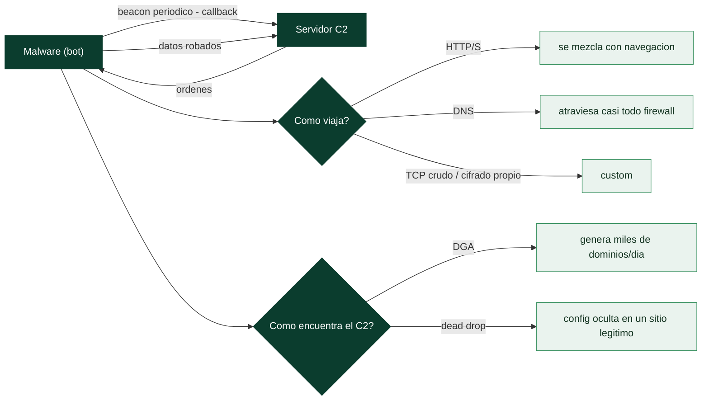

# Clase 149 — Comunicaciones de comando y control (C2) del malware

> Parte: **6 — Análisis de malware** · Fuente: *Practical Malware Analysis* (Sikorski & Honig) y MITRE ATT&CK
> ⏱️ Duración estimada: **120 min** · Nivel: **Avanzado**

---

## 🎯 Objetivo

Entender y diseccionar el canal de **comando y control**: cómo el malware localiza su servidor, qué protocolos usa, cómo estructura el beacon y qué cifrado/ofuscación aplica. El alumno aprenderá a capturar, decodificar y describir el C2, extraer configuración e IOCs de red, y reconocer frameworks conocidos (Cobalt Strike, Metasploit) por sus patrones.

## 📚 Resultados de aprendizaje

Al finalizar, el alumno podrá:

1. **Identificar** el mecanismo de resolución del C2 (dominio fijo, DGA, dead drop).
2. **Analizar** el patrón de beacon: intervalo, jitter, URIs y user-agent.
3. **Decodificar** el tráfico cuando el cifrado es simple (XOR/base64) o hay clave.
4. **Reconocer** frameworks de C2 por sus firmas de red y perfiles.
5. **Extraer** la configuración de C2 desde el binario o la memoria.

## 🗺️ Temas

| # | Tema | Por qué importa |
|---|------|-----------------|
| 1 | Modelo de beacon y callback | Base del control remoto |
| 2 | Protocolos: HTTP/S, DNS, TCP crudo | Definen la detección |
| 3 | DGA y dead drop resolvers | C2 resiliente y sigiloso |
| 4 | Cifrado y ofuscación del tráfico | Oculta comandos y datos |
| 5 | Frameworks (Cobalt Strike, Sliver, Metasploit) | Patrones reconocibles |
| 6 | Extracción de configuración | IOCs y perfiles de red |
| 7 | Detección de red (JA3, Suricata) | Cazar C2 en producción |

## 🧠 Explicación en profundidad

### El cordón umbilical del malware

Casi todo el malware moderno necesita **comunicarse con su operador**: recibir órdenes, enviar datos
robados, descargar módulos adicionales. Ese canal es el **command and control** (C2), y entenderlo es
central por dos razones: es donde el malware **revela su infraestructura** (dominios, IPs, claves) —los
IOCs más valiosos— y es donde la **detección de red** (Parte 1 y 8) tiene su mejor oportunidad, porque
el tráfico C2, por muy ofuscado que esté, **tiene que salir**. Analizar el C2 de una muestra da tanto la
comprensión de cómo se controla como los indicadores para detectarla y bloquearla en toda la red.

### El modelo de beacon: el latido que delata

El patrón fundamental del C2 es el **beacon** (baliza): el malware, en lugar de mantener una conexión
abierta (visible y frágil), **contacta periódicamente** con su servidor —"llama a casa" cada N
segundos— para preguntar si hay órdenes. Este patrón de **callback** es a la vez la fortaleza del
malware (atraviesa NAT y firewalls, porque es tráfico *saliente*, [Clase 037](../../parte-3-hacking-etico-y-pentesting-metodologia/README.md)) y su
talón de Aquiles: la **regularidad temporal** del beacon —conexiones al mismo destino cada 60 segundos,
con tamaño casi constante— es una firma inconfundible que el análisis de metadatos y NetFlow ([Clase
045](../../parte-1-redes-y-seguridad-de-redes/045-netflow-y-analisis-de-metadatos-de-trafico/README.md)) detecta **aunque el contenido esté cifrado**. Los operadores intentan disimularlo con
*jitter* (variación aleatoria del intervalo), pero el patrón periódico sigue siendo detectable.

### Los protocolos y las técnicas de resiliencia

El C2 puede viajar por distintos **protocolos**, cada uno con su perfil. **HTTP/HTTPS** es el más común
porque **se mezcla con la navegación normal** y casi siempre está permitido de salida; HTTPS además
cifra el contenido. El **DNS tunneling** ([Clase 041](../../parte-1-redes-y-seguridad-de-redes/041-seguridad-de-dns-envenenamiento-dnssec-y-tunneling/README.md)) codifica el C2 en consultas DNS, que
atraviesan casi cualquier firewall. El **TCP crudo** con cifrado propio se usa cuando el malware
controla ambos extremos. Para **encontrar el servidor** de forma resiliente —que no caiga si bloquean
un dominio—, dos técnicas destacan. El **DGA** (*Domain Generation Algorithm*) genera
**algorítmicamente miles de nombres de dominio** por día a partir de una semilla; el malware los prueba
hasta encontrar el que el operador ha registrado ese día, de modo que bloquear dominios es inútil
(cambian constantemente) —revertir el DGA para **predecir** los dominios futuros es una tarea clásica
del análisis y permite bloquearlos por adelantado o hacer *sinkholing*—. El **dead drop resolver**
esconde la dirección real del C2 en un sitio legítimo (un perfil de red social, un pastebin, un
comentario de GitHub), de modo que el malware primero consulta ese sitio inocuo para obtener la
dirección real.

### Extraer la configuración y detectar el C2

El objetivo de mayor valor del análisis de C2 es la **extracción de la configuración**: el malware
lleva embebida (cifrada) su **configuración de C2** —dominios, puertos, claves de cifrado, intervalo de
beacon, campaña—, y extraerla da de golpe todos los IOCs de la infraestructura. Muchas familias tienen
**extractores de configuración** conocidos (scripts que localizan y descifran el bloque de config), y
escribir uno para una familia nueva es una contribución valiosa de *threat intelligence* (clase 157).
Los **frameworks de C2** comerciales y de código abierto —**Cobalt Strike** (el más usado por
atacantes reales, cuyos *beacons* tienen configuración extraíble), **Sliver**, **Metasploit**— tienen
características reconocibles que ayudan a identificarlos. Y del lado de la **detección de red**, el
tráfico C2 deja firmas incluso cifrado: la **huella JA3/JA3S** (identifica el cliente/servidor TLS por
cómo negocia el handshake, [Clase 035](../../parte-1-redes-y-seguridad-de-redes/035-ids-ips-con-snort-y-suricata/README.md)) puede delatar un beacon de Cobalt Strike;
las **reglas Suricata** detectan patrones de C2 conocidos; y el análisis de metadatos caza el beaconing
por su regularidad. La lección de la clase es que el C2 es simultáneamente el punto más revelador del
malware (su infraestructura, sus IOCs) y el más detectable (el tráfico tiene que salir), y por eso
analizarlo conecta directamente el análisis de malware con la defensa de red de las Partes 1 y 8.

## 📖 Definiciones y características

- **Beacon:** conexión periódica del implante al C2. Característica clave: **periodicidad + jitter**.
- **DGA (Domain Generation Algorithm):** genera dominios pseudoaleatorios. Característica clave: **evita bloqueo por lista**.
- **Dead drop resolver:** obtiene el C2 desde un servicio legítimo (redes sociales, pastes). Característica clave: **camuflaje**.
- **Malleable C2:** perfiles que imitan tráfico legítimo (Cobalt Strike). Característica clave: **evasión de firmas**.
- **JA3/JA3S:** huella TLS del cliente/servidor. Característica clave: **detección aun con HTTPS**.

## 📔 Glosario

| Término | Definición concisa |
|---------|--------------------|
| C2 (command and control) | Canal por el que el operador controla el malware |
| Beacon | Contacto periódico del malware con su C2 |
| Callback | El malware inicia la conexión saliente |
| Jitter | Variación aleatoria del intervalo del beacon |
| HTTP/S como C2 | Se mezcla con la navegación; el más común |
| DNS tunneling | C2 codificado en consultas DNS |
| DGA | Algoritmo que genera miles de dominios por día |
| Sinkholing | Redirigir los dominios DGA a un servidor controlado |
| Dead drop resolver | Config del C2 oculta en un sitio legítimo |
| Extracción de configuración | Recuperar dominios y claves embebidos en la muestra |
| Extractor de configuración | Script que localiza y descifra el bloque de config |
| Cobalt Strike | Framework de C2 muy usado por atacantes |
| Sliver / Metasploit | Otros frameworks de C2 |
| JA3 / JA3S | Huella del cliente/servidor TLS; delata beacons |
| Beaconing | Regularidad temporal detectable aun con cifrado |

## 🧰 Herramientas y preparación

- **Wireshark** + **INetSim/FakeNet-NG** para capturar y responder.
- **CyberChef** para decodificar (base64, XOR, gunzip).
- **Suricata/Zeek** y firmas de red para detección.
- Extractores de config: **1768.py** (Cobalt Strike), **capa**, scripts de comunidad.

> ⚠️ **Nota ética y de seguridad:** el C2 se analiza con el servidor **simulado** (INetSim/FakeNet) dentro del lab aislado; nunca se da salida real a Internet ni se contacta un C2 vivo sin autorización. Montar servidores C2 solo se hace en entornos propios y con fines defensivos.

## 🧪 Laboratorio guiado

1. Restaura `base-clean`, arranca INetSim/FakeNet y captura con Wireshark en `labnet`.
2. Detona la muestra y observa la primera resolución DNS: ¿un dominio fijo o varios pseudoaleatorios (DGA)?
3. Sigue el flujo HTTP: anota método, URI, headers, **user-agent** y periodicidad de las peticiones (beacon interval + jitter).
4. Extrae el cuerpo de las peticiones/respuestas. Pásalo por **CyberChef** probando base64, XOR de un byte y gunzip para revelar comandos.
5. Si sospechas **Cobalt Strike**, usa `1768.py` sobre el beacon o la memoria para extraer el perfil (watermark, sleep, URIs, clave pública).
6. Localiza la **configuración de C2** en el binario/memoria (Ghidra/Volatility): dominios, puertos, clave, intervalo.
7. Calcula el **JA3** del handshake TLS (si aplica) y redacta una firma de detección (Suricata) para el patrón observado.
8. Documenta los IOCs de red y una regla de caza. Restaura `base-clean`.

## ✍️ Ejercicios

1. Diferencia beacon HTTP, DNS y TCP crudo por sus ventajas de evasión.
2. Explica cómo un DGA complica el bloqueo y cómo se puede predecir.
3. Decodifica un payload C2 simple con CyberChef y describe el comando.
4. Reconoce un perfil malleable y qué imita.
5. Escribe una firma Suricata para un user-agent o URI característico.
6. Extrae la config de C2 de una muestra y preséntala en tabla.

## 📝 Reto verificable

Entrega un **informe de C2** de una muestra con: mecanismo de resolución, protocolo y patrón de beacon, config extraída (dominios/puertos/clave/intervalo), muestra de tráfico decodificado y una firma de detección de red.
**Criterio de aceptación:** la firma propuesta dispara sobre el tráfico capturado en el lab y la config incluye al menos un dominio/IP y el intervalo de beacon verificados.

## ⚠️ Errores comunes

| Síntoma / mensaje | Causa y cómo arreglar |
|-------------------|------------------------|
| No hay tráfico C2 | Sin servicios simulados o detección de sandbox; usa INetSim y enmascara VM |
| No puedo descifrar el beacon | Cifrado fuerte; extrae la clave del binario/memoria |
| Beacon irregular | Jitter alto; promedia varios intervalos |
| Dominios cambian cada ejecución | DGA; identifica y reproduce el algoritmo |
| Firma con muchos falsos positivos | Basaste en algo genérico; usa URI+UA+patrón combinados |

## ❓ Preguntas frecuentes

**❓ ¿Cómo detecto C2 cifrado con HTTPS?** Con metadatos: JA3/JA3S, SNI, tamaño y periodicidad de flujos, y reputación del destino, sin necesidad de descifrar.

**❓ ¿Qué es un perfil malleable?** Una plantilla (Cobalt Strike) que define cómo luce el tráfico para imitar servicios legítimos y evadir firmas.

**❓ ¿Puedo interactuar con el C2 real?** No sin autorización. Analiza con servidor simulado; contactar infraestructura del atacante puede alertarle o ser ilegal.

## 🔗 Referencias

- Sikorski & Honig, *Practical Malware Analysis*, cap. 14 (redes malware-céntricas).
- MITRE ATT&CK — Command and Control. <https://attack.mitre.org/tactics/TA0011/>
- CyberChef. <https://gchq.github.io/CyberChef/>
- Cobalt Strike config extractor (1768.py). <https://blog.didierstevens.com>

## 📥 Material descargable

- 📄 [Guía en PDF](./clase-149-guia.pdf) — versión imprimible de esta clase.
- 🎞️ [Presentación (PPTX)](./clase-149-presentacion.pptx) — deck para proyectar en clase.

## ⬅️ Clase anterior

[Clase 148 — Análisis de comportamiento](../148-analisis-de-comportamiento/README.md)

## ➡️ Siguiente clase

[Clase 150 — Ransomware: anatomía y análisis](../150-ransomware-anatomia-y-analisis/README.md)
