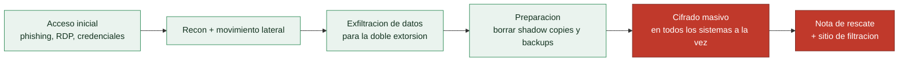

# Clase 150 — Ransomware: anatomía y análisis

> Parte: **6 — Análisis de malware** · Fuente: *Learning Malware Analysis* (Monnappa) y The DFIR Report
> ⏱️ Duración estimada: **130 min** · Nivel: **Avanzado**

---

## 🎯 Objetivo

Diseccionar la familia de mayor impacto económico actual: el ransomware. El alumno analizará su cadena completa (acceso, escalada, movimiento, exfiltración y cifrado), estudiará el esquema criptográfico, evaluará si el descifrado es posible sin la clave y extraerá IOCs y TTPs para prevención y respuesta.

## 📚 Resultados de aprendizaje

Al finalizar, el alumno podrá:

1. **Describir** la cadena de ataque de un incidente de ransomware moderno.
2. **Analizar** el esquema de cifrado (simétrico/asimétrico, generación de claves).
3. **Evaluar** la posibilidad de recuperación sin pagar (errores de implementación, backups).
4. **Identificar** la doble extorsión y la exfiltración previa al cifrado.
5. **Extraer** IOCs, nota de rescate y TTPs para detección y respuesta.

## 🗺️ Temas

| # | Tema | Por qué importa |
|---|------|-----------------|
| 1 | Cadena de ataque (RaaS) | El cifrado es la última fase, no la única |
| 2 | Esquema criptográfico | Determina si hay recuperación posible |
| 3 | Enumeración y cifrado de archivos | Comportamiento característico |
| 4 | Borrado de shadow copies / backups | Impide recuperación local |
| 5 | Doble extorsión y exfiltración | Presión adicional sobre la víctima |
| 6 | Nota de rescate y branding | Atribución de familia |
| 7 | Prevención y respuesta | Backups, segmentación, detección temprana |

## 🧠 Explicación en profundidad

### La amenaza que definió la década

El **ransomware** —malware que **cifra los datos de la víctima y exige un rescate** por la clave— es la
amenaza de mayor impacto económico de los últimos años, y su análisis reúne casi todo lo de la parte:
criptografía, C2, persistencia, evasión. Entender su anatomía importa porque determina la respuesta: si
el esquema criptográfico es sólido, **no hay recuperación sin la clave** (y pagar es problemático); si
tiene un fallo de implementación, a veces existe un descifrador. Y porque el ransomware moderno ha
evolucionado de un cifrado oportunista a una **industria** con división del trabajo.

### RaaS: el ransomware como negocio

El ransomware actual funciona como **RaaS** (*Ransomware-as-a-Service*): los **desarrolladores** crean
y mantienen el malware y la infraestructura, y los **afiliados** lo despliegan contra víctimas a cambio
de un porcentaje del rescate. Esta división explica por qué la misma familia (LockBit, BlackCat, Conti)
aparece en ataques muy distintos: distintos afiliados, mismo ransomware. La **cadena de ataque** típica
no empieza con el cifrado: empieza con un **acceso inicial** (phishing, credenciales compradas, un RDP
expuesto), seguido de **reconocimiento** y **movimiento lateral** ([Clase 078](../../parte-3-hacking-etico-y-pentesting-metodologia/078-movimiento-lateral-en-la-red/README.md)) para maximizar el
alcance, **exfiltración** de datos (para la doble extorsión), y **solo al final** el despliegue del
cifrado en todos los sistemas a la vez. El cifrado es el acto final de una intrusión que a menudo lleva
días o semanas dentro de la red —lo que significa que hay una ventana para detectarlo **antes** de que
cifre—.

### El esquema criptográfico: por qué no se puede descifrar

La pieza técnica central es **cómo cifra**, y el ransomware competente usa un **esquema híbrido** ([Clase
049](../../parte-2-criptografia-aplicada/049-cifrado-asimetrico-rsa/README.md)) que lo hace irreversible sin la clave del atacante. El patrón: para **cada fichero** genera
una **clave simétrica aleatoria** (AES, rápida) y cifra el fichero con ella; luego cifra **esa clave AES
con una clave pública RSA** del atacante y la guarda junto al fichero. Para descifrar haría falta la
**clave privada RSA**, que **solo tiene el atacante** —por eso el cifrado es matemáticamente
irreversible sin pagar—. Los descifradores gratuitos que a veces publican las autoridades solo existen
cuando el ransomware tuvo un **fallo**: usó un generador de aleatoriedad débil ([Clase 058](../../parte-2-criptografia-aplicada/058-generacion-de-aleatoriedad-segura-csprng/README.md)),
reutilizó claves, o el esquema tenía un error. Analizar el esquema criptográfico de una muestra
determina si la recuperación es posible, y es una de las tareas de mayor impacto del análisis.

### Enumeración, destrucción de respaldos y la respuesta

Antes de cifrar, el ransomware **enumera** los ficheros a atacar (por extensión, evitando los del
sistema para que la máquina siga arrancando y mostrando la nota) y —crítico— **destruye los mecanismos
de recuperación**: borra las **shadow copies** de Windows (`vssadmin delete shadows`), desactiva la
recuperación del sistema, y busca y cifra o borra los **backups** accesibles. Esta destrucción de
respaldos es lo que hace tan devastador el ransomware, y su detección (un proceso ejecutando `vssadmin
delete`) es una de las mejores alertas tempranas. El ransomware moderno añade la **doble extorsión**:
**exfiltra** los datos antes de cifrarlos y amenaza con **publicarlos** si no se paga, de modo que
tener backups ya no basta —la víctima sigue bajo presión por la filtración—; algunos añaden triple
extorsión (DDoS, contacto a clientes). La **nota de rescate**, con su *branding* característico, es un
IOC que identifica la familia. Del lado de la **respuesta**, la lección es que la prevención (backups
**offline** e inmutables que el ransomware no pueda alcanzar, MFA, parcheo, segmentación) y la
**detección temprana** (durante los días de movimiento lateral, antes del cifrado) importan
infinitamente más que la reacción una vez cifrado —cuando las opciones son restaurar de backup, pagar
(desaconsejado y a veces ilegal), o perder los datos—. El análisis de ransomware conecta así toda la
parte con la respuesta a incidentes de la Parte 9.

## 📖 Definiciones y características

- **RaaS (Ransomware-as-a-Service):** modelo con operadores y afiliados. Característica clave: **división del trabajo**.
- **Cifrado híbrido:** clave simétrica por archivo protegida con clave pública. Característica clave: **rápido + irrecuperable sin la privada**.
- **Shadow copies:** copias VSS de Windows. Característica clave: el ransomware **las borra** (`vssadmin delete shadows`).
- **Doble extorsión:** exfiltrar datos antes de cifrar. Característica clave: **chantaje con filtración**.
- **Nota de rescate:** instrucciones de pago. Característica clave: **firma de familia**.

## 📔 Glosario

| Término | Definición concisa |
|---------|--------------------|
| Ransomware | Cifra los datos y exige un rescate |
| RaaS | Ransomware como servicio: desarrolladores y afiliados |
| Afiliado | Quien despliega el ransomware a cambio de un porcentaje |
| Cadena de ataque | Acceso, lateral, exfiltración y cifrado final |
| Esquema híbrido | AES por fichero + RSA para la clave AES |
| Clave privada RSA | La tiene solo el atacante; hace irreversible el cifrado |
| Descifrador gratuito | Existe solo si el ransomware tuvo un fallo |
| Enumeración de ficheros | Selección por extensión de qué cifrar |
| Shadow copies | Copias de Windows que el ransomware borra |
| vssadmin delete | Comando de destrucción de respaldos; alerta temprana |
| Doble extorsión | Exfiltrar y amenazar con publicar además de cifrar |
| Nota de rescate | Mensaje con branding que identifica la familia |
| Backup offline / inmutable | La defensa que el ransomware no puede alcanzar |
| Detección temprana | Cazar la intrusión antes del cifrado |

## 🧰 Herramientas y preparación

- **ProcMon/Process Hacker**, **Wireshark**, **Volatility** para comportamiento.
- **Ghidra/x64dbg** para el módulo de cifrado.
- **PEStudio/capa** para detectar APIs de cripto (`CryptGenKey`, `CryptEncrypt`, BCrypt).
- Referencias: **No More Ransom**, informes de The DFIR Report.

> ⚠️ **Nota ética y de seguridad:** el ransomware **cifra datos**; ejecútalo solo en la VM aislada con snapshot y sin acceso a carpetas compartidas del host. Restaura `base-clean` inmediatamente después. Nunca lo pruebes en un sistema con datos reales ni en red corporativa.

## 🧪 Laboratorio guiado

1. Restaura `base-clean`. Crea archivos señuelo (`.docx`, `.txt`, `.jpg`) en carpetas de usuario para observar el cifrado.
2. Analiza estáticamente: con `capa`/PEStudio identifica APIs de cripto y enumeración de archivos (`FindFirstFile`, `CryptEncrypt`).
3. Detona con ProcMon filtrando por `CreateFile`/`WriteFile`: observa el patrón de recorrido de directorios y la escritura de archivos cifrados (nueva extensión, marcador de cabecera).
4. Busca el borrado de recuperación: `vssadmin delete shadows`, `wbadmin`, `bcdedit`. Anótalo como TTP (`T1490`).
5. En Wireshark, comprueba si hay contacto C2 o exfiltración previa al cifrado (doble extorsión).
6. En Ghidra, localiza el módulo de cifrado: ¿AES por archivo?, ¿cómo se genera y protege la clave?, ¿RSA embebido? Documenta el esquema.
7. Evalúa la recuperación: ¿clave reutilizada?, ¿IV predecible?, ¿nota con ID de víctima? Contrasta con No More Ransom.
8. Extrae la nota de rescate y los IOCs; mapea la cadena a ATT&CK. Restaura `base-clean`.

## ✍️ Ejercicios

1. Explica el cifrado híbrido y por qué hace inviable descifrar sin la clave privada.
2. Detecta y documenta los comandos de borrado de shadow copies.
3. Analiza una nota de rescate e infiere la familia.
4. Propón 3 controles preventivos priorizados (backups, EDR, segmentación).
5. Reconoce señales de exfiltración previa al cifrado.
6. Diseña una detección temprana basada en el patrón de escritura masiva.

## 📝 Reto verificable

Entrega un **informe de ransomware** con: cadena de ataque mapeada a ATT&CK, esquema de cifrado descrito, evidencia de borrado de backups, veredicto de recuperabilidad justificado e IOCs (incl. nota y extensión).
**Criterio de aceptación:** el informe justifica con evidencia si el descifrado sin clave es posible, y la cadena incluye al menos las fases de ejecución, evasión (`T1490`) e impacto (`T1486`).

## ⚠️ Errores comunes

| Síntoma / mensaje | Causa y cómo arreglar |
|-------------------|------------------------|
| Cifra el host de análisis | Carpeta compartida activa; aíslala y restaura snapshot |
| "Es descifrable" sin pruebas | Verifica el esquema real; el híbrido correcto no lo es |
| Ignorar la exfiltración | Revisa tráfico previo al cifrado; hay doble extorsión |
| No ver el borrado de VSS | Filtra procesos hijos `vssadmin`/`wmic` en ProcMon |
| Confundir familia por la extensión | La extensión puede variar; correlaciona con la nota y TTPs |

## ❓ Preguntas frecuentes

**❓ ¿Se puede descifrar sin pagar?** A veces: si hay errores criptográficos, claves filtradas o descifradores públicos (No More Ransom). Con cifrado híbrido bien hecho y backups destruidos, normalmente no.

**❓ ¿Por qué borran las shadow copies?** Para impedir la recuperación local de Windows y forzar el pago.

**❓ ¿El cifrado es lo primero que ocurre?** No. Suele ser la fase final; antes hay acceso, escalada, movimiento lateral y exfiltración. Detectar temprano evita el cifrado.

## 🔗 Referencias

- Monnappa K. A., *Learning Malware Analysis*.
- The DFIR Report. <https://thedfirreport.com>
- No More Ransom. <https://www.nomoreransom.org>
- MITRE ATT&CK — Data Encrypted for Impact (T1486). <https://attack.mitre.org/techniques/T1486/>

## 📥 Material descargable

- 📄 [Guía en PDF](./clase-150-guia.pdf) — versión imprimible de esta clase.
- 🎞️ [Presentación (PPTX)](./clase-150-presentacion.pptx) — deck para proyectar en clase.

## ⬅️ Clase anterior

[Clase 149 — Comunicaciones de comando y control (C2) del malware](../149-comunicaciones-de-comando-y-control-c2-del-malware/README.md)

## ➡️ Siguiente clase

[Clase 151 — Rootkits y bootkits](../151-rootkits-y-bootkits/README.md)
