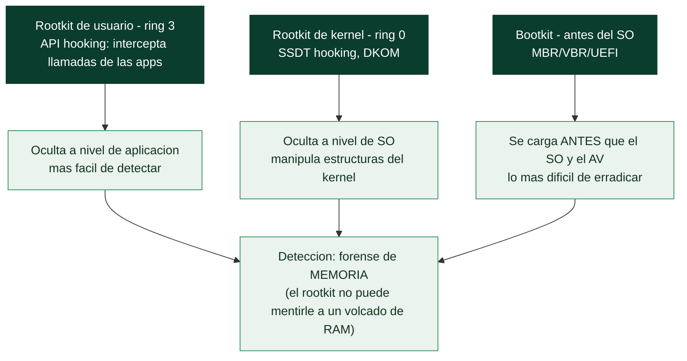

# Clase 151 — Rootkits y bootkits

> Parte: **6 — Análisis de malware** · Fuente: *The Art of Memory Forensics* (Ligh et al.) y *Windows Internals*
> ⏱️ Duración estimada: **130 min** · Nivel: **Experto**

---

## 🎯 Objetivo

Estudiar el malware que busca el sigilo máximo: rootkits (usuario y kernel) y bootkits que se cargan antes del sistema operativo. El alumno aprenderá las técnicas de ocultación (hooking, DKOM, filtros), por qué el análisis de memoria es imprescindible para detectarlos, y cómo el arranque seguro y las protecciones modernas cambian el panorama.

## 📚 Resultados de aprendizaje

Al finalizar, el alumno podrá:

1. **Distinguir** rootkits de usuario, de kernel y bootkits por su nivel de privilegio.
2. **Explicar** técnicas de ocultación: hooking (IAT/inline/SSDT), DKOM y filtros.
3. **Detectar** procesos, DLLs y conexiones ocultas con forense de memoria.
4. **Describir** el arranque (MBR/UEFI) y cómo un bootkit lo subvierte.
5. **Valorar** el papel de Secure Boot, PatchGuard y DSE como defensas.

## 🗺️ Temas

| # | Tema | Por qué importa |
|---|------|-----------------|
| 1 | Anillos de privilegio y superficie kernel | Define el poder del rootkit |
| 2 | Rootkits de usuario (API hooking) | Ocultación básica en user-land |
| 3 | Rootkits de kernel (SSDT, DKOM) | Ocultan a nivel del propio SO |
| 4 | Bootkits (MBR/VBR/UEFI) | Persisten antes del SO |
| 5 | Forense de memoria para detección | Los rootkits mienten al SO en vivo |
| 6 | Defensas: Secure Boot, PatchGuard, DSE, HVCI | Elevan la barrera |
| 7 | Firma de drivers y BYOVD | Vector actual de kernel |

## 🧠 Explicación en profundidad

### Malware que se esconde manipulando el propio sistema

Un **rootkit** es malware cuyo propósito primario es la **ocultación**: modifica el sistema operativo
para que **no pueda ver** al malware —sus procesos, ficheros, claves de registro y conexiones se
vuelven invisibles a las herramientas normales—. El nombre viene de "root" (privilegio máximo) más
"kit". Su gravedad está en que compromete la **confianza en el propio sistema**: si el SO miente sobre
qué procesos existen, ninguna herramienta que dependa del SO es fiable. La profundidad a la que opera
un rootkit —espacio de usuario, kernel, o antes del arranque— determina lo difícil que es de detectar y
de erradicar, y conecta directamente con la explotación de kernel de la [Clase 139](../../parte-5-explotacion-de-sistemas-y-binarios/139-kernel-exploitation-introduccion/README.md).

### De usuario a kernel: la profundidad importa

Los **rootkits de usuario** (ring 3) operan mediante **API hooking**: interceptan las llamadas que las
aplicaciones hacen al sistema (por ejemplo, la función que lista procesos) y **filtran los resultados**
para ocultar lo suyo —cuando el Administrador de tareas pide la lista de procesos, el rootkit borra su
proceso de la respuesta—. Son los más fáciles de escribir y de detectar, porque operan al mismo nivel
que las herramientas de análisis. Los **rootkits de kernel** (ring 0) son mucho más potentes y
peligrosos: al ejecutarse en el núcleo, manipulan las **estructuras internas del sistema operativo**. El
**SSDT hooking** (*System Service Descriptor Table*) intercepta las llamadas al sistema en su raíz; el
**DKOM** (*Direct Kernel Object Manipulation*) va más lejos: **modifica directamente las estructuras de
datos del kernel** —por ejemplo, desenlaza el proceso del malware de la lista doblemente enlazada de
procesos que el kernel mantiene, de modo que **el propio kernel deja de "conocer" el proceso** aunque
siga ejecutándose—. Contra un rootkit de kernel, ninguna herramienta que corra sobre ese kernel es de
fiar.

### Bootkits: cargarse antes que el sistema operativo

Los **bootkits** llevan la idea al extremo temporal: se cargan **antes que el sistema operativo**,
durante el arranque, lo que les da control **sobre el propio SO desde el primer instante** y les permite
sobrevivir a reinstalaciones del sistema. Los clásicos infectan el **MBR** (*Master Boot Record*) o el
**VBR** (*Volume Boot Record*), el código que el firmware ejecuta para arrancar. Los modernos atacan el
**UEFI** (el firmware que reemplazó a la BIOS), instalándose en la propia placa —persistencia que
sobrevive incluso a formatear el disco, la más difícil de erradicar que existe—. Un bootkit que se carga
antes que el antivirus puede desactivarlo o esconderse de él por completo, porque ya estaba ahí cuando el
AV arrancó.

### Detección por memoria y las defensas modernas

La clave para **detectar** rootkits desmonta su propia estrategia: como el rootkit manipula el SO en
ejecución, **no puede mentirle a un volcado de memoria** tomado desde fuera. La **forense de memoria**
con Volatility ([Clase 148](148-analisis-de-comportamiento/README.md)) compara la lista "oficial" de
procesos con la que se obtiene recorriendo las estructuras del kernel directamente, y las
**discrepancias delatan** lo que el rootkit oculta (un proceso desenlazado por DKOM aparece al recorrer
la memoria aunque el kernel no lo liste). Del lado de las **defensas**, Windows ha construido una pila
que hace mucho más difícil el rootkit de kernel moderno: **Secure Boot** (el firmware solo arranca código
firmado, contra bootkits), **PatchGuard/KPP** (impide modificar estructuras críticas del kernel, contra
SSDT hooking y DKOM), **DSE** (*Driver Signature Enforcement*, el kernel solo carga drivers firmados) y
**HVCI** (*Hypervisor-protected Code Integrity*, usa virtualización para proteger el kernel de sí mismo).
Estas defensas empujaron a los atacantes hacia una técnica característica: el **BYOVD** (*Bring Your Own
Vulnerable Driver*), que consiste en **cargar un driver legítimo pero vulnerable** —firmado, así que DSE
lo acepta— y **explotar su vulnerabilidad** para ejecutar código en el kernel, sorteando la firma. El
BYOVD es hoy la vía principal hacia el kernel para el malware, y detectar la carga de drivers vulnerables
conocidos es una defensa clave. La lección de la clase es que el rootkit es la aplicación defensiva de la
explotación de kernel (Parte 5): el mismo dominio, ahora para ocultarse en lugar de para escalar, y con
las mismas defensas de kernel como campo de batalla.

## 📖 Definiciones y características

- **Rootkit:** malware que oculta su presencia al sistema. Característica clave: **sigilo estructural**.
- **DKOM (Direct Kernel Object Manipulation):** altera estructuras del kernel (p. ej. desenlaza un `EPROCESS`). Característica clave: **oculta procesos** sin hooks.
- **SSDT hooking:** intercepta llamadas del sistema. Característica clave: **control de syscalls**.
- **Bootkit:** infecta MBR/VBR/UEFI para cargarse antes del SO. Característica clave: **persistencia pre-SO**.
- **BYOVD (Bring Your Own Vulnerable Driver):** cargar un driver firmado vulnerable para entrar al kernel. Característica clave: **evade la firma obligatoria**.

## 📔 Glosario

| Término | Definición concisa |
|---------|--------------------|
| Rootkit | Malware cuyo fin es ocultarse manipulando el SO |
| API hooking | Interceptar llamadas para filtrar los resultados |
| Rootkit de usuario | Opera en ring 3; más fácil de detectar |
| Rootkit de kernel | Opera en ring 0; manipula el núcleo |
| SSDT hooking | Interceptar las llamadas al sistema en su raíz |
| DKOM | Modificar directamente las estructuras del kernel |
| Proceso desenlazado | Sacado de la lista del kernel; sigue ejecutándose |
| Bootkit | Se carga antes que el SO durante el arranque |
| MBR / VBR | Código de arranque que infectan los bootkits clásicos |
| UEFI bootkit | Se instala en el firmware; sobrevive al formateo |
| Forense de memoria | Detecta rootkits comparando listas del kernel |
| Secure Boot | El firmware solo arranca código firmado |
| PatchGuard | Impide modificar estructuras críticas del kernel |
| DSE / HVCI | Firma de drivers / integridad de código por hipervisor |
| BYOVD | Cargar un driver vulnerable firmado y explotarlo |

## 🧰 Herramientas y preparación

- **Volatility 3** (`malfind`, `ssdt`, `driverscan`, `psxview`, `netscan`).
- **GMER/RootkitRevealer** (conceptual) y comparación cross-view.
- **PE-bear/Ghidra** para drivers `.sys`.
- Referencias de arranque: **UEFI spec**, documentación de Secure Boot.

> ⚠️ **Nota ética y de seguridad:** los rootkits de kernel pueden dañar el SO invitado. Trabaja en la VM aislada con snapshot y asume que la VM quedará inservible tras la ejecución. Nunca cargues drivers maliciosos en un host real. El estudio es para **detección y defensa**.

## 🧪 Laboratorio guiado

1. Restaura `base-clean`. Captura un volcado de memoria de referencia (limpio) para comparar.
2. Detona una muestra con capacidad de ocultación (o usa un caso de estudio con memoria provista) y captura RAM.
3. Con Volatility, ejecuta `windows.psxview`: compara las distintas fuentes de procesos; un proceso presente en una lista y ausente en otra sugiere **DKOM**.
4. Revisa `windows.ssdt` para entradas que no apunten a `ntoskrnl`/`win32k` (posible **SSDT hook**).
5. Usa `windows.driverscan`/`modules` para hallar drivers no firmados o sospechosos; extrae el `.sys` y analízalo en Ghidra.
6. Con `windows.netscan`, busca conexiones que las herramientas en vivo no mostraban (ocultación de red).
7. Si es un bootkit, examina el MBR/VBR o la partición EFI en busca de modificaciones; documenta el vector de arranque.
8. Redacta hallazgos: técnica de ocultación, evidencia cross-view y cómo un EDR/forense lo detectaría. Descarta la VM.

## ✍️ Ejercicios

1. Explica la diferencia práctica entre un hook inline y DKOM.
2. Interpreta un `psxview` con discrepancias y concluye qué está oculto.
3. Analiza un driver `.sys` y localiza su rutina de ocultación.
4. Describe cómo Secure Boot frena los bootkits UEFI.
5. Explica BYOVD y por qué sigue funcionando pese a la firma obligatoria.
6. Diseña una detección de carga de drivers vulnerables conocidos.

## 📝 Reto verificable

Entrega un **informe de rootkit** identificando la técnica de ocultación con evidencia de memoria (cross-view/SSDT/driverscan), el artefacto oculto (proceso/conexión/driver) y una recomendación de detección.
**Criterio de aceptación:** el informe muestra al menos una discrepancia cross-view o un hook/driver anómalo con la salida de Volatility que lo respalda, y explica por qué el análisis en disco/vivo no bastaba.

## ⚠️ Errores comunes

| Síntoma / mensaje | Causa y cómo arreglar |
|-------------------|------------------------|
| Herramientas en vivo "no ven nada" | El rootkit las engaña; usa forense de memoria offline |
| VM se cuelga al cargar el driver | Comportamiento esperado en kernel; trabaja con snapshot |
| `ssdt` limpio pero algo se oculta | Puede ser DKOM o hooks inline; combina varias vistas |
| Driver sospechoso pero firmado | Posible BYOVD; verifica CVE del driver, no solo la firma |
| No hallo el bootkit | Revisa MBR/VBR y partición EFI, no solo el sistema de archivos |

## ❓ Preguntas frecuentes

**❓ ¿Por qué memoria y no disco?** Porque el rootkit manipula el SO en ejecución; la memoria conserva la evidencia real que las APIs comprometidas ocultan.

**❓ ¿Siguen siendo relevantes los bootkits?** Sí, especialmente UEFI. Secure Boot ayuda, pero han aparecido bootkits que lo evaden con vulnerabilidades del firmware.

**❓ ¿Cómo entran hoy al kernel?** Con frecuencia vía BYOVD: cargan un driver firmado pero vulnerable para obtener ejecución en kernel sin necesitar su propio driver firmado.

## 🔗 Referencias

- Ligh et al., *The Art of Memory Forensics*.
- Yosifovich et al., *Windows Internals* (arranque y kernel).
- Volatility 3. <https://github.com/volatilityfoundation/volatility3>
- MITRE ATT&CK — Rootkit (T1014). <https://attack.mitre.org/techniques/T1014/>

## 📥 Material descargable

- 📄 [Guía en PDF](./clase-151-guia.pdf) — versión imprimible de esta clase.
- 🎞️ [Presentación (PPTX)](./clase-151-presentacion.pptx) — deck para proyectar en clase.

## ⬅️ Clase anterior

[Clase 150 — Ransomware: anatomía y análisis](../150-ransomware-anatomia-y-analisis/README.md)

## ➡️ Siguiente clase

[Clase 152 — Análisis de documentos maliciosos: macros y PDF](../152-analisis-de-documentos-maliciosos-macros-y-pdf/README.md)
