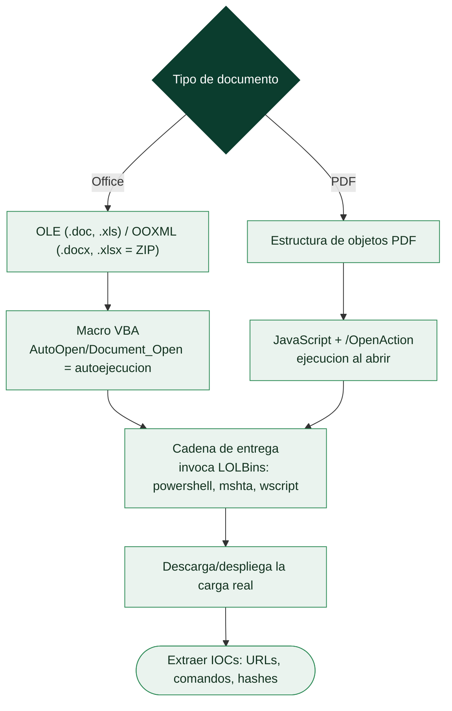

# Clase 152 — Análisis de documentos maliciosos: macros y PDF

> Parte: **6 — Análisis de malware** · Fuente: *Learning Malware Analysis* (Monnappa) y recursos de Didier Stevens
> ⏱️ Duración estimada: **110 min** · Nivel: **Intermedio**

---

## 🎯 Objetivo

Analizar el vector de entrega más común en phishing: documentos ofimáticos con macros VBA y PDFs maliciosos. El alumno aprenderá a extraer y desofuscar macros, seguir la cadena de descarga/ejecución, examinar la estructura interna de un PDF y encontrar el JavaScript o los objetos que detonan la infección, todo sin abrir el documento en su aplicación real.

## 📚 Resultados de aprendizaje

Al finalizar, el alumno podrá:

1. **Explorar** la estructura OLE/OOXML de documentos Office sin abrirlos.
2. **Extraer y desofuscar** macros VBA y reconstruir la cadena de ejecución.
3. **Analizar** un PDF: objetos, streams, JavaScript y acciones automáticas.
4. **Reconocer** patrones de entrega (LOLBins, PowerShell, mshta).
5. **Extraer** IOCs (URLs, comandos, payloads) de forma segura.

## 🗺️ Temas

| # | Tema | Por qué importa |
|---|------|-----------------|
| 1 | Formatos OLE vs OOXML | Determina la herramienta de extracción |
| 2 | Macros VBA y autoejecución | `AutoOpen`/`Document_Open` detonan |
| 3 | Desofuscación de VBA | El código real está escondido |
| 4 | Estructura de PDF | Objetos, streams, xref |
| 5 | JavaScript y acciones en PDF | `/OpenAction`, `/JS`, `/Launch` |
| 6 | Cadena de entrega (LOLBins) | mshta, powershell, wscript |
| 7 | Extracción de IOCs | Alimenta detección y bloqueo |

## 🧠 Explicación en profundidad

### El vector de entrada favorito: un documento que parece inofensivo

Los **documentos maliciosos** (*maldocs*) son uno de los vectores de acceso inicial más comunes, porque
explotan la confianza: un Word, un Excel o un PDF parecen datos inertes, no programas, y por eso la gente
los abre sin recelo. Pero estos formatos pueden **contener y ejecutar código** —macros, JavaScript,
acciones automáticas—, y un maldoc bien hecho convierte "abrir un adjunto" en "ejecutar malware". El
análisis de maldocs tiene su propio instrumental porque no se analiza un ejecutable, sino un formato de
documento del que hay que **extraer el código embebido** para estudiarlo. Casi siempre el documento no
es el malware final: es un **cargador** (la primera etapa de la cadena de entrega) que descarga o
despliega la carga real.

### Office: OLE, OOXML y las macros VBA

Los documentos de Office vienen en dos formatos que hay que distinguir. El antiguo **OLE** (*Object
Linking and Embedding*, los `.doc`/`.xls`) es un formato binario compuesto, un "sistema de ficheros
dentro del fichero". El moderno **OOXML** (`.docx`/`.xlsx`) es en realidad un **archivo ZIP** que
contiene XML y otros recursos —descomprimirlo revela su estructura—. El código malicioso en Office son
casi siempre las **macros VBA** (*Visual Basic for Applications*), y la clave es la **autoejecución**:
macros con nombres especiales como **`AutoOpen`** o **`Document_Open`** se ejecutan **automáticamente al
abrir el documento**, sin más interacción que "habilitar contenido". La herramienta de referencia es
**oletools** (`olevba`), que **extrae el código VBA** de un documento Office y señala las construcciones
sospechosas (autoejecución, ofuscación, llamadas a shell). El VBA extraído suele estar **ofuscado**
—cadenas troceadas y recombinadas, nombres sin sentido, codificación— y **desofuscarlo** (a mano o con
herramientas como ViperMonkey que lo emulan) revela lo que hace: casi siempre construir y ejecutar un
comando que invoca la siguiente etapa.

### PDF: objetos, JavaScript y acciones

Los **PDF** tienen una estructura de **objetos** (un árbol de elementos: páginas, fuentes, streams) y
pueden contener **JavaScript** y **acciones automáticas**. El vector clásico es un objeto **`/OpenAction`**
que ejecuta **JavaScript al abrir** el documento, o acciones que lanzan un fichero embebido o una URL. El
JavaScript en PDF históricamente explotaba vulnerabilidades del lector (Adobe Reader), aunque los lectores
modernos lo restringen. Herramientas como **peepdf**, **pdf-parser** y **pdfid** (de Didier Stevens)
analizan la estructura, listan los objetos sospechosos (los que contienen JavaScript, acciones, ficheros
embebidos) y extraen el código para su análisis. Como en Office, el JavaScript suele estar ofuscado y hay
que desofuscarlo.

### La cadena de entrega, los LOLBins y la extracción de IOCs

El patrón que une a todos los maldocs es la **cadena de entrega** mediante **LOLBins** (*Living Off the
Land Binaries*, [Clase 159](159-fileless-malware-y-living-off-the-land/README.md)): en lugar de traer un
ejecutable (que el antivirus detectaría), el documento **invoca programas legítimos del sistema** para
hacer el trabajo sucio —`powershell.exe` para descargar y ejecutar la carga, `mshta.exe` para ejecutar un
HTA remoto, `wscript.exe`/`cscript.exe` para scripts, `certutil.exe` para descargar ficheros, `regsvr32`
para ejecutar código—. Estos binarios son de Microsoft, están firmados y son de confianza, así que su uso
levanta menos sospechas. Reconocer la invocación de un LOLBin en el VBA o el JavaScript desofuscado es el
momento en que se entiende qué hace el maldoc. El **producto del análisis** es la **extracción de IOCs**:
las URLs de descarga, los comandos ejecutados, los nombres de fichero, los hashes de las cargas —todo lo
necesario para detectar y bloquear la campaña—. La lección de la clase es que analizar un maldoc es
**extraer y desofuscar el código embebido** para reconstruir la cadena de entrega, y que el documento
casi nunca es el final: es la puerta por la que entra todo lo demás, lo que lo hace un objetivo prioritario
para la detección temprana.

## 📖 Definiciones y características

- **Macro VBA:** código embebido en Office. Característica clave: **autoejecución** con `AutoOpen`.
- **OLE (Compound File):** contenedor binario de Office clásico (.doc/.xls). Característica clave: **streams internos**.
- **OOXML:** formato ZIP+XML moderno (.docx/.xlsm). Característica clave: **descomprimible**.
- **/OpenAction:** acción que un PDF ejecuta al abrirse. Característica clave: **detonación automática**.
- **LOLBin:** binario legítimo abusado (mshta, powershell). Característica clave: **evasión** por confianza.

## 📔 Glosario

| Término | Definición concisa |
|---------|--------------------|
| Documento malicioso (maldoc) | Documento que contiene y ejecuta código |
| Cargador | Primera etapa que descarga o despliega la carga real |
| OLE | Formato binario compuesto de Office antiguo (.doc/.xls) |
| OOXML | Formato ZIP de Office moderno (.docx/.xlsx) |
| Macro VBA | Código embebido en documentos Office |
| AutoOpen / Document_Open | Macros que se ejecutan al abrir el documento |
| oletools / olevba | Herramientas que extraen el VBA |
| ViperMonkey | Emulador de VBA para desofuscar |
| Objeto PDF | Elemento del árbol de un PDF |
| /OpenAction | Acción que ejecuta código al abrir el PDF |
| peepdf / pdfid | Herramientas de análisis de PDF |
| LOLBin | Binario legítimo del sistema abusado por el malware |
| powershell / mshta / certutil | LOLBins comunes en cadenas de entrega |
| Cadena de entrega | Secuencia que lleva de abrir el doc a la carga final |
| Extracción de IOCs | URLs, comandos y hashes obtenidos del análisis |

## 🧰 Herramientas y preparación

- **oletools** (`olevba`, `oleid`, `oledump.py`) para Office.
- **peepdf**, **pdf-parser.py**, **pdfid.py** (Didier Stevens) para PDF.
- **CyberChef** para desofuscar cadenas.
- **REMnux** trae la mayoría preinstaladas.

> ⚠️ **Nota ética y de seguridad:** analiza los documentos con herramientas de línea de comandos **sin abrirlos** en Word/Adobe, y siempre en la VM aislada. Abrir el documento en su aplicación puede detonar la macro o el exploit. Trabaja solo con muestras autorizadas.

## 🧪 Laboratorio guiado

Documento Office con macros:

1. Identifica el tipo: `oleid documento.doc`. ¿Tiene macros?, ¿VBA?, ¿objetos embebidos?
2. Extrae y analiza la macro: `olevba documento.doc`. Localiza `AutoOpen`/`Document_Open` y marca las cadenas ofuscadas.
3. Desofusca: reconstruye concatenaciones, `Chr()`, base64 y XOR con CyberChef hasta obtener el comando real (típicamente un `powershell -enc ...`).
4. Decodifica el PowerShell (`-EncodedCommand` es base64 UTF-16LE) y extrae la URL de descarga y el payload de segunda etapa.

PDF malicioso:

5. Triaje: `pdfid.py doc.pdf` para contar `/JS`, `/OpenAction`, `/Launch`, `/EmbeddedFile`.
6. Extrae objetos: `pdf-parser.py --search JavaScript doc.pdf` y vuelca el stream del JS.
7. Analiza el JavaScript: identifica si descarga, lanza otro proceso o explota una vulnerabilidad del lector.
8. Consolida IOCs (URLs, comandos, hashes de payload) y mapea la cadena a ATT&CK (`T1566`, `T1059`).

## ✍️ Ejercicios

1. Explica la diferencia de análisis entre `.doc` (OLE) y `.docx/.xlsm` (OOXML).
2. Desofusca una macro que usa `Chr()` + concatenación.
3. Decodifica un `powershell -enc` y extrae la URL.
4. Interpreta la salida de `pdfid.py` y prioriza qué objeto revisar.
5. Extrae y explica un `/OpenAction` con `/Launch`.
6. Redacta 5 IOCs a partir de un documento analizado.

## 📝 Reto verificable

Analiza un documento malicioso (Office o PDF) y entrega la **cadena de ejecución reconstruida** desde la apertura hasta el payload de segunda etapa, con la macro/JS desofuscado y los IOCs.
**Criterio de aceptación:** presentas el comando final desofuscado (p. ej. el PowerShell decodificado) y al menos una URL/IOC de la segunda etapa, sin haber abierto nunca el documento en su aplicación.

## ⚠️ Errores comunes

| Síntoma / mensaje | Causa y cómo arreglar |
|-------------------|------------------------|
| Abrir el doc en Word para "verlo" | Detona la macro; usa solo oletools |
| `olevba` sin resultados | Macro en objeto embebido; revisa `oledump.py` por stream |
| PowerShell ilegible | Está en base64 UTF-16LE; decodifica con CyberChef |
| PDF "sin JS" pero sospechoso | Revisa `/Launch`, `/EmbeddedFile` y URIs, no solo `/JS` |
| Perder la segunda etapa | La URL responde en INetSim; captura el payload en el lab |

## ❓ Preguntas frecuentes

**❓ ¿Por qué no abrir el documento?** Porque la macro o el exploit se ejecutan al abrir. Las herramientas de línea de comandos extraen el contenido sin detonarlo.

**❓ ¿Siguen usándose macros?** Menos desde que Office bloquea macros de Internet por defecto, pero persisten junto a otros vectores (HTML smuggling, LNK, contenedores).

**❓ ¿Cómo decodifico un PowerShell ofuscado?** Empieza por `-EncodedCommand` (base64 UTF-16LE) y luego deshaz capas (gzip, replace, format) con CyberChef.

## 🔗 Referencias

- Monnappa K. A., *Learning Malware Analysis*, cap. sobre documentos.
- oletools. <https://github.com/decalage2/oletools>
- Didier Stevens — PDF tools. <https://blog.didierstevens.com/programs/pdf-tools/>
- MITRE ATT&CK — Phishing (T1566). <https://attack.mitre.org/techniques/T1566/>

## 📥 Material descargable

- 📄 [Guía en PDF](./clase-152-guia.pdf) — versión imprimible de esta clase.
- 🎞️ [Presentación (PPTX)](./clase-152-presentacion.pptx) — deck para proyectar en clase.

## ⬅️ Clase anterior

[Clase 151 — Rootkits y bootkits](../151-rootkits-y-bootkits/README.md)

## ➡️ Siguiente clase

[Clase 153 — Análisis de malware en scripts: PowerShell y JavaScript](../153-analisis-de-malware-en-scripts-powershell-y-javascript/README.md)
