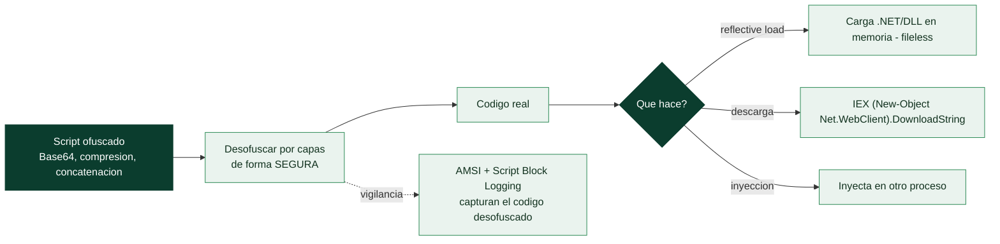

# Clase 153 — Análisis de malware en scripts: PowerShell y JavaScript

> Parte: **6 — Análisis de malware** · Fuente: *Learning Malware Analysis* (Monnappa) y MITRE ATT&CK
> ⏱️ Duración estimada: **110 min** · Nivel: **Intermedio**

---

## 🎯 Objetivo

Desofuscar y entender malware basado en scripts, hoy dominante en las primeras etapas de intrusión: PowerShell, JScript/JavaScript (WSH), HTA y VBScript. El alumno aprenderá a deshacer capas de ofuscación, reconocer patrones de descarga e inyección en memoria, y usar el logging del propio sistema para reconstruir lo que el script hizo.

## 📚 Resultados de aprendizaje

Al finalizar, el alumno podrá:

1. **Reconocer** patrones de ofuscación en PowerShell y JScript.
2. **Desofuscar** manual y automáticamente hasta el código legible.
3. **Identificar** descarga, reflective loading e inyección en memoria.
4. **Aprovechar** ScriptBlock Logging, AMSI y ETW para el análisis.
5. **Extraer** IOCs y mapear a técnicas de ejecución de ATT&CK.

## 🗺️ Temas

| # | Tema | Por qué importa |
|---|------|-----------------|
| 1 | Por qué scripts: LOLBins y evasión | Sin binario en disco, menos detección |
| 2 | Ofuscación en PowerShell | Base64, formato, alias, `IEX` |
| 3 | Reflective loading e inyección | Ejecuta payloads en memoria |
| 4 | JScript/HTA/VBScript (WSH) | Vectores de entrega clásicos |
| 5 | Logging y AMSI | Defensas que ayudan al analista |
| 6 | Desofuscación segura | Sin ejecutar el código malicioso |
| 7 | Extracción de IOCs y TTPs | Detección posterior |

## 🧠 Explicación en profundidad

### Por qué los atacantes aman los scripts

Una parte enorme del malware moderno **no es un ejecutable compilado**, sino un **script** —PowerShell,
JavaScript, VBScript—. La razón es estratégica: los scripts usan **intérpretes que ya vienen en el
sistema** (`powershell.exe`, `wscript.exe`, `mshta.exe`), firmados por Microsoft y de confianza, así que
ejecutar un script no requiere traer un binario que el antivirus detectaría —es *living off the land*
([Clase 159](../159-fileless-malware-y-living-off-the-land/README.md))—. Además, los scripts se pueden ejecutar
**en memoria sin tocar el disco** (fileless), son fáciles de ofuscar y de modificar, y a menudo son la
etapa que un maldoc (clase 152) invoca. Analizar malware en scripts es distinto de analizar un binario:
no hay que desensamblar, pero sí **desofuscar** capas y capas de código deliberadamente ilegible.

### PowerShell: la navaja suiza ofensiva

**PowerShell** es la herramienta de scripting favorita del malware en Windows por su potencia: acceso
completo a la API de Windows y a .NET, capacidad de descargar y ejecutar código en memoria, y ubicuidad.
El malware en PowerShell está casi siempre **fuertemente ofuscado**, y reconocer las técnicas es la mitad
del análisis: **codificación Base64** (el clásico `powershell -EncodedCommand`, que oculta el comando
real), **compresión** (el script se descomprime en memoria), **concatenación y reordenación de cadenas**,
**sustitución de caracteres**, y el uso de **alias y sintaxis crípticas**. La capacidad más peligrosa es
el **reflective loading**: PowerShell puede **cargar un ensamblado .NET o un DLL directamente en memoria**
(sin escribirlo en disco) y ejecutarlo, o **inyectar código en otro proceso** —todo sin dejar un fichero,
lo que evade las defensas que se fijan en el disco—.

### JScript, HTA y VBScript: el Windows Script Host

Más allá de PowerShell, Windows ejecuta otros scripts a través del **WSH** (*Windows Script Host*):
**JScript** (la versión Microsoft de JavaScript) y **VBScript**, que corren con `wscript.exe`/`cscript.exe`,
y los **HTA** (*HTML Application*), ficheros HTML con scripts que `mshta.exe` ejecuta **con plenos
privilegios** (sin las restricciones de un navegador) —un vector muy usado porque un `.hta` parece una
página web pero puede hacer cualquier cosa—. Todos comparten con PowerShell la lógica: intérprete de
confianza, ofuscación pesada, y a menudo son la etapa intermedia que descarga la carga final. El análisis
es el mismo ejercicio de **desofuscación**.

### Desofuscar con seguridad, AMSI y la extracción de TTPs

El reto central es **desofuscar sin ejecutar** el código malicioso. La tentación de "simplemente
ejecutarlo para ver qué hace" es peligrosa: hay que hacerlo en el laboratorio aislado (clase 142) o, mejor,
desofuscar **estáticamente**. La técnica clave es reemplazar el comando de ejecución final (`IEX`
—*Invoke-Expression*—, `eval`) por uno de **impresión** (`Write-Host`, `console.log`), de modo que el
script, en lugar de ejecutar la siguiente capa, la **imprima** —así se pela la ofuscación capa a capa de
forma segura—. Del lado de la **defensa y el logging**, Microsoft añadió instrumentación clave: **AMSI**
(*Antimalware Scan Interface*) permite al antivirus **inspeccionar el script ya desofuscado** justo antes
de ejecutarse (el malware ve derrotada su ofuscación en el punto de ejecución, y por eso muchas familias
intentan **deshabilitar AMSI** —un comportamiento que en sí es un IOC—), y el **Script Block Logging** de
PowerShell **registra el código desofuscado** que se ejecuta, dándole al analista y al defensor el script
real aunque llegara ofuscado. El producto del análisis, como siempre, es la **extracción de IOCs y TTPs**:
las URLs, los comandos, las técnicas ATT&CK usadas. La lección de la clase es que el malware en scripts
cambia el trabajo de "desensamblar código máquina" a "desofuscar capas de script", pero el objetivo es el
mismo —entender qué hace y extraer los indicadores— y que la instrumentación moderna (AMSI, logging) le ha
quitado al scripting parte de su ventaja de invisibilidad.

## 📖 Definiciones y características

- **IEX (Invoke-Expression):** ejecuta una cadena como código. Característica clave: **detonador** de payloads ofuscados.
- **Reflective loading:** cargar un ensamblado/PE en memoria sin tocar disco. Característica clave: **fileless**.
- **AMSI:** interfaz antimalware que inspecciona scripts en runtime. Característica clave: **desofusca para el defensor**.
- **ScriptBlock Logging:** registro de bloques de PowerShell ejecutados. Característica clave: **forense de scripts**.
- **HTA:** aplicación HTML ejecutada por mshta. Característica clave: **entrega con confianza del SO**.

## 📔 Glosario

| Término | Definición concisa |
|---------|--------------------|
| Malware en scripts | Malware escrito en PowerShell, JScript, VBScript |
| Intérprete de confianza | powershell/wscript/mshta, firmados por Microsoft |
| PowerShell ofensivo | Acceso a la API y a .NET; carga en memoria |
| EncodedCommand | Comando PowerShell codificado en Base64 |
| Reflective loading | Cargar un ensamblado en memoria sin tocar disco |
| IEX (Invoke-Expression) | Ejecuta una cadena como código |
| WSH | Windows Script Host; ejecuta JScript y VBScript |
| HTA | HTML Application ejecutada por mshta con plenos privilegios |
| Desofuscación segura | Imprimir en vez de ejecutar cada capa |
| Pelado por capas | Revelar la ofuscación una capa cada vez |
| AMSI | Interfaz que inspecciona el script desofuscado |
| Deshabilitar AMSI | Intento del malware de cegar la inspección; es un IOC |
| Script Block Logging | Registra el código PowerShell desofuscado |
| TTP | Tácticas, técnicas y procedimientos del atacante |

## 🧰 Herramientas y preparación

- **CyberChef** y **PowerShell ISE/VSCode** para desofuscar (sin `Invoke`).
- **AMSIScriptContentRetrieval**, **PSDecode**, **box-js** (JScript), **js-beautify**.
- Logs: **Event Viewer** (Microsoft-Windows-PowerShell/Operational), **Sysmon**.
- **REMnux** para las utilidades de JavaScript.

> ⚠️ **Nota ética y de seguridad:** desofusca **sin ejecutar** el código. Sustituye `IEX`/`eval` por impresión en pantalla y trabaja en la VM aislada. Ejecutar el script para "ver qué hace" puede detonar la infección real; usa logging y análisis estático primero.

## 🧪 Laboratorio guiado

PowerShell ofuscado:

1. Identifica las capas: `-enc` (base64 UTF-16LE), `-join`, `[char]`, `` `` (backticks), `Replace`, `Format`.
2. Decodifica el base64 con CyberChef (`From Base64` + `Decode text UTF-16LE`).
3. Sustituye el `IEX` final por `Write-Output` para revelar la siguiente capa **sin ejecutarla**. Repite hasta el código limpio.
4. Localiza la lógica real: `Net.WebClient.DownloadString`, `Reflection.Assembly`, shellcode en `[Byte[]]`, `VirtualAlloc`/`CreateThread` (inyección).
5. Correlaciona con **ScriptBlock Logging**: activa el registro, y en una ejecución controlada previa (o en logs provistos) recupera el bloque desofuscado que Windows ya registró.

JScript/HTA:

6. Beautifica con `js-beautify` y analiza con `box-js` (que emula WSH y registra las llamadas) para capturar URLs y comandos sin ejecutarlo de verdad.
7. Extrae los IOCs (URLs, comandos, hashes) y mapea a ATT&CK (`T1059.001` PowerShell, `T1059.007` JavaScript).

## ✍️ Ejercicios

1. Desofusca un one-liner de PowerShell con 3 capas y documenta cada una.
2. Explica cómo AMSI y ScriptBlock Logging ayudan al analista.
3. Reconoce un patrón de inyección de shellcode en PowerShell.
4. Usa `box-js` sobre un JScript y extrae la URL de segunda etapa.
5. Convierte un `IEX` en `Write-Output` y justifica por qué es más seguro.
6. Redacta una detección basada en el Event ID 4104.

## 📝 Reto verificable

Desofusca un script malicioso (PowerShell o JScript) hasta su forma legible y entrega la **cadena de ejecución** con la URL/payload de segunda etapa y los IOCs, sin haberlo ejecutado.
**Criterio de aceptación:** muestras el código final desofuscado y explicas cada capa de ofuscación deshecha, con al menos un IOC (URL/comando) verificado en el lab vía INetSim.

## ⚠️ Errores comunes

| Síntoma / mensaje | Causa y cómo arreglar |
|-------------------|------------------------|
| Ejecutar el script "para ver" | Detona la infección; desofusca estáticamente o con box-js |
| Base64 da basura | Es UTF-16LE; ajusta el decode en CyberChef |
| Sin ScriptBlock logs | No estaba activado; habilítalo por GPO antes de detonar en lab |
| box-js no resuelve la URL | Emulación incompleta; combina con lectura manual |
| Perder capas de ofuscación | Ve capa por capa reemplazando el ejecutor por print |

## ❓ Preguntas frecuentes

**❓ ¿Por qué tanto malware en PowerShell?** Está firmado y preinstalado (LOLBin), ejecuta en memoria y ofusca fácilmente, reduciendo la detección basada en archivos.

**❓ ¿AMSI lo detiene todo?** No; existen técnicas de bypass. Aun así, AMSI y el ScriptBlock Logging entregan al defensor el contenido desofuscado, muy útil para el análisis.

**❓ ¿Puedo confiar en box-js?** Es una gran ayuda para JScript, pero emula un subconjunto; complementa siempre con lectura manual del código.

## 🔗 Referencias

- Monnappa K. A., *Learning Malware Analysis*.
- Microsoft — About Script Block Logging. <https://learn.microsoft.com/powershell/module/microsoft.powershell.core/about/about_logging_windows>
- box-js. <https://github.com/CapacitorSet/box-js>
- MITRE ATT&CK — Command and Scripting Interpreter (T1059). <https://attack.mitre.org/techniques/T1059/>

## 📥 Material descargable

- 📄 [Guía en PDF](./clase-153-guia.pdf) — versión imprimible de esta clase.
- 🎞️ [Presentación (PPTX)](./clase-153-presentacion.pptx) — deck para proyectar en clase.

## ⬅️ Clase anterior

[Clase 152 — Análisis de documentos maliciosos: macros y PDF](../152-analisis-de-documentos-maliciosos-macros-y-pdf/README.md)

## ➡️ Siguiente clase

[Clase 154 — Malware en Linux](../154-malware-en-linux/README.md)
