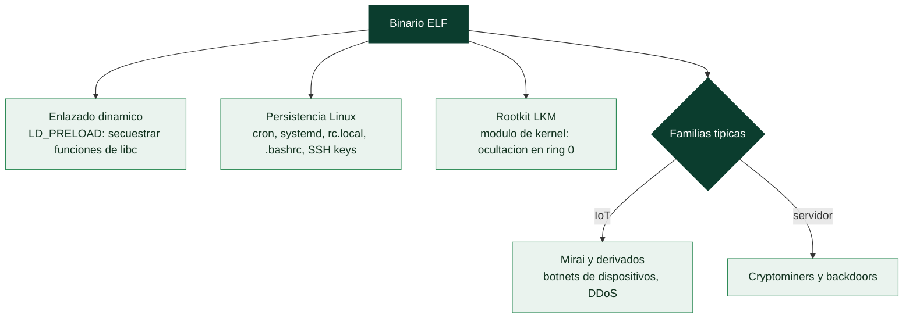

# Clase 154 — Malware en Linux

> Parte: **6 — Análisis de malware** · Fuente: *Learning Malware Analysis* (Monnappa) y *Practical Binary Analysis*
> ⏱️ Duración estimada: **120 min** · Nivel: **Avanzado**

---

## 🎯 Objetivo

Adaptar el análisis al ecosistema Linux, cada vez más atacado por su presencia en servidores, IoT y contenedores. El alumno estudiará el formato ELF, las técnicas de persistencia y ocultación en Linux (cron, systemd, LD_PRELOAD, rootkits LKM), las familias típicas (botnets IoT, mineros, backdoors) y las herramientas de análisis estático y dinámico en este entorno.

## 📚 Resultados de aprendizaje

Al finalizar, el alumno podrá:

1. **Analizar** binarios ELF: cabeceras, secciones, símbolos e imports dinámicos.
2. **Identificar** persistencia en Linux (cron, systemd, rc, perfiles de shell).
3. **Reconocer** ocultación por `LD_PRELOAD` y rootkits de módulo del kernel (LKM).
4. **Trazar** el comportamiento con `strace`, `ltrace` y análisis de red.
5. **Caracterizar** familias comunes: botnets IoT, cryptominers, backdoors.

## 🗺️ Temas

| # | Tema | Por qué importa |
|---|------|-----------------|
| 1 | Formato ELF | Equivalente Linux del PE |
| 2 | Enlazado dinámico y `LD_PRELOAD` | Vector de hooking en user-land |
| 3 | Persistencia en Linux | cron, systemd, rc.local, bashrc |
| 4 | Rootkits LKM | Ocultación en kernel |
| 5 | Familias IoT (Mirai y derivados) | Amenaza dominante en Linux |
| 6 | Cryptominers y backdoors | Objetivos frecuentes en servidores |
| 7 | Herramientas: strace/ltrace/Ghidra | Triaje dinámico y estático |

## 🧠 Explicación en profundidad

### El malware no es solo un problema de Windows

Aunque Windows domina el malware de escritorio, **Linux es el objetivo dominante donde de verdad
importa**: los **servidores** (web, bases de datos, la nube) y los **dispositivos IoT** corren Linux, y
son blancos de altísimo valor. El malware de Linux tiene características propias que exigen un
instrumental adaptado: usa el formato **ELF** en lugar de PE, se apoya en mecanismos de Linux para
persistir y ocultarse, y abarca desde sofisticados backdoors de servidor hasta las gigantescas botnets
de IoT. Analizarlo aplica los principios de la parte con las particularidades del ecosistema Linux.

### ELF, LD_PRELOAD y la persistencia en Linux

El formato **ELF** ([Clase 130](../../parte-5-explotacion-de-sistemas-y-binarios/130-ingenieria-inversa-introduccion/README.md)) es el punto de partida: se analiza con las mismas
herramientas de RE (Ghidra, radare2) y de observación dinámica de Linux (`strace` para syscalls,
`ltrace` para funciones de librería, [Clase 134](../../parte-5-explotacion-de-sistemas-y-binarios/134-analisis-dinamico-y-debugging-de-binarios/README.md)). Una técnica de ocultación específica de Linux
es el abuso de **`LD_PRELOAD`**: esta variable de entorno hace que el enlazador dinámico cargue una
librería **antes** que las demás, lo que permite a un rootkit de usuario **secuestrar funciones de la
libc** —redefinir `readdir` para ocultar ficheros, `open` para bloquear el acceso a los suyos— sin tocar
el kernel; es el equivalente Linux del API hooking. La **persistencia en Linux** tiene su propio
catálogo, todo detectable: entradas en **cron**, servicios de **systemd**, líneas en `rc.local` o en los
ficheros de perfil del shell (`.bashrc`, `.profile`), y —muy usado— **claves SSH autorizadas** añadidas a
`~/.ssh/authorized_keys` (acceso remoto sin contraseña, difícil de notar, [Clase 082](../../parte-3-hacking-etico-y-pentesting-metodologia/082-persistencia-en-sistemas-comprometidos/README.md)).

### Rootkits LKM: el kernel de Linux como campo de batalla

Los **rootkits de kernel** en Linux se implementan como **LKM** (*Loadable Kernel Modules*): módulos que
se cargan en el kernel en ejecución y, desde ring 0, ocultan procesos, ficheros y conexiones manipulando
las estructuras del kernel —el equivalente Linux del DKOM/SSDT hooking de la clase 151—. Un LKM malicioso
puede interceptar la tabla de syscalls, ocultarse a sí mismo de la lista de módulos, y dar puertas
traseras con privilegios de root. Como en Windows, la detección fiable pasa por la **forense de memoria**
(Volatility tiene perfiles de Linux) y por herramientas que comparan lo que el kernel reporta con lo que
se observa directamente. Las defensas modernas (firma de módulos, *lockdown* del kernel) elevan el listón,
pero el kernel de Linux sigue siendo un objetivo.

### Las familias que definen el malware de Linux

Dos categorías dominan. Las **botnets de IoT**, con **Mirai** como arquetipo: Mirai infecta dispositivos
IoT (cámaras, routers) probando **credenciales por defecto** (admin/admin y similares), los enrola en una
botnet masiva, y los usa para lanzar **ataques DDoS** devastadores. Su código fuente se filtró en 2016, lo
que generó **decenas de derivados** —analizar un binario de la familia Mirai es reconocer sus rasgos
característicos (la tabla de credenciales, el protocolo de C2, los vectores de ataque)—. La segunda
categoría son los **cryptominers y backdoors de servidor**: un servidor Linux comprometido a menudo se usa
para **minar criptomoneda** de forma sigilosa (consumiendo los recursos de la víctima) o como **backdoor**
persistente para movimiento lateral y exfiltración. Detectar un cryptominer suele ser cuestión de notar el
consumo anómalo de CPU y las conexiones a *pools* de minería. La lección de la clase es que el análisis de
malware de Linux usa los mismos principios y muchas de las mismas herramientas que el de Windows, adaptados
a ELF, a los mecanismos de persistencia de Linux y a un panorama de amenazas donde los servidores y el IoT
—no los escritorios— son el premio, algo cada vez más relevante conforme la infraestructura se mueve a la
nube (Parte 10).

## 📖 Definiciones y características

- **ELF:** formato de ejecutables/librerías de Linux. Característica clave: **secciones y segmentos** (headers de programa).
- **LD_PRELOAD:** variable para precargar librerías. Característica clave: **hooking de funciones libc** sin tocar el binario.
- **LKM rootkit:** módulo del kernel malicioso. Característica clave: **ocultación a nivel kernel**.
- **strace/ltrace:** trazan syscalls / llamadas a librería. Característica clave: **comportamiento en vivo**.
- **Mirai:** botnet IoT por credenciales por defecto. Característica clave: **escaneo y fuerza bruta Telnet/SSH**.

## 📔 Glosario

| Término | Definición concisa |
|---------|--------------------|
| Malware de Linux | Malware dirigido a servidores e IoT |
| ELF | Formato de ejecutable de Linux |
| strace / ltrace | Observan syscalls y funciones de librería |
| LD_PRELOAD | Carga una librería antes que las demás; secuestra libc |
| API hooking en Linux | Redefinir funciones de libc para ocultar |
| Persistencia Linux | cron, systemd, rc.local, .bashrc, SSH keys |
| authorized_keys | Clave SSH que da acceso sin contraseña |
| LKM | Loadable Kernel Module; vía de los rootkits de kernel |
| Rootkit LKM | Oculta procesos y ficheros desde ring 0 |
| Firma de módulos | Defensa que restringe qué LKM se cargan |
| Botnet de IoT | Red de dispositivos infectados para DDoS |
| Mirai | Botnet IoT que abusa de credenciales por defecto |
| Credenciales por defecto | Vector de infección de IoT |
| Cryptominer | Malware que mina criptomoneda con recursos de la víctima |

## 🧰 Herramientas y preparación

- **readelf**, **objdump**, **nm**, **file** para ELF estático.
- **Ghidra** para desensamblado ELF.
- **strace**, **ltrace**, **/proc**, **tcpdump/Wireshark** para dinámico.
- VM Linux aislada (REMnux o Ubuntu mínima) con snapshot.

> ⚠️ **Nota ética y de seguridad:** ejecuta ELF maliciosos solo en la VM Linux aislada, sin red hacia Internet y con snapshot. Los rootkits LKM pueden inutilizar el kernel invitado; asume que la VM será desechada. Nunca analices en un servidor de producción.

## 🧪 Laboratorio guiado

1. Triaje estático: `file muestra`, `readelf -h muestra` (arquitectura, tipo), `readelf -d` (dependencias dinámicas) y `nm -D` (símbolos). ¿Está *stripped*?, ¿estático o dinámico?
2. Extrae strings y busca rutas de persistencia (`/etc/cron.*`, `/etc/systemd/system`, `~/.bashrc`), IPs y comandos.
3. Desensambla en Ghidra la función principal y localiza el bucle de escaneo/beacon si es una botnet.
4. Análisis dinámico: en la VM aislada, `strace -f -e trace=network,process ./muestra` para ver conexiones y procesos hijos; `ltrace` para llamadas libc.
5. Observa la persistencia creada: nuevas unidades systemd, entradas de cron o modificaciones de perfiles de shell. Documéntalas.
6. Si sospechas `LD_PRELOAD`, revisa `/etc/ld.so.preload` y librerías inyectadas; para LKM, revisa `lsmod` y módulos ocultos.
7. Captura el tráfico con `tcpdump` y extrae IOCs de red; mapea a ATT&CK. Restaura snapshot.

## ✍️ Ejercicios

1. Compara ELF y PE en estructura y herramientas de análisis.
2. Explica cómo `LD_PRELOAD` permite ocultar procesos a `ps`.
3. Identifica 4 mecanismos de persistencia en Linux con ejemplo.
4. Interpreta una traza de `strace` y describe el comportamiento.
5. Reconoce el patrón de escaneo de una botnet tipo Mirai.
6. Detecta un cryptominer por su uso de CPU y conexiones a pools.

## 📝 Reto verificable

Analiza una muestra ELF y entrega un **informe** con: arquitectura y tipo de binario, persistencia establecida, comportamiento de red (IOCs) y clasificación de familia, respaldado por salidas de `readelf`, `strace` y `tcpdump`.
**Criterio de aceptación:** identificas correctamente el mecanismo de persistencia con evidencia de `strace`/sistema de archivos y al menos un IOC de red, y clasificas la muestra (botnet/miner/backdoor) con justificación.

## ⚠️ Errores comunes

| Síntoma / mensaje | Causa y cómo arreglar |
|-------------------|------------------------|
| Binario *stripped* sin símbolos | Normal en malware; trabaja por strings y xrefs en Ghidra |
| `strace` no muestra red | Filtra por `trace=network`; puede usar syscalls directas |
| Arquitectura no coincide | ELF de MIPS/ARM (IoT); usa qemu-user para emular |
| Persistencia no encontrada | Revisa systemd, cron, rc.local y perfiles, no solo uno |
| Módulo kernel oculto | LKM rootkit; compara `lsmod` con `/proc/modules` |

## ❓ Preguntas frecuentes

**❓ ¿El malware Linux es menos peligroso?** No. Domina en servidores, IoT y cloud; botnets, ransomware Linux y mineros son muy activos.

**❓ ¿Cómo analizo binarios ARM/MIPS de IoT?** Con `qemu-user` para ejecutarlos en tu host x86 dentro del lab, y Ghidra que soporta esas arquitecturas.

**❓ ¿strace es suficiente?** Es un gran triaje dinámico, pero combínalo con análisis estático; el malware puede detectar el tracing o usar syscalls poco comunes.

## 🔗 Referencias

- Monnappa K. A., *Learning Malware Analysis*.
- Andriesse, D., *Practical Binary Analysis* (No Starch).
- man readelf / strace / ltrace. <https://man7.org/linux/man-pages/>
- MITRE ATT&CK — Linux. <https://attack.mitre.org/matrices/enterprise/linux/>

## 📥 Material descargable

- 📄 [Guía en PDF](./clase-154-guia.pdf) — versión imprimible de esta clase.
- 🎞️ [Presentación (PPTX)](./clase-154-presentacion.pptx) — deck para proyectar en clase.

## ⬅️ Clase anterior

[Clase 153 — Análisis de malware en scripts: PowerShell y JavaScript](../153-analisis-de-malware-en-scripts-powershell-y-javascript/README.md)

## ➡️ Siguiente clase

[Clase 155 — Malware en Android](../155-malware-en-android/README.md)
