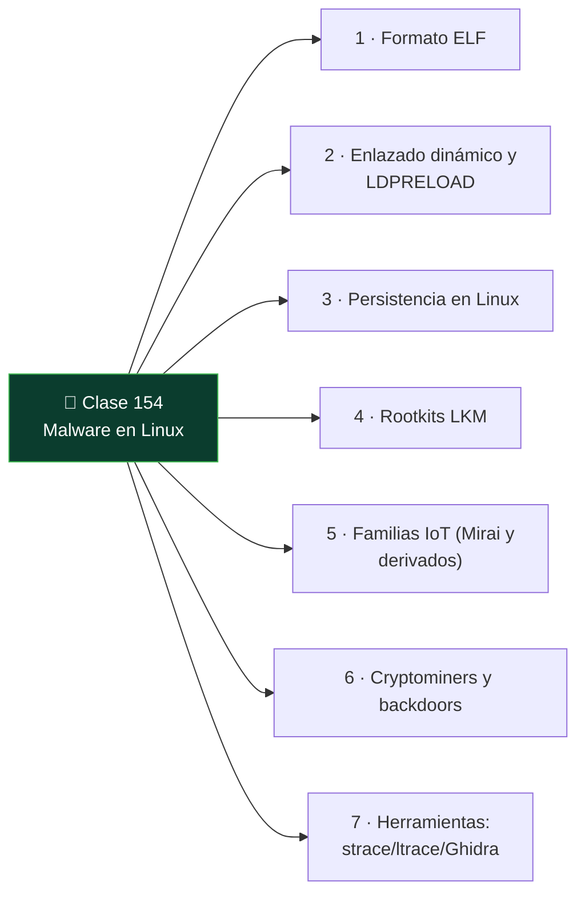

# Clase 154 — Malware en Linux

<!-- cabecera:inicio -->

> 🗂️ Parte: **6 — Análisis de malware** · 📖 Fuente: *Learning Malware Analysis* (Monnappa) y *Practical Binary Analysis*
> ⏱️ Duración estimada: **120 min** · 🎚️ Nivel: **Avanzado**

<!-- cabecera:fin -->

---

## 🎯 Objetivo

Adaptar el análisis al ecosistema Linux, cada vez más atacado por su presencia en servidores, IoT y contenedores. El alumno estudiará el formato ELF, las técnicas de persistencia y ocultación en Linux (cron, systemd, LD_PRELOAD, rootkits LKM), las familias típicas (botnets IoT, mineros, backdoors) y las herramientas de análisis estático y dinámico en este entorno.

## 📚 Resultados de aprendizaje

Al finalizar, el alumno podrá:

1. **Analizar** binarios ELF: cabeceras, secciones, símbolos e imports dinámicos.
2. **Identificar** persistencia en Linux (cron, systemd, rc, perfiles de shell).
3. **Reconocer** ocultación por `LD_PRELOAD` y rootkits de módulo del kernel (LKM).
4. **Trazar** el comportamiento con `strace`, `ltrace` y análisis de red.
5. **Caracterizar** familias comunes: botnets IoT, cryptominers, backdoors.

## 🗺️ Temas

<!-- mapa:inicio -->

<!-- mapa:fin -->

| # | Tema | Por qué importa |
|---|------|-----------------|
| 1 | Formato ELF | Equivalente Linux del PE |
| 2 | Enlazado dinámico y `LD_PRELOAD` | Vector de hooking en user-land |
| 3 | Persistencia en Linux | cron, systemd, rc.local, bashrc |
| 4 | Rootkits LKM | Ocultación en kernel |
| 5 | Familias IoT (Mirai y derivados) | Amenaza dominante en Linux |
| 6 | Cryptominers y backdoors | Objetivos frecuentes en servidores |
| 7 | Herramientas: strace/ltrace/Ghidra | Triaje dinámico y estático |

## 📖 Definiciones y características

- **ELF:** formato de ejecutables/librerías de Linux. Característica clave: **secciones y segmentos** (headers de programa).
- **LD_PRELOAD:** variable para precargar librerías. Característica clave: **hooking de funciones libc** sin tocar el binario.
- **LKM rootkit:** módulo del kernel malicioso. Característica clave: **ocultación a nivel kernel**.
- **strace/ltrace:** trazan syscalls / llamadas a librería. Característica clave: **comportamiento en vivo**.
- **Mirai:** botnet IoT por credenciales por defecto. Característica clave: **escaneo y fuerza bruta Telnet/SSH**.

## 🧰 Herramientas y preparación

- **readelf**, **objdump**, **nm**, **file** para ELF estático.
- **Ghidra** para desensamblado ELF.
- **strace**, **ltrace**, **/proc**, **tcpdump/Wireshark** para dinámico.
- VM Linux aislada (REMnux o Ubuntu mínima) con snapshot.

> ⚠️ **Nota ética y de seguridad:** ejecuta ELF maliciosos solo en la VM Linux aislada, sin red hacia Internet y con snapshot. Los rootkits LKM pueden inutilizar el kernel invitado; asume que la VM será desechada. Nunca analices en un servidor de producción.

## 🧪 Laboratorio guiado

1. Triaje estático: `file muestra`, `readelf -h muestra` (arquitectura, tipo), `readelf -d` (dependencias dinámicas) y `nm -D` (símbolos). ¿Está *stripped*?, ¿estático o dinámico?
2. Extrae strings y busca rutas de persistencia (`/etc/cron.*`, `/etc/systemd/system`, `~/.bashrc`), IPs y comandos.
3. Desensambla en Ghidra la función principal y localiza el bucle de escaneo/beacon si es una botnet.
4. Análisis dinámico: en la VM aislada, `strace -f -e trace=network,process ./muestra` para ver conexiones y procesos hijos; `ltrace` para llamadas libc.
5. Observa la persistencia creada: nuevas unidades systemd, entradas de cron o modificaciones de perfiles de shell. Documéntalas.
6. Si sospechas `LD_PRELOAD`, revisa `/etc/ld.so.preload` y librerías inyectadas; para LKM, revisa `lsmod` y módulos ocultos.
7. Captura el tráfico con `tcpdump` y extrae IOCs de red; mapea a ATT&CK. Restaura snapshot.

## ✍️ Ejercicios

1. Compara ELF y PE en estructura y herramientas de análisis.
2. Explica cómo `LD_PRELOAD` permite ocultar procesos a `ps`.
3. Identifica 4 mecanismos de persistencia en Linux con ejemplo.
4. Interpreta una traza de `strace` y describe el comportamiento.
5. Reconoce el patrón de escaneo de una botnet tipo Mirai.
6. Detecta un cryptominer por su uso de CPU y conexiones a pools.

## 📝 Reto verificable

Analiza una muestra ELF y entrega un **informe** con: arquitectura y tipo de binario, persistencia establecida, comportamiento de red (IOCs) y clasificación de familia, respaldado por salidas de `readelf`, `strace` y `tcpdump`.
**Criterio de aceptación:** identificas correctamente el mecanismo de persistencia con evidencia de `strace`/sistema de archivos y al menos un IOC de red, y clasificas la muestra (botnet/miner/backdoor) con justificación.

## ⚠️ Errores comunes

| Síntoma / mensaje | Causa y cómo arreglar |
|-------------------|------------------------|
| Binario *stripped* sin símbolos | Normal en malware; trabaja por strings y xrefs en Ghidra |
| `strace` no muestra red | Filtra por `trace=network`; puede usar syscalls directas |
| Arquitectura no coincide | ELF de MIPS/ARM (IoT); usa qemu-user para emular |
| Persistencia no encontrada | Revisa systemd, cron, rc.local y perfiles, no solo uno |
| Módulo kernel oculto | LKM rootkit; compara `lsmod` con `/proc/modules` |

## ❓ Preguntas frecuentes

**❓ ¿El malware Linux es menos peligroso?** No. Domina en servidores, IoT y cloud; botnets, ransomware Linux y mineros son muy activos.

**❓ ¿Cómo analizo binarios ARM/MIPS de IoT?** Con `qemu-user` para ejecutarlos en tu host x86 dentro del lab, y Ghidra que soporta esas arquitecturas.

**❓ ¿strace es suficiente?** Es un gran triaje dinámico, pero combínalo con análisis estático; el malware puede detectar el tracing o usar syscalls poco comunes.

## 🔗 Referencias

- Monnappa K. A., *Learning Malware Analysis*.
- Andriesse, D., *Practical Binary Analysis* (No Starch).
- man readelf / strace / ltrace. <https://man7.org/linux/man-pages/>
- MITRE ATT&CK — Linux. <https://attack.mitre.org/matrices/enterprise/linux/>

## 📥 Material descargable

- 📄 [Guía en PDF](./clase-154-guia.pdf) — versión imprimible de esta clase.
- 🎞️ [Presentación (PPTX)](./clase-154-presentacion.pptx) — deck para proyectar en clase.

## ⬅️ Clase anterior

[Clase 153 — Análisis de malware en scripts: PowerShell y JavaScript](../153-analisis-de-malware-en-scripts-powershell-y-javascript/README.md)

## ➡️ Siguiente clase

[Clase 155 — Malware en Android](../155-malware-en-android/README.md)
