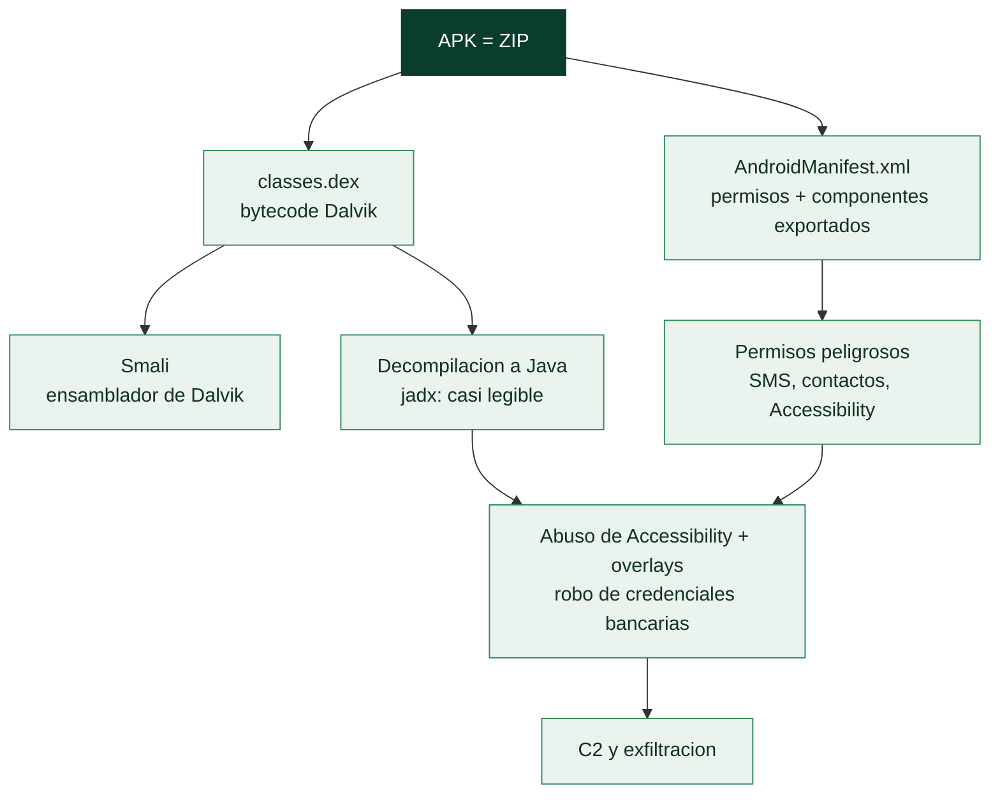

# Clase 155 — Malware en Android

> Parte: **6 — Análisis de malware** · Fuente: *Learning Malware Analysis* y OWASP Mobile Security
> ⏱️ Duración estimada: **120 min** · Nivel: **Avanzado**

---

## 🎯 Objetivo

Analizar aplicaciones Android maliciosas: entender el formato APK, descompilar el bytecode Dalvik a algo legible, revisar el manifiesto y los permisos, y reconstruir el comportamiento (robo de SMS/credenciales, overlays bancarios, spyware). El alumno aprenderá el flujo estático y dinámico con un emulador aislado.

## 📚 Resultados de aprendizaje

Al finalizar, el alumno podrá:

1. **Descomponer** un APK: manifiesto, permisos, DEX, recursos y librerías nativas.
2. **Descompilar** el bytecode a Smali/Java para leer la lógica.
3. **Identificar** permisos peligrosos y componentes exportados abusables.
4. **Reconocer** técnicas: overlays, accesibilidad, intercepción de SMS, C2.
5. **Analizar** dinámicamente en un emulador aislado con captura de tráfico.

## 🗺️ Temas

| # | Tema | Por qué importa |
|---|------|-----------------|
| 1 | Estructura APK y Android Manifest | Punto de partida del análisis |
| 2 | Permisos y componentes exportados | Superficie de abuso |
| 3 | Bytecode Dalvik y Smali | El código real de la app |
| 4 | Descompilación a Java | Lectura rápida de la lógica |
| 5 | Abuso de Accessibility y overlays | Técnicas de troyanos bancarios |
| 6 | C2 y exfiltración | Robo de datos y control |
| 7 | Análisis dinámico en emulador | Comportamiento real |

## 🧠 Explicación en profundidad

### El malware en el dispositivo que llevamos encima

Los smartphones concentran la vida digital —banca, mensajería, credenciales, ubicación—, y **Android**,
por su cuota de mercado y su modelo más abierto (permite instalar apps fuera de la tienda oficial), es
el objetivo dominante del malware móvil. El malware de Android se distribuye como **APK** (el formato de
las apps), a menudo disfrazado de una app legítima, y su análisis tiene un instrumental propio porque no
es código nativo compilado sino, principalmente, **bytecode que se puede decompilar de vuelta a un
Java casi legible** —lo que hace el análisis de Android, en cierto sentido, más accesible que el de un
binario x86 stripped—.

### El APK y el manifiesto: la declaración de intenciones

Un **APK** es en realidad un **archivo ZIP** con una estructura definida, y su fichero más importante para
el análisis es el **AndroidManifest.xml**: declara los **permisos** que la app solicita, sus
**componentes** (actividades, servicios, receivers) y cuáles están **exportados** (accesibles desde otras
apps —una superficie de ataque—). El manifiesto es una **declaración de intenciones**: una linterna que
pide permiso para leer SMS, acceder a los contactos, usar los servicios de accesibilidad y ejecutarse al
arrancar el teléfono es, sin analizar una línea de código, sospechosa. Los **permisos peligrosos** —SMS
(interceptar códigos de verificación), contactos, ubicación, cámara, y sobre todo **Accessibility**— son
la primera señal de alarma, y su combinación revela el propósito.

### De Dalvik a Java: la decompilación

El código de una app Android se compila a **bytecode Dalvik** (el `classes.dex`), que corre en la máquina
virtual de Android (ART/Dalvik). Ese bytecode se puede representar en **Smali**, un ensamblador legible de
Dalvik —el equivalente de leer el desensamblado—, pero lo más productivo es **decompilarlo de vuelta a
Java**: herramientas como **jadx** producen un código Java **casi idéntico al original**, porque el
bytecode Dalvik conserva mucha estructura de alto nivel (nombres de clases y métodos, tipos). Esto hace el
análisis de Android notablemente más directo que el de un binario nativo: en lugar de descifrar
ensamblador, se lee Java. La ofuscación (con herramientas como ProGuard/R8, que renombran clases y métodos
a `a.b.c`) dificulta pero no impide el análisis. **APKTool** desempaqueta el APK y decodifica el manifiesto
y los recursos.

### Las técnicas del malware bancario y el análisis dinámico

El malware de Android más dañino son los **troyanos bancarios**, y su técnica estrella es el **abuso del
servicio de Accessibility**. Accessibility es una API legítima pensada para usuarios con discapacidad, que
permite a una app **leer el contenido de la pantalla y simular toques**. El malware la abusa para
**automatizar acciones** (conceder permisos, instalar más apps, hacer transferencias) y **leer lo que el
usuario escribe** —incluidas credenciales—. La combina con los **overlays**: la app dibuja una **pantalla
falsa encima** de la app legítima del banco, de modo que el usuario introduce sus credenciales en la
pantalla del malware creyendo que es la del banco. Otras técnicas incluyen la **interceptación de SMS**
(para robar los códigos de doble factor) y el registro de pulsaciones. Todo se combina con **C2 y
exfiltración** de lo robado. El análisis dinámico se hace en un **emulador** (Android Studio, Genymotion) o
un dispositivo de pruebas, observando el comportamiento —a menudo con **Frida** ([Clase 134](../../parte-5-explotacion-de-sistemas-y-binarios/134-analisis-dinamico-y-debugging-de-binarios/README.md)) para
interceptar funciones y saltarse comprobaciones anti-análisis—. La lección de la clase es que el malware de
Android combina un análisis de código **más accesible** (decompilación a Java) con un abuso característico
de las **APIs del sistema** (Accessibility, overlays, SMS) para robar directamente lo que más importa, y
que el manifiesto y los permisos dan un primer diagnóstico antes de tocar el código.

## 📖 Definiciones y características

- **APK:** paquete ZIP de una app Android. Característica clave: **manifiesto + DEX + recursos**.
- **AndroidManifest.xml:** declara permisos y componentes. Característica clave: **mapa de capacidades**.
- **DEX / Dalvik bytecode:** código ejecutable de la app. Característica clave: **descompilable a Smali/Java**.
- **Accessibility abuse:** uso del servicio de accesibilidad para leer/controlar la UI. Característica clave: **control total** de la pantalla.
- **Overlay:** ventana falsa sobre una app legítima. Característica clave: **robo de credenciales** bancarias.

## 📔 Glosario

| Término | Definición concisa |
|---------|--------------------|
| Malware de Android | Malware móvil distribuido como APK |
| APK | Archivo ZIP que empaqueta una app Android |
| AndroidManifest.xml | Declara permisos y componentes de la app |
| Permiso peligroso | SMS, contactos, ubicación, Accessibility |
| Componente exportado | Accesible desde otras apps; superficie de ataque |
| Bytecode Dalvik | Código compilado que corre en ART/Dalvik |
| classes.dex | Fichero con el bytecode de la app |
| Smali | Ensamblador legible de Dalvik |
| jadx | Decompilador de Dalvik a Java casi legible |
| APKTool | Desempaqueta el APK y decodifica el manifiesto |
| ProGuard / R8 | Ofuscadores que renombran clases y métodos |
| Accessibility | API abusada para leer pantalla y simular toques |
| Overlay | Pantalla falsa dibujada sobre la app legítima |
| Interceptación de SMS | Robo de códigos de doble factor |
| Emulador / Frida | Entorno y herramienta de análisis dinámico |

## 🧰 Herramientas y preparación

- **apktool** (desempaqueta y decodifica el manifiesto/Smali).
- **jadx** / **jadx-gui** (descompila DEX a Java).
- **MobSF** (análisis estático y dinámico automatizado).
- **Android Emulator/Genymotion** aislado, **Frida** (instrumentación), **mitmproxy** (tráfico TLS).

> ⚠️ **Nota ética y de seguridad:** instala y ejecuta APKs maliciosos solo en un **emulador aislado** (sin cuentas reales, sin SIM, sin red hacia Internet salvo el proxy del lab). Nunca en tu teléfono personal. Trabaja únicamente con muestras autorizadas.

## 🧪 Laboratorio guiado

Estático:

1. Desempaqueta: `apktool d muestra.apk`. Revisa `AndroidManifest.xml`: permisos (`READ_SMS`, `SYSTEM_ALERT_WINDOW`, `BIND_ACCESSIBILITY_SERVICE`) y componentes `exported`.
2. Descompila a Java con `jadx-gui muestra.apk`. Localiza el `Application`/servicios y sigue el flujo desde `onCreate`/receivers de SMS.
3. Busca strings de C2 (URLs, endpoints), claves de cifrado y llamadas a `SmsManager`, `AccessibilityService`, `WebView` (overlays).
4. Corre **MobSF** para un informe automatizado y contrástalo con tu lectura manual.

Dinámico:

5. Instala el APK en el emulador aislado (`adb install muestra.apk`) con snapshot previo.
6. Configura **mitmproxy** como proxy y captura el tráfico C2 (instala el CA del proxy en el emulador). Observa registros y comandos.
7. Con **Frida**, engancha funciones de cifrado/red para revelar datos antes de cifrar y confirmar el C2.
8. Extrae IOCs (dominios, endpoints, permisos abusados) y mapea a ATT&CK Mobile. Restaura el snapshot.

## ✍️ Ejercicios

1. Enumera 6 permisos peligrosos y el abuso asociado a cada uno.
2. Explica cómo un troyano bancario usa overlays + accesibilidad.
3. Descompila una app y localiza el receptor de SMS.
4. Interpreta el informe de MobSF y prioriza hallazgos.
5. Captura tráfico C2 con mitmproxy y documenta un comando.
6. Usa Frida para revelar una cadena cifrada en runtime.

## 📝 Reto verificable

Analiza un APK malicioso y entrega un **informe** con: permisos peligrosos, componentes exportados, técnica principal (overlay/SMS/spyware), C2 e IOCs, respaldado por descompilado y captura de tráfico.
**Criterio de aceptación:** identificas la capacidad principal con la evidencia del código descompilado y capturas al menos un endpoint C2 en mitmproxy, sin haber usado un dispositivo real.

## ⚠️ Errores comunes

| Síntoma / mensaje | Causa y cómo arreglar |
|-------------------|------------------------|
| Instalar en el móvil personal | Riesgo real; usa solo emulador aislado |
| jadx falla al descompilar | Ofuscación/anti-descompilación; usa Smali de apktool |
| Sin tráfico TLS legible | Falta el CA del proxy o hay pinning; instala CA y bypass con Frida |
| Permisos "normales" pero malicioso | Revisa accesibilidad y APIs, no solo el manifiesto |
| Multi-DEX incompleto | La app tiene varios DEX; asegúrate de analizarlos todos |

## ❓ Preguntas frecuentes

**❓ ¿Basta el análisis estático?** Da mucho (permisos, C2, lógica), pero la ofuscación y la carga dinámica exigen análisis dinámico con emulador y Frida.

**❓ ¿Qué es el certificate pinning y cómo lo supero?** La app valida el certificado del servidor; para inspeccionar TLS en el lab se hace bypass con Frida en el emulador.

**❓ ¿Por qué la accesibilidad es tan peligrosa?** Permite leer y controlar toda la interfaz: capturar credenciales, autorizar acciones y ocultar la actividad al usuario.

## 🔗 Referencias

- OWASP Mobile Security Testing Guide. <https://owasp.org/www-project-mobile-app-security/>
- jadx. <https://github.com/skylot/jadx>
- apktool. <https://apktool.org>
- MobSF. <https://github.com/MobSF/Mobile-Security-Framework-MobSF>
- MITRE ATT&CK Mobile. <https://attack.mitre.org/matrices/mobile/>

## 📥 Material descargable

- 📄 [Guía en PDF](./clase-155-guia.pdf) — versión imprimible de esta clase.
- 🎞️ [Presentación (PPTX)](./clase-155-presentacion.pptx) — deck para proyectar en clase.

## ⬅️ Clase anterior

[Clase 154 — Malware en Linux](../154-malware-en-linux/README.md)

## ➡️ Siguiente clase

[Clase 156 — Reglas YARA para detección](../156-reglas-yara-para-deteccion/README.md)
