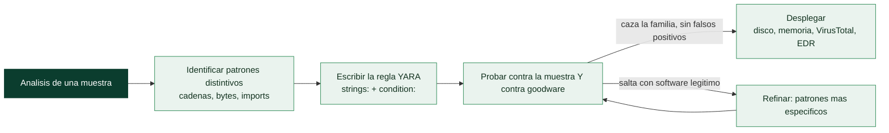

# Clase 156 — Reglas YARA para detección

> Parte: **6 — Análisis de malware** · Fuente: YARA Documentation (VirusTotal) y *Practical Malware Analysis*
> ⏱️ Duración estimada: **110 min** · Nivel: **Intermedio**

---

## 🎯 Objetivo

Convertir el análisis en detección escribiendo reglas **YARA** que identifiquen una familia de malware de forma robusta y con bajos falsos positivos. El alumno aprenderá la sintaxis, a elegir buenas cadenas y condiciones, a usar el módulo PE, y a probar y afinar reglas contra un conjunto de muestras y de goodware.

## 📚 Resultados de aprendizaje

Al finalizar, el alumno podrá:

1. **Escribir** reglas YARA con secciones `meta`, `strings` y `condition`.
2. **Elegir** cadenas discriminantes (texto, hex, regex) que generalicen a la familia.
3. **Usar** el módulo `pe` (imphash, secciones, imports) para condiciones robustas.
4. **Probar** reglas contra muestras y goodware para medir falsos positivos.
5. **Desplegar** YARA en triaje, memoria y flujos automatizados.

## 🗺️ Temas

| # | Tema | Por qué importa |
|---|------|-----------------|
| 1 | Anatomía de una regla | Estructura básica |
| 2 | Tipos de cadenas: texto, hex, regex | Flexibilidad de firma |
| 3 | Condiciones y operadores | Lógica de detección |
| 4 | Módulo `pe` y otros | Firmas por estructura, no solo bytes |
| 5 | Falsos positivos y goodware | Calidad de la regla |
| 6 | Reglas por familia vs por muestra | Generalización |
| 7 | Despliegue (disco, memoria, VT) | Uso operativo |

## 🧠 Explicación en profundidad

### Convertir el análisis en detección reutilizable

Analizar una muestra da comprensión, pero su valor se multiplica cuando ese conocimiento se convierte en
una **regla de detección** que encuentra **otras muestras de la misma familia**. **YARA** es el estándar
para eso: un lenguaje para describir patrones —cadenas, secuencias de bytes, condiciones estructurales—
que identifican malware, de modo que una regla escrita a partir de una muestra caza todas sus variantes,
en disco, en memoria y en servicios como VirusTotal. YARA se ha ganado el apodo de "el pattern-matching
del analista de malware", y escribir buenas reglas es una de las habilidades más rentables de la parte,
porque conecta el análisis individual con la detección a escala.



### La anatomía de una regla: strings y condition

Una regla YARA tiene una estructura simple y constante. Se declara con `rule NombreRegla { ... }` y
contiene tres secciones. **`meta:`** guarda metadatos (autor, fecha, familia, referencia) que no afectan a
la detección pero documentan la regla. **`strings:`** define los **patrones a buscar**, cada uno con un
identificador (`$a`, `$b`). Y **`condition:`** es la **expresión booleana** que decide cuándo la regla
coincide, combinando los patrones. Por ejemplo: "coincide si aparecen al menos 2 de estas 3 cadenas Y el
fichero es un PE". La separación entre *qué buscar* (strings) y *cuándo dispararse* (condition) es lo que
da a YARA su flexibilidad.

Los **tipos de cadena** cubren las tres formas de describir un patrón. Las **cadenas de texto** buscan
literales (`$a = "malicious.com"`), con modificadores como `nocase` (ignora mayúsculas), `wide` (busca la
versión Unicode/UTF-16, esencial en Windows) o `ascii`. Las **cadenas hexadecimales** buscan **secuencias
de bytes** (`$b = { E8 ?? ?? ?? ?? 5D C3 }`), con comodines (`??`) para bytes variables y saltos —ideales
para describir un fragmento de código máquina característico que sobrevive a cambios de cadenas—. Y las
**expresiones regulares** (`$c = /https?:\/\/[a-z0-9]+\.evil/`) para patrones flexibles. Combinar los
tres tipos permite describir con precisión qué hace única a una familia.

### Condiciones, módulos y el equilibrio del falso positivo

La **`condition`** es donde vive la inteligencia de la regla. Soporta operadores lógicos (`and`, `or`,
`not`), conteo (`2 of them`, `all of them`, `any of ($a, $b)`), posición (`$a at 0` —al inicio del
fichero—), y aritmética. Los **módulos** amplían enormemente su poder: el módulo **`pe`** permite escribir
condiciones sobre la **estructura del PE** (clase 145) —`pe.imphash()`, `pe.number_of_sections`,
`pe.entry_point`, `pe.imports("kernel32.dll", "CreateRemoteThread")`—, de modo que una regla puede
dispararse por características estructurales, no solo por cadenas; hay módulos para ELF, para hashes, para
matemáticas (entropía). El **reto central** de escribir reglas es el **equilibrio del falso positivo**: una
regla demasiado genérica (una cadena común) caza malware pero también software legítimo (**goodware**),
inundando de falsas alertas; una regla demasiado específica (un hash exacto) solo caza esa muestra y no sus
variantes. La buena regla usa patrones **distintivos** de la familia —una cadena de C2 única, una secuencia
de código de su rutina de cifrado, su imphash— y **se prueba siempre contra un corpus de goodware** para
verificar que no salta con software normal. Este es el arte de YARA.

### Reglas por familia vs por muestra, y el despliegue

Hay dos filosofías de regla. Una regla **por muestra** identifica una muestra concreta (hashes, cadenas
exactas) —precisa pero frágil, no caza variantes—. Una regla **por familia** captura lo que es **común a
todo el linaje** (la lógica de C2, la rutina de cifrado, patrones de código estables) —más difícil de
escribir pero mucho más valiosa, porque detecta variantes futuras que aún no existen—. El objetivo del
analista serio es la regla por familia. Finalmente, las reglas se **despliegan** en muchos sitios: escaneo
de **ficheros en disco** (un EDR o un antivirus con motor YARA), escaneo de **memoria** (para pillar
malware desempaquetado o inyectado que en disco estaba packed —clave, porque el código real solo aparece en
memoria—), y como **YARA retrohunt en VirusTotal** (buscar en el histórico de VT todas las muestras que
coincidan con una regla nueva, lo que permite descubrir toda una campaña a partir de una sola muestra). La
lección de la clase es que YARA es el puente entre el análisis y la operación: transforma el conocimiento
obtenido de una muestra en una capacidad de detección reutilizable, compartible y escalable —el motivo de
que las reglas YARA sean una moneda central de la *threat intelligence* de la clase 157—.

## 📖 Definiciones y características

- **Regla YARA:** patrón declarativo para clasificar archivos/memoria. Característica clave: **`strings` + `condition`**.
- **String hex con comodines:** patrón de bytes con `??`/`[n-m]`. Característica clave: **tolera variación**.
- **imphash (módulo pe):** hash de imports. Característica clave: **agrupa familia** de forma estable.
- **Falso positivo:** regla que marca software legítimo. Característica clave: a minimizar con **goodware testing**.
- **Condición:** expresión lógica que decide el match. Característica clave: **combina evidencias**.

## 📔 Glosario

| Término | Definición concisa |
|---------|--------------------|
| YARA | Lenguaje para describir patrones que identifican malware |
| Regla | Unidad de YARA: meta, strings y condition |
| meta | Metadatos de la regla (autor, familia, referencia) |
| strings | Patrones a buscar |
| condition | Expresión booleana que dispara la regla |
| Cadena de texto | Literal, con `nocase`, `wide`, `ascii` |
| wide | Busca la versión Unicode/UTF-16 de la cadena |
| Cadena hexadecimal | Secuencia de bytes con comodines `??` |
| Expresión regular | Patrón flexible en la regla |
| Módulo pe | Condiciones sobre la estructura del PE |
| pe.imphash | Función que agrupa por tabla de imports |
| Goodware | Software legítimo; hay que evitar cazarlo |
| Falso positivo | Regla que salta con software normal |
| Regla por familia | Captura lo común al linaje; caza variantes |
| Retrohunt | Buscar en el histórico de VirusTotal con una regla |

## 🧰 Herramientas y preparación

- **yara** CLI y **yara-python**.
- **yarGen** (genera reglas candidatas), **YARA-CI**, **capa** (para inspirar condiciones).
- Conjunto de **muestras** de una familia + un corpus de **goodware** (binarios de sistema) para pruebas.
- Editor con resaltado YARA.

> ⚠️ **Nota ética y de seguridad:** aunque YARA no ejecuta las muestras, manipula binarios reales; trabaja en la VM aislada. Las reglas son para **detección defensiva**; compártelas con cuidado para no revelar capacidades de detección a los adversarios de forma innecesaria.

## 🧪 Laboratorio guiado

1. Toma 3–5 muestras de una familia (previamente analizadas) y extrae strings/estructuras comunes con `floss`, `strings` y PEStudio.
2. Escribe una regla base:

   ```yara
   import "pe"
   rule Familia_Ejemplo {
     meta:
       author = "analista"
       description = "Detecta la familia X"
       reference = "hash_sha256"
     strings:
       $s1 = "cadena_unica_del_C2" ascii
       $s2 = { 6A 40 68 00 30 00 00 } // patrón de código
       $re = /mutex_[a-f0-9]{8}/ ascii
     condition:
       uint16(0) == 0x5A4D and 2 of ($s*) and $re
   }
   ```

3. Añade una condición estructural con el módulo pe: `pe.imphash() == "..."` o `pe.number_of_sections`.
4. Prueba: `yara -r regla.yar carpeta_muestras/` debe marcar las muestras de la familia.
5. Ejecuta la regla contra el corpus de **goodware**: `yara -r regla.yar C:\Windows\System32\`. Si hay matches, endurece cadenas/condición.
6. Genera candidatas con `yarGen` y compáralas con tu regla manual; combina lo mejor de ambas.
7. Ajusta hasta lograr **cobertura de la familia con cero falsos positivos** en tu corpus. Documenta la regla y su tasa de acierto.

## ✍️ Ejercicios

1. Escribe una regla con cadenas de texto, hex y regex.
2. Convierte una firma frágil (una sola string) en una robusta (varias evidencias).
3. Usa `pe.imphash()` para agrupar una familia.
4. Provoca un falso positivo a propósito y luego corrígelo.
5. Explica cuándo usar `all of them` vs `N of ($s*)`.
6. Documenta el `meta` mínimo recomendable de una regla.

## 📝 Reto verificable

Entrega una regla YARA para una familia que detecte **todas** tus muestras objetivo y **ninguna** del corpus de goodware, con `meta` completo y al menos una condición estructural (pe/imphash).
**Criterio de aceptación:** `yara -r` marca el 100% de las muestras de la familia y 0 archivos del corpus de goodware de prueba, y la regla incluye una condición del módulo `pe`.

## ⚠️ Errores comunes

| Síntoma / mensaje | Causa y cómo arreglar |
|-------------------|------------------------|
| Muchos falsos positivos | Cadenas genéricas; usa strings únicos y `N of` |
| No detecta variantes | Regla atada a una muestra; generaliza con hex+comodines |
| Regla no compila | Sintaxis de `condition`/strings; revisa comillas y llaves |
| imphash no coincide | El packer cambia imports; usa imphash del binario desempacado |
| Lenta en grandes corpus | Evita regex costosos; ancla con `uint16(0)==0x5A4D` |

## ❓ Preguntas frecuentes

**❓ ¿Firmar por familia o por muestra?** Por familia. Una regla atada a una muestra caduca con la próxima variante; busca patrones estructurales y de código compartidos.

**❓ ¿YARA sirve en memoria?** Sí. Es muy útil escanear volcados de memoria o procesos vivos, donde el código desempacado revela strings ausentes en disco.

**❓ ¿Debo publicar mis reglas?** Depende. Compartir ayuda a la comunidad, pero exponer detecciones internas puede permitir al atacante evadirlas; evalúa el contexto.

## 🔗 Referencias

- YARA Documentation. <https://yara.readthedocs.io>
- yarGen. <https://github.com/Neo23x0/yarGen>
- Florian Roth — Reglas YARA de calidad. <https://github.com/Neo23x0/signature-base>
- Sikorski & Honig, *Practical Malware Analysis*.

## 📥 Material descargable

- 📄 [Guía en PDF](./clase-156-guia.pdf) — versión imprimible de esta clase.
- 🎞️ [Presentación (PPTX)](./clase-156-presentacion.pptx) — deck para proyectar en clase.

## ⬅️ Clase anterior

[Clase 155 — Malware en Android](../155-malware-en-android/README.md)

## ➡️ Siguiente clase

[Clase 157 — Threat intelligence a partir de malware](../157-threat-intelligence-a-partir-de-malware/README.md)
