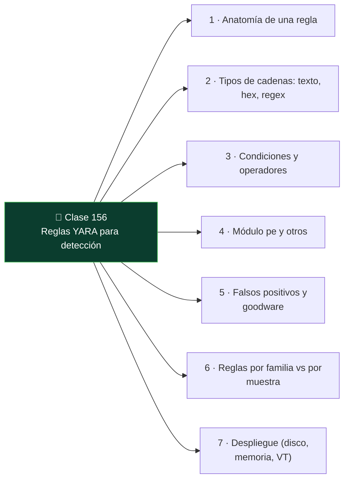

# Clase 156 — Reglas YARA para detección

<!-- cabecera:inicio -->

<div align="center">

[](../README.md)
[](../../README.md)
[](../../README.md)
[](../../README.md)

</div>

> 🗂️ Parte: **6 — Análisis de malware** · 📖 Fuente: YARA Documentation (VirusTotal) y *Practical Malware Analysis*
> ⏱️ Duración estimada: **110 min** · 🎚️ Nivel: **Intermedio**

<!-- cabecera:fin -->

---

## 🎯 Objetivo

Convertir el análisis en detección escribiendo reglas **YARA** que identifiquen una familia de malware de forma robusta y con bajos falsos positivos. El alumno aprenderá la sintaxis, a elegir buenas cadenas y condiciones, a usar el módulo PE, y a probar y afinar reglas contra un conjunto de muestras y de goodware.

## 📚 Resultados de aprendizaje

Al finalizar, el alumno podrá:

1. **Escribir** reglas YARA con secciones `meta`, `strings` y `condition`.
2. **Elegir** cadenas discriminantes (texto, hex, regex) que generalicen a la familia.
3. **Usar** el módulo `pe` (imphash, secciones, imports) para condiciones robustas.
4. **Probar** reglas contra muestras y goodware para medir falsos positivos.
5. **Desplegar** YARA en triaje, memoria y flujos automatizados.

## 🗺️ Temas

<!-- mapa:inicio -->



<!-- mapa:fin -->

| # | Tema | Por qué importa |
|---|------|-----------------|
| 1 | Anatomía de una regla | Estructura básica |
| 2 | Tipos de cadenas: texto, hex, regex | Flexibilidad de firma |
| 3 | Condiciones y operadores | Lógica de detección |
| 4 | Módulo `pe` y otros | Firmas por estructura, no solo bytes |
| 5 | Falsos positivos y goodware | Calidad de la regla |
| 6 | Reglas por familia vs por muestra | Generalización |
| 7 | Despliegue (disco, memoria, VT) | Uso operativo |

## 📖 Definiciones y características

- **Regla YARA:** patrón declarativo para clasificar archivos/memoria. Característica clave: **`strings` + `condition`**.
- **String hex con comodines:** patrón de bytes con `??`/`[n-m]`. Característica clave: **tolera variación**.
- **imphash (módulo pe):** hash de imports. Característica clave: **agrupa familia** de forma estable.
- **Falso positivo:** regla que marca software legítimo. Característica clave: a minimizar con **goodware testing**.
- **Condición:** expresión lógica que decide el match. Característica clave: **combina evidencias**.

## 🧰 Herramientas y preparación

- **yara** CLI y **yara-python**.
- **yarGen** (genera reglas candidatas), **YARA-CI**, **capa** (para inspirar condiciones).
- Conjunto de **muestras** de una familia + un corpus de **goodware** (binarios de sistema) para pruebas.
- Editor con resaltado YARA.

> ⚠️ **Nota ética y de seguridad:** aunque YARA no ejecuta las muestras, manipula binarios reales; trabaja en la VM aislada. Las reglas son para **detección defensiva**; compártelas con cuidado para no revelar capacidades de detección a los adversarios de forma innecesaria.

## 🧪 Laboratorio guiado

1. Toma 3–5 muestras de una familia (previamente analizadas) y extrae strings/estructuras comunes con `floss`, `strings` y PEStudio.
2. Escribe una regla base:

   ```yara
   import "pe"
   rule Familia_Ejemplo {
     meta:
       author = "analista"
       description = "Detecta la familia X"
       reference = "hash_sha256"
     strings:
       $s1 = "cadena_unica_del_C2" ascii
       $s2 = { 6A 40 68 00 30 00 00 } // patrón de código
       $re = /mutex_[a-f0-9]{8}/ ascii
     condition:
       uint16(0) == 0x5A4D and 2 of ($s*) and $re
   }
   ```

3. Añade una condición estructural con el módulo pe: `pe.imphash() == "..."` o `pe.number_of_sections`.
4. Prueba: `yara -r regla.yar carpeta_muestras/` debe marcar las muestras de la familia.
5. Ejecuta la regla contra el corpus de **goodware**: `yara -r regla.yar C:\Windows\System32\`. Si hay matches, endurece cadenas/condición.
6. Genera candidatas con `yarGen` y compáralas con tu regla manual; combina lo mejor de ambas.
7. Ajusta hasta lograr **cobertura de la familia con cero falsos positivos** en tu corpus. Documenta la regla y su tasa de acierto.

## ✍️ Ejercicios

1. Escribe una regla con cadenas de texto, hex y regex.
2. Convierte una firma frágil (una sola string) en una robusta (varias evidencias).
3. Usa `pe.imphash()` para agrupar una familia.
4. Provoca un falso positivo a propósito y luego corrígelo.
5. Explica cuándo usar `all of them` vs `N of ($s*)`.
6. Documenta el `meta` mínimo recomendable de una regla.

## 📝 Reto verificable

Entrega una regla YARA para una familia que detecte **todas** tus muestras objetivo y **ninguna** del corpus de goodware, con `meta` completo y al menos una condición estructural (pe/imphash).
**Criterio de aceptación:** `yara -r` marca el 100% de las muestras de la familia y 0 archivos del corpus de goodware de prueba, y la regla incluye una condición del módulo `pe`.

## ⚠️ Errores comunes

| Síntoma / mensaje | Causa y cómo arreglar |
|-------------------|------------------------|
| Muchos falsos positivos | Cadenas genéricas; usa strings únicos y `N of` |
| No detecta variantes | Regla atada a una muestra; generaliza con hex+comodines |
| Regla no compila | Sintaxis de `condition`/strings; revisa comillas y llaves |
| imphash no coincide | El packer cambia imports; usa imphash del binario desempacado |
| Lenta en grandes corpus | Evita regex costosos; ancla con `uint16(0)==0x5A4D` |

## ❓ Preguntas frecuentes

**❓ ¿Firmar por familia o por muestra?** Por familia. Una regla atada a una muestra caduca con la próxima variante; busca patrones estructurales y de código compartidos.

**❓ ¿YARA sirve en memoria?** Sí. Es muy útil escanear volcados de memoria o procesos vivos, donde el código desempacado revela strings ausentes en disco.

**❓ ¿Debo publicar mis reglas?** Depende. Compartir ayuda a la comunidad, pero exponer detecciones internas puede permitir al atacante evadirlas; evalúa el contexto.

## 🔗 Referencias

- YARA Documentation. <https://yara.readthedocs.io>
- yarGen. <https://github.com/Neo23x0/yarGen>
- Florian Roth — Reglas YARA de calidad. <https://github.com/Neo23x0/signature-base>
- Sikorski & Honig, *Practical Malware Analysis*.

## 📥 Material descargable

- 📄 [Guía en PDF](./clase-156-guia.pdf) — versión imprimible de esta clase.
- 🎞️ [Presentación (PPTX)](./clase-156-presentacion.pptx) — deck para proyectar en clase.

## ⬅️ Clase anterior

[Clase 155 — Malware en Android](../155-malware-en-android/README.md)

## ➡️ Siguiente clase

[Clase 157 — Threat intelligence a partir de malware](../157-threat-intelligence-a-partir-de-malware/README.md)
