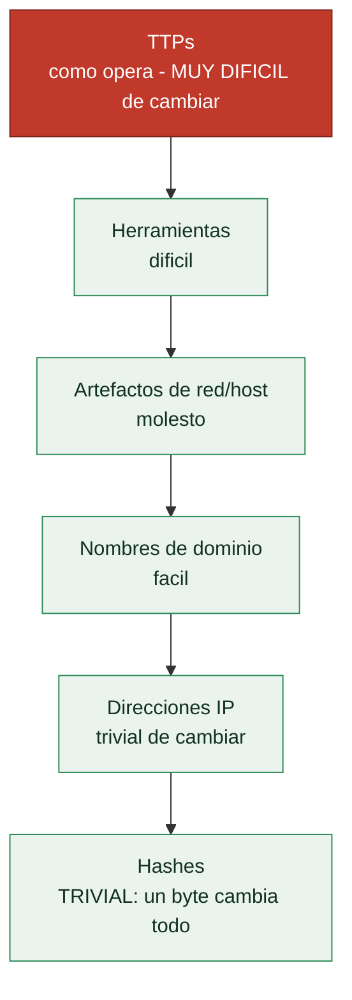

# Clase 157 — Threat intelligence a partir de malware

> Parte: **6 — Análisis de malware** · Fuente: MITRE ATT&CK, *Intelligence-Driven Incident Response* (Roberts & Brown)
> ⏱️ Duración estimada: **110 min** · Nivel: **Avanzado**

---

## 🎯 Objetivo

Transformar el análisis de una muestra en **inteligencia accionable**: IOCs estructurados, TTPs mapeados, pivoteo hacia infraestructura y campañas relacionadas, y atribución razonada. El alumno aprenderá a usar la Pyramid of Pain, marcos como Diamond Model y ATT&CK, y a producir inteligencia que otros equipos puedan consumir (STIX, MISP).

## 📚 Resultados de aprendizaje

Al finalizar, el alumno podrá:

1. **Distinguir** niveles de IOC según la Pyramid of Pain y su valor.
2. **Estructurar** inteligencia con Diamond Model, ATT&CK y STIX/TAXII.
3. **Pivotar** desde una muestra hacia infraestructura y muestras relacionadas.
4. **Evaluar** atribución con hipótesis y confianza, evitando conclusiones frágiles.
5. **Publicar** inteligencia consumible (MISP, feeds, reglas).

## 🗺️ Temas

| # | Tema | Por qué importa |
|---|------|-----------------|
| 1 | Datos, información, inteligencia | Diferencia clave del CTI |
| 2 | Pyramid of Pain | Prioriza IOCs por impacto en el atacante |
| 3 | Diamond Model | Estructura adversario/infra/capacidad/víctima |
| 4 | Pivoteo de infraestructura | Amplía de una muestra a una campaña |
| 5 | Atribución y confianza | Evita errores caros |
| 6 | STIX/TAXII y MISP | Formatos e intercambio |
| 7 | IOCs vs TTPs | Durabilidad de la detección |

## 🧠 Explicación en profundidad

### De analizar una muestra a entender al adversario

La **inteligencia de amenazas** (*threat intelligence*, CTI) convierte el análisis de malware individual
en **conocimiento accionable sobre los adversarios**: quiénes son, cómo operan, qué infraestructura usan,
a quién atacan. Es el paso de "esta muestra hace X" a "el grupo Y usa esta técnica contra el sector Z, y
así se detecta y se anticipa". La CTI es lo que da propósito estratégico al análisis: no se analiza
malware por curiosidad, sino para **defender mejor**, y para eso hay que transformar los datos técnicos en
inteligencia que informe decisiones.

La jerarquía fundamental es **dato → información → inteligencia**. Un **dato** es un hecho aislado (una IP,
un hash). La **información** es datos con contexto (esta IP es el C2 de esta familia). La **inteligencia**
es información analizada que responde a una necesidad y **guía la acción** (este grupo está atacando a tu
sector con esta técnica, prioriza esta defensa). Confundir datos con inteligencia —entregar una lista de
hashes y llamarla "inteligencia"— es el error más común, y por eso la CTI insiste en el análisis, no solo
en la recolección.

### La Pyramid of Pain: qué IOCs de verdad duelen al atacante

El concepto que ordena la CTI es la **Pyramid of Pain** (David Bianco), que clasifica los indicadores por
**cuánto le cuesta al atacante cambiarlos** si los bloqueas —es decir, cuánto "dolor" le causas—.

En la base, lo trivial de cambiar: los **hashes** (un byte distinto, hash nuevo) y las **IPs** (rotar es
trivial). En medio, lo molesto: **dominios** y **artefactos** de red/host (mutex, claves de registro).
En la cima, lo caro: las **herramientas** del atacante y —lo más difícil de todo— sus **TTPs** (tácticas,
técnicas y procedimientos, [Clase 141](../141-introduccion-al-malware-tipos-y-taxonomia/README.md)). La lección
estratégica es contundente: **detectar por hashes e IPs es fácil de evadir para el atacante** (los cambia
en minutos), mientras que **detectar por TTPs le obliga a cambiar su forma de operar**, algo lento y
costoso. Por eso la CTI madura invierte en detección por **comportamiento y TTPs** (mapeados a ATT&CK) por
encima de las listas de IOCs volátiles —aunque los IOCs siguen siendo útiles para el bloqueo inmediato—.

### Pivoteo, atribución y el Diamond Model

Dos técnicas convierten una muestra en inteligencia sobre una campaña. El **pivoteo de infraestructura**:
a partir de un indicador (un dominio de C2) se **descubren indicadores relacionados** —otros dominios en el
mismo servidor, certificados compartidos, patrones de registro— reconstruyendo la infraestructura del
adversario; es el **pivote del Diamond Model** ([Clase 003](../../parte-0-fundamentos-y-prerrequisitos/003-frameworks-de-seguridad-nist-csf-iso-27001-mitre-att-ck-y-diamond-model/README.md)) aplicado en la práctica. La
**atribución** —determinar **quién** está detrás— es lo más difícil y lo que exige más cautela: se basa en
la combinación de TTPs, infraestructura, código compartido y objetivos, pero es propensa al error y a la
manipulación (los atacantes plantan **false flags** para desviar la culpa), así que la CTI seria expresa la
atribución con **niveles de confianza** explícitos ("con confianza media, atribuimos a...") y nunca como
certeza. El **Diamond Model** (adversario, capacidad, infraestructura, víctima) es el marco para organizar
todo esto.

### Compartir la inteligencia: STIX, TAXII y MISP

La CTI solo tiene valor si se **comparte** —la defensa colectiva es más fuerte que la individual—, y para
ello existen estándares. **STIX** (*Structured Threat Information eXpression*) es un formato estandarizado
para **describir** amenazas (indicadores, TTPs, actores, campañas) de forma que las máquinas lo procesen;
**TAXII** es el protocolo para **transportar** ese STIX entre organizaciones. **MISP** (*Malware
Information Sharing Platform*) es la plataforma abierta más usada para **compartir y correlacionar** IOCs y
CTI entre equipos y comunidades. El énfasis final de la clase es la distinción **IOCs vs TTPs**: los IOCs
(hashes, IPs, dominios) son fáciles de compartir y de bloquear pero volátiles (base de la pirámide); los
TTPs son duraderos y estratégicos pero más difíciles de expresar y de detectar (cima de la pirámide). Una
CTI equilibrada usa ambos —IOCs para el bloqueo táctico inmediato, TTPs para la detección estratégica y
duradera— y los comparte en formatos estándar. La lección de la clase, que cierra el ciclo del análisis de
malware, es que el objetivo último de analizar una muestra no es la muestra en sí, sino **producir
inteligencia** que haga a la organización —y a la comunidad— más difíciles de atacar.

## 📖 Definiciones y características

- **IOC:** artefacto observable (hash, IP, dominio). Característica clave: **fácil de cambiar** para el atacante (base de la pirámide).
- **TTP:** comportamiento del adversario. Característica clave: **caro de cambiar** (cima de la pirámide).
- **Pyramid of Pain (Bianco):** jerarquía de indicadores por "dolor" al atacante. Característica clave: **prioriza detección**.
- **Diamond Model:** modelo de eventos de intrusión. Característica clave: **relaciona 4 vértices**.
- **STIX:** lenguaje estructurado para CTI. Característica clave: **interoperabilidad**.

## 📔 Glosario

| Término | Definición concisa |
|---------|--------------------|
| Threat intelligence (CTI) | Conocimiento accionable sobre los adversarios |
| Dato → información → inteligencia | Jerarquía de valor de la CTI |
| Pyramid of Pain | Clasifica IOCs por cuánto cuesta cambiarlos |
| IOC | Indicador de compromiso (hash, IP, dominio) |
| TTP | Tácticas, técnicas y procedimientos; lo más caro de cambiar |
| Hash / IP | IOCs triviales de cambiar (base de la pirámide) |
| Pivoteo de infraestructura | Descubrir indicadores relacionados desde uno |
| Atribución | Determinar quién está detrás; con niveles de confianza |
| False flag | Pista plantada para desviar la atribución |
| Nivel de confianza | Cautela explícita en las afirmaciones de CTI |
| Diamond Model | Adversario, capacidad, infraestructura, víctima |
| STIX | Formato estándar para describir amenazas |
| TAXII | Protocolo para transportar CTI (STIX) |
| MISP | Plataforma de compartición de IOCs y CTI |

## 🧰 Herramientas y preparación

- **VirusTotal (pivoteo)**, **MalwareBazaar**, **URLhaus**, **ThreatFox** (abuse.ch).
- **MISP** para almacenar y compartir; **STIX2** (Python) para estructurar.
- **MITRE ATT&CK Navigator** para mapear TTPs.
- Passive DNS / WHOIS para pivoteo de infraestructura.

> ⚠️ **Nota ética y de seguridad:** el pivoteo usa fuentes de inteligencia y metadatos; no contactes infraestructura del atacante ni descargues muestras activas fuera del lab. Maneja la inteligencia con clasificación adecuada (TLP) y evita exponer datos de víctimas.

## 🧪 Laboratorio guiado

1. Parte de una muestra ya analizada. Reúne sus IOCs: hashes, dominios/IPs C2, mutex, rutas, certificados TLS.
2. Clasifícalos con la **Pyramid of Pain** y anota cuáles son volátiles (hash/IP) y cuáles duraderos (TTPs, herramientas).
3. Pivotea en VirusTotal/ThreatFox: desde un dominio C2 encuentra otras muestras que lo contactan; desde un imphash halla binarios similares. Documenta las relaciones.
4. Usa passive DNS/WHOIS para expandir la infraestructura (dominios hermanos, ASN, patrones de registro).
5. Construye un **Diamond Model** del evento: adversario (hipótesis), infraestructura, capacidad (la muestra), víctima.
6. Mapea las TTPs al **ATT&CK Navigator** y exporta la capa.
7. Estructura un objeto **STIX** (indicator + malware + relationship) o crea un evento en **MISP** con TLP y tags.
8. Redacta una evaluación de atribución con nivel de confianza (baja/media/alta) y las evidencias que la sostienen.

## ✍️ Ejercicios

1. Ordena 8 IOCs en la Pyramid of Pain y justifica.
2. Pivotea de un dominio a muestras relacionadas y documenta el grafo.
3. Rellena un Diamond Model de un caso real.
4. Exporta una capa de ATT&CK Navigator para una familia.
5. Crea un evento MISP con IOCs, TTPs y TLP.
6. Redacta una hipótesis de atribución con confianza calibrada.

## 📝 Reto verificable

A partir de una muestra, entrega un **paquete de inteligencia**: IOCs clasificados por la pirámide, capa ATT&CK, grafo de pivoteo con al menos 2 relaciones nuevas y una evaluación de atribución con nivel de confianza.
**Criterio de aceptación:** el paquete incluye al menos dos artefactos relacionados descubiertos por pivoteo (no presentes en la muestra inicial) y una atribución con confianza explícita y evidencia, no una afirmación categórica.

## ⚠️ Errores comunes

| Síntoma / mensaje | Causa y cómo arreglar |
|-------------------|------------------------|
| Solo compartir hashes/IPs | Son volátiles; añade TTPs, más duraderos |
| Atribución categórica | Usa hipótesis y niveles de confianza; evita saltar a conclusiones |
| Pivoteo sin verificar | Correlaciona varias fuentes antes de afirmar relación |
| IOCs sin contexto | Añade fechas, TLP y origen para que sean útiles |
| Exponer datos de víctimas | Anonimiza y respeta TLP al compartir |

## ❓ Preguntas frecuentes

**❓ ¿Por qué priorizar TTPs sobre IOCs?** Porque el atacante cambia hashes e IPs con facilidad, pero modificar sus técnicas es costoso; detectar TTPs es más resiliente.

**❓ ¿La atribución es fiable?** Es difícil y manipulable (false flags). Se maneja como hipótesis con niveles de confianza, no como certeza.

**❓ ¿Qué es TLP?** El Traffic Light Protocol clasifica cómo puede compartirse la información (RED/AMBER/GREEN/CLEAR) para proteger fuentes y víctimas.

## 🔗 Referencias

- Bianco, D. — Pyramid of Pain. <https://detect-respond.blogspot.com/2013/03/the-pyramid-of-pain.html>
- Roberts & Brown — *Intelligence-Driven Incident Response*.
- MISP. <https://www.misp-project.org>
- STIX/TAXII (OASIS). <https://oasis-open.github.io/cti-documentation/>
- MITRE ATT&CK Navigator. <https://mitre-attack.github.io/attack-navigator/>

## 📥 Material descargable

- 📄 [Guía en PDF](./clase-157-guia.pdf) — versión imprimible de esta clase.
- 🎞️ [Presentación (PPTX)](./clase-157-presentacion.pptx) — deck para proyectar en clase.

## ⬅️ Clase anterior

[Clase 156 — Reglas YARA para detección](../156-reglas-yara-para-deteccion/README.md)

## ➡️ Siguiente clase

[Clase 158 — Emulación y unpacking automatizado](../158-emulacion-y-unpacking-automatizado/README.md)
