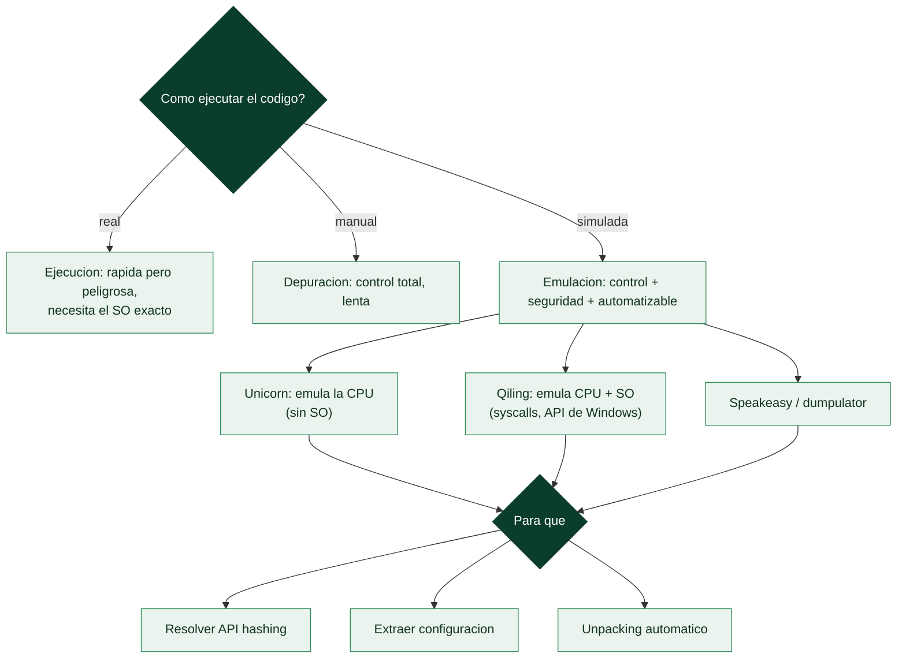

# Clase 158 — Emulación y unpacking automatizado

> Parte: **6 — Análisis de malware** · Fuente: *Practical Malware Analysis* y documentación de Unicorn/qiling
> ⏱️ Duración estimada: **130 min** · Nivel: **Experto**

---

## 🎯 Objetivo

Escalar el análisis con **emulación** de CPU y automatización del unpacking y la extracción de configuración. El alumno aprenderá a usar frameworks de emulación (Unicorn, Qiling) y de análisis programático (Speakeasy, dumpulator) para desempacar sin depurar a mano, resolver API hashing, ejecutar rutinas de descifrado aisladas y construir extractores de config reutilizables.

## 📚 Resultados de aprendizaje

Al finalizar, el alumno podrá:

1. **Explicar** cuándo la emulación supera a la depuración manual.
2. **Emular** funciones aisladas (descifrado, API hashing) con Unicorn/Qiling.
3. **Automatizar** el unpacking y el dump con emuladores o hooks.
4. **Construir** un extractor de configuración para una familia.
5. **Integrar** la automatización en un pipeline de triaje.

## 🗺️ Temas

| # | Tema | Por qué importa |
|---|------|-----------------|
| 1 | Emulación vs ejecución vs depuración | Control y seguridad |
| 2 | Unicorn Engine (emulación de CPU) | Ejecuta código sin SO real |
| 3 | Qiling (emulación con SO) | Emula syscalls y librerías |
| 4 | Speakeasy / dumpulator | Emulación orientada a malware |
| 5 | Resolución de API hashing por emulación | Recupera nombres de API |
| 6 | Extractores de configuración | Config a escala |
| 7 | Pipelines de triaje | Automatización operativa |

## 🧠 Explicación en profundidad

### Escalar el análisis: cuando ejecutar y depurar no basta

Analizar malware a mano —desempaquetar en un depurador, resolver APIs por hash una a una, extraer la
config manualmente— no escala cuando hay que triar cientos de muestras al día. La **emulación** resuelve
esto: **ejecutar el código del malware en un entorno simulado y controlado** que no es ni una ejecución
real (peligrosa, requiere el SO y hardware exactos) ni una depuración manual (lenta), sino algo intermedio
—se corre el código instrucción a instrucción en un CPU virtual, con control total y sin riesgo—. La
emulación es la clave de la **automatización** del análisis: unpacking, resolución de API hashing y
extracción de configuración que a mano llevarían horas se hacen programáticamente en segundos.



### Emular la CPU frente a emular el sistema operativo

Hay dos niveles de emulación con capacidades distintas. **Unicorn Engine** (derivado de QEMU) emula
**solo la CPU**: ejecuta instrucciones x86/ARM y gestiona registros y memoria, pero **no proporciona un
sistema operativo** —si el código hace una syscall o llama a una API de Windows, Unicorn no sabe qué hacer
salvo que el analista lo implemente—. Es perfecto para emular **fragmentos aislados** de código: la rutina
de descifrado de cadenas, el algoritmo de un DGA, la función de hashing de APIs —se le da la entrada, se
ejecuta, se lee el resultado, sin necesidad de todo el entorno—. **Qiling** va más allá: emula la CPU **y
proporciona un sistema operativo** (implementa las syscalls de Linux y la API de Windows, un sistema de
ficheros virtual), de modo que puede ejecutar un **binario completo** de forma emulada, interceptando cada
llamada al sistema. Herramientas como **Speakeasy** (de Mandiant) y **dumpulator** están especializadas en
emular malware de Windows para automatizar el análisis.

### Los tres usos que transforman el análisis

La emulación brilla en tres tareas concretas y frecuentes. **Resolver el API hashing** (clase 146): en
lugar de invertir a mano el algoritmo de hash y precalcular una tabla, se **emula la propia rutina de
resolución** del malware —se le da la lista de nombres de API y se deja que el código del malware calcule
los hashes— obteniendo la correspondencia automáticamente; o se emula el momento de la llamada para ver qué
API se resuelve. **Unpacking automático**: se **emula la ejecución del stub** hasta que se desempaqueta en
memoria y se **vuelca** el código real, sin abrir un depurador ni lidiar con anti-debug (la emulación no es
un depurador que el malware pueda detectar con `IsDebuggerPresent`). Y la **extracción de configuración**:
se emula la rutina de descifrado de la config del malware para obtener los dominios de C2 y las claves
directamente —los **extractores de configuración** modernos suelen basarse en emulación—.

### Pipelines de triaje y los límites

El valor operativo de la emulación es construir **pipelines de triaje automático**: un sistema que recibe
una muestra, la emula, extrae su configuración, resuelve sus APIs, aplica reglas YARA (clase 156) y produce
un informe estructurado —todo sin intervención humana, procesando volumen—. Esto libera al analista para
concentrarse en las muestras que de verdad requieren análisis manual profundo. Los **límites** de la
emulación son reales y hay que conocerlos: es **incompleta** (implementar toda la API de Windows es
inviable, así que el malware que usa una API no emulada falla), es **más lenta** que la ejecución real
instrucción a instrucción, y el malware avanzado incluye **anti-emulación** (detecta inconsistencias del
entorno emulado, como que ciertas APIs devuelvan valores irreales, y se comporta distinto). Por eso la
emulación **complementa** pero no reemplaza al análisis dinámico real (clase 144) y al manual (clase 146):
se emula para automatizar lo repetible y escalar el triaje, y se recurre al análisis completo para lo que
la emulación no alcanza. La lección de la clase es que la emulación es la herramienta que hace el análisis
de malware **escalable**, convirtiendo tareas manuales tediosas en código reutilizable —el mismo salto de
"a mano" a "automatizado" que define la madurez en cualquier disciplina técnica—.

## 📖 Definiciones y características

- **Emulación:** ejecutar instrucciones en un motor software, no en la CPU real. Característica clave: **control total y aislamiento**.
- **Unicorn Engine:** emulador de CPU multiarquitectura. Característica clave: **emula código, no el SO**.
- **Qiling:** framework de emulación con soporte de SO/syscalls. Característica clave: **ejecuta binarios enteros** de forma controlada.
- **Config extractor:** script que extrae la configuración de una familia. Característica clave: **repetible y a escala**.
- **API hashing:** resolver APIs por hash. Característica clave: **resoluble por emulación** del algoritmo.

## 📔 Glosario

| Término | Definición concisa |
|---------|--------------------|
| Emulación | Ejecutar código en un CPU virtual, con control y sin riesgo |
| Emulación vs ejecución vs depuración | Simulada vs real vs manual |
| Unicorn Engine | Emula solo la CPU; ideal para fragmentos |
| Qiling | Emula CPU y SO; ejecuta binarios completos |
| Speakeasy / dumpulator | Emuladores especializados en malware de Windows |
| Emular un fragmento | Ejecutar una rutina aislada (descifrado, DGA) |
| Resolver API hashing | Emular la rutina que resuelve las APIs por hash |
| Unpacking automático | Emular el stub y volcar el código desempaquetado |
| Extracción de configuración | Emular el descifrado de la config del C2 |
| Extractor de configuración | Herramienta que obtiene dominios y claves |
| Pipeline de triaje | Sistema que analiza muestras automáticamente |
| Anti-emulación | Malware que detecta el entorno emulado |
| Emulación incompleta | No toda la API está implementada |
| Complementa el análisis | La emulación escala, no reemplaza el manual |

## 🧰 Herramientas y preparación

- **Unicorn Engine** (+ Capstone/Keystone) y **Qiling Framework**.
- **Speakeasy** (Mandiant) y **dumpulator** para emulación de malware.
- **FLOSS**/**capa** para localizar rutinas objetivo.
- Python en la VM aislada para orquestar.

> ⚠️ **Nota ética y de seguridad:** aunque la emulación es más segura que ejecutar, trabaja en la VM aislada: los binarios siguen siendo maliciosos y algunos emuladores realizan syscalls reales. No permitas salida de red desde el emulador. Los extractores se usan para defensa.

## 🧪 Laboratorio guiado

1. Con `capa`/FLOSS localiza en una muestra la rutina de **descifrado de config** o de **API hashing** (dirección de inicio y fin).
2. Emula solo esa función con Unicorn: mapea memoria, carga los bytes del binario, fija registros/argumentos y ejecuta hasta la dirección final. Lee el buffer de salida (config descifrada).

   ```python
   from unicorn import *
   from unicorn.x86_const import *
   mu = Uc(UC_ARCH_X86, UC_MODE_32)
   mu.mem_map(0x400000, 0x100000)
   mu.mem_write(0x401000, code_bytes)
   mu.reg_write(UC_X86_REG_ESP, 0x4FF000)
   mu.emu_start(0x401000, 0x401050)
   print(mu.mem_read(0x402000, 64))  # config descifrada
   ```

3. Para API hashing, emula el algoritmo de hash y precomputa los hashes de APIs comunes; construye un mapa hash→nombre y anota el desensamblado.
4. Usa **Qiling** o **Speakeasy** para emular la muestra completa y capturar las llamadas a APIs (`VirtualAlloc`, `WriteProcessMemory`) que revelan el payload desempacado; vuelca la región.
5. Empaqueta lo anterior en un **extractor de config**: recibe una muestra de la familia y devuelve dominios/claves/intervalos en JSON.
6. Prueba el extractor contra varias muestras de la familia y mide su tasa de éxito.

## ✍️ Ejercicios

1. Explica cuándo prefieres emular una función en vez de depurar la muestra.
2. Emula una rutina XOR con Unicorn y recupera su salida.
3. Resuelve API hashing precomputando hashes de APIs comunes.
4. Usa Qiling/Speakeasy para capturar las APIs de un unpacker.
5. Escribe un extractor de config que devuelva JSON.
6. Integra el extractor en un mini-pipeline de triaje por lotes.

## 📝 Reto verificable

Entrega un **extractor de configuración** para una familia que, por emulación, recupere la config (dominios/clave/intervalo) de al menos 3 muestras distintas de esa familia, con salida en JSON.
**Criterio de aceptación:** el script corre sin depuración manual y produce la config correcta para 3+ muestras de la familia, verificable contra el análisis manual de una de ellas.

## ⚠️ Errores comunes

| Síntoma / mensaje | Causa y cómo arreglar |
|-------------------|------------------------|
| La emulación falla en una API | Falta stub/hook de esa API; impleméntalo o usa Qiling |
| Registros/pila mal inicializados | Emulas una función sin su contexto; fija args y ESP/RSP |
| Config sale corrupta | Rango de direcciones incorrecto; ajusta inicio/fin y base |
| Hashes no coinciden | Algoritmo de hash mal identificado; verifícalo en el código |
| Extractor solo sirve para 1 muestra | Codificaste offsets fijos; parametriza por patrones |

## ❓ Preguntas frecuentes

**❓ ¿Emulación reemplaza al desensamblado?** No; lo complementa. Primero localizas la rutina con análisis estático y luego la emulas para obtener el resultado sin ejecutar todo el malware.

**❓ ¿Es 100% segura la emulación?** Más segura que ejecutar, pero frameworks con soporte de SO pueden hacer syscalls reales; mantén el aislamiento.

**❓ ¿Vale la pena automatizar un extractor?** Sí cuando una familia es prevalente: procesar cientos de muestras a mano no escala; un extractor entrega IOCs en segundos.

## 🔗 Referencias

- Unicorn Engine. <https://www.unicorn-engine.org>
- Qiling Framework. <https://qiling.io>
- Speakeasy (Mandiant). <https://github.com/mandiant/speakeasy>
- dumpulator. <https://github.com/mrexodia/dumpulator>

## 📥 Material descargable

- 📄 [Guía en PDF](./clase-158-guia.pdf) — versión imprimible de esta clase.
- 🎞️ [Presentación (PPTX)](./clase-158-presentacion.pptx) — deck para proyectar en clase.

## ⬅️ Clase anterior

[Clase 157 — Threat intelligence a partir de malware](../157-threat-intelligence-a-partir-de-malware/README.md)

## ➡️ Siguiente clase

[Clase 159 — Fileless malware y living-off-the-land](../159-fileless-malware-y-living-off-the-land/README.md)
