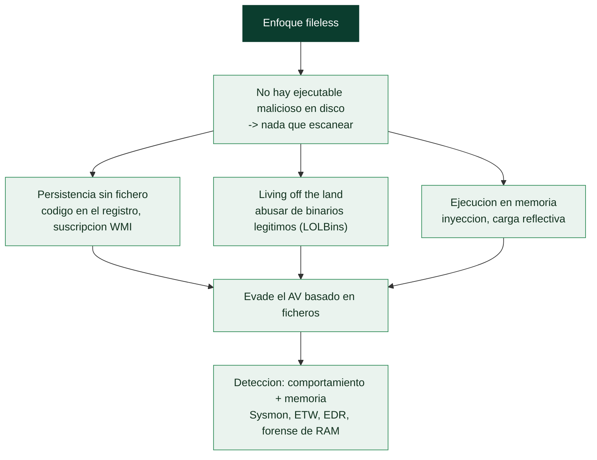

# Clase 159 — Fileless malware y living-off-the-land

> Parte: **6 — Análisis de malware** · Fuente: *The Art of Memory Forensics* y MITRE ATT&CK
> ⏱️ Duración estimada: **120 min** · Nivel: **Experto**

---

## 🎯 Objetivo

Analizar amenazas que apenas tocan el disco: malware **fileless** que vive en memoria o en el registro, y ataques **living-off-the-land (LOLBins)** que abusan de binarios legítimos del sistema. El alumno aprenderá a detectar y reconstruir estas técnicas con forense de memoria y telemetría, donde el análisis de archivos tradicional se queda ciego.

## 📚 Resultados de aprendizaje

Al finalizar, el alumno podrá:

1. **Definir** malware fileless y sus mecanismos de persistencia sin archivo.
2. **Reconocer** LOLBins comunes y cómo se abusan (LOLBAS).
3. **Detectar** código solo en memoria con forense (Volatility).
4. **Reconstruir** la cadena desde la telemetría (Sysmon/EDR/ScriptBlock).
5. **Proponer** detecciones centradas en comportamiento, no en archivos.

## 🗺️ Temas

| # | Tema | Por qué importa |
|---|------|-----------------|
| 1 | Qué es fileless y por qué evade | Sin archivo, menos detección AV |
| 2 | Persistencia sin archivo (registro, WMI) | Sobrevive sin binario en disco |
| 3 | LOLBins y LOLBAS | Abuso de binarios firmados |
| 4 | Inyección y ejecución en memoria | Payload nunca toca disco |
| 5 | Forense de memoria para fileless | Única fuente de evidencia |
| 6 | Telemetría: Sysmon, ETW, EDR | Reconstrucción de la cadena |
| 7 | Detección por comportamiento | Estrategia frente a fileless |

## 🧠 Explicación en profundidad

### Malware sin fichero: la evasión por diseño

El **malware fileless** (sin fichero) es el que **no escribe un ejecutable malicioso en el disco**, o lo
hace de forma mínima y efímera, operando principalmente **en memoria** y **abusando de herramientas
legítimas del sistema**. Su razón de ser es la **evasión**: las defensas tradicionales (antivirus, listas
de hashes) se basan en **escanear ficheros en disco**, así que un malware que no deja fichero **no tiene
qué escanear** —es invisible para toda una generación de defensas—. El fileless no es una familia concreta
sino un **enfoque** que muchas amenazas modernas adoptan, y entenderlo es esencial porque ha cambiado el
centro de gravedad de la defensa del disco a la **memoria y el comportamiento**.

### Persistir y ejecutar sin dejar fichero

El malware fileless resuelve dos problemas sin tocar el disco. La **persistencia sin fichero**: en lugar de
un ejecutable en una carpeta con una Run key que lo apunte, **guarda el propio código malicioso dentro del
registro** (un valor de registro grande que contiene un script codificado, que otro componente lee y
ejecuta) o usa **suscripciones a eventos WMI** (clase 148) que ejecutan código en respuesta a un evento del
sistema —persistencia que no deja un fichero que buscar—. La **ejecución en memoria**: el código malicioso
se **inyecta** en un proceso legítimo o se **carga reflectivamente** (clase 153) directamente en memoria
desde una fuente remota o desde el registro, sin escribirse nunca en disco. El resultado es malware que
vive enteramente en la RAM y en la configuración del sistema.

### Living off the land: usar las herramientas de la casa

El pilar complementario es el **living off the land** (LotL): **abusar de los binarios y scripts legítimos
que ya vienen en el sistema** para hacer el trabajo malicioso, en lugar de traer herramientas propias.
Estos son los **LOLBins** (*Living Off the Land Binaries*) y **LOLBAS** (el proyecto que los cataloga en
Windows; **GTFOBins** es el equivalente Linux, [Clase 076](../../parte-3-hacking-etico-y-pentesting-metodologia/076-escalada-de-privilegios-en-linux/README.md)): `powershell.exe`
(ejecutar código), `certutil.exe` (descargar ficheros y decodificar Base64), `mshta.exe` (ejecutar HTA
remoto), `regsvr32.exe` (ejecutar código de una URL), `rundll32.exe`, `wmic.exe`, `bitsadmin.exe`. Como
todos son **binarios de Microsoft, firmados y de confianza**, su ejecución no levanta las alarmas que
levantaría un binario desconocido —el atacante hace que el propio Windows ejecute su ataque—. El LotL es la
razón por la que la detección basada en "¿es este fichero malicioso?" falla: los ficheros implicados son
todos legítimos; lo malicioso es **cómo se usan y en qué secuencia**.

### La respuesta defensiva: comportamiento, telemetría y memoria

El malware fileless **obligó a la defensa a evolucionar** del disco al comportamiento, y esa es la lección
central de la clase. Como no hay fichero que escanear, la detección se basa en **qué se hace, no en qué se
tiene**: un `certutil.exe` descargando un fichero de una IP rara, un `powershell.exe` con un comando Base64
largo lanzado por un documento de Word, un `svchost.exe` haciendo conexiones de red anómalas —cada uno es
un binario legítimo, pero la **acción y el contexto** son sospechosos—. Esto exige **telemetría rica**:
**Sysmon** (registra creación de procesos con su línea de comandos y su proceso padre, conexiones de red,
cambios de registro —la línea de comandos es clave, porque revela el `powershell -enc ...` malicioso),
**ETW** (*Event Tracing for Windows*, la instrumentación profunda del SO), y los **EDR** (que correlacionan
todo esto en tiempo real). Y para el código que vive en RAM, la **forense de memoria** (Volatility, clase
148) es indispensable —es donde el fileless deja su rastro—. La **detección por comportamiento** —reglas
que buscan secuencias sospechosas de acciones en lugar de firmas de ficheros— es la respuesta, y conecta
directamente esta clase con la ingeniería de detección de la Parte 8. La conclusión es que el fileless y el
LotL representan el estado del arte de la evasión, y que combatirlos requiere haber trasladado la defensa
del "¿qué ficheros hay?" al "¿qué comportamientos ocurren?", el gran cambio de paradigma de la seguridad de
endpoints moderna.

## 📖 Definiciones y características

- **Fileless malware:** ejecuta principalmente en memoria, con poca o nula huella en disco. Característica clave: **evasión de AV de archivos**.
- **LOLBin/LOLBAS:** binario legítimo del SO abusado con fines maliciosos. Característica clave: **confianza heredada**.
- **Persistencia WMI:** suscripciones a eventos WMI para ejecutar código. Característica clave: **sin archivo visible**.
- **Registro como almacenamiento:** payloads guardados en claves del registro. Característica clave: **oculto y persistente**.
- **In-memory injection:** cargar y ejecutar payload en RAM. Característica clave: **nada que escanear en disco**.

## 📔 Glosario

| Término | Definición concisa |
|---------|--------------------|
| Fileless | Malware que no escribe un ejecutable en disco |
| Evasión por diseño | No hay fichero que escanear |
| Persistencia sin fichero | Código en el registro o en suscripciones WMI |
| Ejecución en memoria | Inyección o carga reflectiva sin tocar disco |
| Living off the land (LotL) | Abusar de herramientas legítimas del sistema |
| LOLBin | Binario legítimo del sistema abusado |
| LOLBAS | Catálogo de LOLBins en Windows |
| certutil / mshta / regsvr32 | LOLBins comunes |
| Binario firmado de confianza | Su uso no levanta las alarmas de un binario nuevo |
| Detección por comportamiento | Basada en qué se hace, no en qué fichero hay |
| Sysmon | Registra procesos, líneas de comando, red, registro |
| Línea de comandos | Revela el uso malicioso de un binario legítimo |
| ETW | Event Tracing for Windows; telemetría profunda |
| EDR | Correlaciona la telemetría en tiempo real |
| Forense de memoria | Donde el fileless deja su rastro |

## 🧰 Herramientas y preparación

- **Volatility 3** (`malfind`, `windows.registry`, `windows.svcscan`, `windows.wmi`).
- **Sysmon** (Event IDs 1, 3, 7, 8, 11, 19–21) y **Event Viewer** (PowerShell 4104).
- Referencia **LOLBAS** (`lolbas-project.github.io`).
- **Autoruns**, **winpmem** para capturar RAM.

> ⚠️ **Nota ética y de seguridad:** las técnicas LOLBin y fileless se estudian para **detección y respuesta**. Detona en la VM aislada con captura de memoria y telemetría. No uses estas técnicas fuera de sistemas propios y autorizados.

## 🧪 Laboratorio guiado

1. Restaura `base-clean`, habilita **Sysmon** (config tipo SwiftOnSecurity) y **ScriptBlock Logging**.
2. Detona un caso fileless (o reproduce una cadena LOLBin controlada). Captura RAM con `winpmem` al final.
3. Con Volatility, `windows.malfind` para regiones RWX inyectadas: identifica el payload en memoria y vuélcalo para analizarlo.
4. Busca persistencia sin archivo: `windows.registry.printkey` en claves `Run`/servicios con payloads codificados, y suscripciones **WMI** (`__EventFilter`/`CommandLineEventConsumer`).
5. Revisa la telemetría: en Sysmon, procesos hijos de Office/`explorer` que lanzan `powershell`, `mshta`, `rundll32`, `regsvr32` con argumentos sospechosos (LOLBins). Anota los Event IDs.
6. Reconstruye la cadena de ejecución uniendo memoria + Sysmon + ScriptBlock (Event 4104).
7. Propón detecciones por comportamiento (p. ej. `rundll32` sin DLL, `regsvr32` con URL, WMI consumer nuevo) y mapea a ATT&CK (`T1218`, `T1546.003`, `T1055`).

## ✍️ Ejercicios

1. Explica por qué el AV de archivos falla contra fileless.
2. Enumera 6 LOLBins y su abuso típico (con Event Sysmon esperado).
3. Detecta un payload en memoria con `malfind` y vuélcalo.
4. Identifica una persistencia WMI y descríbela.
5. Escribe una regla de detección para `regsvr32` con URL remota.
6. Reconstruye una cadena LOLBin desde logs de Sysmon.

## 📝 Reto verificable

Analiza una cadena fileless/LOLBin y entrega su **reconstrucción** con: payload en memoria volcado, persistencia sin archivo identificada, LOLBins abusados y detecciones por comportamiento mapeadas a ATT&CK.
**Criterio de aceptación:** presentas evidencia de memoria (malfind/registro/WMI) y de telemetría (Sysmon/4104) que juntas explican la cadena completa, más al menos dos detecciones por comportamiento implementables.

## ⚠️ Errores comunes

| Síntoma / mensaje | Causa y cómo arreglar |
|-------------------|------------------------|
| "No hay malware" en disco | Es fileless; analiza memoria y registro |
| Sin telemetría útil | Sysmon/logging no configurados; habilítalos antes de detonar |
| LOLBin parece legítimo | Revisa argumentos y proceso padre, no solo el binario |
| Persistencia no aparece | Busca WMI y registro, no solo tareas/servicios con archivo |
| Payload perdido al reiniciar | Fileless no persiste el binario; captura RAM en caliente |

## ❓ Preguntas frecuentes

**❓ ¿Fileless significa sin ningún rastro?** No. Deja rastro en memoria, registro, WMI y telemetría; solo evita el archivo ejecutable clásico en disco.

**❓ ¿Cómo detecto abuso de LOLBins?** Por comportamiento: relaciones proceso-padre inusuales, argumentos anómalos y accesos de red desde binarios que normalmente no los hacen.

**❓ ¿La memoria es imprescindible aquí?** Sí. Para fileless, el volcado de RAM suele ser la única fuente que contiene el payload real.

## 🔗 Referencias

- Ligh et al., *The Art of Memory Forensics*.
- LOLBAS Project. <https://lolbas-project.github.io>
- MITRE ATT&CK — Signed Binary Proxy Execution (T1218). <https://attack.mitre.org/techniques/T1218/>
- Sysmon. <https://learn.microsoft.com/sysinternals/downloads/sysmon>

## 📥 Material descargable

- 📄 [Guía en PDF](./clase-159-guia.pdf) — versión imprimible de esta clase.
- 🎞️ [Presentación (PPTX)](./clase-159-presentacion.pptx) — deck para proyectar en clase.

## ⬅️ Clase anterior

[Clase 158 — Emulación y unpacking automatizado](../158-emulacion-y-unpacking-automatizado/README.md)

## ➡️ Siguiente clase

[Clase 160 — Reporte de análisis de malware](../160-reporte-de-analisis-de-malware/README.md)
