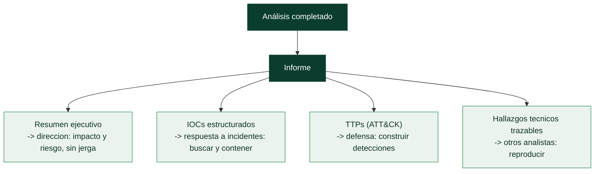

# Clase 160 — Reporte de análisis de malware

> Parte: **6 — Análisis de malware** · Fuente: *Practical Malware Analysis* y guías de reporting (SANS/DFIR)
> ⏱️ Duración estimada: **110 min** · Nivel: **Intermedio**

---

## 🎯 Objetivo

Cerrar el ciclo: convertir todo el análisis en un **informe profesional** que distintos públicos puedan usar para decidir y actuar. El alumno aprenderá a estructurar un reporte con resumen ejecutivo, hallazgos técnicos, IOCs, TTPs, evaluación de impacto y recomendaciones, y a entregar los artefactos (YARA, IOCs, config) en formatos consumibles.

## 📚 Resultados de aprendizaje

Al finalizar, el alumno podrá:

1. **Estructurar** un informe con secciones para público ejecutivo y técnico.
2. **Redactar** un resumen ejecutivo claro, sin jerga innecesaria.
3. **Documentar** hallazgos, IOCs y TTPs de forma trazable y reproducible.
4. **Evaluar** impacto, severidad y recomendaciones accionables.
5. **Entregar** artefactos consumibles (reglas YARA, IOCs, ATT&CK layer).

## 🗺️ Temas

| # | Tema | Por qué importa |
|---|------|-----------------|
| 1 | Audiencias del informe | Ejecutivo vs técnico vs defensor |
| 2 | Resumen ejecutivo | Decisiones sin leer lo técnico |
| 3 | Hallazgos técnicos trazables | Reproducibilidad y credibilidad |
| 4 | IOCs y TTPs estructurados | Detección y respuesta |
| 5 | Impacto, severidad y prioridad | Guía la acción |
| 6 | Recomendaciones accionables | Contención y erradicación |
| 7 | Entregables y formatos | Consumo por otros equipos |

## 🧠 Explicación en profundidad

### El análisis solo vale si se comunica

Como el pentest (clase 085), el análisis de malware **culmina en un informe**: todo el trabajo técnico
—desempaquetar, revertir, extraer la config— solo genera valor cuando se convierte en un documento que
**otros pueden usar** para defender, responder y decidir. Un análisis brillante que se queda en la cabeza
del analista no protege a nadie. El reporte transforma el conocimiento individual en capacidad
organizativa, y saber estructurarlo es tan parte del oficio como el análisis mismo.

### Las audiencias: un informe, varios lectores

La clave que organiza todo el reporte es que tiene **audiencias distintas con necesidades distintas**, y
cada una necesita una parte diferente. La **dirección** necesita saber el **impacto de negocio** y el
riesgo, sin jerga técnica. Los **respondedores de incidentes** (Parte 9) necesitan **IOCs accionables**
para buscar y contener la infección **ya**. Los **defensores/ingenieros de detección** (Parte 8)
necesitan los **TTPs y el comportamiento** para construir detecciones duraderas. Otros analistas necesitan
los **detalles técnicos** para continuar o reproducir el trabajo. Un buen informe sirve a todas con
secciones diferenciadas, no con un muro de texto técnico uniforme.

### Resumen ejecutivo, hallazgos trazables e indicadores estructurados

El **resumen ejecutivo** es lo primero y, para muchos lectores, lo único que leerán: en pocas frases dice
**qué es** la muestra (familia, tipo), **qué hace** (roba credenciales, cifra datos), **cuál es el
impacto** y **qué se recomienda**, todo en lenguaje de negocio. Los **hallazgos técnicos** deben ser
**trazables**: cada afirmación respaldada por evidencia (una dirección, una cadena, una captura, la orden
que la produjo), de modo que otro analista pueda verificarla o reproducirla —sin trazabilidad, un informe
es un conjunto de opiniones—. Los **IOCs** se entregan de forma **estructurada** y, idealmente, en un
formato estándar (STIX, clase 157) o al menos en tablas claras separadas por tipo (hashes, dominios, IPs,
mutex, rutas de fichero, claves de registro), listos para importar en las herramientas de detección. Y los
**TTPs** se expresan mapeados a **MITRE ATT&CK** (el hilo de toda la parte), dando a los defensores el
lenguaje que ya usan.

### Impacto, recomendaciones y entregables

El informe traduce lo técnico a **impacto, severidad y prioridad**: no basta con "hace inyección de
código", hay que decir qué significa para la organización (¿roba las credenciales bancarias de los
clientes? ¿cifra los servidores de producción?) y con qué urgencia hay que actuar. Las **recomendaciones**
han de ser **accionables**: no "mejore su seguridad" sino "bloquee estos dominios, busque este mutex en la
flota, aplique esta regla YARA, parchee esta vulnerabilidad de entrada". El objetivo, como en el pentest,
es que el informe **conduzca a acciones concretas** que reduzcan el riesgo. Los **entregables y formatos**
se adaptan al destinatario: un informe narrativo (PDF/documento) para la lectura humana, un paquete de IOCs
en STIX/CSV para las máquinas, reglas YARA (clase 156) para la detección, una entrada en MISP para
compartir con la comunidad. La lección que cierra la Parte 6 es que el análisis de malware es un proceso que
va de una muestra opaca a **inteligencia comunicada y accionable**, y que el reporte —bien estructurado
para cada audiencia, trazable, con IOCs y TTPs listos para usar— es lo que convierte horas de ingeniería
inversa en defensa real. Sin ese último paso, el mejor análisis del mundo no detiene ni un solo ataque.

## 📖 Definiciones y características

- **Resumen ejecutivo:** síntesis para dirección. Característica clave: **conclusión y riesgo** sin tecnicismos.
- **Hallazgo trazable:** afirmación respaldada por evidencia reproducible. Característica clave: **verificable**.
- **IOC estructurado:** indicador con tipo, valor y contexto. Característica clave: **listo para ingestión**.
- **Severidad:** medida de impacto y urgencia. Característica clave: **prioriza la respuesta**.
- **Entregable:** artefacto reutilizable (YARA, CSV de IOCs, capa ATT&CK). Característica clave: **acción inmediata**.

## 📔 Glosario

| Término | Definición concisa |
|---------|--------------------|
| Reporte de análisis | Documento que comunica los resultados del análisis |
| Audiencia | Lector con necesidades específicas |
| Dirección | Necesita impacto de negocio y riesgo |
| Respuesta a incidentes | Necesita IOCs accionables para contener |
| Ingeniería de detección | Necesita TTPs para construir detecciones |
| Resumen ejecutivo | Qué es, qué hace, impacto y recomendación, sin jerga |
| Hallazgo trazable | Afirmación respaldada por evidencia reproducible |
| IOCs estructurados | Indicadores en tablas o formato estándar |
| STIX | Formato estándar para entregar IOCs |
| TTP / ATT&CK | Comportamiento mapeado a la taxonomía |
| Impacto y severidad | Qué significa para la organización y con qué urgencia |
| Recomendación accionable | Acción concreta que reduce el riesgo |
| Entregables | Formatos adaptados a cada destinatario |
| Regla YARA / MISP | Entregables de detección y de compartición |

## 🧰 Herramientas y preparación

- Plantilla de informe (Markdown/Word) y **ATT&CK Navigator** para la capa.
- **MISP/STIX** o CSV para IOCs; repositorio de **reglas YARA**.
- Capturas de las herramientas usadas (ProcMon, Volatility, Wireshark, Ghidra) como evidencia.
- Guía de estilo: claro, conciso, sin especular más allá de la evidencia.

> ⚠️ **Nota ética y de seguridad:** el informe puede contener IOCs y detalles sensibles; aplica clasificación (TLP), anonimiza datos de víctimas y no incluyas la muestra ejecutable en el documento. Comparte por canales seguros.

## 🧪 Laboratorio guiado

Redacta el informe completo de una muestra analizada en la parte:

1. **Portada y metadatos:** nombre de la muestra, hashes (SHA-256, imphash), analista, fecha, TLP.
2. **Resumen ejecutivo (½ página):** qué es, qué hace, impacto y recomendación principal, en lenguaje llano.
3. **Detalles de la muestra:** tipo, familia, tamaño, packing, entorno de análisis (VM aislada).
4. **Análisis estático:** strings clave, imports/capacidades, entropía, hallazgos del desensamblado.
5. **Análisis dinámico:** árbol de procesos, persistencia, archivos/registro, mutex.
6. **Red y C2:** protocolo, dominios/IPs, patrón de beacon, config extraída.
7. **TTPs (ATT&CK):** tabla táctica/técnica/ID/evidencia + capa del Navigator adjunta.
8. **IOCs:** tabla estructurada (tipo, valor, contexto) y CSV/STIX adjunto.
9. **Impacto y severidad:** qué compromete, alcance y clasificación de severidad justificada.
10. **Recomendaciones:** detección (regla YARA adjunta), contención, erradicación y prevención.
11. **Anexos:** reglas YARA, config extraída, capturas de evidencia.

## ✍️ Ejercicios

1. Escribe un resumen ejecutivo de 8 líneas para dirección no técnica.
2. Convierte 3 hallazgos en afirmaciones trazables con su evidencia.
3. Construye una tabla de IOCs con tipo, valor y contexto.
4. Justifica una severidad (crítica/alta/media) con criterios.
5. Redacta 4 recomendaciones accionables priorizadas.
6. Adjunta una capa de ATT&CK Navigator y una regla YARA.

## 📝 Reto verificable

Entrega un **informe completo** de una muestra con las 11 secciones, IOCs estructurados, capa ATT&CK, regla YARA y resumen ejecutivo, listo para su consumo por un SOC.
**Criterio de aceptación:** un lector no técnico entiende el riesgo y la recomendación solo con el resumen ejecutivo, y un analista puede reproducir los hallazgos y desplegar los IOCs y la regla YARA adjuntos sin información adicional.

## ⚠️ Errores comunes

| Síntoma / mensaje | Causa y cómo arreglar |
|-------------------|------------------------|
| Resumen ejecutivo lleno de jerga | Reescríbelo para dirección: riesgo y acción |
| Hallazgos sin evidencia | Añade capturas/comandos que los respalden |
| IOCs en prosa | Estructúralos en tabla/CSV para ingestión |
| Recomendaciones vagas | Hazlas específicas, priorizadas y accionables |
| Incluir el binario en el doc | Nunca; adjunta hashes e IOCs, no la muestra |

## ❓ Preguntas frecuentes

**❓ ¿Un informe para todos?** No. Estructúralo por capas: resumen para dirección, detalle para analistas, entregables para el SOC.

**❓ ¿Cuánta especulación es aceptable?** La justa y marcada como tal. Separa hechos (con evidencia) de hipótesis (con nivel de confianza).

**❓ ¿Qué entregables son imprescindibles?** IOCs consumibles, TTPs mapeados a ATT&CK y al menos una detección (YARA/regla EDR) reutilizable.

## 🔗 Referencias

- Sikorski & Honig, *Practical Malware Analysis*.
- SANS — Malware analysis reporting (posters y whitepapers). <https://www.sans.org>
- MITRE ATT&CK Navigator. <https://mitre-attack.github.io/attack-navigator/>
- FIRST — TLP. <https://www.first.org/tlp/>

## 📥 Material descargable

- 📄 [Guía en PDF](./clase-160-guia.pdf) — versión imprimible de esta clase.
- 🎞️ [Presentación (PPTX)](./clase-160-presentacion.pptx) — deck para proyectar en clase.

## ⬅️ Clase anterior

[Clase 159 — Fileless malware y living-off-the-land](../159-fileless-malware-y-living-off-the-land/README.md)

## ➡️ Siguiente clase

[Clase 161 — Red Team vs pentest: filosofía y objetivos](../../parte-7-red-team-y-operaciones-ofensivas/161-red-team-vs-pentest-filosofia-y-objetivos/README.md)
