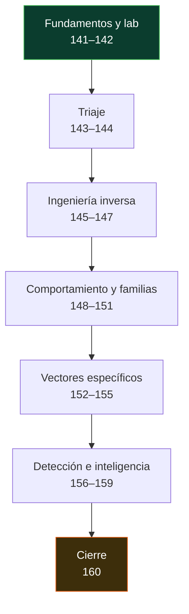

# 🦠 Parte 6 — Análisis de malware

> [⬅️ Volver al programa](../../README.md) · [📚 Índice completo](../README.md) · [⏭️ Parte siguiente](../parte-7-red-team-y-operaciones-ofensivas/README.md)

Estático, dinámico, PE, unpacking, YARA y reporte

**Fuentes de referencia de esta parte:**

- Sikorski, M. & Honig, A. — *Practical Malware Analysis* (No Starch Press).
- Monnappa K. A. — *Learning Malware Analysis* (Packt).
- Ligh, M. et al. — *The Art of Memory Forensics* (Wiley).
- Yosifovich, P. et al. — *Windows Internals* (Microsoft Press).
- MITRE ATT&CK — matriz de tácticas y técnicas adversarias.
- YARA Documentation (VirusTotal) y The DFIR Report (informes públicos).

---

## 🎯 ¿De qué trata esta parte?

El análisis de malware es la disciplina de diseccionar software malicioso para responder tres preguntas: **qué hace**, **cómo lo hace** y **cómo detectarlo**. No se trata de escribir malware, sino de leerlo: entender un binario que un adversario diseñó para resistir el análisis, extraer sus indicadores, reconstruir su comportamiento y traducir todo eso en detecciones y en un informe accionable para un equipo de respuesta.

Esta parte recorre el flujo completo del analista: montar un laboratorio aislado, hacer triaje estático y dinámico, entender el formato PE de Windows, usar desensambladores como Ghidra e IDA, vencer packers y ofuscación, seguir el comportamiento y las comunicaciones C2, y estudiar familias concretas (ransomware, rootkits, documentos maliciosos, malware de Linux y Android, fileless). Cierra con reglas YARA, threat intelligence y la redacción de un reporte profesional.

Sirve a analistas de malware, respondedores de incidentes (DFIR), threat hunters, ingenieros de detección y equipos de SOC que necesitan ir más allá del veredicto binario de un antivirus y comprender de verdad la amenaza que tienen delante.

## 🧩 Problemas que resuelve

- Montar un entorno de análisis **aislado y reversible** donde una muestra real no pueda escapar ni contaminar la red.
- Hacer **triaje rápido** de una muestra desconocida para priorizar (¿es peligrosa?, ¿qué familia?, ¿qué hace?).
- Extraer **IOCs** (hashes, dominios, IPs, mutex, claves de registro) para alimentar detección y bloqueo.
- Vencer **ofuscación, packing y anti-análisis** para llegar al código real.
- Entender el **canal C2** y las tácticas de persistencia, evasión y exfiltración.
- Escribir **firmas YARA** y detecciones de comportamiento que generalicen a la familia, no solo a una muestra.
- Producir un **informe** técnico y ejecutivo que otros puedan usar para contener y erradicar.

## 🎓 Resultados de aprendizaje

Al terminar la parte, el alumno podrá:

- Construir y operar un laboratorio de malware aislado con snapshots y sin fuga de red.
- Clasificar una muestra por tipo, familia y capacidades usando análisis estático y dinámico.
- Interpretar la estructura de un binario PE (cabeceras, secciones, imports, recursos, entropía).
- Desensamblar y anotar funciones clave en Ghidra/IDA para reconstruir la lógica del malware.
- Detectar y revertir packing y ofuscación, y hacer dump de un proceso desempacado.
- Reconstruir el comportamiento (persistencia, inyección, C2) mapeándolo a MITRE ATT&CK.
- Escribir reglas YARA robustas y de bajo falso positivo para una familia.
- Redactar un reporte de análisis con resumen ejecutivo, IOCs, TTPs y recomendaciones.

## 🧱 Prerrequisitos

- Parte 3 (fundamentos de sistemas, Windows/Linux internals básicos).
- Parte 5 (explotación de sistemas y binarios): ensamblador x86/x64, depuración, formato de ejecutables.
- Cómodo con línea de comandos en Windows y Linux, virtualización (VirtualBox/VMware) y lectura de código.

## 🗺️ Estructura temática

<!-- arco:inicio -->

<!-- arco:fin -->

| Bloque | Clases | Enfoque |
|--------|--------|---------|
| Fundamentos y lab | 141–142 | Taxonomía y laboratorio seguro |
| Triaje | 143–144 | Análisis estático y dinámico básico |
| Ingeniería inversa | 145–147 | PE, Ghidra/IDA, unpacking |
| Comportamiento y familias | 148–151 | Conducta, C2, ransomware, rootkits |
| Vectores específicos | 152–155 | Documentos, scripts, Linux, Android |
| Detección e inteligencia | 156–159 | YARA, threat intel, emulación, fileless |
| Cierre | 160 | Reporte de análisis |

## 🔗 Referencias de la parte

- *Practical Malware Analysis* — Sikorski & Honig. <https://nostarch.com/malware>
- *Learning Malware Analysis* — Monnappa K. A. <https://www.packtpub.com>
- *The Art of Memory Forensics* — Ligh, Case, Levy, Walters. <https://www.memoryanalysis.net>
- MITRE ATT&CK. <https://attack.mitre.org>
- YARA. <https://virustotal.github.io/yara/>
- The DFIR Report. <https://thedfirreport.com>

## ▶️ Empezar

[Clase 141 — Introducción al malware: tipos y taxonomía](141-introduccion-al-malware-tipos-y-taxonomia/README.md)
