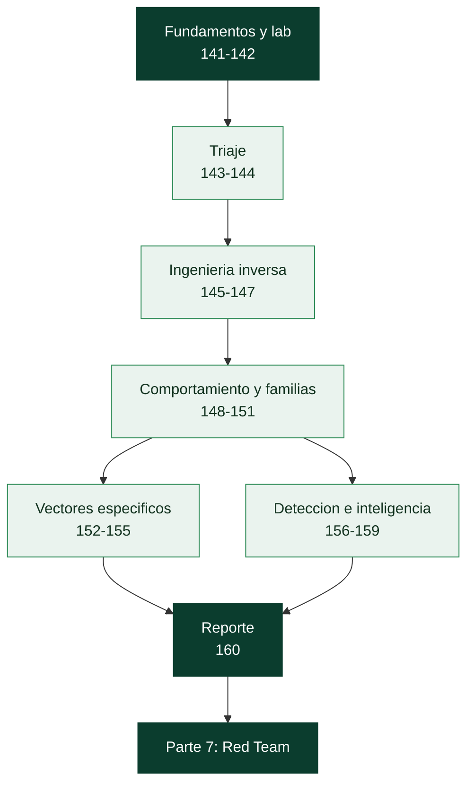

# Parte 6 — Análisis de malware

> [⬅️ Volver al programa](../../README.md) · [📚 Índice completo](../README.md) · [⏭️ Parte siguiente](../parte-7-red-team-y-operaciones-ofensivas/README.md)

**20 clases** · rango 141–160 · Estático, dinámico, PE, unpacking, YARA y reporte

**Fuentes de referencia de esta parte:**

- Sikorski, M. & Honig, A. — *Practical Malware Analysis* (No Starch Press).
- Monnappa K. A. — *Learning Malware Analysis* (Packt).
- Ligh, M. et al. — *The Art of Memory Forensics* (Wiley).
- Yosifovich, P. et al. — *Windows Internals* (Microsoft Press).
- MITRE ATT&CK — matriz de tácticas y técnicas adversarias.
- YARA Documentation (VirusTotal) y The DFIR Report (informes públicos).

---

## 🎯 ¿De qué trata esta parte?

El análisis de malware es la disciplina de diseccionar software malicioso para responder tres preguntas: **qué hace**, **cómo lo hace** y **cómo detectarlo**. No se trata de escribir malware, sino de leerlo: entender un binario que un adversario diseñó para resistir el análisis, extraer sus indicadores, reconstruir su comportamiento y traducir todo eso en detecciones y en un informe accionable para un equipo de respuesta.

Esta parte recorre el flujo completo del analista: montar un laboratorio aislado, hacer triaje estático y dinámico, entender el formato PE de Windows, usar desensambladores como Ghidra e IDA, vencer packers y ofuscación, seguir el comportamiento y las comunicaciones C2, y estudiar familias concretas (ransomware, rootkits, documentos maliciosos, malware de Linux y Android, fileless). Cierra con reglas YARA, threat intelligence y la redacción de un reporte profesional.

Sirve a analistas de malware, respondedores de incidentes (DFIR), threat hunters, ingenieros de detección y equipos de SOC que necesitan ir más allá del veredicto binario de un antivirus y comprender de verdad la amenaza que tienen delante.

## 🧩 Problemas que resuelve

- Montar un entorno de análisis **aislado y reversible** donde una muestra real no pueda escapar ni contaminar la red.
- Hacer **triaje rápido** de una muestra desconocida para priorizar (¿es peligrosa?, ¿qué familia?, ¿qué hace?).
- Extraer **IOCs** (hashes, dominios, IPs, mutex, claves de registro) para alimentar detección y bloqueo.
- Vencer **ofuscación, packing y anti-análisis** para llegar al código real.
- Entender el **canal C2** y las tácticas de persistencia, evasión y exfiltración.
- Escribir **firmas YARA** y detecciones de comportamiento que generalicen a la familia, no solo a una muestra.
- Producir un **informe** técnico y ejecutivo que otros puedan usar para contener y erradicar.

## 🎓 Resultados de aprendizaje

Al terminar la parte, el alumno podrá:

- Construir y operar un laboratorio de malware aislado con snapshots y sin fuga de red.
- Clasificar una muestra por tipo, familia y capacidades usando análisis estático y dinámico.
- Interpretar la estructura de un binario PE (cabeceras, secciones, imports, recursos, entropía).
- Desensamblar y anotar funciones clave en Ghidra/IDA para reconstruir la lógica del malware.
- Detectar y revertir packing y ofuscación, y hacer dump de un proceso desempacado.
- Reconstruir el comportamiento (persistencia, inyección, C2) mapeándolo a MITRE ATT&CK.
- Escribir reglas YARA robustas y de bajo falso positivo para una familia.
- Redactar un reporte de análisis con resumen ejecutivo, IOCs, TTPs y recomendaciones.

## 🧱 Prerrequisitos

Esta parte apoya el análisis en varios cimientos de las partes anteriores:

| Necesitas tener claro… | Dónde se cubre |
|---|---|
| Ingeniería inversa: ELF/PE, Ghidra, estático vs dinámico | [Parte 5](../parte-5-explotacion-de-sistemas-y-binarios/README.md) · [Clases 130–135](../parte-5-explotacion-de-sistemas-y-binarios/130-ingenieria-inversa-introduccion/README.md) |
| Laboratorio aislado con snapshots | [Clase 004](../parte-0-fundamentos-y-prerrequisitos/004-montaje-del-laboratorio-virtualizacion-kali-snapshots-y-aislamiento-de-red/README.md) |
| Hashing, cifrado híbrido (para ransomware) | [Clases 049](../parte-2-criptografia-aplicada/049-cifrado-asimetrico-rsa/README.md), [051](../parte-2-criptografia-aplicada/051-funciones-hash-sha-2-sha-3-y-sus-propiedades/README.md) |
| Persistencia, C2, exfiltración (desde el ataque) | [Clases 082–083](../parte-3-hacking-etico-y-pentesting-metodologia/082-persistencia-en-sistemas-comprometidos/README.md) |
| DNS tunneling y beaconing (para el C2) | [Clases 041](../parte-1-redes-y-seguridad-de-redes/041-seguridad-de-dns-envenenamiento-dnssec-y-tunneling/README.md), [045](../parte-1-redes-y-seguridad-de-redes/045-netflow-y-analisis-de-metadatos-de-trafico/README.md) |
| Diamond Model y MITRE ATT&CK | [Clase 003](../parte-0-fundamentos-y-prerrequisitos/003-frameworks-de-seguridad-nist-csf-iso-27001-mitre-att-ck-y-diamond-model/README.md) |

## 🧭 Cómo recorrer esta parte

**El orden va del método a las especializaciones.** Las clases 141–148 construyen el flujo de trabajo fundamental (laboratorio, triaje, PE, RE, unpacking, comportamiento) que todo lo demás da por sabido; a partir de ahí, las clases de familias y vectores (149–155) y las de detección e inteligencia (156–160) se apoyan en ese método. Conviene recorrer el bloque fundamental en orden y sin saltos; los vectores específicos (documentos, scripts, Linux, Android) son más independientes entre sí.

**El ritmo.** La parte suma unas **39 h 40 min** de trabajo guiado, más el tiempo de laboratorio con muestras reales, que es considerable. A dos horas al día son unas **cinco semanas**.

**El método, clase a clase.**

1. Lee **🎯 Objetivo** y **📚 Resultados de aprendizaje**.
2. Lee **🧠 Explicación en profundidad** antes de detonar nada. El *porqué* de cada técnica —por qué el malware se empaqueta, por qué usa LOLBins— es lo que hace reconocibles las variantes nuevas.
3. Prepara el **laboratorio aislado** de **🧰 Herramientas y preparación**. En esta parte esto no es negociable: se trabaja con malware real.
4. Haz el **🧪 Laboratorio guiado** con snapshots, restaurando tras cada muestra.
5. Resuelve **✍️ Ejercicios** y el **📝 Reto verificable**.
6. Repasa el **📔 Glosario**: la parte encadena muchas siglas (IAT, OEP, DKOM, DGA, LOLBin, IOC, TTP).

> ⚠️ **Uso ético y seguridad — la clase 142 precede a todo.** Aquí se manejan **muestras de malware reales**, diseñadas para infectar. Se trabaja **siempre** en un laboratorio aislado (host-only, sin ruta a Internet ni a la red real), con snapshots, y con las muestras guardadas cifradas (contraseña `infected`). Un laboratorio mal montado te convierte en la primera víctima o en el vector que infecta a tu organización. **No detones una muestra hasta haber montado y verificado el aislamiento de la clase 142.**

## 🧱 Anatomía de una clase

Las 20 clases siguen el **estándar pedagógico profundo** del programa:

| Sección | Qué contiene | Para qué la usas |
|---|---|---|
| 🎯 Objetivo | Qué sabrás hacer al terminar y por qué importa | Decidir si necesitas la clase |
| 📚 Resultados de aprendizaje | Lista verificable de capacidades concretas | Autoevaluarte al final |
| 🗺️ Temas | Cada tema con el porqué de su inclusión | Ubicarte antes de leer |
| 🧠 Explicación en profundidad | El mecanismo del malware y cómo revertirlo, con diagramas | Entender, no memorizar recetas |
| 📖 Definiciones y características | Cada término desarrollado con su relevancia | Consulta puntual |
| 📔 Glosario | Términos y siglas de la clase, en tabla | Repaso rápido |
| 🧰 Herramientas y preparación | Qué instalar y qué laboratorio montar | Antes del laboratorio |
| 🧪 Laboratorio guiado | Análisis paso a paso de una muestra, en aislamiento | Donde de verdad se aprende |
| ✍️ Ejercicios · 📝 Reto verificable | Práctica propia y una muestra que analizar | Consolidar y demostrar |
| ⚠️ Errores comunes · ❓ Preguntas frecuentes | Tropiezos reales y dudas auténticas | Cuando algo no encaja |
| 🔗 Referencias | Sikorski, Monnappa, ATT&CK, DFIR Report | Profundizar |

El CI del repositorio verifica que ninguna clase de esta parte pierda las secciones **🧠 Explicación en profundidad** ni **📔 Glosario**.

## 🗺️ Estructura temática

| Bloque | Clases | Enfoque | Tiempo |
|--------|--------|---------|--------|
| Fundamentos y lab | 141–142 | Taxonomía y laboratorio seguro | ≈ 3 h 15 |
| Triaje | 143–144 | Análisis estático y dinámico básico | ≈ 3 h 20 |
| Ingeniería inversa | 145–147 | PE, Ghidra/IDA, unpacking | ≈ 6 h 20 |
| Comportamiento y familias | 148–151 | Conducta, C2, ransomware, rootkits | ≈ 8 h 20 |
| Vectores específicos | 152–155 | Documentos, scripts, Linux, Android | ≈ 7 h 40 |
| Detección e inteligencia | 156–159 | YARA, threat intel, emulación, fileless | ≈ 7 h 40 |
| Cierre | 160 | Reporte de análisis | ≈ 1 h 50 |

## 📖 Guía capítulo a capítulo

### 🧪 Bloque 1 · Fundamentos y laboratorio — clases 141 a 142

- **[141 · Introducción al malware: tipos y taxonomía](141-introduccion-al-malware-tipos-y-taxonomia/README.md)** · 75 min — Clasificar por comportamiento, no por nombre comercial. Las categorías (propagación, acceso, impacto, sigilo), familia/variante/campaña, y por qué ATT&CK pone orden en el caos de nombres.
- **[142 · Laboratorio seguro de análisis de malware](142-laboratorio-seguro-de-analisis-de-malware/README.md)** · 120 min — Analizar sin infectarte, la regla que precede a todo. La arquitectura de dos VMs (FLARE VM + REMnux/INetSim), los snapshots, y los dos enemigos: la evasión y el descuido.

### 🔍 Bloque 2 · Triaje — clases 143 a 144

- **[143 · Análisis estático básico](143-analisis-estatico-basico/README.md)** · 90 min — Aprender de la muestra sin ejecutarla. Hashes (exactos y difusos), strings, imports como mapa de capacidades, entropía como indicador de packing, y el contraste con VirusTotal.
- **[144 · Análisis dinámico básico y sandboxing](144-analisis-dinamico-basico-y-sandboxing/README.md)** · 120 min — Detonar y observar. La metodología del baseline (ProcMon, Regshot), los marcadores de infección (mutex), y los sandboxes automáticos con su enemigo, el anti-análisis.

### 🔬 Bloque 3 · Ingeniería inversa — clases 145 a 147

- **[145 · El formato PE de Windows](145-el-formato-pe-de-windows/README.md)** · 110 min — El formato de todo ejecutable de Windows. De la cabecera MZ a los NT headers, RVA vs raw offset, la IAT, y las anomalías que delatan malware.
- **[146 · Análisis con IDA y Ghidra aplicado a malware](146-analisis-con-ida-y-ghidra-aplicado-a-malware/README.md)** · 140 min — Leer el código con un adversario que dificulta el análisis. Las APIs de Windows como mapa de intenciones, y la resolución dinámica de APIs (API hashing) que hay que revertir.
- **[147 · Ofuscación, packing y unpacking](147-ofuscacion-packing-y-unpacking/README.md)** · 130 min — Casi todo el malware está empaquetado. Identificar el packer, el caso fácil (UPX), y el unpacking manual: OEP, dump de memoria y reconstrucción de la IAT.

### 🧠 Bloque 4 · Comportamiento y familias — clases 148 a 151

- **[148 · Análisis de comportamiento](148-analisis-de-comportamiento/README.md)** · 120 min — De acciones sueltas al comportamiento como sistema. Persistencia, inyección de código, evasión, y la forense de memoria con Volatility, todo mapeado a ATT&CK.
- **[149 · Comunicaciones de C2](149-comunicaciones-de-comando-y-control-c2-del-malware/README.md)** · 120 min — El cordón umbilical del malware. El modelo de beacon (y por qué su regularidad lo delata), los protocolos, DGA y dead drops, y la extracción de configuración.
- **[150 · Ransomware: anatomía y análisis](150-ransomware-anatomia-y-analisis/README.md)** · 130 min — La amenaza que definió la década. El modelo RaaS, el esquema criptográfico híbrido que lo hace irreversible, la destrucción de respaldos, y la doble extorsión.
- **[151 · Rootkits y bootkits](151-rootkits-y-bootkits/README.md)** · 130 min — Malware que se esconde manipulando el sistema. De usuario a kernel (API hooking, DKOM), los bootkits (UEFI), la detección por memoria, y el BYOVD.

### 📄 Bloque 5 · Vectores específicos — clases 152 a 155

- **[152 · Documentos maliciosos: macros y PDF](152-analisis-de-documentos-maliciosos-macros-y-pdf/README.md)** · 110 min — El vector de entrada favorito. Office (OLE/OOXML, macros VBA), PDF (JavaScript, /OpenAction), y la cadena de entrega con LOLBins.
- **[153 · Malware en scripts: PowerShell y JavaScript](153-analisis-de-malware-en-scripts-powershell-y-javascript/README.md)** · 110 min — Por qué los atacantes aman los scripts. PowerShell ofensivo y su ofuscación, el WSH (JScript/HTA), la desofuscación segura, y AMSI.
- **[154 · Malware en Linux](154-malware-en-linux/README.md)** · 120 min — El malware no es solo de Windows. ELF, LD_PRELOAD y la persistencia en Linux, los rootkits LKM, y las familias (Mirai, cryptominers) donde servidores e IoT son el premio.
- **[155 · Malware en Android](155-malware-en-android/README.md)** · 120 min — El malware en el dispositivo que llevamos encima. El APK y el manifiesto, la decompilación a Java, y el abuso de Accessibility y overlays de los troyanos bancarios.

### 🎯 Bloque 6 · Detección e inteligencia — clases 156 a 159

- **[156 · Reglas YARA para detección](156-reglas-yara-para-deteccion/README.md)** · 110 min — Convertir el análisis en detección reutilizable. La anatomía de una regla (strings + condition), el módulo `pe`, el equilibrio del falso positivo, y las reglas por familia.
- **[157 · Threat intelligence a partir de malware](157-threat-intelligence-a-partir-de-malware/README.md)** · 110 min — De analizar una muestra a entender al adversario. La Pyramid of Pain (qué IOCs de verdad duelen), el pivoteo, la atribución con cautela, y STIX/TAXII/MISP.
- **[158 · Emulación y unpacking automatizado](158-emulacion-y-unpacking-automatizado/README.md)** · 130 min — Escalar el análisis. Unicorn (emular la CPU) vs Qiling (CPU + SO), los tres usos (API hashing, unpacking, extracción de config), y los pipelines de triaje.
- **[159 · Fileless malware y living-off-the-land](159-fileless-malware-y-living-off-the-land/README.md)** · 110 min — Malware sin fichero, la evasión por diseño. Persistencia sin fichero, los LOLBins, y el cambio de paradigma de la defensa: del disco al comportamiento (Sysmon, EDR).

### 📝 Bloque 7 · Cierre — clase 160

- **[160 · Reporte de análisis de malware](160-reporte-de-analisis-de-malware/README.md)** · 110 min — El análisis solo vale si se comunica. Las audiencias (dirección, respuesta, detección), el resumen ejecutivo, los IOCs estructurados y los TTPs, y las recomendaciones accionables.

## 🧰 Qué tendrás al terminar

- Un **laboratorio de malware** aislado, reversible y verificado, montado por ti.
- Un **flujo de triaje** que va del estático (hashes, strings, imports, entropía) al dinámico (ProcMon, Regshot, red simulada).
- La capacidad de **leer el formato PE**, desensamblar en Ghidra/IDA y **desempaquetar** malware (OEP, dump, IAT).
- Una **matriz de comportamiento** mapeada a ATT&CK, con la forense de memoria (Volatility) para lo que el disco no muestra.
- Análisis practicado de **familias reales**: ransomware, rootkits, maldocs, scripts, Linux, Android, fileless.
- **Reglas YARA** por familia, un extractor de configuración, y la **inteligencia** (IOCs + TTPs) lista para compartir.
- Un **reporte** estructurado para cada audiencia, que convierte el análisis en defensa real.

## 🚦 ¿Puedo saltarme clases?

El bloque fundamental (141–148) no se salta; los vectores específicos sí, si no aplican a tu trabajo. Sáltate una clase solo si respondes de memoria a su pregunta de control:

| Si dominas… | Pregunta de control | Si titubeas |
|---|---|---|
| Laboratorio (142) | ¿Qué hace INetSim y por qué es imprescindible? | Haz 142 |
| Estático (143) | ¿Por qué los imports revelan las capacidades de una muestra? | Haz 143 |
| PE (145) | ¿Qué diferencia una RVA de un raw offset? | Haz 145 |
| Unpacking (147) | ¿Qué es el OEP y por qué hay que localizarlo? | Haz 147 |
| C2 (149) | ¿Por qué el beaconing se detecta aun con tráfico cifrado? | Haz 149 |
| Fileless (159) | ¿Por qué el LotL derrota la detección basada en ficheros? | Haz 159 |

## 🔗 Referencias de la parte

- *Practical Malware Analysis* — Sikorski & Honig. <https://nostarch.com/malware>
- *Learning Malware Analysis* — Monnappa K. A. <https://www.packtpub.com>
- *The Art of Memory Forensics* — Ligh, Case, Levy, Walters. <https://www.memoryanalysis.net>
- MITRE ATT&CK. <https://attack.mitre.org>
- YARA. <https://virustotal.github.io/yara/>
- The DFIR Report. <https://thedfirreport.com>

## ▶️ Empezar

[Clase 141 — Introducción al malware: tipos y taxonomía](141-introduccion-al-malware-tipos-y-taxonomia/README.md)
