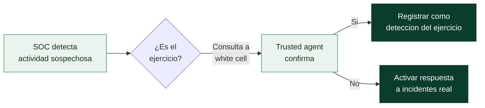

# Clase 161 — Red Team vs pentest: filosofía y objetivos

> Parte: **7 — Red Team y operaciones ofensivas** · Fuente: *Red Team Development and Operations (Vest & Tubberville)*
> ⏱️ Duración estimada: **90 min** · Nivel: **Intermedio**

---

## 🎯 Objetivo

Entender qué distingue realmente a un ejercicio de Red Team de un pentest tradicional: no es "hacking más avanzado", sino un cambio de filosofía. El alumno aprenderá a encuadrar una operación adversarial en torno a **objetivos de negocio**, a definir Rules of Engagement (RoE) sólidas y a articular por qué emular a un adversario mejora la defensa mucho más que un listado de vulnerabilidades.

## 📚 Resultados de aprendizaje

Al finalizar, el alumno podrá:

1. **Contrastar** pentest, Red Team y vulnerability assessment según objetivo, alcance y métrica de éxito.
2. **Redactar** los objetivos de una operación (flags/crown jewels) y sus RoE mínimas.
3. **Explicar** el concepto de "assumed breach" y cuándo conviene sobre un ataque desde cero.
4. **Situar** al Red Team dentro del modelo de madurez defensiva de una organización.
5. **Diseñar** los criterios de detección/respuesta que el ejercicio pretende evaluar.

## 🗺️ Temas

| # | Tema | Por qué importa |
|---|------|-----------------|
| 1 | Pentest vs Red Team vs VA | Evita vender un servicio por otro y fija expectativas |
| 2 | Objetivos ("crown jewels") | Un Red Team persigue metas, no cobertura exhaustiva |
| 3 | Rules of Engagement | Define lo permitido; protege legal y operativamente |
| 4 | Assumed breach | Ahorra tiempo cuando el foco es detección, no perímetro |
| 5 | Threat-informed vs opportunistic | Emular a un actor real da realismo y relevancia |
| 6 | Trusted agent y white cell | Coordina el ejercicio y evita incidentes reales |
| 7 | Métricas de éxito | Traduce el ejercicio en valor defensivo medible |

## 🧠 Explicación en profundidad

No es que el Red Team sea "un pentest con hackers mejores". Es que responde a una **pregunta distinta**. El pentest pregunta *"¿qué vulnerabilidades explotables hay en este alcance?"*; el Red Team pregunta *"si un adversario real fuera a por nuestras joyas de la corona, ¿lo detectaríamos y responderíamos a tiempo?"*. La primera evalúa **sistemas**; la segunda evalúa a **personas y procesos** —el SOC, la detección, el plan de respuesta—. Confundirlas lleva al desastre comercial clásico: vender un Red Team a quien todavía no parchea lo básico, entregar un informe de tres hallazgos sigilosos y dejar al cliente pensando que "no encontraron nada".

### Tres servicios que se confunden

Hay un continuo de madurez, no un ranking de dificultad:

| Servicio | Pregunta que responde | Métrica de éxito | Ruido tolerado |
|---|---|---|---|
| **Vulnerability Assessment** | ¿Qué debilidades conocidas tengo? | Cobertura y exhaustividad | Máximo (escaneo abierto) |
| **Penetration test** | ¿Qué puede explotar un atacante aquí? | Nº y severidad de vías demostradas | Alto (importa encontrar, no esconderse) |
| **Red Team** | ¿Detectamos y respondemos a un adversario con objetivo? | Tiempo a detección/respuesta y objetivos logrados | Mínimo (el sigilo es parte de la prueba) |

Cada uno es el correcto en un momento distinto de madurez. Un VA es la base; el pentest demuestra impacto; el Red Team solo aporta valor cuando ya existe una **capacidad defensiva que medir**.

### Objetivos de negocio, no cobertura

Un pentest busca *ancho* (cubrir el alcance); un Red Team busca *profundidad hacia una meta*. Esa meta se expresa primero en lenguaje de negocio —"¿puede un externo leer la nómina en tres semanas sin ser visto?"— y luego se traduce en **flags** técnicas verificables: leer una tabla señuelo marcada, obtener credenciales de un DBA, alcanzar un segmento aislado. Las flags convierten el difuso "hackear la empresa" en un criterio binario de éxito, y evitan que el ejercicio degenere en una caza indiscriminada de bugs.

### Assumed breach: empezar dentro

Gastar dos de tres semanas cruzando el perímetro por phishing suele ser **malgastar el presupuesto** cuando lo que la organización quiere saber es qué pasa *después* de la primera víctima —porque el phishing, con tiempo, siempre acaba funcionando—. El modelo **assumed breach** concede un punto de apoyo inicial (una workstation, un usuario de bajo privilegio) y enfoca el ejercicio en la post-explotación: movimiento lateral, escalada, detección. No es "hacer trampa"; es reconocer un hecho estadístico y comprar realismo donde de verdad importa.

### RoE, white cell y deconfliction

Todo lo anterior solo es ético y seguro dentro de un marco escrito: las **Rules of Engagement**. Fijan qué sistemas están dentro y fuera de alcance, qué técnicas se prohíben (DoS, ransomware real, tocar dispositivos médicos o SCADA de producción), la ventana horaria y los contactos de escalado. En paralelo, una **white cell** (personas informadas del ejercicio) permite la **deconfliction**: cuando el SOC ve una alerta y no sabe si es un incidente real o el Red Team, un canal de confirmación evita activar un plan de crisis innecesario.

### Medir para que el ejercicio valga

El entregable de un Red Team no es una lista de CVEs: es una **medición de la defensa**. Las tres métricas nucleares son el **TTD** (tiempo a detección: cuánto tardó el Blue Team en ver la actividad), el **TTR** (tiempo a respuesta: cuánto tardó en contenerla) y la **cobertura** (qué porcentaje de las técnicas ejecutadas generó una alerta). Estas cifras, más el camino narrado hasta las flags, son lo que convierte el ejercicio en mejoras concretas de detección —y el puente natural hacia el purple teaming, donde Red y Blue afinan juntos.

## 📖 Definiciones y características

- **Red Team**: emulación de un adversario con objetivos concretos, priorizando sigilo y evaluación de la capacidad de **detección y respuesta**. Característica clave: mide a la defensa, no solo al sistema.
- **Penetration test**: evaluación técnica orientada a **encontrar y demostrar** el mayor número de vulnerabilidades explotables en un alcance. Característica: cobertura amplia, ruido aceptable.
- **Rules of Engagement (RoE)**: documento que fija qué, cómo, cuándo y dónde se puede atacar, contactos de emergencia y límites. Característica: es el contrato operativo.
- **Assumed breach**: se parte de un punto de apoyo ya concedido (una workstation, un usuario) para centrarse en post-explotación. Característica: optimiza el tiempo hacia el objetivo.
- **Crown jewels / flags**: los activos o acciones que definen el éxito (ej. leer la base de datos de RRHH). Característica: convierten "hackear" en un objetivo verificable.
- **White cell / trusted agent**: personas informadas que supervisan el ejercicio y pueden pausarlo. Característica: red de seguridad del engagement.

## 📔 Glosario

| Término | Definición concisa |
|---------|--------------------|
| Red Team | Emulación de un adversario con objetivo para medir detección y respuesta |
| Penetration test | Evaluación técnica que busca demostrar el máximo de vías explotables |
| Vulnerability Assessment (VA) | Inventario de debilidades conocidas, sin explotación profunda |
| Crown jewels | Activos críticos cuyo compromiso define el éxito del ejercicio |
| Flag | Meta técnica verificable derivada del objetivo de negocio |
| Rules of Engagement (RoE) | Contrato que fija alcance, técnicas permitidas, ventanas y contactos |
| Assumed breach | Empezar con un punto de apoyo ya concedido para evaluar la post-explotación |
| Threat-informed | Ejercicio guiado por la inteligencia de un adversario real |
| White cell | Personas informadas que supervisan el ejercicio y pueden pausarlo |
| Trusted agent | Contacto autorizado que confirma o desmiente actividad del ejercicio |
| Deconfliction | Proceso para distinguir una alerta del ejercicio de un incidente real |
| TTD | Tiempo a detección: cuánto tarda la defensa en ver la actividad |
| TTR | Tiempo a respuesta: cuánto tarda en contener la actividad |
| Cobertura de detección | Porcentaje de técnicas ejecutadas que generaron alerta |
| Purple team | Colaboración en tiempo real de Red y Blue para mejorar detecciones |
| Operation Charter | Documento breve que fija objetivo, flags, RoE y métricas del ejercicio |

## 🧰 Herramientas y preparación

Esta clase es de planificación; el "tooling" es documental. Prepara:

- Una plantilla de **RoE** y de **plan de operación** (puedes basarte en las de redteam.guide).
- Un **cuaderno de operación** (Obsidian, un repo Git privado o incluso Markdown) para registrar decisiones y tiempos.
- Acceso al catálogo de **MITRE ATT&CK** para más adelante mapear las técnicas al plan.
- Un diagrama de la organización objetivo ficticia (usaremos "ACME Corp" como caso de estudio de laboratorio).

> ⚠️ Todo el ejercicio se plantea sobre una organización ficticia de laboratorio o con autorización escrita. La planificación sin autorización no ataca nada, pero define el marco legal que hace ético todo lo que viene después.

## 🧪 Laboratorio guiado (ejercicio aplicado)

Como esta clase es conceptual, el laboratorio es un **taller de planificación** de un ejercicio para "ACME Corp":

1. **Define el objetivo de negocio.** Escribe una frase única: "Demostrar si un atacante externo puede acceder a la base de datos de nómina en 3 semanas sin ser detectado."
2. **Traduce a flags técnicas.** Deriva metas verificables: (a) acceso a un endpoint de finanzas, (b) credenciales de un DBA, (c) lectura de una tabla marcada como señuelo.
3. **Elige el punto de partida.** Decide entre *external* (desde internet) o *assumed breach* (workstation ya comprometida) y justifica la elección según lo que la organización quiere evaluar.
4. **Redacta las RoE mínimas.** Ventana horaria, sistemas fuera de alcance (producción crítica, dispositivos médicos), técnicas prohibidas (DoS, ransomware real), y contactos de escalado.
5. **Define señales de detección esperadas.** Lista qué eventos debería generar cada fase y quién en el Blue Team debería verlos.
6. **Establece las métricas.** Tiempo-a-detección (TTD), tiempo-a-respuesta (TTR), y porcentaje de técnicas detectadas.
7. **Documenta un plan de comunicación** con la white cell (deconfliction): cómo confirmar que una alerta real es del ejercicio.

## ✍️ Ejercicios

1. Escribe en una tabla las 5 diferencias más importantes entre pentest y Red Team.
2. Redacta un objetivo de negocio y tres flags técnicas derivadas para una empresa de e-commerce.
3. Enumera 8 cláusulas que consideres imprescindibles en unas RoE y justifica dos de ellas.
4. Argumenta cuándo un *assumed breach* es mejor que un ataque desde cero, con un ejemplo.
5. Diseña una tabla de métricas (TTD/TTR/cobertura) con valores objetivo razonables.
6. Explica qué es la "deconfliction" y describe un procedimiento para evitar un incidente real innecesario.

## 📝 Reto verificable

Produce un **documento de una página** ("Operation Charter") para ACME Corp que contenga: objetivo de negocio, 3 flags, tipo de inicio, 6 RoE, un plan de deconfliction y 3 métricas de éxito.
**Criterio de aceptación:** cualquier persona ajena podría leerlo y saber qué está autorizado, qué se persigue y cómo se medirá el éxito, sin ambigüedad.

## ⚠️ Errores comunes

| Síntoma / mensaje | Causa y cómo arreglar |
|-------------------|-----------------------|
| El cliente esperaba "todas las vulnerabilidades" | Se vendió Red Team pero se necesitaba un pentest; alinea expectativas antes de firmar |
| El equipo dispara alarmas y cunde el pánico | Falta deconfliction; establece un canal y un código con la white cell |
| El ejercicio se sale de alcance | RoE vagas; especifica sistemas, técnicas y ventanas con precisión |
| No hay forma de decir si "salió bien" | Objetivos no verificables; define flags concretas y medibles |
| Se toca producción crítica | Falta lista de exclusiones; marca sistemas prohibidos explícitamente |

## ❓ Preguntas frecuentes

**❓ ¿Un Red Team siempre es "mejor" que un pentest?**
No. Si una organización aún no parchea lo básico, un pentest da más valor. El Red Team evalúa detección/respuesta; solo tiene sentido cuando ya existe una capacidad defensiva que medir.

**❓ ¿Qué es "purple team" en este contexto?**
Cuando Red y Blue colaboran en tiempo real para mejorar detecciones. Lo veremos en la Clase 178; aquí basta saber que es el destino natural del valor del ejercicio.

**❓ ¿El assumed breach no "hace trampa"?**
No: reconoce que el phishing eventualmente funciona y enfoca el presupuesto en lo que de verdad se quiere evaluar (¿detectamos y respondemos una vez dentro?).

## 🔗 Referencias

- Vest, J. & Tubberville, J. *Red Team Development and Operations*. <https://redteam.guide/>
- MITRE — *Red Team measures of effectiveness*. <https://attack.mitre.org/resources/>
- NIST SP 800-115 — *Technical Guide to Information Security Testing*.
- CREST — *Red Team Guide*. <https://www.crest-approved.org/>

## 📥 Material descargable

- 📄 [Guía en PDF](./clase-161-guia.pdf) — versión imprimible de esta clase.
- 🎞️ [Presentación (PPTX)](./clase-161-presentacion.pptx) — deck para proyectar en clase.

## ⬅️ Clase anterior

[Clase 160 — Reporte de análisis de malware](../../parte-6-analisis-de-malware/160-reporte-de-analisis-de-malware/README.md)

## ➡️ Siguiente clase

[Clase 162 — MITRE ATT&CK como lenguaje ofensivo](../162-mitre-att-ck-como-lenguaje-ofensivo/README.md)
