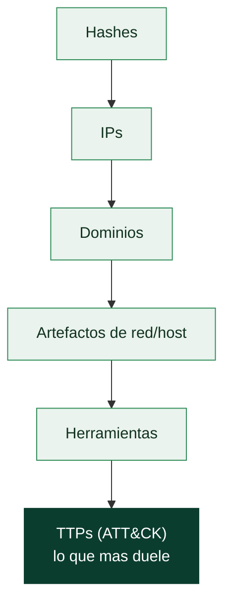

# Clase 162 — MITRE ATT&CK como lenguaje ofensivo

> Parte: **7 — Red Team y operaciones ofensivas** · Fuente: *MITRE ATT&CK Framework (attack.mitre.org)*
> ⏱️ Duración estimada: **90 min** · Nivel: **Intermedio**

---

## 🎯 Objetivo

Dominar MITRE ATT&CK como el vocabulario común entre atacantes y defensores. El alumno aprenderá la estructura del framework (tácticas, técnicas, subtécnicas, procedimientos), a mapear acciones ofensivas a IDs concretos y a usar ATT&CK Navigator para planificar cobertura y comunicar resultados de forma que el Blue Team pueda accionarlos.

## 📚 Resultados de aprendizaje

Al finalizar, el alumno podrá:

1. **Explicar** la jerarquía Táctica → Técnica → Subtécnica → Procedimiento.
2. **Mapear** una acción ofensiva concreta a su ID de ATT&CK (ej. `T1059.001`).
3. **Construir** un layer en ATT&CK Navigator para planificar una operación.
4. **Relacionar** técnicas con sus fuentes de datos (Data Sources) y detecciones.
5. **Diferenciar** las matrices Enterprise, Mobile e ICS.

## 🗺️ Temas

| # | Tema | Por qué importa |
|---|------|-----------------|
| 1 | Tácticas (el "por qué") | Son las 14 metas del adversario (TA00xx) |
| 2 | Técnicas y subtécnicas | El "cómo" concreto (Txxxx / Txxxx.00x) |
| 3 | Procedimientos | Implementación real de una técnica por un grupo |
| 4 | Grupos (G) y Software (S) | Vinculan técnicas a actores reales |
| 5 | Data Sources y detección | Une ofensiva con telemetría defensiva |
| 6 | ATT&CK Navigator | Visualiza cobertura y planifica |
| 7 | Matrices Enterprise/ICS/Mobile | Distinto alcance según el entorno |

## 🧠 Explicación en profundidad

ATT&CK no es "una lista de ataques": es un **vocabulario compartido** entre quien ataca y quien defiende. Antes de ATT&CK, un informe decía "el atacante usó técnicas avanzadas de persistencia" y cada lector entendía algo distinto. Hoy decimos `T1547.001` (Registry Run Keys) y todos —Red Team, SOC, threat intel— hablan del mismo comportamiento, con la misma detección asociada. Ese lenguaje común es lo que convierte un ejercicio ofensivo en algo que la defensa puede **medir y accionar**.

### La jerarquía: por qué / cómo / con qué

El framework se organiza en cuatro niveles que van de lo abstracto a lo concreto:

| Nivel | Responde a | Ejemplo |
|---|---|---|
| **Táctica** | El *por qué* (la meta) | Credential Access |
| **Técnica** | El *cómo* general | `T1003` OS Credential Dumping |
| **Subtécnica** | El *cómo* específico | `T1003.001` LSASS Memory |
| **Procedimiento** | La *implementación* real observada | APT29 vuelca LSASS con comsvcs.dll |

Entender esta jerarquía es lo que evita el error más común: confundir la táctica (el objetivo) con la técnica (el método). Hay 14 tácticas en la matriz Enterprise —de Initial Access a Impact— y cientos de técnicas colgando de ellas.

### De IOC a comportamiento: la Pyramid of Pain

Por qué ATT&CK importa tanto se entiende con la **Pyramid of Pain**: bloquear un hash o una IP le cuesta al adversario segundos (cambia el fichero, rota el servidor). Pero detectar un **comportamiento** —volcar LSASS, kerberoasting— le obliga a cambiar su forma de operar, que es caro y lento. ATT&CK cataloga precisamente esa capa alta de la pirámide: los TTPs, lo que de verdad duele al adversario cuando lo detectas.



### Grupos, software y Data Sources

ATT&CK no cataloga solo comportamientos: los ata a la realidad. Los **Grupos** (`G0016` APT29) enumeran las técnicas atribuidas a un actor; el **Software** (`S0154` Cobalt Strike) las que implementa una herramienta. Y cada técnica lista sus **Data Sources** —la telemetría que permite verla: Process Creation, Command Execution, Network Traffic—. Ese campo es el puente hacia el SIEM: te dice qué log necesitas para detectar la técnica que planeas ejecutar.

### Navigator: planificar y comunicar cobertura

El **ATT&CK Navigator** es la hoja de cálculo del framework: una matriz coloreable donde marcas las técnicas de tu plan (una *layer* ofensiva) y el Blue Team marca las que sabe detectar (una *layer* defensiva). Superponer ambas revela los **huecos de cobertura** de un vistazo —las técnicas que ejecutarás y nadie verá—. Es a la vez herramienta de planificación del Red Team y de comunicación con la defensa.

### Enterprise, Mobile e ICS

ATT&CK no es una sola matriz. **Enterprise** cubre Windows, Linux, macOS, nube y contenedores; **Mobile** cubre Android/iOS; **ICS** cubre entornos industriales (con tácticas propias como *Inhibit Response Function*). Aplicar una técnica de la matriz equivocada —emular un ataque a un PLC en una red puramente ofimática— produce un plan irreal. Elegir la matriz correcta es el primer paso de cualquier mapeo.

## 📖 Definiciones y características

- **Táctica**: objetivo táctico del adversario (Initial Access, Execution, Persistence...). Característica: responde al "por qué".
- **Técnica**: método para lograr una táctica (ej. `T1059` Command and Scripting Interpreter). Característica: responde al "cómo".
- **Subtécnica**: variante específica (ej. `T1059.001` PowerShell). Característica: granularidad para detección.
- **Procedimiento**: implementación concreta observada in-the-wild. Característica: es lo más cercano a IOC/comportamiento real.
- **Grupo (Gxxxx)**: actor de amenaza catalogado (ej. `G0016` APT29). Característica: agrupa técnicas atribuidas.
- **Data Source**: telemetría que permite observar una técnica (Process, Command, Network Traffic...). Característica: puente hacia el SIEM.

## 📔 Glosario

| Término | Definición concisa |
|---------|--------------------|
| ATT&CK | Base de conocimiento de tácticas y técnicas adversarias observadas |
| Táctica | Objetivo del adversario; el "por qué" (14 en Enterprise) |
| Técnica | Método para lograr una táctica; el "cómo" general (`Txxxx`) |
| Subtécnica | Variante específica de una técnica (`Txxxx.00x`) |
| Procedimiento | Implementación concreta de una técnica por un actor real |
| Grupo (Gxxxx) | Actor de amenaza catalogado con sus técnicas atribuidas |
| Software (Sxxxx) | Malware o herramienta con las técnicas que implementa |
| Data Source | Telemetría que permite observar una técnica |
| ATT&CK Navigator | Herramienta para colorear la matriz y visualizar cobertura |
| Layer | Capa de Navigator que representa un plan o una cobertura |
| Pyramid of Pain | Modelo que jerarquiza los IOC por su coste para el adversario |
| Cyber Kill Chain | Modelo lineal de fases de intrusión (Lockheed Martin) |
| Matriz Enterprise | ATT&CK para Windows, Linux, macOS, nube y contenedores |
| Matriz ICS | ATT&CK para entornos de control industrial |
| STIX/TAXII | Formato y protocolo para intercambiar conocimiento de amenazas |
| Cobertura | Grado en que la defensa detecta las técnicas de la matriz |

## 🧰 Herramientas y preparación

- Navegador web para [attack.mitre.org](https://attack.mitre.org/) y el [ATT&CK Navigator](https://mitre-attack.github.io/attack-navigator/) (también desplegable en local vía Docker).
- `pip install mitreattack-python` para consultar el conocimiento por API (STIX/TAXII).
- Opcional: desplegar Navigator local:

  ```bash
  git clone https://github.com/mitre-attack/attack-navigator
  cd attack-navigator/nav-app && npm install && npm start
  ```

- El JSON de la matriz Enterprise (`enterprise-attack.json`) del repo `mitre/cti`.

> ⚠️ Esta clase es de conocimiento y planificación: no se ejecuta técnica ofensiva alguna, solo se cataloga y visualiza.

## 🧪 Laboratorio guiado

1. **Explora la matriz Enterprise.** En attack.mitre.org localiza las 14 tácticas y cuenta cuántas técnicas cuelgan de *Credential Access*.
2. **Mapea una acción.** Toma "un atacante ejecuta un script de PowerShell descargado" y asígnale la táctica (Execution) y la técnica/subtécnica (`T1059.001`).
3. **Ficha un grupo.** Abre `G0016` (APT29) y anota 5 técnicas que usa; observa el software asociado (ej. `S0154` Cobalt Strike).
4. **Instala la API:** `pip install mitreattack-python` y lista técnicas de una táctica:

   ```python
   from mitreattack.stix20 import MitreAttackData
   data = MitreAttackData("enterprise-attack.json")
   for t in data.get_techniques_by_tactic("credential-access", "enterprise-attack"):
       print(t.external_references[0].external_id, t.name)
   ```

5. **Crea un layer en Navigator.** Añade manualmente las técnicas de APT29 y coloréalas; exporta el JSON.
6. **Cruza con Data Sources.** Para tres técnicas del layer, anota qué Data Source las detecta (ej. `T1059.001` → Command Execution / Script Block Logging).
7. **Genera una capa de "plan de operación"**: marca en verde lo que planeas ejecutar en el AD lab de las clases siguientes.

## ✍️ Ejercicios

1. Da el ID ATT&CK de: Kerberoasting, Pass-the-Hash, LSASS dumping y phishing con adjunto.
2. Explica la diferencia entre técnica y procedimiento con un ejemplo de PowerShell.
3. Crea un layer de Navigator con 10 técnicas y exporta el JSON.
4. Para 5 técnicas, indica su Data Source principal de detección.
5. Compara la matriz Enterprise con la de ICS: nombra dos tácticas exclusivas de ICS.
6. Usa la API para contar cuántas subtécnicas tiene `T1059`.

## 📝 Reto verificable

Construye un **ATT&CK Navigator layer** que represente el plan de emulación de un grupo real (elige entre APT29, FIN7 o Wizard Spider), con al menos 15 técnicas mapeadas y un comentario por técnica.
**Criterio de aceptación:** el JSON importa sin errores en Navigator y cada técnica marcada existe realmente en el perfil del grupo según su página de ATT&CK.

## ⚠️ Errores comunes

| Síntoma / mensaje | Causa y cómo arreglar |
|-------------------|-----------------------|
| Confundir táctica con técnica | La táctica es el "por qué", la técnica el "cómo"; revisa la jerarquía |
| ID inválido en Navigator | Usaste un ID deprecado; verifica en attack.mitre.org la versión actual |
| Layer no importa | JSON mal formado o versión de Navigator distinta; ajusta el campo `versions` |
| Técnica sin detección clara | No revisaste Data Sources; abre la técnica y lee la sección Detection |
| Mezclar matrices | Aplicaste una técnica ICS a Enterprise; confirma la matriz correcta |

## ❓ Preguntas frecuentes

**❓ ¿ATT&CK es solo para defensores?**
No. Para el Red Team es el mapa de planificación y el idioma del informe: mapear tus TTPs permite que la defensa mida su cobertura.

**❓ ¿Cada técnica tiene una única detección?**
No; una técnica puede detectarse por varias Data Sources y una detección puede cubrir varias técnicas. Por eso el mapeo es many-to-many.

**❓ ¿Qué diferencia hay con la Cyber Kill Chain?**
La Kill Chain (Lockheed Martin) es lineal y de alto nivel; ATT&CK es un catálogo detallado y no secuencial de comportamientos observados.

## 🔗 Referencias

- MITRE ATT&CK. <https://attack.mitre.org/>
- ATT&CK Navigator. <https://github.com/mitre-attack/attack-navigator>
- `mitreattack-python`. <https://github.com/mitre-attack/mitreattack-python>
- MITRE — *Getting Started with ATT&CK*. <https://attack.mitre.org/resources/getting-started/>

## 📥 Material descargable

- 📄 [Guía en PDF](./clase-162-guia.pdf) — versión imprimible de esta clase.
- 🎞️ [Presentación (PPTX)](./clase-162-presentacion.pptx) — deck para proyectar en clase.

## ⬅️ Clase anterior

[Clase 161 — Red Team vs pentest: filosofía y objetivos](../161-red-team-vs-pentest-filosofia-y-objetivos/README.md)

## ➡️ Siguiente clase

[Clase 163 — Emulación de adversarios](../163-emulacion-de-adversarios/README.md)
