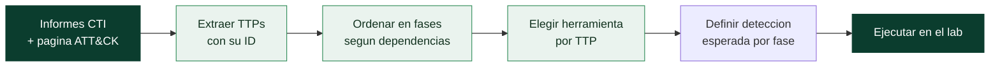

# Clase 163 — Emulación de adversarios

> Parte: **7 — Red Team y operaciones ofensivas** · Fuente: *MITRE Adversary Emulation Plans / CTID*
> ⏱️ Duración estimada: **100 min** · Nivel: **Intermedio**

---

## 🎯 Objetivo

Aprender a transformar threat intelligence sobre un actor real en un **plan de emulación** ejecutable: qué técnicas usa, en qué orden, con qué herramientas, y cómo reproducir su comportamiento de forma controlada para poner a prueba las defensas. El alumno pasará de "hacer hacking genérico" a "actuar como APT29 lo haría".

## 📚 Resultados de aprendizaje

Al finalizar, el alumno podrá:

1. **Distinguir** emulación, simulación y ataque oportunista.
2. **Extraer** TTPs de un informe de CTI y estructurarlos en fases.
3. **Construir** un plan de emulación con la MITRE Emulation Library como base.
4. **Seleccionar** herramientas que reproduzcan cada TTP fielmente.
5. **Definir** los criterios de "detectado/no detectado" por cada fase.

## 🗺️ Temas

| # | Tema | Por qué importa |
|---|------|-----------------|
| 1 | Emulación vs simulación | Precisión del realismo que se busca |
| 2 | Threat intelligence como insumo | El plan nace de datos, no de intuición |
| 3 | Emulation Library de MITRE | Planes listos y validados por la comunidad |
| 4 | Fases y encadenamiento de TTPs | El orden importa para el realismo |
| 5 | Selección de herramientas | Reproducir el comportamiento, no el binario exacto |
| 6 | Micro-emulaciones (CTID) | Emulaciones atómicas y reutilizables |
| 7 | Criterios de detección por fase | Convierten la emulación en medición |

## 🧠 Explicación en profundidad

La diferencia entre "hacer hacking" y **emular a un adversario** es la diferencia entre improvisar y seguir un guion basado en inteligencia. La emulación de adversarios toma lo que sabemos de un actor real —APT29, FIN7— y reconstruye su forma de operar de manera controlada, para responder una pregunta muy concreta: *si este actor viniera a por nosotros, ¿lo veríamos?*. No se trata de usar su malware, sino de reproducir su **comportamiento**.

### Emulación, simulación y ataque oportunista

Tres cosas que se confunden y no son lo mismo:

| Enfoque | En qué se basa | Cuándo usarlo |
|---|---|---|
| **Emulación** | TTPs de un actor *específico* (CTI) | Hay un modelo de amenaza claro y maduro |
| **Simulación** | Comportamientos adversariales *genéricos* | Punto de partida, cobertura amplia |
| **Ataque oportunista** | Lo que el operador sepa hacer | Pentest, no medición de detección |

La emulación es la más realista y la más cara de preparar, porque exige inteligencia sólida. La simulación (por ejemplo con Atomic Red Team) es un buen primer paso cuando el cliente aún no tiene un adversario prioritario.

### La CTI como materia prima

Un plan de emulación **no se inventa**: nace de datos. La fuente son los informes de CTI (Mandiant, CrowdStrike, Microsoft, The DFIR Report), la página del grupo en ATT&CK y la Emulation Library de MITRE. De ahí se extraen los TTPs y —clave— el **orden** en que el actor los encadena. Anclar cada técnica del plan a una fuente evita el pecado de la "emulación de fantasía": reproducir algo que el actor nunca hizo.

### Fases: por qué el orden importa

Un plan de emulación no es una bolsa de técnicas: es una **secuencia con dependencias**. No puedes hacer movimiento lateral antes de haber descubierto la red, ni exfiltrar antes de haber recolectado. Estructurar el plan por fases —Initial Access → Discovery → Credential Access → Lateral Movement → Collection → Exfiltration— reproduce el flujo real del actor y, de paso, permite medir en qué fase te detectan (que es exactamente lo que quiere saber la defensa).

### Reproducir el comportamiento, no el binario

Un error peligroso e innecesario es querer usar el malware real del actor. No hace falta: emulas la **acción**, no la muestra. Si APT29 usó un download cradle de PowerShell (`T1059.001`), lo reproduces con un stager de tu C2; si volcó credenciales (`T1003.001`), con un método equivalente en el lab. El comportamiento observable —y por tanto la detección— es el mismo, sin el riesgo de detonar malware real.

### Micro-emulaciones y criterios de detección

El Center for Threat-Informed Defense (CTID) popularizó las **micro-emulaciones**: unidades atómicas y componibles que emulan un comportamiento pequeño y aislado, fáciles de reutilizar entre planes. Sea macro o micro, cada TTP del plan debe llevar su **criterio de detección**: qué evento debería generar y quién debería verlo. Sin ese criterio, la emulación es un ejercicio ofensivo más; con él, es una **medición** de la defensa.

## 📖 Definiciones y características

- **Adversary emulation**: reproducción fiel del comportamiento de un actor específico basada en CTI. Característica: imita TTPs, no solo objetivos.
- **Adversary simulation**: uso de comportamientos adversariales genéricos sin atarse a un actor. Característica: menos específica, más rápida.
- **TTP (Tactics, Techniques, Procedures)**: la firma comportamental de un actor. Característica: más difícil de cambiar que un IOC.
- **Emulation Plan**: documento paso a paso que reproduce a un actor. Característica: encadena TTPs con herramientas y comandos.
- **CTI (Cyber Threat Intelligence)**: información sobre actores, campañas y TTPs. Característica: es la materia prima del plan.
- **Micro-emulation**: emulación de un comportamiento pequeño y aislado (CTID). Característica: modular y componible.

## 📔 Glosario

| Término | Definición concisa |
|---------|--------------------|
| Adversary emulation | Reproducción fiel del comportamiento de un actor real, basada en CTI |
| Adversary simulation | Uso de comportamientos adversariales genéricos, sin atarse a un actor |
| TTP | Tácticas, técnicas y procedimientos; la firma comportamental de un actor |
| CTI | Cyber Threat Intelligence: información sobre actores, campañas y TTPs |
| Emulation Plan | Documento paso a paso que reproduce a un actor |
| Emulation Library | Colección pública de planes validados por MITRE/CTID |
| Micro-emulación | Emulación atómica de un comportamiento aislado y reutilizable |
| Fase | Etapa del plan que agrupa TTPs con una meta común |
| Download cradle | Descarga y ejecución en memoria de un payload, típica de PowerShell |
| Stager | Payload pequeño que descarga y lanza el implante completo |
| Detección esperada | Evento que un TTP debería generar y quién debería verlo |
| APT29 | Actor estatal (Cozy Bear) frecuente en planes de emulación |
| FIN7 | Actor con motivación financiera y TTPs bien documentados |
| CTID | Center for Threat-Informed Defense, impulsor de las micro-emulaciones |
| Atomic Red Team | Biblioteca de pruebas atómicas para simular TTPs |
| Deconfliction | Distinguir la actividad del ejercicio de un incidente real |

## 🧰 Herramientas y preparación

- [MITRE Adversary Emulation Library](https://github.com/center-for-threat-informed-defense/adversary_emulation_library).
- Informes de CTI públicos (Mandiant, CrowdStrike, Microsoft, DFIR Report).
- El laboratorio de las clases siguientes (C2 + AD lab) para ejecutar el plan más adelante.
- Herramientas de reproducción: Sliver/Mythic (C2), Impacket, y Atomic Red Team (Clase 180) para TTPs atómicos.

> ⚠️ La emulación se ejecuta **solo** en el laboratorio propio. En esta clase construimos el plan en papel; su ejecución práctica llega con la infraestructura de las clases 164 en adelante y el AD lab.

## 🧪 Laboratorio guiado

1. **Elige un actor.** Toma APT29 (usaremos el plan público de la Emulation Library como referencia).
2. **Lee la CTI base.** Revisa 2 informes públicos y anota las técnicas mencionadas con su ID ATT&CK.
3. **Descarga el plan de MITRE.** Clona la Emulation Library y abre el plan de APT29; identifica sus fases (Initial Access → Discovery → Credential Access → Lateral Movement → Collection → Exfiltration).
4. **Estructura tu plan.** Crea una tabla con columnas: Fase | Técnica (ID) | Herramienta | Comando/acción | Detección esperada.
5. **Selecciona herramientas por TTP.** Para "PowerShell download cradle" (`T1059.001`), decide reproducirlo con un stager de tu C2; para "credential dumping" (`T1003.001`), con un método equivalente a Mimikatz en el lab.
6. **Encadena las fases.** Ordena los TTPs de forma que cada uno habilite al siguiente (ej. discovery antes que lateral movement).
7. **Define criterios de éxito y detección.** Por cada fila, escribe qué evento debería generar y quién debería verlo.

## ✍️ Ejercicios

1. Explica con un ejemplo la diferencia entre emulación y simulación.
2. Extrae 8 TTPs de un informe público de CTI y mapéalos a ATT&CK.
3. Ordena esos 8 TTPs en fases coherentes de un ataque.
4. Elige una herramienta para reproducir cada uno de 5 TTPs.
5. Redacta el criterio de detección para tres fases.
6. Compara dos planes de la Emulation Library y señala una diferencia de estilo entre los dos actores.

## 📝 Reto verificable

Entrega un **plan de emulación de una página** para un actor de tu elección (con base en CTI pública), que contenga al menos 10 TTPs organizados en 5 fases, la herramienta de reproducción por TTP y la detección esperada.
**Criterio de aceptación:** cada TTP tiene ID ATT&CK válido, hay continuidad lógica entre fases (cada una habilita la siguiente) y las herramientas elegidas reproducen el comportamiento descrito en la CTI.

## ⚠️ Errores comunes

| Síntoma / mensaje | Causa y cómo arreglar |
|-------------------|-----------------------|
| El plan es una lista sin orden | Faltan fases; encadena TTPs por dependencia |
| Se copia el malware del actor | No es necesario ni seguro; reproduce el comportamiento, no el binario |
| TTPs sin fuente | Emulación inventada; ancla cada técnica a un informe de CTI |
| No se puede medir | Faltan criterios de detección; añádelos por fase |
| Se elige un actor irreal para el entorno | Emular ICS en una red ofimática no aporta; ajusta el actor al objetivo |

## ❓ Preguntas frecuentes

**❓ ¿Necesito el malware real del actor?**
No. Emulas el **comportamiento** (TTPs) con herramientas seguras y controladas. Usar malware real es peligroso e innecesario.

**❓ ¿De dónde saco los TTPs de un actor?**
De su página en ATT&CK (Groups), informes de proveedores de CTI y de la Emulation Library de MITRE.

**❓ ¿Emulación o simulación para un cliente nuevo?**
La simulación (comportamientos genéricos) suele ser mejor punto de partida; la emulación de un actor específico aporta más cuando el cliente tiene un modelo de amenaza claro.

## 🔗 Referencias

- MITRE CTID — *Adversary Emulation Library*. <https://github.com/center-for-threat-informed-defense/adversary_emulation_library>
- MITRE — *Adversary Emulation Plans*. <https://attack.mitre.org/resources/adversary-emulation-plans/>
- Vest & Tubberville — *Red Team Development and Operations*.
- Mandiant / CrowdStrike — informes públicos de threat intelligence.

## 📥 Material descargable

- 📄 [Guía en PDF](./clase-163-guia.pdf) — versión imprimible de esta clase.
- 🎞️ [Presentación (PPTX)](./clase-163-presentacion.pptx) — deck para proyectar en clase.

## ⬅️ Clase anterior

[Clase 162 — MITRE ATT&CK como lenguaje ofensivo](../162-mitre-att-ck-como-lenguaje-ofensivo/README.md)

## ➡️ Siguiente clase

[Clase 164 — Diseño de infraestructura de comando y control (C2)](../164-diseno-de-infraestructura-de-comando-y-control-c2/README.md)
