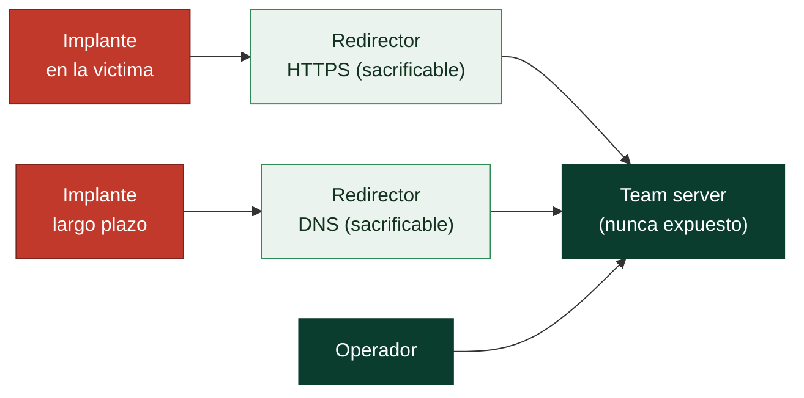

# Clase 164 — Diseño de infraestructura de comando y control (C2)

> Parte: **7 — Red Team y operaciones ofensivas** · Fuente: *Red Team Development and Operations (Vest & Tubberville)*
> ⏱️ Duración estimada: **110 min** · Nivel: **Avanzado**

---

## 🎯 Objetivo

Diseñar infraestructura de C2 resiliente y sigilosa: la red de servidores, redirectores, dominios y canales que un operador usa para controlar sus implantes sin exponer el servidor de comando ni facilitar el bloqueo por parte del defensor. El alumno entenderá la arquitectura por capas, el uso de redirectores, la categorización de dominios y la separación de infraestructura por función.

## 📚 Resultados de aprendizaje

Al finalizar, el alumno podrá:

1. **Explicar** la arquitectura por capas de una operación (team server, redirectores, dominios).
2. **Configurar** un redirector HTTP/HTTPS que oculte el team server.
3. **Seleccionar** y categorizar dominios para mimetizar tráfico legítimo.
4. **Separar** la infraestructura de staging, C2 de largo plazo y exfiltración.
5. **Diseñar** un plan de resiliencia ante bloqueos (rotación, canales alternativos).

## 🗺️ Temas

| # | Tema | Por qué importa |
|---|------|-----------------|
| 1 | Team server | Cerebro de la operación; nunca se expone directo |
| 2 | Redirectores | Ocultan el team server y filtran tráfico |
| 3 | Categorización de dominios | Tráfico que "parece" legítimo evade filtros |
| 4 | Canales (HTTPS, DNS, SMB) | Distintos perfiles de sigilo y fiabilidad |
| 5 | Domain fronting / CDN | Ofusca el destino real del tráfico |
| 6 | Separación por función | Un dominio quemado no tumba toda la operación |
| 7 | Resiliencia y rotación | Sobrevivir al bloqueo del defensor |

## 🧠 Explicación en profundidad

El servidor desde el que un operador controla sus implantes es, a la vez, lo más valioso y lo más frágil de una operación. Si el defensor lo localiza, cae toda la campaña: identifica los implantes, bloquea el dominio y atribuye. Por eso la infraestructura de C2 no es "un servidor con un panel", sino una **arquitectura por capas** diseñada bajo un principio: que el team server nunca reciba tráfico del objetivo directamente, y que **ninguna pieza quemada tumbe el conjunto**.

### El principio: nada crítico expuesto, todo sacrificable

La regla de oro es separar lo **valioso** (el team server, el cerebro) de lo **desechable** (los redirectores, los dominios). El objetivo solo habla con piezas sacrificables; cuando una se quema, se reemplaza sin tocar el núcleo. Esto invierte la economía del defensor: bloquear un redirector le cuesta trabajo y a ti te cuesta un `terraform apply`.



### Redirectores: la capa de sacrificio

Un **redirector** es un proxy (socat, Nginx con `proxy_pass`, Apache `mod_rewrite`) que se sitúa entre el implante y el team server. Hace dos cosas: **reenvía** el tráfico C2 válido al team server y **descarta o desvía** todo lo demás —un analista curioso que navegue al dominio ve una web inocua, no un panel de C2—. Al filtrar por User-Agent, URI o cabeceras esperadas, el redirector convierte el escaneo del defensor en ruido inútil y protege la IP real del núcleo.

### Que el tráfico parezca legítimo: dominios, categorización y perfiles

El sigilo no es solo ocultar *dónde* está el servidor, sino hacer que el tráfico *parezca* rutinario. Tres palancas: **categorizar dominios** (un dominio clasificado como "business" o "health" por los proxies web pasa filtros de reputación); los **malleable profiles**, que definen cómo se ven las peticiones (URIs, headers, jitter) para imitar una app legítima como una API de telemetría; y el **domain fronting**, que usa el SNI de un CDN legítimo para que el destino aparente ser un dominio de confianza —técnica cada vez más limitada por los proveedores—.

### Canales: short-haul y long-haul

No todos los implantes usan el mismo canal. El **short-haul** (HTTPS con check-ins frecuentes) da trabajo interactivo y ágil, pero genera más tráfico. El **long-haul** (DNS o check-ins muy espaciados) es lento pero sigiloso, ideal para la **persistencia**: si el operador pierde el canal rápido, el lento sigue vivo para recuperar el acceso. Combinarlos —un beacon rápido para operar, uno lento de respaldo— equilibra agilidad y supervivencia.

### Separación por función y resiliencia

La lección operativa final es **compartimentar**: infraestructura distinta para *staging* (entrega del payload), *C2 de largo plazo* y *exfiltración*. Así, quemar el dominio de staging no revela el canal de exfiltración ni el de persistencia. A esto se suma un **plan de rotación**: dominios y redirectores de reserva listos para entrar cuando el defensor bloquee los activos. Una operación bien diseñada asume que la parte visible caerá, y se organiza para que caer no signifique perder.

## 📖 Definiciones y características

- **Team server**: servidor central que gestiona implantes y operadores. Característica: se protege tras redirectores, nunca recibe tráfico del objetivo directamente.
- **Redirector**: proxy (socat, Apache mod_rewrite, Nginx) que reenvía tráfico válido al team server y descarta el resto. Característica: es sacrificable.
- **Long-haul vs short-haul C2**: canales lentos y sigilosos (persistencia) vs rápidos (trabajo interactivo). Característica: se combinan para equilibrar sigilo y agilidad.
- **Domain fronting**: usar el SNI/host de un CDN legítimo para ocultar el destino real. Característica: cada vez más limitado por los proveedores.
- **Malleable profile**: configuración que define cómo se ve el tráfico C2 (headers, URIs, jitter). Característica: mimetiza aplicaciones legítimas.
- **Categorización de dominio**: clasificar un dominio como "business/health" ante proxies web. Característica: evita bloqueos por reputación.

## 📔 Glosario

| Término | Definición concisa |
|---------|--------------------|
| Team server | Servidor central que gestiona implantes y operadores; nunca se expone |
| Redirector | Proxy sacrificable que reenvía tráfico válido y descarta el resto |
| Staging | Infraestructura dedicada a la entrega inicial del payload |
| Long-haul C2 | Canal lento y sigiloso para persistencia |
| Short-haul C2 | Canal rápido para trabajo interactivo |
| Domain fronting | Ocultar el destino real tras el SNI de un CDN legítimo |
| Malleable profile | Configuración que define cómo se ve el tráfico C2 |
| Categorización de dominio | Clasificar un dominio (business/health) para pasar filtros |
| SNI | Server Name Indication; el host del handshake TLS |
| Jitter | Variación aleatoria del intervalo de check-in |
| Redirector DNS | Redirector que reenvía tráfico C2 sobre consultas DNS |
| Compartimentación | Separar infraestructura por función para limitar el daño |
| Rotación | Reemplazar dominios/redirectores quemados por reservas |
| Quemado (burned) | Activo detectado o bloqueado por el defensor |
| VPS | Servidor virtual donde se despliega la infraestructura |
| Beacon | Implante que llama a casa a intervalos configurables |

## 🧰 Herramientas y preparación

- Un VPS de laboratorio (o VMs locales) para team server y redirectores.
- `socat`, `nginx`/`apache2` para redirectores; `certbot` para TLS válido.
- Un dominio de práctica (o `/etc/hosts` en el lab para simular resolución).
- Frameworks C2 que veremos en la Clase 165 (Sliver/Mythic) como consumidores de esta infraestructura.
- Terraform/Ansible (opcional) para automatizar el despliegue reproducible.

> ⚠️ Toda esta infraestructura se despliega en tu propio laboratorio o en VPS que controlas legítimamente, para dirigir implantes hacia máquinas de tu lab. Nunca apuntes redirectores hacia objetivos sin autorización escrita.

## 🧪 Laboratorio guiado

1. **Levanta el team server** en una VM aislada (lo poblaremos con Sliver en la próxima clase). Anota su IP interna.
2. **Despliega un redirector HTTPS con socat:**

   ```bash
   socat TCP4-LISTEN:443,fork,reuseaddr TCP4:10.10.0.5:443
   ```

   donde `10.10.0.5` es el team server. El objetivo solo verá el redirector.
3. **Redirector filtrante con Nginx.** Configura `proxy_pass` solo para las URIs de tu perfil C2 y devuelve un `302` a un sitio legítimo para todo lo demás:

   ```nginx
   location /api/v1/updates { proxy_pass https://10.10.0.5; }
   location / { return 302 https://www.ejemplo-legitimo.com; }
   ```

4. **Emite TLS válido** con `certbot` para el dominio del redirector; evita certificados autofirmados que delatan la operación.
5. **Separa funciones.** Define un redirector para *staging* (entrega inicial) y otro para *C2 de largo plazo*, de modo que quemar uno no exponga el otro.
6. **Prueba resiliencia.** Apaga el redirector primario y verifica que el implante rota al secundario (lo configuraremos con el perfil del C2 en la Clase 165).
7. **Registra la arquitectura** en un diagrama: objetivo → redirector(es) → team server, con dominios y puertos.

## ✍️ Ejercicios

1. Dibuja la arquitectura de una operación con 2 redirectores y separación staging/C2.
2. Escribe la regla de Nginx que reenvía solo `/jquery-3.6.0.min.js` al team server.
3. Explica por qué un certificado autofirmado es un mal OPSEC.
4. Compara canales HTTPS, DNS y SMB en fiabilidad y sigilo.
5. Diseña un plan de rotación de dominios ante un bloqueo.
6. Investiga el estado actual del domain fronting en un CDN popular y resume por qué está limitado.

## 📝 Reto verificable

Despliega en tu lab una cadena **objetivo → redirector (TLS válido) → team server** donde el redirector solo reenvíe las URIs de tu perfil y redirija el resto a un sitio benigno.
**Criterio de aceptación:** desde una máquina "víctima" del lab, una petición a la URI válida llega al team server, pero navegar a la raíz del redirector devuelve el sitio benigno; el team server nunca es alcanzable directamente desde la víctima.

## ⚠️ Errores comunes

| Síntoma / mensaje | Causa y cómo arreglar |
|-------------------|-----------------------|
| El defensor bloquea todo de golpe | Sin separación por función; segmenta staging/C2/exfil |
| Certificado inválido en el navegador | Autofirmado; usa Let's Encrypt para TLS confiable |
| Team server aparece en logs del objetivo | No hay redirector o filtra mal; asegúrate de que solo el redirector es visible |
| Tráfico C2 evidente en el proxy web | Perfil por defecto; personaliza el malleable profile (Clase 165) |
| Redirector reenvía escaneos de bots | Falta filtrado por URI/User-Agent; añade reglas de descarte |

## ❓ Preguntas frecuentes

**❓ ¿Por qué no conectar el implante directo al team server?**
Porque cuando el defensor descubre la IP, la bloquea y pierdes todos los implantes. Los redirectores son sacrificables y protegen el activo central.

**❓ ¿El domain fronting sigue siendo viable?**
Muy limitado: la mayoría de CDNs lo han restringido. Hoy se prefieren dominios categorizados y perfiles maleables realistas.

**❓ ¿DNS C2 es mejor que HTTPS?**
DNS es sigiloso y sobrevive a muchos filtros, pero es lento y ruidoso en volumen. Se usa como long-haul/backup, no como canal principal interactivo.

## 🔗 Referencias

- Vest & Tubberville — *Red Team Development and Operations* (capítulo de infraestructura). <https://redteam.guide/>
- Bishop Fox — *Red Team infrastructure wiki*. <https://github.com/bluscreenofjeff/Red-Team-Infrastructure-Wiki>
- MITRE ATT&CK — *Command and Control* (TA0011). <https://attack.mitre.org/tactics/TA0011/>
- Nginx / socat documentación oficial.

## 📥 Material descargable

- 📄 [Guía en PDF](./clase-164-guia.pdf) — versión imprimible de esta clase.
- 🎞️ [Presentación (PPTX)](./clase-164-presentacion.pptx) — deck para proyectar en clase.

## ⬅️ Clase anterior

[Clase 163 — Emulación de adversarios](../163-emulacion-de-adversarios/README.md)

## ➡️ Siguiente clase

[Clase 165 — Frameworks C2: Cobalt Strike, Sliver y Mythic](../165-frameworks-c2-cobalt-strike-sliver-y-mythic/README.md)
