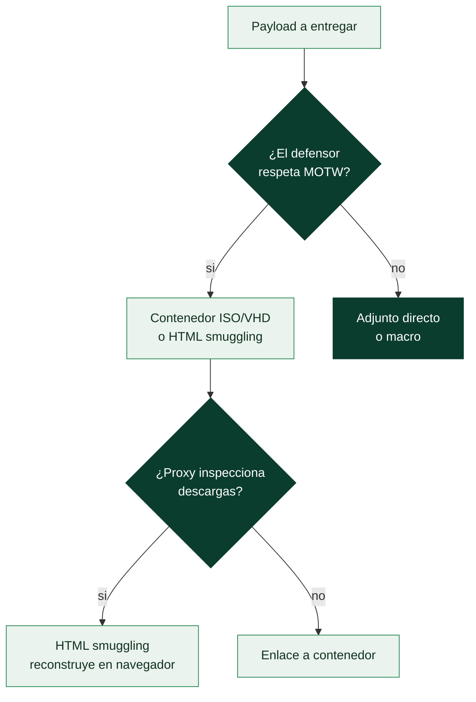

# Clase 166 — Phishing y entrega de payloads

> Parte: **7 — Red Team y operaciones ofensivas** · Fuente: *Operator Handbook (T. Bryant) / MITRE ATT&CK Phishing (T1566)*
> ⏱️ Duración estimada: **110 min** · Nivel: **Avanzado**

---

## 🎯 Objetivo

Diseñar y ejecutar campañas de phishing controladas como vector de acceso inicial: pretextos creíbles, infraestructura de correo con buena reputación, y payloads que superen los filtros sin quemar la operación. El alumno aprenderá los formatos de entrega modernos (contenedores ISO/LNK, macros, HTML smuggling) y cómo medir la campaña sin dañar a las personas objetivo.

## 📚 Resultados de aprendizaje

Al finalizar, el alumno podrá:

1. **Diseñar** un pretexto de phishing y su narrativa coherente.
2. **Configurar** infraestructura de correo (SPF/DKIM/DMARC, dominio calentado) en un lab.
3. **Elegir** el formato de entrega adecuado según el defensor (LNK, ISO, HTML smuggling, macro).
4. **Operar** GoPhish para ejecutar y medir una campaña controlada.
5. **Aplicar** consideraciones éticas y de mínimo daño en el objetivo humano.

## 🗺️ Temas

| # | Tema | Por qué importa |
|---|------|-----------------|
| 1 | Spear phishing vs masivo | Precisión vs alcance |
| 2 | Pretexto y OSINT | La credibilidad decide el clic |
| 3 | Reputación de correo | SPF/DKIM/DMARC y dominios calentados |
| 4 | Formatos de entrega | Mark-of-the-Web, contenedores, smuggling |
| 5 | Landing pages y captura | Robo de credenciales controlado |
| 6 | GoPhish | Ejecución y métricas de campaña |
| 7 | Ética y salud del objetivo | No dañar a las personas |

## 🧠 Explicación en profundidad

El phishing sigue encabezando los informes de acceso inicial año tras año no porque sea sofisticado, sino porque ataca la capa que ningún parche cubre del todo: la **decisión humana**. Entender por qué funciona —y por qué un defensor lo detecta o no— importa mucho más que memorizar el último truco de entrega, porque los trucos caducan y el principio permanece. Esta clase mira el phishing desde la lógica del que emula a un adversario, siempre dentro de buzones de laboratorio o de un alcance autorizado.

### El pretexto es el verdadero exploit

Antes que ningún fichero, lo que se "programa" es una historia. Un **pretexto** creíble se apoya en tres palancas psicológicas —autoridad ("es de IT"), urgencia ("caduca hoy") y familiaridad ("el portal de RRHH de siempre")— y su credibilidad se construye con **OSINT**: nombres reales, jerga interna, el aspecto del correo corporativo. Por eso el spear phishing dirigido supera con creces al envío masivo: no compite en volumen, compite en verosimilitud. Y por eso mismo la primera línea defensiva no es técnica sino formativa: un usuario que reconoce las palancas resiste aunque el correo pase todos los filtros.

### Reputación: por qué el defensor te cree (o no)

Un correo no se juzga solo por su texto; el receptor evalúa **quién lo envía**. Los tres registros DNS de autenticación deciden esa confianza: **SPF** declara qué servidores pueden enviar en nombre del dominio, **DKIM** firma el mensaje criptográficamente para probar que no se alteró, y **DMARC** le dice al receptor qué hacer si SPF o DKIM fallan. Un dominio recién comprado y sin historial "huele mal" a los filtros por reputación; de ahí el **calentamiento** (enviar tráfico legítimo creciente durante días). En el ejercicio esto se configura bien no para engañar mejor, sino para que la prueba mida la conducta humana y no quede sepultada en la carpeta de spam por un detalle de infraestructura.

### La carrera del Mark-of-the-Web

Cuando Windows descarga un fichero de internet le adhiere una marca, el **Mark-of-the-Web (MOTW)**, que activa advertencias y bloquea macros. Toda la evolución de los formatos de entrega es, en el fondo, una carrera alrededor de esa marca: las macros de Office cayeron cuando Microsoft empezó a bloquearlas por MOTW, y el terreno se desplazó hacia **contenedores** (ISO, VHD) cuyo contenido interno no siempre hereda la marca, hacia **HTML smuggling** —donde el binario se reconstruye en el navegador desde JavaScript y nunca viaja "como fichero" por el proxy— y hacia el abuso de instaladores firmados. Para el defensor, cada técnica deja una señal distinta (un ISO montándose, un `.lnk` lanzando `powershell`), y ahí es donde el conocimiento ofensivo se convierte en detección.

### Medir sin dañar

El entregable de una campaña no son "víctimas", son **métricas**: tasa de apertura, de clic y de entrega de credenciales. Herramientas como **GoPhish** las capturan de forma controlada. Pero la medición honesta convive con un límite ético estricto: el objetivo es evaluar el proceso, no humillar a personas. Por eso se prohíben pretextos que exploten emociones sensibles (despidos, emergencias familiares), se coordina con la **white cell**, y el cierre no es una lista de "quién picó" sino una fase de concienciación. Un ejercicio de phishing que deja al personal resentido ha fracasado aunque sus números sean altos, porque destruye la colaboración con la defensa que es su verdadero fin.

## 📖 Definiciones y características

- **Spear phishing (`T1566.001`)**: correo dirigido con adjunto/enlace a personas concretas. Característica: alta tasa de éxito por personalización.
- **Pretexto**: historia que motiva la acción (factura, RRHH, IT). Característica: debe ser coherente con OSINT del objetivo.
- **Mark-of-the-Web (MOTW)**: marca que Windows pone a archivos de internet. Característica: dispara advertencias; los contenedores (ISO) la evaden.
- **HTML smuggling**: reconstruir el payload en el navegador vía JS/Blob para evadir proxies. Característica: el binario no viaja por la red como tal.
- **SPF/DKIM/DMARC**: mecanismos de autenticación de correo. Característica: bien configurados mejoran la entregabilidad del phishing legítimo del ejercicio.
- **Landing page**: página que captura credenciales o entrega el payload. Característica: clona un servicio conocido de forma controlada.

## 📔 Glosario

| Término | Definición concisa |
|---------|--------------------|
| Phishing (T1566) | Envío de mensajes engañosos para inducir una acción (clic, credenciales, ejecución) |
| Spear phishing | Phishing dirigido y personalizado contra personas u organizaciones concretas |
| Pretexto | Historia que motiva la acción del objetivo; el verdadero "exploit" de la campaña |
| OSINT | Recogida de información de fuentes públicas para dar verosimilitud al pretexto |
| SPF | Registro DNS que declara qué servidores pueden enviar correo en nombre del dominio |
| DKIM | Firma criptográfica del correo que prueba que no se alteró en tránsito |
| DMARC | Política que indica al receptor qué hacer si SPF o DKIM fallan |
| Calentamiento de dominio | Enviar tráfico legítimo creciente para construir reputación de envío |
| Mark-of-the-Web (MOTW) | Marca que Windows pone a ficheros de internet; dispara advertencias y bloqueos |
| Contenedor (ISO/VHD) | Formato de disco cuyo contenido interno puede no heredar el MOTW |
| HTML smuggling | Reconstruir el payload en el navegador vía JS/Blob para evadir proxies |
| LNK | Acceso directo de Windows usado como lanzador dentro de un contenedor |
| Landing page | Página controlada que captura credenciales o entrega el payload |
| GoPhish | Plataforma para lanzar y medir campañas de phishing controladas |
| Tasa de clic | Porcentaje de objetivos que abrieron el enlace; métrica central de la campaña |
| White cell | Personas informadas que supervisan el ejercicio y protegen a los objetivos |

## 🧰 Herramientas y preparación

- [GoPhish](https://getgophish.com/) para gestionar la campaña y métricas.
- Un dominio de práctica con registros SPF/DKIM/DMARC configurados (en tu lab o dominio propio).
- El C2 de las clases anteriores para el payload de la landing.
- Herramientas de generación de contenedores/LNK en un entorno controlado.
- Buzones de "víctima" de laboratorio (cuentas de prueba que tú controlas).

> ⚠️ **Ética reforzada.** El phishing se ejecuta solo contra buzones de laboratorio propios o contra objetivos con autorización escrita y dentro de las RoE. Nunca uses pretextos que causen daño psicológico real (despidos falsos, emergencias familiares). En engagements reales, coordina con la white cell y respeta la dignidad de las personas objetivo.

## 🧪 Laboratorio guiado

1. **OSINT del objetivo ficticio.** Reúne (de fuentes públicas del lab) nombres, roles y el estilo de correo de "ACME Corp".
2. **Monta GoPhish.** Descarga y ejecuta el binario; crea un *Sending Profile* con tu servidor SMTP de lab.
3. **Configura reputación.** Añade SPF, DKIM y DMARC al dominio de práctica y verifica con `dig TXT` que resuelven.
4. **Redacta el pretexto.** Un correo de "actualización de portal de RRHH" con enlace a tu landing; cuida gramática, firma y coherencia.
5. **Crea la landing page.** Clona (en tu lab) la pantalla de login del "portal" y captura credenciales o entrega el payload C2.
6. **Elige la entrega.** Compara enviar un `.lnk` dentro de un `.iso` (evade MOTW) frente a HTML smuggling; documenta pros/cons de cada uno.
7. **Lanza y mide.** Envía a los buzones de laboratorio; en GoPhish observa tasas de apertura, clic y envío de credenciales. Limpia al terminar.

## ✍️ Ejercicios

1. Redacta dos pretextos distintos y evalúa cuál es más creíble y por qué.
2. Configura SPF/DKIM/DMARC en un dominio de prueba y valídalos.
3. Explica cómo un contenedor ISO evade el Mark-of-the-Web.
4. Describe el flujo de HTML smuggling paso a paso.
5. Crea una campaña en GoPhish y explica cada métrica que reporta.
6. Propón 3 reglas éticas propias para campañas contra personas reales.

## 📝 Reto verificable

Ejecuta una **campaña de phishing completa en tu laboratorio** con GoPhish: pretexto, correo autenticado (SPF/DKIM), landing page y método de entrega que evada MOTW, midiendo apertura y clic.
**Criterio de aceptación:** GoPhish reporta al menos un clic desde un buzón de lab, el correo pasa autenticación (no cae en spam por SPF/DKIM), y documentas por qué el método de entrega elegido evade una advertencia de Windows. Todo sobre buzones que controlas.

## ⚠️ Errores comunes

| Síntoma / mensaje | Causa y cómo arreglar |
|-------------------|-----------------------|
| El correo cae en spam | SPF/DKIM/DMARC mal configurados o dominio sin calentar; corrige registros |
| Windows advierte "archivo de internet" | MOTW en el adjunto; usa contenedor ISO/VHD o smuggling |
| El pretexto no genera clics | Poco creíble o mal segmentado; mejora OSINT y narrativa |
| El proxy bloquea la descarga | Payload visible en la red; usa HTML smuggling |
| Daño real a una persona | Pretexto abusivo; revisa la ética y coordina con la white cell |

## ❓ Preguntas frecuentes

**❓ ¿El phishing sigue siendo el vector #1?**
Sí; sigue siendo de los accesos iniciales más efectivos y baratos, por eso es central en la emulación de casi cualquier actor.

**❓ ¿Las macros de Office todavía funcionan?**
Cada vez menos: Microsoft bloquea macros de internet por defecto. Hoy dominan LNK en contenedores, HTML smuggling y abuso de instaladores.

**❓ ¿Cómo evito dañar a las personas?**
Pretextos neutros, coordinación con la white cell, no explotar emociones sensibles y una fase de concienciación posterior en lugar de señalar culpables.

## 🔗 Referencias

- MITRE ATT&CK — *Phishing* (`T1566`). <https://attack.mitre.org/techniques/T1566/>
- GoPhish. <https://getgophish.com/> · <https://docs.getgophish.com/>
- Outflank / research sobre *HTML smuggling* y contenedores.
- Bryant, T. — *Operator Handbook*.

## 📥 Material descargable

- 📄 [Guía en PDF](./clase-166-guia.pdf) — versión imprimible de esta clase.
- 🎞️ [Presentación (PPTX)](./clase-166-presentacion.pptx) — deck para proyectar en clase.

## ⬅️ Clase anterior

[Clase 165 — Frameworks C2: Cobalt Strike, Sliver y Mythic](../165-frameworks-c2-cobalt-strike-sliver-y-mythic/README.md)

## ➡️ Siguiente clase

[Clase 167 — Acceso inicial: técnicas](../167-acceso-inicial-tecnicas/README.md)
