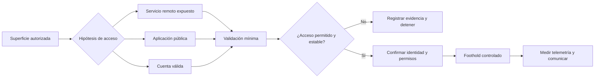

# Clase 167 — Acceso inicial: técnicas

> Parte: **7 — Red Team y operaciones ofensivas** · Fuente: *MITRE ATT&CK Initial Access (TA0001) / RTFM v2*
> ⏱️ Duración estimada: **100 min** · Nivel: **Avanzado**

---

## 🎯 Objetivo

Cubrir el abanico de técnicas de **acceso inicial** más allá del phishing: servicios expuestos, credenciales válidas, abuso de aplicaciones de cara a internet, drive-by y supply chain. El alumno aprenderá a elegir el vector según el objetivo y a establecer el primer punto de apoyo (foothold) de forma sigilosa en su laboratorio.

## 📚 Resultados de aprendizaje

Al finalizar, el alumno podrá:

1. **Enumerar** las técnicas de la táctica Initial Access de ATT&CK.
2. **Explotar** un servicio expuesto de laboratorio para obtener foothold.
3. **Usar** credenciales válidas (password spraying) de forma controlada.
4. **Evaluar** riesgos y sigilo de cada vector de entrada.
5. **Establecer** un foothold estable con el C2 previamente montado.

## 🗺️ Temas

| # | Tema | Por qué importa |
|---|------|-----------------|
| 1 | External Remote Services (`T1133`) | VPN/RDP expuestos, vector muy común |
| 2 | Exploit Public-Facing App (`T1190`) | Webs y APIs vulnerables |
| 3 | Valid Accounts (`T1078`) | Credenciales filtradas/débiles |
| 4 | Password spraying | Un password contra muchos usuarios |
| 5 | Drive-by y supply chain | Vectores indirectos |
| 6 | Establecer foothold | Del acceso a la sesión C2 |
| 7 | Sigilo del primer paso | No quemar la operación al entrar |

## 🧠 Explicación en profundidad

### Acceso inicial no significa todavía control estable

MITRE ATT&CK llama **Initial Access** al conjunto de técnicas empleadas para entrar en una red. La distinción es importante: demostrar que una credencial funciona o que una aplicación responde a una prueba no equivale a disponer de un punto de apoyo operativo. Entre ambos estados hay que confirmar identidad, alcance, permisos, estabilidad y telemetría generada. Una buena operación separa esas comprobaciones para no convertir una validación mínima en un incidente causado por el propio equipo de evaluación.

El vector tampoco se elige solo por su probabilidad de éxito. Se compara con las reglas de enfrentamiento, el objetivo de la prueba y el posible impacto. Una aplicación pública vulnerable puede ofrecer una ruta directa, pero probarla sobre producción puede afectar disponibilidad. Una cuenta válida evita explotar software, pero un inicio de sesión desde un origen o horario inusual sigue siendo visible para un proveedor de identidad. **Válido no significa invisible.**



### Del inventario a una hipótesis comprobable

Enumerar puertos sin contexto produce una lista, no una decisión. Cada hallazgo debe convertirse en una hipótesis: «el portal VPN acepta identidades del dominio y carece del control acordado» o «la versión observada de la aplicación podría estar afectada por una vulnerabilidad concreta». La hipótesis incluye evidencia necesaria, criterio de éxito, riesgo y condición de parada. Esa disciplina impide probar indiscriminadamente cada servicio descubierto.

En `T1133`, el objeto de estudio es un servicio remoto accesible desde fuera del perímetro. En `T1190`, la condición inicial es una aplicación expuesta y una debilidad validable. En `T1078`, lo determinante es que una identidad legítima pueda usarse en un contexto que la organización debería restringir. Son problemas distintos y dejan rastros distintos: autenticación en VPN o RDP, solicitudes y errores de aplicación, o eventos del proveedor de identidad.

### Password spraying: modelo de riesgo, no receta de sigilo

El spraying distribuye una misma contraseña entre varias identidades, a diferencia del ataque que concentra muchas contraseñas sobre una cuenta. Esa distribución puede reducir la probabilidad de alcanzar un umbral de bloqueo por usuario, pero no elimina los controles. Un SOC puede correlacionar numerosos fallos con igual origen, agente, protocolo o intervalo; además, políticas inteligentes pueden bloquear por riesgo y no solo por contador.

Antes de una prueba autorizada se obtienen la política de bloqueo, la ventana de observación, las cuentas excluidas y un contacto de emergencia. El ritmo no se «adivina»: se acuerda. El resultado pedagógico relevante no es cuántas credenciales se prueban, sino si la organización previene, detecta y responde al patrón sin afectar cuentas críticas.

### Qué debe probar el foothold

Un foothold bien documentado responde cuatro preguntas: qué identidad o proceso se controla, en qué activo, con qué privilegios y durante cuánto tiempo. También conserva el instante, origen, técnica ATT&CK y evidencia defensiva. No exige persistencia automática; de hecho, instalarla sin que esté dentro del alcance amplía innecesariamente el impacto. El primer acceso es una evidencia intermedia para evaluar controles, no una licencia para continuar sin límites.

## 📖 Definiciones y características

- **External Remote Services (`T1133`)**: acceso vía servicios remotos expuestos (RDP, VPN, Citrix). Característica: no requiere malware, solo credenciales.
- **Exploit Public-Facing Application (`T1190`)**: explotar una vulnerabilidad en un servicio accesible. Característica: entrada directa sin interacción del usuario.
- **Valid Accounts (`T1078`)**: usar credenciales legítimas obtenidas. Característica: puede mezclarse con actividad normal, pero el origen, dispositivo, horario y patrón siguen siendo detectables.
- **Password spraying**: probar un número muy limitado de contraseñas contra varias identidades. Característica: distribuye intentos, pero aún puede bloquear cuentas y ser correlacionado.
- **Foothold**: primer punto de apoyo controlado en la red objetivo. Característica: base para pivotar y escalar.
- **Drive-by compromise (`T1189`)**: comprometer al usuario al visitar un sitio. Característica: indirecto y oportunista.

## 📔 Glosario

- **Superficie expuesta:** activos y servicios alcanzables desde el punto de partida autorizado.
- **Vector de acceso:** camino concreto que conecta una condición inicial con la entrada al entorno.
- **Hipótesis de acceso:** afirmación comprobable que relaciona un activo, una debilidad y un resultado esperado.
- **Foothold:** acceso inicial confirmado y suficientemente estable para la siguiente actividad autorizada.
- **Cuenta válida:** identidad legítima empleada fuera del uso previsto o sin los controles esperados.
- **Password spraying:** prueba de una contraseña limitada sobre varias cuentas; no debe confundirse con fuerza bruta por cuenta.
- **Política de bloqueo:** reglas que determinan umbrales, duración y restablecimiento tras fallos de autenticación.
- **Condición de parada:** evento previamente acordado que obliga a suspender una prueba.
- **White cell:** grupo que conoce y gobierna el ejercicio, gestiona seguridad y resuelve incidentes.
- **Telemetría de autenticación:** registros de intentos, resultados, origen, dispositivo y contexto de inicio de sesión.

## 🧰 Herramientas y preparación

- Máquinas de laboratorio con servicios expuestos deliberadamente (una web vulnerable, RDP, un VPN de lab).
- `nmap`, `ffuf`/`gobuster` para descubrir superficie; herramientas de la Parte 4 (web) y Parte 5 (explotación).
- Para spraying en AD: `kerbrute`, `NetExec (nxc)` contra el DC del lab.
- El C2 de las clases anteriores para convertir el acceso en sesión.

> ⚠️ Todo se ejecuta contra sistemas de tu propio laboratorio o dentro del alcance autorizado. El password spraying puede bloquear cuentas: en engagements reales, coordínalo con la white cell y respeta las políticas de lockout.

## 🧪 Laboratorio guiado

1. **Mapea la superficie.** `nmap -sV -p- 10.10.10.0/24` en tu lab para localizar servicios expuestos (web, RDP, SMB, VPN).
2. **Explota un servicio público.** Toma la web vulnerable del lab y consigue ejecución (reutiliza técnicas de la Parte 4/5); confirma un shell.
3. **Enumera usuarios para spraying.** Contra el DC de laboratorio:

   ```bash
   kerbrute userenum -d lab.local --dc 10.10.10.10 users.txt
   ```

4. **Password spraying controlado.** Una sola contraseña por ronda para evitar lockout:

   ```bash
   nxc smb 10.10.10.10 -u users.txt -p 'Oto2026!' --continue-on-success
   ```

5. **Valida credenciales.** Con un par válido, comprueba acceso SMB/WinRM: `nxc winrm 10.10.10.20 -u user -p 'Oto2026!'`.
6. **Establece el foothold.** Entrega un implante C2 (Sliver) a la máquina comprometida y confirma la sesión a través del redirector.
7. **Documenta el vector** elegido, su ID ATT&CK y su nivel de sigilo relativo.

## ✍️ Ejercicios

1. Lista 6 técnicas de Initial Access con su ID de ATT&CK.
2. Explica por qué `Valid Accounts` es más sigiloso que explotar un servicio.
3. Diseña una campaña de password spraying que no bloquee cuentas (calcula el timing según la política de lockout).
4. Compara el riesgo de detección de `T1190` frente a `T1078`.
5. Consigue un foothold en el lab por dos vectores distintos y compáralos.
6. Investiga un caso real de acceso inicial por supply chain y resúmelo.

## 📝 Reto verificable

Obtén un **foothold con sesión C2** en una máquina de tu laboratorio a través de un vector de Initial Access que **no** sea phishing, documentando la técnica ATT&CK usada.
**Criterio de aceptación:** existe una sesión C2 activa originada por el vector elegido (servicio expuesto o credenciales válidas), presentas el ID ATT&CK correspondiente y explicas cómo evitaste bloqueos/ruido innecesario.

## ⚠️ Errores comunes

| Síntoma / mensaje | Causa y cómo arreglar |
|-------------------|-----------------------|
| Cuentas bloqueadas masivamente | Spraying demasiado agresivo; una contraseña por ventana de lockout |
| El exploit no funciona | Versión distinta o WAF; confirma versión y ajusta el payload |
| Login válido pero sin acceso remoto | El usuario no tiene WinRM/RDP; prueba otro protocolo o usuario |
| Foothold se pierde al cerrar sesión | Falta persistencia; se añade en post-explotación |
| Detección inmediata | Vector ruidoso; elige credenciales válidas cuando el sigilo importa |

## ❓ Preguntas frecuentes

**❓ ¿Cuál es el vector más común hoy?**
No existe un ranking universal: cambia según sector, periodo, fuente de incidentes y taxonomía. La evaluación debe usar inteligencia reciente y relevante para la organización, no asumir que el vector más citado será el aplicable.

**❓ ¿El password spraying es detectable?**
Sí, genera muchos logins fallidos distribuidos; por eso se hace lento y con pocas contraseñas. Aún así, un SOC atento lo detecta.

**❓ ¿Por qué preferir credenciales válidas?**
Porque evita explotar software y puede parecerse al uso esperado. Aun así, genera telemetría de identidad y puede ser muy anómalo por origen, dispositivo, horario, MFA o secuencia de accesos.

## 🔗 Referencias

- MITRE ATT&CK — *Initial Access* (TA0001). <https://attack.mitre.org/tactics/TA0001/> — taxonomía utilizada para distinguir `T1133`, `T1190`, `T1078` y los demás caminos de entrada.
- NIST — *Technical Guide to Information Security Testing and Assessment*, SP 800-115. <https://doi.org/10.6028/NIST.SP.800-115> — sustenta la planificación, las reglas de enfrentamiento, el manejo seguro de datos y el reporte de pruebas técnicas.
- NetExec. <https://github.com/Pennyw0rth/NetExec> — documentación de la herramienta empleada únicamente en el laboratorio de autenticación.
- Kerbrute. <https://github.com/ropnop/kerbrute> — referencia del comportamiento y opciones de la herramienta de enumeración del laboratorio.
- Clark, B. — *RTFM: Red Team Field Manual v2* — consulta operativa complementaria; la clasificación conceptual se toma de ATT&CK y NIST.

## 📥 Material descargable

- 📄 [Guía en PDF](./clase-167-guia.pdf) — versión imprimible de esta clase.
- 🎞️ [Presentación (PPTX)](./clase-167-presentacion.pptx) — deck para proyectar en clase.

## ⬅️ Clase anterior

[Clase 166 — Phishing y entrega de payloads](../166-phishing-y-entrega-de-payloads/README.md)

## ➡️ Siguiente clase

[Clase 168 — Evasión de defensas: antivirus y EDR](../168-evasion-de-defensas-antivirus-y-edr/README.md)
