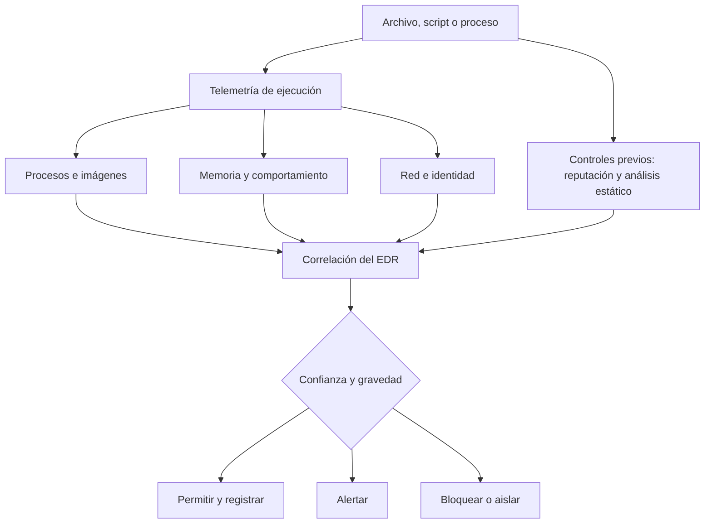

# Clase 168 — Evasión de defensas: antivirus y EDR

> Parte: **7 — Red Team y operaciones ofensivas** · Fuente: *RTFM v2 (Clark) / documentación de EDR y Windows internals*
> ⏱️ Duración estimada: **120 min** · Nivel: **Experto**

---

## 🎯 Objetivo

Entender cómo funcionan los antivirus y EDR modernos para poder evadirlos de forma comprendida (no por copiar-pegar). El alumno estudiará las técnicas de detección (firmas, heurística, hooks de usermode, ETW, callbacks del kernel) y las contramedidas ofensivas responsables (unhooking, syscalls directas, ejecución en memoria), siempre en su laboratorio y con la mirada puesta en cómo el Blue Team lo detecta.

## 📚 Resultados de aprendizaje

Al finalizar, el alumno podrá:

1. **Describir** cómo un EDR obtiene telemetría (hooks usermode, ETW, callbacks del kernel).
2. **Diferenciar** detección estática, heurística y comportamental.
3. **Aplicar** técnicas de evasión (unhooking, syscalls indirectas, ejecución en memoria) en un lab.
4. **Medir** la evasión frente a un EDR real de laboratorio.
5. **Explicar** las contramedidas defensivas de cada técnica ofensiva.

## 🗺️ Temas

| # | Tema | Por qué importa |
|---|------|-----------------|
| 1 | Firmas y heurística | Detección estática básica |
| 2 | Userland hooking | Cómo el EDR intercepta APIs |
| 3 | ETW y telemetría | Fuente rica de eventos |
| 4 | Kernel callbacks | Visibilidad profunda del EDR |
| 5 | Unhooking | Restaurar ntdll limpia |
| 6 | Syscalls directas/indirectas | Saltarse los hooks usermode |
| 7 | Ejecución en memoria | Cambia artefactos de archivo, no elimina telemetría |

## 🧠 Explicación en profundidad

### Un EDR no es un único detector

Un error pedagógico frecuente es imaginar el EDR como una función colocada delante de cada API. En realidad, el producto combina sensores, eventos del sistema, contexto histórico y una capa de análisis. La arquitectura exacta depende del fabricante y de la versión: puede consumir creación de procesos, carga de imágenes, actividad de red, eventos de seguridad, ETW y señales obtenidas por componentes protegidos. Por eso una técnica que altera una observación en modo usuario no «apaga el EDR»; como máximo afecta una fuente concreta.

La detección ocurre además en momentos diferentes. Antes de ejecutar puede evaluarse reputación, firma o estructura del archivo. Durante la ejecución se correlacionan relaciones padre-hijo, memoria, credenciales, red y secuencias de acciones. Después, el backend puede enriquecer lo observado con inteligencia, prevalencia y actividad de otros equipos. Cambiar el hash solo altera una parte de la primera capa.

### Firmas, comportamiento y contexto se complementan

Una firma puede reconocer una secuencia de bytes, una cadena o una familia conocida con muy poco coste. La heurística busca propiedades sospechosas sin exigir identidad exacta. La analítica comportamental observa relaciones: por ejemplo, un intérprete iniciado por una aplicación ofimática que crea otro proceso y establece una conexión. Ninguna capa es perfecta; el valor aparece al correlacionarlas.

Esta distinción cambia el laboratorio. No basta con anotar «detectado/no detectado». Debe registrarse **qué control** produjo el resultado, en qué etapa, con qué evento y si la prevención fue local o posterior. Sin esa línea base, atribuir el cambio a unhooking, ejecución en memoria o cualquier otra variación sería una conclusión no demostrada.

### Límite real de las técnicas centradas en modo usuario

Los hooks en bibliotecas de usuario son una posible fuente de observación, no una propiedad universal que deba asumirse. Restaurar código de una biblioteca o cambiar la ruta de una llamada puede modificar esa observación, pero la creación de hilos, los cambios de protección de memoria, la carga de módulos y la actividad resultante pueden seguir siendo visibles por otros medios. De igual forma, ejecutar sin escribir un binario convencional en disco reduce determinados artefactos, pero no borra memoria, red, proceso ni identidad.

La pregunta profesional no es «¿cómo hago invisible esta acción?», sino «¿qué fuentes se conservaron y cuáles se degradaron?». Esa pregunta permite al equipo azul diseñar cobertura redundante y al equipo rojo producir un hallazgo reproducible, en vez de una demostración dependiente de una versión concreta.

### Método experimental para una prueba segura

Se cambia una sola variable por iteración: misma máquina, identidad, muestra de prueba y ventana temporal. Primero se ejecuta la línea base; después, una variante; por último, se comparan archivos, procesos, eventos, alertas y tráfico. El criterio de éxito incluye observabilidad defensiva, no solo ejecución. Si la prueba requiere debilitar un control, se hace en una VM desechable y se restituye el estado al terminar.

## 📖 Definiciones y características

- **Detección por firma**: comparación con hashes/patrones conocidos. Característica: rápida pero evadible con cambios mínimos.
- **Detección heurística/comportamental**: analiza acciones (inyección, acceso a LSASS). Característica: más robusta, base de los EDR.
- **Userland hooking**: instrumentación de funciones en modo usuario empleada por algunos productos y versiones. Característica: es una fuente posible, no la arquitectura completa de todo EDR.
- **ETW (Event Tracing for Windows)**: infraestructura de trazado con múltiples proveedores y consumidores. Característica: la ubicación y protección de cada proveedor condicionan su resistencia a manipulación.
- **Kernel callbacks**: notificaciones del kernel (process/thread/image load) que el driver del EDR recibe. Característica: difíciles de evadir desde usermode.
- **Direct/indirect syscalls**: rutas alternativas para alcanzar una llamada al sistema y alterar la observación en modo usuario. Característica: no eliminan las señales del kernel, memoria, proceso o comportamiento.

## 📔 Glosario

- **AV:** control antimalware centrado en prevenir o detectar contenido malicioso.
- **EDR:** plataforma que recoge y correlaciona telemetría de endpoints para detectar, investigar y responder.
- **Sensor:** componente que obtiene una señal concreta del sistema.
- **Hook:** redirección o instrumentación de una función para observar o alterar su ejecución.
- **Modo usuario:** espacio donde se ejecutan aplicaciones con acceso restringido al kernel.
- **Modo kernel:** nivel privilegiado que administra procesos, memoria, dispositivos y otros recursos del sistema.
- **ETW:** infraestructura de trazado de Windows basada en proveedores y consumidores de eventos.
- **Callback:** mecanismo por el que un componente recibe notificación de determinados eventos.
- **Ejecución en memoria:** carga de código sin depender de un ejecutable convencional persistido; no equivale a ausencia de artefactos.
- **Línea base:** medición inicial usada para atribuir correctamente el efecto de una variación.
- **Correlación:** unión de varias señales y contexto para elevar o reducir la confianza de una detección.

## 🧰 Herramientas y preparación

- Un EDR de laboratorio (versión de evaluación o Microsoft Defender for Endpoint en un tenant de prueba) y **Sysmon** (Parte 8) para telemetría.
- Windows internals: entender PE, ntdll y syscalls (repaso Partes 5 y 6).
- Proyectos de estudio open source (SysWhispers y referencias de unhooking) para comprender la mecánica.
- El C2 de las clases anteriores como carga a evadir.

> ⚠️ **Solo laboratorio.** La evasión se practica contra EDR/antivirus en máquinas que controlas, para entender su funcionamiento y mejorar la detección. Distribuir malware evasivo o usarlo fuera de un engagement autorizado es ilegal. El objetivo pedagógico es defensivo: saber qué buscar.

## 🧪 Laboratorio guiado

1. **Línea base de detección.** Ejecuta un implante C2 sin evasión en la VM con EDR y observa la alerta; anota qué evento la disparó.
2. **Analiza la instrumentación.** Con un depurador, compara una función como `NtAllocateVirtualMemory` entre una VM base y la VM vigilada. Si observas una redirección, demuestra su procedencia antes de atribuirla al EDR: Windows, un profiler u otro software también puede modificar rutas de ejecución.
3. **Unhooking conceptual.** Estudia cómo recargar una copia limpia de `ntdll.dll` desde disco (o `KnownDlls`) para sobrescribir los hooks en memoria; explica por qué restaura las funciones originales.
4. **Syscalls indirectas.** Revisa el patrón de SysWhispers: resolver el número de syscall en runtime y saltar a la instrucción `syscall` dentro de ntdll para no ser hookeado en usermode.
5. **Ejecución en memoria.** En una VM desechable, compara una carga reflectiva de prueba con un ejecutable convencional. Registra qué artefactos de archivo disminuyen y qué señales de proceso, memoria y red permanecen; no la describas como «sin artefactos».
6. **Compara fuentes ETW sin deshabilitarlas.** Modela qué observación depende del proceso y cuál se origina en componentes más privilegiados. Usa una prueba inocua para comprobar que degradar conceptualmente una fuente no elimina la telemetría redundante.
7. **Mide y documenta.** Repite la ejecución con cada técnica y anota si el EDR alerta, degradando el ruido paso a paso, y qué fuente de datos aún lo detecta.

## ✍️ Ejercicios

1. Explica la diferencia entre detección por firma y comportamental con un ejemplo.
2. Describe cómo un EDR instala un hook en ntdll y cómo el unhooking lo revierte.
3. Compara syscalls directas e indirectas en términos de sigilo.
4. Explica por qué la ejecución en memoria genera menos telemetría de disco.
5. Investiga qué es ETW-TI y por qué es más difícil de evadir que ETW clásico.
6. Para tres técnicas ofensivas, describe su contramedida defensiva.

## 📝 Reto verificable

Partiendo de un implante que el EDR de tu lab detecta, aplica **al menos dos técnicas de evasión** y documenta el cambio en la telemetría.
**Criterio de aceptación:** demuestras (con capturas de la consola del EDR/Sysmon) que la línea base generaba una alerta y que tras las técnicas aplicadas cambia el resultado; además, explicas qué fuente de datos aún podría detectarte. Todo en tu laboratorio.

## ⚠️ Errores comunes

| Síntoma / mensaje | Causa y cómo arreglar |
|-------------------|-----------------------|
| Evasión "mágica" que no entiendes | Copiaste código; estudia el mecanismo antes de usarlo |
| Sigue detectando pese a syscalls | El EDR usa kernel callbacks/ETW-TI; usermode no basta |
| El unhooking crashea el proceso | Copia de ntdll mal mapeada; respeta secciones/permisos |
| Alerta por acceso a LSASS | La técnica es comportamental, no de firma; cambia el comportamiento, no el binario |
| Funciona hoy, falla mañana | El EDR se actualizó; la evasión es una carrera continua |

## ❓ Preguntas frecuentes

**❓ ¿Cambiar el hash evade un EDR?**
Solo evade firmas estáticas. Los EDR modernos son comportamentales: detectan lo que el proceso hace, no cómo se llama el archivo.

**❓ ¿Las syscalls directas son la solución definitiva?**
No. Evaden hooks usermode, pero el kernel (callbacks, ETW-TI) sigue viendo la actividad. Además, un proceso que llama syscalls "raras" es en sí sospechoso.

**❓ ¿Esto no es enseñar a hacer malware?**
Enseñamos el mecanismo para **defender**: sin entender la evasión no se puede escribir una detección robusta. Todo se practica en laboratorio propio.

## 🔗 Referencias

- MITRE ATT&CK — *Defense Evasion* (TA0005). <https://attack.mitre.org/tactics/TA0005/> — taxonomía para relacionar técnicas de evasión con mitigaciones y fuentes de detección, sin asumir invisibilidad.
- Microsoft — *Event Tracing for Windows*. <https://learn.microsoft.com/en-us/windows-hardware/drivers/devtest/event-tracing-for-windows--etw-> — base técnica para distinguir proveedores, sesiones y consumidores de telemetría ETW.
- Microsoft — *Windows Defender Application Control and AppLocker Overview*. <https://learn.microsoft.com/en-us/windows/security/application-security/application-control/windows-defender-application-control/wdac-and-applocker-overview> — referencia para separar control de aplicaciones, antimalware y EDR.
- Elastic Security Labs — *Kernel ETW is the best ETW*. <https://www.elastic.co/security-labs/kernel-etw-best-etw> — investigación del fabricante usada para contrastar hooks en proceso con fuentes ETW del kernel y sus límites de manipulación.
- SysWhispers3. <https://github.com/klezVirus/SysWhispers3> — código de estudio para comprender resolución de llamadas; no se toma como prueba de evasión universal.
- Clark, B. — *RTFM: Red Team Field Manual v2* — referencia operativa complementaria para el entorno controlado.

## 📥 Material descargable

- 📄 [Guía en PDF](./clase-168-guia.pdf) — versión imprimible de esta clase.
- 🎞️ [Presentación (PPTX)](./clase-168-presentacion.pptx) — deck para proyectar en clase.

## ⬅️ Clase anterior

[Clase 167 — Acceso inicial: técnicas](../167-acceso-inicial-tecnicas/README.md)

## ➡️ Siguiente clase

[Clase 169 — Ofuscación de payloads y bypass de AMSI](../169-ofuscacion-de-payloads-y-bypass-de-amsi/README.md)
