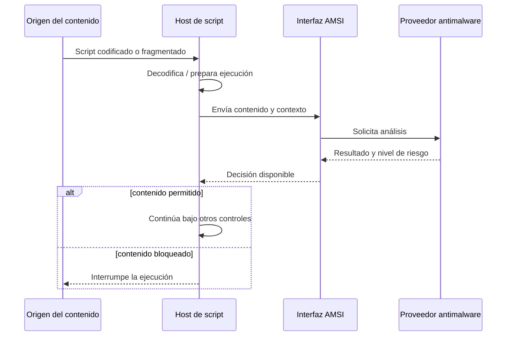

# Clase 169 — Ofuscación de payloads y bypass de AMSI

> Parte: **7 — Red Team y operaciones ofensivas** · Fuente: *RTFM v2 (Clark) / Microsoft AMSI documentation*
> ⏱️ Duración estimada: **110 min** · Nivel: **Experto**

---

## 🎯 Objetivo

Comprender AMSI (Antimalware Scan Interface) y las técnicas de ofuscación de payloads que lo evaden, entendiendo el mecanismo en profundidad. El alumno verá cómo AMSI inspecciona scripts en memoria (PowerShell, VBA, JScript), por qué la ofuscación simple ya no basta, y las estrategias de bypass responsables, con foco en cómo se detectan.

## 📚 Resultados de aprendizaje

Al finalizar, el alumno podrá:

1. **Explicar** el funcionamiento de AMSI y qué motores lo consumen.
2. **Aplicar** ofuscación a scripts y evaluar su efectividad.
3. **Describir** las categorías de bypass de AMSI (memory patching, providers, downgrade).
4. **Reconocer** por qué un bypass "público" deja de funcionar.
5. **Detectar** los IOCs que deja un intento de bypass.

## 🗺️ Temas

| # | Tema | Por qué importa |
|---|------|-----------------|
| 1 | Qué es AMSI | Inspección de contenido en runtime |
| 2 | Integraciones (PowerShell, VBA, .NET) | AMSI cubre múltiples motores |
| 3 | Ofuscación de scripts | Rompe firmas estáticas |
| 4 | AMSI memory patch | Neutraliza el scan en el proceso |
| 5 | Downgrade y forzar errores | Alternativas al patch |
| 6 | Detección de bypass | Cómo lo ve el Blue Team |
| 7 | Ofuscación de binarios | Más allá de scripts |

## 🧠 Explicación en profundidad

### AMSI es una interfaz de integración, no un antivirus independiente

AMSI permite que una aplicación entregue contenido a un proveedor antimalware y reciba un resultado. Microsoft documenta integraciones en PowerShell, Windows Script Host, JavaScript/VBScript, macros de Office y determinados flujos de UAC. El proveedor y su política deciden la clasificación; por eso no existe una respuesta universal para todas las combinaciones de host, versión y producto.

Su ventaja pedagógica aparece en el **momento del análisis**. Un script puede llegar codificado o dividido y, aun así, el host puede enviar al proveedor una representación más cercana al contenido que pretende ejecutar. AMSI también admite sesiones para relacionar fragmentos. Esto explica por qué cambiar cadenas visibles en el archivo puede derrotar una firma simple sin evitar el análisis posterior.

### Ofuscación, codificación y cifrado no son sinónimos

La **codificación** cambia una representación para transportarla o interpretarla; Base64 no aporta secreto. El **cifrado** protege confidencialidad mientras exista una clave adecuada. La **ofuscación** busca dificultar el análisis conservando la función. En una cadena real pueden aparecer las tres, pero cada una resuelve un problema diferente y deja una etapa de reconstrucción observable.

Evaluar ofuscación solo por si «pasa» una muestra confunde el resultado. Hay que comprobar legibilidad, contenido entregado a AMSI, Script Block Logging, proceso resultante y comportamiento. La transformación puede reducir una firma textual y, al mismo tiempo, aumentar la anomalía mediante capas de decodificación, reflexión o llamadas poco habituales.

### Qué significa alterar la ruta de análisis

Las categorías conocidas de evasión intentan cambiar el contenido, el host, la disponibilidad de la interfaz o el resultado que recibe el proceso. Un parche en memoria afecta a ese proceso y versión concretos; no elimina necesariamente otros sensores ni la telemetría previa o posterior. Un downgrade depende de que un componente antiguo esté instalado y permitido, algo que un sistema endurecido debe evitar. Manipular proveedores cambia la relación de confianza del sistema y puede requerir privilegios, además de generar indicios propios.

Por seguridad, el ejercicio debe usar una cadena inocua de prueba y centrarse en observar el flujo. No se necesita ejecutar malware real para demostrar que una transformación cambia el punto donde aparece una detección. El entregable profesional es una matriz que muestre qué capa observó cada variante y qué control compensatorio permaneció activo.

### La defensa se construye con redundancia

AMSI no sustituye el registro de bloques de script, el control de aplicaciones, la reducción de superficie de ataque ni la telemetría del endpoint. Si una prueba demuestra que una interfaz puede degradarse en un proceso, la recomendación no es buscar una firma eterna del bypass, sino combinar protección contra manipulación, versiones modernas, registro centralizado y detecciones de comportamiento. La conclusión debe sobrevivir al snippet usado en la demostración.

## 📖 Definiciones y características

- **AMSI**: interfaz de Windows que permite a aplicaciones integrar proveedores antimalware y enviar contenido o flujos para análisis. Característica: el contenido disponible depende del host y del momento de la solicitud.
- **Ofuscación**: transformar el código para romper firmas manteniendo la funcionalidad. Característica: derrota firmas, no comportamiento.
- **AMSI bypass por alteración en memoria**: intento de modificar dentro de un proceso la ruta o el resultado del análisis. Característica: depende de versión e integración y puede generar señales de manipulación propias.
- **Downgrade**: forzar el uso de PowerShell v2 (sin AMSI). Característica: evita AMSI si la v2 está disponible.
- **Provider tampering**: manipular el proveedor de AMSI registrado. Característica: técnica más sigilosa pero compleja.
- **String obfuscation / encoding**: dividir y codificar cadenas sospechosas. Característica: primer nivel de evasión estática.

## 📔 Glosario

- **AMSI:** interfaz estándar de Windows que conecta aplicaciones con proveedores antimalware.
- **Host de script:** aplicación responsable de interpretar o ejecutar el contenido, como PowerShell o Windows Script Host.
- **Proveedor AMSI:** componente antimalware que analiza el contenido recibido mediante la interfaz.
- **Sesión AMSI:** contexto que permite correlacionar varias solicitudes de análisis relacionadas.
- **Codificación:** cambio reversible de representación; no garantiza confidencialidad.
- **Cifrado:** transformación criptográfica destinada a proteger información mediante una clave.
- **Ofuscación:** transformación que dificulta la comprensión manteniendo el comportamiento.
- **Desofuscación:** reconstrucción del contenido o lógica original antes o durante la ejecución.
- **Script Block Logging:** registro de bloques de PowerShell procesados, útil como fuente independiente de AMSI.
- **Tamper protection:** controles destinados a impedir cambios no autorizados en componentes de seguridad.
- **Control compensatorio:** medida que mantiene cobertura cuando otro control falla o se degrada.

## 🧰 Herramientas y preparación

- Windows con PowerShell 5+ y Microsoft Defender activo (en VM de laboratorio).
- Herramientas de ofuscación de estudio (Invoke-Obfuscation como referencia histórica) y editores de scripts.
- Sysmon + Script Block Logging (Parte 8) para observar la detección.
- El C2 previo para probar la entrega de scripts evadidos.

> ⚠️ **Solo laboratorio.** Estas técnicas se practican en máquinas propias para entender AMSI y escribir mejores detecciones. Muchos bypass son públicos y por eso mismo ya están firmados. Nunca uses esto fuera de un engagement autorizado.

## 🧪 Laboratorio guiado

1. **Provoca una detección.** En PowerShell del lab, ejecuta una cadena claramente maliciosa conocida (ej. la firma de prueba de AMSI) y observa que Defender la bloquea.
2. **Entiende dónde escanea AMSI.** Comprueba que la detección ocurre en memoria al ejecutar, no al guardar el archivo: AMSI ve el contenido tras la desofuscación superficial.
3. **Ofuscación básica.** Divide y concatena las cadenas sospechosas; observa si la firma estática deja de coincidir y por qué AMSI puede seguir viéndolo en runtime.
4. **Estudia el memory patch sin una carga real.** Analiza conceptualmente cómo una alteración en proceso intenta cambiar el flujo de análisis. Usa una cadena inocua de prueba y compara eventos; no necesitas ejecutar malware para demostrar la degradación de esa capa.
5. **Downgrade (si aplica).** Prueba invocar `powershell -version 2` en un sistema que lo permita y comprueba la ausencia de AMSI (documenta que en sistemas endurecidos v2 no está).
6. **Observa la detección.** Con Script Block Logging activo, revisa cómo el Blue Team ve el bypass (patrones de reflexión, `[Ref].Assembly`, strings característicos).
7. **Ofuscación de binarios.** Compara cómo un packer/cifrado cambia el hash del payload C2 sin cambiar su comportamiento, y por qué el EDR aún lo detecta.

## ✍️ Ejercicios

1. Explica con tus palabras qué ventaja tiene AMSI sobre el escaneo de archivos en disco.
2. Ofusca un script de prueba y evalúa si evade la firma estática.
3. Describe paso a paso la lógica de un AMSI memory patch.
4. Explica por qué el downgrade a PS v2 evade AMSI y cómo mitigarlo.
5. Enumera 4 IOCs que deja un intento de bypass en los logs.
6. Investiga por qué los bypass públicos "caducan" rápido.

## 📝 Reto verificable

En tu laboratorio, toma un script que Defender bloquea y consigue ejecutarlo aplicando una técnica de bypass de AMSI, documentando **cómo el Blue Team lo detectaría**.
**Criterio de aceptación:** demuestras la ejecución del script tras el bypass (antes bloqueado) y entregas una regla o lista de indicadores (Script Block Logging, cadenas, comportamiento) con la que un defensor detectaría tu técnica. Todo en tu VM.

## ⚠️ Errores comunes

| Síntoma / mensaje | Causa y cómo arreglar |
|-------------------|-----------------------|
| El bypass público no funciona | Ya está firmado; entiende el mecanismo y adáptalo |
| Ofusco pero AMSI sigue detectando | AMSI ve el runtime; la ofuscación estática no basta |
| Downgrade falla | PS v2 deshabilitado (buen hardening); no hay atajo |
| El patch bloquea PowerShell | Offset/versión incorrectos; verifica la firma de la función |
| Script Block Logging te delata | Es telemetría rica; asume que el bypass es visible |

## ❓ Preguntas frecuentes

**❓ ¿Ofuscar es suficiente para evadir AMSI?**
No. AMSI inspecciona el contenido en memoria tras la desofuscación superficial, así que la ofuscación estática por sí sola raramente basta contra motores actualizados.

**❓ ¿Por qué los bypass de GitHub dejan de funcionar?**
Porque los proveedores pueden añadir firmas, heurísticas o detecciones de comportamiento, y las versiones del host cambian. La comprensión del mecanismo es duradera; el snippet concreto no.

**❓ ¿Deshabilitar AMSI es lo mismo que evadirlo?**
No exactamente: evadir es lograr que no bloquee tu contenido concreto; los memory patches efectivamente lo neutralizan en el proceso, lo cual es muy detectable.

## 🔗 Referencias

- Microsoft — *Antimalware Scan Interface (AMSI)*. <https://learn.microsoft.com/en-us/windows/win32/amsi/antimalware-scan-interface-portal> — fuente principal para el propósito, las integraciones, las sesiones y el modelo proveedor/aplicación.
- Microsoft — *AMSI developer audience, samples*. <https://learn.microsoft.com/en-us/windows/win32/amsi/dev-audience> — referencia del flujo de inicialización, análisis y resultado utilizado en el diagrama conceptual.
- MITRE ATT&CK — *Impair Defenses* (`T1562`). <https://attack.mitre.org/techniques/T1562/> — clasificación de la degradación de controles y sus posibilidades de detección.
- Microsoft — *about Logging Windows*. <https://learn.microsoft.com/en-us/powershell/module/microsoft.powershell.core/about/about_logging_windows> — sustenta Script Block Logging como fuente de observación complementaria.
- Clark, B. — *RTFM: Red Team Field Manual v2* — referencia de consulta operativa; el funcionamiento de AMSI se fundamenta en Microsoft Learn.

## 📥 Material descargable

- 📄 [Guía en PDF](./clase-169-guia.pdf) — versión imprimible de esta clase.
- 🎞️ [Presentación (PPTX)](./clase-169-presentacion.pptx) — deck para proyectar en clase.

## ⬅️ Clase anterior

[Clase 168 — Evasión de defensas: antivirus y EDR](../168-evasion-de-defensas-antivirus-y-edr/README.md)

## ➡️ Siguiente clase

[Clase 170 — Active Directory: enumeración](../170-active-directory-enumeracion/README.md)
