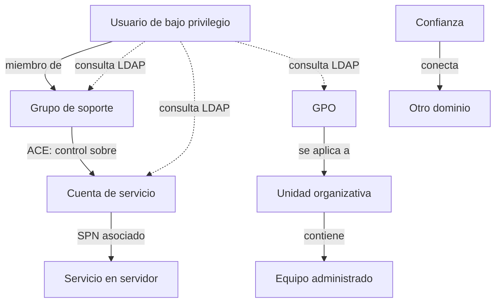

# Clase 170 — Active Directory: enumeración

> Parte: **7 — Red Team y operaciones ofensivas** · Fuente: *The Hacker Recipes (AD) / Operator Handbook*
> ⏱️ Duración estimada: **110 min** · Nivel: **Avanzado**

---

## 🎯 Objetivo

Aprender a enumerar un dominio de Active Directory desde una posición de foothold: usuarios, grupos, equipos, políticas, confianzas, SPNs y relaciones. La enumeración es el 80% del trabajo en AD: cuanto mejor entiendas la estructura del dominio, más limpio y dirigido será el ataque. El alumno montará un AD lab (o usará GOAD) y lo mapeará.

## 📚 Resultados de aprendizaje

Al finalizar, el alumno podrá:

1. **Montar** un laboratorio de Active Directory (o desplegar GOAD).
2. **Enumerar** usuarios, grupos, equipos y GPOs con herramientas nativas y de terceros.
3. **Identificar** SPNs, cuentas privilegiadas y relaciones de confianza.
4. **Consultar** LDAP de forma eficiente y sigilosa.
5. **Documentar** la superficie del dominio para planificar el ataque.

## 🗺️ Temas

| # | Tema | Por qué importa |
|---|------|-----------------|
| 1 | Estructura de AD | Dominios, OUs, forest, confianzas |
| 2 | LDAP y objetos | El "lenguaje" de consulta de AD |
| 3 | Enumeración de usuarios/grupos | Mapa de identidades y privilegios |
| 4 | SPNs y cuentas de servicio | Base de Kerberoasting (Clase 171) |
| 5 | GPOs y ACLs | Fuente de rutas de escalado |
| 6 | Confianzas de dominio/forest | Movimiento entre dominios |
| 7 | Sigilo en la enumeración | Evitar disparar alertas |

## 🧠 Explicación en profundidad

### Active Directory es un grafo de objetos y permisos

AD DS no es solamente una lista de usuarios. Es un servicio de directorio distribuido entre controladores de dominio que almacena objetos —cuentas, equipos, grupos, unidades organizativas y políticas— junto con atributos y relaciones. Microsoft especifica LDAP como su protocolo principal de acceso al directorio, mientras Kerberos y NTLM participan en autenticación. Entender esa separación evita atribuir a LDAP funciones que pertenecen a Kerberos o al sistema de autorización.

La enumeración útil reconstruye tres planos: **identidad** (quién es quién), **recursos** (qué equipos y servicios existen) y **control** (quién puede modificar o utilizar qué). Una cuenta aparentemente común puede ser relevante por pertenencia transitiva a grupos, por una ACE sobre otro objeto o porque ejecuta un servicio. El riesgo reside con frecuencia en la relación, no en el nombre del objeto.

### Cómo se organiza una consulta LDAP

Una consulta necesita una base de búsqueda, un alcance, un filtro y los atributos que se desean recuperar. Pedir todo el dominio con todos los atributos es sencillo, pero genera volumen y dificulta el análisis. Una consulta dirigida parte de una pregunta: «¿qué cuentas de usuario poseen un SPN?» o «¿qué grupos contienen a esta identidad?». Entonces limita el filtro y solicita solo los atributos necesarios.

El **distinguished name** ubica un objeto en el árbol; el `sAMAccountName` conserva un nombre de inicio de sesión histórico y el SID identifica al principal de seguridad dentro de las relaciones de autorización. Confundirlos causa errores al correlacionar resultados. También hay que considerar replicación: dos controladores pueden mostrar diferencias transitorias después de un cambio.

### De la colección al razonamiento

PowerView, Impacket, NetExec y los colectores de BloodHound son medios de consulta, no conclusiones. Cada resultado importante debe verificarse mediante otra vista o consulta y conservar su procedencia. Por ejemplo, descubrir un SPN identifica una cuenta vinculada a un servicio; no demuestra por sí solo que la contraseña sea débil ni que el servicio sea explotable. Una ACE `GenericAll` exige confirmar objeto origen, objeto destino, herencia y contexto antes de describir una ruta.

BloodHound representa relaciones como nodos y aristas para ayudar a razonar sobre caminos. Eso no convierte cada camino calculado en uno ejecutable: pueden intervenir segmentación, sesiones caducadas, controles de endpoint o datos desactualizados. La visualización produce hipótesis que luego se validan con el menor impacto posible.

### Enumerar también deja telemetría

Las lecturas legítimas del directorio son necesarias para la administración, por lo que prevenirlas de forma absoluta no suele ser viable. La defensa busca secuencias, volumen, origen e identidad: un endpoint que consulta rápidamente todos los usuarios, grupos, ACL y relaciones puede diferir de la actividad administrativa habitual. El red team debe medir número de consultas, duración y fuentes empleadas; «low and slow» tampoco garantiza invisibilidad si el patrón acumulado es anómalo.

## 📖 Definiciones y características

- **Active Directory**: servicio de directorio de Microsoft para gestionar identidades y recursos. Característica: LDAP + Kerberos como columna vertebral.
- **LDAP**: protocolo de consulta del directorio. Característica: permite enumerar casi todo con una cuenta de dominio válida.
- **SPN (Service Principal Name)**: identificador de un servicio ligado a una cuenta. Característica: habilita Kerberoasting.
- **GPO (Group Policy Object)**: política aplicada a OUs/equipos. Característica: mal configurada, ofrece escalado.
- **ACL / ACE**: permisos sobre objetos de AD. Característica: relaciones abusables (GenericAll, WriteDACL).
- **Trust (confianza)**: relación entre dominios/forests. Característica: puede permitir saltar de un dominio a otro.

## 📔 Glosario

- **AD DS:** servicio de directorio de dominio de Microsoft implementado por controladores de dominio.
- **Objeto:** entrada del directorio que representa una identidad, recurso, contenedor u otra entidad.
- **Atributo:** propiedad almacenada en un objeto, como nombre, SID o SPN.
- **LDAP:** protocolo estándar para consultar y actualizar servicios de directorio.
- **Base DN:** punto del árbol desde el cual comienza una búsqueda LDAP.
- **Distinguished name (DN):** nombre jerárquico único que ubica un objeto en el directorio.
- **SID:** identificador de un principal de seguridad utilizado en autorización.
- **OU:** contenedor administrativo al que pueden vincularse políticas y delegaciones.
- **ACE:** entrada individual que concede o deniega un derecho dentro de una ACL.
- **SPN:** identificador que asocia una instancia de servicio con la cuenta bajo la que se ejecuta.
- **Confianza:** relación que permite reconocer autenticación entre dominios o bosques bajo reglas definidas.
- **Replicación:** propagación de cambios entre controladores de dominio.

## 🧰 Herramientas y preparación

- **AD lab:** un DC Windows Server + 1–2 workstations, o desplegar [GOAD](https://github.com/Orange-Cyberdefense/GOAD).
- `PowerView` (PowerShell), `NetExec (nxc)`, `ldapsearch`, `BloodHound` collectors (Clase 173).
- `Impacket` (`GetADUsers.py`, `GetUserSPNs.py`) desde Linux.
- Una cuenta de dominio de bajo privilegio para partir del foothold.

> ⚠️ Todo se realiza contra tu propio laboratorio de AD (o GOAD). Enumerar un dominio ajeno sin autorización es acceso no autorizado. GOAD está diseñado precisamente para practicar esto de forma legal.

## 🧪 Laboratorio guiado

1. **Despliega el lab.** Levanta GOAD o tu DC + workstations. Verifica resolución DNS al dominio (ej. `lab.local`).
2. **Enumera con nxc:** `nxc smb 10.10.10.10 -u user -p 'pass' --users --groups` para listar usuarios y grupos.
3. **PowerView desde Windows.** Importa el módulo y ejecuta `Get-DomainUser`, `Get-DomainGroupMember "Domain Admins"`, `Get-DomainComputer`.
4. **Busca SPNs:** con Impacket `GetUserSPNs.py lab.local/user:pass -dc-ip 10.10.10.10` para localizar cuentas de servicio (insumo de la próxima clase).
5. **Consulta LDAP directa:** `ldapsearch -x -H ldap://10.10.10.10 -D 'user@lab.local' -w pass -b 'DC=lab,DC=local' '(objectClass=user)'`.
6. **Mapea confianzas:** `Get-DomainTrust` y anota relaciones entre dominios del forest.
7. **Recoge para BloodHound.** Ejecuta el collector (`SharpHound`/`bloodhound-python`) para el análisis de rutas de la Clase 173, y documenta cuentas privilegiadas y ACLs interesantes.

## ✍️ Ejercicios

1. Lista todos los miembros de "Domain Admins" del lab con dos herramientas distintas.
2. Encuentra 3 cuentas con SPN y explica por qué son interesantes.
3. Consulta por LDAP los usuarios con `PASSWD_NOTREQD` o `DONT_REQUIRE_PREAUTH`.
4. Enumera las GPOs del dominio y a qué OUs aplican.
5. Mapea las confianzas del forest y dibújalas.
6. Compara el ruido (telemetría) de PowerView vs consultas LDAP puntuales.

## 📝 Reto verificable

Produce un **mapa del dominio de tu AD lab**: usuarios privilegiados, cuentas con SPN, GPOs relevantes, confianzas y al menos una relación ACL potencialmente abusable, recogido además con un collector de BloodHound.
**Criterio de aceptación:** entregas un documento/diagrama con esos cinco elementos, cada dato verificable en el lab, y un archivo de recolección listo para importar en BloodHound.

## ⚠️ Errores comunes

| Síntoma / mensaje | Causa y cómo arreglar |
|-------------------|-----------------------|
| LDAP no responde | DNS mal configurado o credenciales inválidas; verifica dominio y cuenta |
| PowerView bloqueado por AMSI | Import detectado; aplica lo visto en la Clase 169 en el lab |
| No aparecen SPNs | No hay cuentas de servicio con SPN registrado; revisa el diseño del lab |
| Enumeración muy ruidosa | Consultas masivas; usa peticiones dirigidas y espaciadas |
| El collector falla | Falta conectividad al DC o permisos; ejecuta con la cuenta correcta |

## ❓ Preguntas frecuentes

**❓ ¿Necesito ser admin para enumerar AD?**
No necesariamente. Por defecto, una identidad autenticada puede leer muchos objetos y atributos necesarios para operar AD DS, pero ACL, endurecimiento y tipo de objeto pueden limitar la vista. La práctica mide lo que esa identidad concreta puede consultar, no asume acceso universal.

**❓ ¿PowerView o BloodHound?**
Ambos: PowerView para consultas puntuales interactivas; BloodHound para visualizar relaciones y rutas de ataque (Clase 173).

**❓ ¿Qué es GOAD?**
Game of Active Directory: un laboratorio vulnerable y reproducible pensado para practicar ataques a AD de forma legal en tu propia máquina.

## 🔗 Referencias

- Microsoft — *Active Directory Protocols Overview*. <https://learn.microsoft.com/en-us/openspecs/windows_protocols/ms-adod/9003d65b-05eb-4ba1-a006-dd617476319d> — fuente principal para distinguir AD DS, LDAP y los protocolos relacionados.
- Microsoft — *Active Directory Data Model and glossary*. <https://learn.microsoft.com/en-us/openspecs/windows_protocols/ms-addm/bf6e41b7-bae0-4a47-affd-6f18218a537c> — sustenta los conceptos de objeto, atributo, naming context, SID y replicación.
- MITRE ATT&CK — *Permission Groups Discovery* (`T1069`). <https://attack.mitre.org/techniques/T1069/> — referencia para explicar el valor ofensivo y la detección de enumeración de grupos.
- SpecterOps — *BloodHound: Attack Paths*. <https://bloodhound.specterops.io/analyze-data/findings/attack-paths> — base del razonamiento como grafo y de la necesidad de validar los caminos calculados.
- GOAD. <https://github.com/Orange-Cyberdefense/GOAD> — laboratorio vulnerable reproducible utilizado en los ejercicios.
- PowerSploit/PowerView. <https://github.com/PowerShellMafia/PowerSploit> e Impacket. <https://github.com/fortra/impacket> — documentación de las herramientas concretas del laboratorio.

## 📥 Material descargable

- 📄 [Guía en PDF](./clase-170-guia.pdf) — versión imprimible de esta clase.
- 🎞️ [Presentación (PPTX)](./clase-170-presentacion.pptx) — deck para proyectar en clase.

## ⬅️ Clase anterior

[Clase 169 — Ofuscación de payloads y bypass de AMSI](../169-ofuscacion-de-payloads-y-bypass-de-amsi/README.md)

## ➡️ Siguiente clase

[Clase 171 — Active Directory: Kerberoasting y ataques a Kerberos](../171-active-directory-kerberoasting-y-ataques-a-kerberos/README.md)
