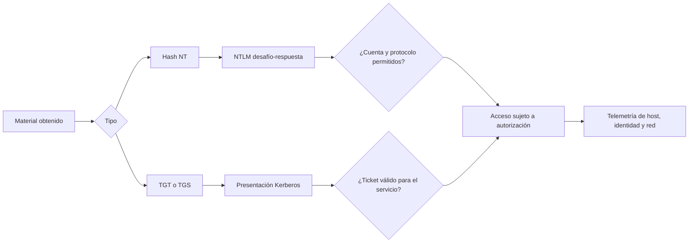

# Clase 172 — Active Directory: Pass-the-Hash y Pass-the-Ticket

> Parte: **7 — Red Team y operaciones ofensivas** · Fuente: *The Hacker Recipes / MITRE ATT&CK T1550*
> ⏱️ Duración estimada: **110 min** · Nivel: **Avanzado**

---

## 🎯 Objetivo

Dominar el movimiento lateral en Active Directory mediante reutilización de credenciales sin conocer la contraseña en claro: Pass-the-Hash (PtH), Pass-the-Ticket (PtT) y Overpass-the-Hash. El alumno aprenderá a extraer material de autenticación, reutilizarlo para autenticarse en otras máquinas del lab y entender por qué NTLM y Kerberos permiten estos abusos.

## 📚 Resultados de aprendizaje

Al finalizar, el alumno podrá:

1. **Explicar** por qué NTLM permite Pass-the-Hash.
2. **Ejecutar** PtH para autenticarse con un hash NTLM en el lab.
3. **Realizar** Pass-the-Ticket con un TGT/TGS robado.
4. **Aplicar** Overpass-the-Hash para obtener un TGT desde un hash.
5. **Reconocer** las defensas (Credential Guard, LSA protection, tiering).

## 🗺️ Temas

| # | Tema | Por qué importa |
|---|------|-----------------|
| 1 | NTLM y el hash | Base de Pass-the-Hash |
| 2 | Extracción de credenciales | LSASS, SAM, tickets |
| 3 | Pass-the-Hash (`T1550.002`) | Movimiento lateral sin contraseña |
| 4 | Pass-the-Ticket (`T1550.003`) | Reutilizar TGT/TGS |
| 5 | Overpass-the-Hash | Del hash NTLM a un TGT |
| 6 | Movimiento lateral | SMB/WMI/WinRM con credenciales |
| 7 | Defensas | Credential Guard, tiering, LSA |

## 🧠 Explicación en profundidad

### Una credencial no siempre es una contraseña

Windows puede representar la capacidad de autenticarse mediante distintos materiales: una contraseña, claves derivadas, un hash NT empleado en intercambios NTLM o un ticket Kerberos vigente. **Pass-the-Hash (PtH)** y **Pass-the-Ticket (PtT)** reutilizan material ya derivado o emitido, sin recuperar primero la contraseña legible. Por eso la respuesta debe considerar sesiones, tickets y secretos comprometidos según el protocolo.

En NTLM, el cliente demuestra conocimiento de un secreto respondiendo a un desafío. Si alguien obtiene el hash NT adecuado, puede producir esa respuesta sin conocer la contraseña en claro. En Kerberos, un ticket robado puede presentarse dentro de su contexto y vigencia. Son rutas distintas, con artefactos y mitigaciones distintas.



### Autenticación no equivale a autorización

Que el protocolo acepte el material confirma una identidad o sesión. El recurso todavía aplica permisos, grupos, políticas de inicio de sesión y segmentación. Un hash de una cuenta sin derechos remotos no concede administración. Un TGS sirve para el servicio y ámbito para el que fue emitido; un TGT permite solicitar tickets, pero sigue sujeto a vigencia y política. Esta separación debe aparecer en el informe para no exagerar impacto.

El llamado **overpass-the-hash** usa material de clave para obtener credenciales Kerberos en vez de continuar mediante NTLM. Lo relevante no es memorizar nombres de herramientas, sino reconocer la transición de protocolo y su telemetría: solicitud de TGT, posterior TGS y acceso al servicio.

### De dónde procede el material y por qué importa

LSASS participa en autenticación y mantiene material necesario para sesiones; su contenido y aislamiento varían por versión, configuración y tipo de inicio de sesión. Credential Guard usa seguridad basada en virtualización para aislar determinados secretos. No es una protección absoluta: reduce rutas de extracción concretas, mientras siguen siendo necesarios cuentas separadas, restricción de administración, reducción de NTLM y endpoints privilegiados.

La pregunta defensiva decisiva es dónde una identidad privilegiada deja material reutilizable. Si un administrador inicia sesión en un equipo de menor confianza, ese equipo puede convertirse en puente hacia otros recursos. El modelo de niveles administrativos y estaciones privilegiadas reduce esa exposición mejor que perseguir únicamente la firma de una herramienta.

### Evidencia y contención

Los eventos se correlacionan entre equipo origen, destino y controlador de dominio. Un inicio de sesión de red no demuestra PtH por sí solo. Se buscan combinaciones: protocolo inesperado, cuenta privilegiada desde un host no administrativo, secuencia Kerberos anómala, acceso a varios sistemas y señales de acceso a credenciales. La contención protege primero las cuentas y endpoints de mayor alcance sin destruir evidencia.

## 📖 Definiciones y características

- **Hash NT**: valor derivado de la contraseña que participa en autenticación NTLM. Característica: su exposición puede permitir producir respuestas válidas sin recuperar la contraseña legible.
- **Pass-the-Hash (PtH)**: autenticarse presentando el hash NTLM. Característica: funciona porque NTLM no exige la contraseña en claro.
- **Pass-the-Ticket (PtT)**: inyectar un TGT/TGS robado en la sesión. Característica: reutiliza autenticación Kerberos válida.
- **Overpass-the-Hash**: usar el hash para pedir un TGT (Kerberos) y así moverse. Característica: combina lo mejor de PtH con Kerberos.
- **LSASS**: proceso que guarda credenciales en memoria. Característica: fuente principal de extracción.
- **Credential Guard**: aísla determinados secretos mediante seguridad basada en virtualización. Característica: reduce rutas de extracción, pero no reemplaza separación administrativa ni reducción de NTLM.

## 📔 Glosario

- **Material de autenticación:** secreto, clave o ticket que permite demostrar una identidad.
- **Hash NT:** valor derivado de la contraseña usado en mecanismos Windows heredados.
- **NTLM:** familia de protocolos basada en desafío-respuesta.
- **PtH:** reutilización de un hash NT para autenticarse mediante NTLM.
- **PtT:** reutilización de un ticket Kerberos obtenido de otra sesión o contexto.
- **Overpass-the-Hash:** uso de material de clave para solicitar tickets Kerberos.
- **LSASS:** proceso de autoridad de seguridad local que participa en autenticación.
- **Credential Guard:** aislamiento basado en virtualización para proteger secretos seleccionados.
- **Autenticación:** comprobación de la identidad presentada.
- **Autorización:** decisión sobre las acciones que esa identidad puede realizar.
- **Sesión privilegiada:** contexto autenticado con derechos elevados que requiere aislamiento adicional.

## 🧰 Herramientas y preparación

- AD lab / GOAD con varias máquinas y una cuenta local admin reutilizada (escenario clásico).
- **Mimikatz** / **pypykatz** para extracción; **Impacket** (`psexec.py`, `wmiexec.py`, `secretsdump.py`); **NetExec (nxc)**; **Rubeus** para tickets.
- Privilegios de administrador local en la máquina de origen (para leer LSASS).

> ⚠️ Extraer credenciales de LSASS y reutilizarlas se practica **solo** en tu laboratorio. En un engagement real es una de las acciones más monitorizadas: hazla comprendiendo la telemetría. Nunca en sistemas ajenos sin autorización escrita.

## 🧪 Laboratorio guiado

1. **Extrae hashes (con admin local).** En la máquina de origen del lab:

   ```text
   secretsdump.py lab.local/adminlocal:pass@10.10.10.20
   ```

   o `pypykatz lsa minidump lsass.dmp` sobre un volcado.
2. **Pass-the-Hash con nxc:**

   ```bash
   nxc smb 10.10.10.30 -u Administrator -H <NTLM_HASH> --local-auth
   ```

   Autentícate sin conocer la contraseña.
3. **Ejecución remota por PtH:**

   ```bash
   psexec.py -hashes :<NTLM_HASH> Administrator@10.10.10.30
   ```

4. **Overpass-the-Hash con Rubeus:** `Rubeus.exe asktgt /user:svc /rc4:<HASH> /ptt` para obtener e inyectar un TGT.
5. **Pass-the-Ticket:** exporta un TGT (`Rubeus dump` / `mimikatz sekurlsa::tickets /export`) e inyéctalo con `Rubeus.exe ptt /ticket:ticket.kirbi`.
6. **Muévete lateralmente** hacia una tercera máquina usando el ticket inyectado (WinRM/SMB) y verifica el acceso.
7. **Observa la detección.** Revisa eventos de logon `4624` con tipo/paquete anómalo y accesos a LSASS (Sysmon EID 10) que delatan la técnica.

## ✍️ Ejercicios

1. Explica por qué NTLM permite Pass-the-Hash y Kerberos no directamente.
2. Ejecuta PtH para acceder a una segunda máquina del lab.
3. Realiza Overpass-the-Hash y confirma el TGT con `klist`.
4. Roba e inyecta un TGT para moverte a una tercera máquina.
5. Investiga cómo Credential Guard rompe la extracción de LSASS.
6. Describe el modelo de tiering de Microsoft y cómo limita el movimiento lateral.

## 📝 Reto verificable

Partiendo de admin local en una máquina del lab, **muévete lateralmente a otras dos máquinas** usando Pass-the-Hash y Pass-the-Ticket (una técnica cada una), sin conocer contraseñas en claro.
**Criterio de aceptación:** obtienes ejecución de comandos en dos máquinas destino distintas, una vía PtH y otra vía PtT, mostrando los comandos empleados y el material (hash/ticket) reutilizado. Todo en tu laboratorio.

## ⚠️ Errores comunes

| Síntoma / mensaje | Causa y cómo arreglar |
|-------------------|-----------------------|
| PtH rechazado (`STATUS_LOGON_FAILURE`) | Hash o usuario incorrecto, o cuenta de dominio (usa `--local-auth` para local) |
| No puedo leer LSASS | Falta admin local o Credential Guard activo; consíguelo o cambia de técnica |
| PtT no autentica | Ticket expirado o para otro servicio; verifica caducidad y SPN |
| Overpass falla | Etype/hash equivocado; usa el hash NTLM correcto con `/rc4` |
| Detectado al dumpear | Acceso a LSASS muy vigilado; asume telemetría (Sysmon EID 10) |

## ❓ Preguntas frecuentes

**❓ ¿PtH sigue funcionando en Windows moderno?**
Sí, mientras se use NTLM. Credential Guard, LSA protection y el modelo de tiering lo dificultan, pero muchos entornos siguen siendo vulnerables.

**❓ ¿Diferencia entre PtH y PtT?**
PtH reutiliza el hash NTLM (autenticación NTLM); PtT reutiliza un ticket Kerberos ya emitido. Overpass-the-Hash es el puente: del hash a un TGT.

**❓ ¿Cómo se defiende una organización?**
Credential Guard, deshabilitar NTLM donde se pueda, tiering administrativo, LAPS para contraseñas locales únicas y monitorización de accesos a LSASS.

## 🔗 Referencias

- Microsoft — *Windows Authentication Architecture*. <https://learn.microsoft.com/en-us/windows-server/security/windows-authentication/windows-authentication-architecture> — base para separar autenticación local, NTLM, Kerberos y autorización.
- Microsoft — *Passwords technical overview*. <https://learn.microsoft.com/en-us/windows-server/security/kerberos/passwords-technical-overview> — sustenta el papel del hash NT y cuándo Windows usa NTLM o Kerberos.
- MITRE ATT&CK — *Pass the Hash* (`T1550.002`). <https://attack.mitre.org/techniques/T1550/002/> — definición, mitigaciones y detección específicas de PtH.
- MITRE ATT&CK — *Pass the Ticket* (`T1550.003`). <https://attack.mitre.org/techniques/T1550/003/> — definición y fuentes de telemetría específicas de PtT.
- Microsoft — *Implementing Least-Privilege Administrative Models*. <https://learn.microsoft.com/en-us/windows-server/identity/ad-ds/plan/security-best-practices/implementing-least-privilege-administrative-models> — fundamento de la separación administrativa y reducción de exposición de credenciales.
- Impacket. <https://github.com/fortra/impacket> y Rubeus. <https://github.com/GhostPack/Rubeus> — referencias de herramientas usadas en el laboratorio controlado.

## 📥 Material descargable

- 📄 [Guía en PDF](./clase-172-guia.pdf) — versión imprimible de esta clase.
- 🎞️ [Presentación (PPTX)](./clase-172-presentacion.pptx) — deck para proyectar en clase.

## ⬅️ Clase anterior

[Clase 171 — Active Directory: Kerberoasting y ataques a Kerberos](../171-active-directory-kerberoasting-y-ataques-a-kerberos/README.md)

## ➡️ Siguiente clase

[Clase 173 — BloodHound y análisis de rutas de ataque](../173-bloodhound-y-analisis-de-rutas-de-ataque/README.md)
