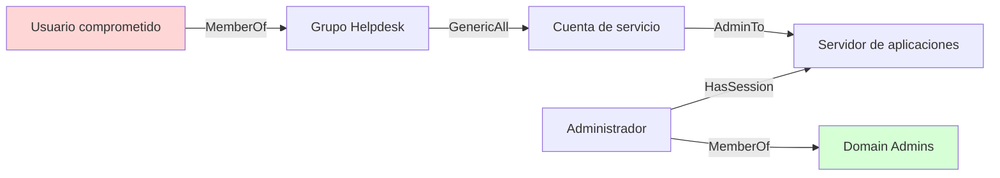

# Clase 173 — BloodHound y análisis de rutas de ataque

> Parte: **7 — Red Team y operaciones ofensivas** · Fuente: *SpecterOps — BloodHound documentation*
> ⏱️ Duración estimada: **100 min** · Nivel: **Avanzado**

---

## 🎯 Objetivo

Usar BloodHound para modelar Active Directory como un grafo y descubrir rutas de ataque hacia el compromiso de dominio que serían invisibles a simple vista. El alumno recolectará datos con SharpHound/bloodhound-python, importará el grafo y usará las consultas para encontrar el camino más corto de un usuario de bajo privilegio a Domain Admin.

## 📚 Resultados de aprendizaje

Al finalizar, el alumno podrá:

1. **Recolectar** datos de AD con SharpHound o bloodhound-python.
2. **Importar** y navegar el grafo en BloodHound (CE/legacy).
3. **Interpretar** las aristas abusables (GenericAll, WriteDACL, AddMember, etc.).
4. **Encontrar** el camino más corto a Domain Admins.
5. **Priorizar** rutas por sigilo y facilidad de explotación.

## 🗺️ Temas

| # | Tema | Por qué importa |
|---|------|-----------------|
| 1 | Modelo de grafo | Nodos (usuarios/equipos) y aristas (permisos) |
| 2 | Collectors | SharpHound, bloodhound-python, métodos |
| 3 | Aristas abusables | GenericAll, WriteDACL, ForceChangePassword... |
| 4 | Consultas predefinidas | "Shortest path to Domain Admins" |
| 5 | Cypher personalizado | Consultas a medida sobre el grafo |
| 6 | Priorización de rutas | Sigilo vs facilidad |
| 7 | Uso defensivo | El Blue Team también lo usa |

## 🧠 Explicación en profundidad

### BloodHound cambia la pregunta

Una auditoría puede listar miembros de grupos privilegiados y no detectar que una cuenta ordinaria controla indirectamente a uno de ellos. BloodHound modela identidades, equipos, grupos, sesiones y permisos como un **grafo dirigido**. La pregunta deja de ser «¿quién es administrador?» y pasa a ser «¿qué secuencia de relaciones conecta una identidad controlada con un activo crítico?».

Un nodo representa una entidad; una arista expresa una relación con dirección y semántica. `MemberOf` no significa lo mismo que `GenericAll`, y `HasSession` describe estado observado, no un permiso permanente. Leer solo la línea visual sin consultar el significado de la arista produce conclusiones falsas.



El camino es una **hipótesis**: hay que confirmar que los datos siguen vigentes, que la ACE no está condicionada por herencia, que el servidor es alcanzable y que la sesión continúa existiendo. BloodHound prioriza la validación; no garantiza todos los saltos.

### Calidad y temporalidad de los datos

La recolección combina objetos relativamente estables —grupos o ACL— con estados volátiles —sesiones—. Cada conjunto necesita marca de tiempo, identidad recolectora, métodos habilitados y cobertura. Importar datos antiguos con datos nuevos puede dibujar rutas que nunca coexistieron. Antes de informar una ruta se registra cuándo se observó cada relación y se vuelve a consultar el salto crítico.

La cuenta colectora también condiciona visibilidad. Que no aparezca una relación puede significar que no existe, que no fue consultada o que la identidad no pudo verla. Ausencia en el grafo no equivale automáticamente a ausencia de riesgo.

### Ruta más corta no significa mejor remediación

El camino con menos aristas ayuda a explorar, pero el control defensivo se elige por alcance y efecto. Quitar una ACE heredada mal concedida puede cortar cientos de rutas; cerrar una sesión corta una relación transitoria. La remediación identifica el **punto de control** que reduce mayor exposición sin romper administración legítima.

Conviene etiquetar activos de alto valor y puntos de entrada realistas, y comparar rutas antes y después de un cambio. Así BloodHound valida delegaciones de helpdesk, separación de niveles, cuentas de servicio y lugares donde inician sesión administradores.

### Del grafo al hallazgo demostrable

El informe conserva consulta, versión de datos y aristas relevantes. Para cada salto explica requisito, evidencia, limitación y medida defensiva. La demostración se detiene cuando el impacto queda probado; no hace falta recorrer hasta el control total si una modificación segura y reversible valida la relación crítica.

## 📖 Definiciones y características

- **BloodHound**: herramienta que modela AD como grafo para hallar rutas de ataque. Característica: convierte relaciones complejas en caminos visibles.
- **SharpHound**: collector que extrae objetos y relaciones del dominio. Característica: genera JSON/zip para importar.
- **Arista abusable**: relación de permiso explotable (ej. `GenericAll`). Característica: define un "salto" en la ruta.
- **GenericAll / WriteDACL**: control total o sobre la ACL de un objeto. Característica: permiten tomar control de cuentas/grupos.
- **Cypher**: lenguaje de consulta de grafos (Neo4j). Característica: permite preguntas personalizadas.
- **Attack path**: secuencia de aristas de un nodo controlado a uno objetivo. Característica: el "mapa" del ataque.

## 📔 Glosario

- **Grafo dirigido:** nodos conectados por relaciones con dirección.
- **Nodo:** entidad modelada, como usuario, grupo, equipo o dominio.
- **Arista:** relación tipada entre dos nodos.
- **Semántica de arista:** condiciones exactas bajo las que una relación representa capacidad o estado.
- **Attack path:** secuencia potencial desde un punto inicial hasta un objetivo.
- **Punto de entrada:** identidad o activo considerado inicialmente controlado.
- **Activo de alto valor:** entidad cuya afectación tendría impacto significativo.
- **SharpHound:** recolector oficial de datos de Active Directory para BloodHound.
- **Cypher:** lenguaje de consulta de grafos.
- **Relación transitoria:** arista dependiente de un estado cambiante.
- **Punto de control:** cambio defensivo capaz de interrumpir una o varias rutas.

## 🧰 Herramientas y preparación

- [BloodHound CE](https://github.com/SpecterOps/BloodHound) (Docker) o BloodHound legacy + Neo4j.
- **SharpHound** (Windows) o **bloodhound-python** desde Linux.
- El AD lab / GOAD con datos de las clases anteriores (recolección de la Clase 170).
- Credenciales de bajo privilegio como punto de partida del análisis.

> ⚠️ La recolección se realiza en tu AD lab / GOAD. En engagements reales, SharpHound genera telemetría notable (consultas LDAP masivas): planifícalo con OPSEC. Nunca ejecutes collectors contra dominios ajenos sin autorización.

## 🧪 Laboratorio guiado

1. **Levanta BloodHound CE:** `curl -L https://ghst.ly/getbhce | docker compose -f - up` (o el método del repo) y accede a la consola web.
2. **Recolecta con bloodhound-python:**

   ```bash
   bloodhound-python -u lowuser -p 'Passw0rd' -d lab.local -ns 10.10.10.10 -c All
   ```

   o `SharpHound.exe -c All` desde una máquina del dominio.
3. **Importa** los archivos zip/JSON en BloodHound y confirma que aparecen usuarios, equipos y grupos.
4. **Marca tu punto de partida.** Señala tu usuario de bajo privilegio como "Owned".
5. **Ejecuta la consulta clave:** "Shortest Path to Domain Admins from Owned Principals" y analiza las aristas del camino.
6. **Explora aristas.** Haz clic en una arista `GenericAll` y lee la ayuda de abuso (cómo explotarla con `net`, PowerView, Impacket).
7. **Cypher a medida.** Escribe una consulta para listar usuarios kerberoastables con camino a DA y prioriza la ruta más sigilosa.

## ✍️ Ejercicios

1. Recolecta el lab con dos collectors distintos y compara los resultados.
2. Encuentra el camino más corto de tu usuario a Domain Admins.
3. Explica cómo se abusa de `WriteDACL` sobre un grupo.
4. Escribe una consulta Cypher que liste equipos con Unconstrained Delegation.
5. Prioriza dos rutas por sigilo y justifica tu elección.
6. Usa BloodHound de forma defensiva: identifica una relación peligrosa que recomendarías eliminar.

## 📝 Reto verificable

Con BloodHound, identifica y **documenta una ruta completa** desde un usuario de bajo privilegio hasta Domain Admins en tu AD lab, explicando cómo se abusa de cada arista del camino.
**Criterio de aceptación:** presentas el grafo con la ruta resaltada, listas cada arista en orden con la técnica concreta de abuso, y señalas cuál es el "salto" más ruidoso de la cadena.

## ⚠️ Errores comunes

| Síntoma / mensaje | Causa y cómo arreglar |
|-------------------|-----------------------|
| No hay caminos a DA | Datos incompletos; recolecta con `-c All` y marca "Owned" |
| Importación falla | Versión de collector incompatible con BloodHound CE; usa versiones emparejadas |
| Grafo vacío | Neo4j no conectado o import erróneo; revisa credenciales de Neo4j |
| SharpHound detectado | Recolección ruidosa; usa métodos más selectivos y espaciados |
| Aristas sin sentido | Datos viejos; vuelve a recolectar tras cambios en el lab |

## ❓ Preguntas frecuentes

**❓ ¿BloodHound explota por mí?**
No; identifica las rutas y explica cómo abusarlas, pero la explotación la ejecutas tú con otras herramientas (PowerView, Impacket, Rubeus).

**❓ ¿CE o legacy?**
BloodHound CE es la versión actual y recomendada. La legacy sigue documentada, pero CE trae mejor rendimiento y despliegue con Docker.

**❓ ¿También sirve para defender?**
Sí. Los defensores lo usan para encontrar y cortar rutas peligrosas (relaciones ACL excesivas) antes de que un atacante las explote.

## 🔗 Referencias

- SpecterOps — *BloodHound: Attack Paths*. <https://bloodhound.specterops.io/analyze-data/findings/attack-paths> — fuente principal para nodos iniciales, objetivos, rutas y remediación.
- SpecterOps — *BloodHound CE documentation*. <https://bloodhound.specterops.io/> — referencia oficial para recolección, importación y semántica del modelo.
- SpecterOps — repositorio oficial de BloodHound. <https://github.com/SpecterOps/BloodHound> — fuente usada para fijar la versión del software desplegado en el laboratorio.
- Microsoft — *Best Practices for Securing Active Directory*. <https://learn.microsoft.com/en-us/windows-server/identity/ad-ds/plan/security-best-practices/best-practices-for-securing-active-directory> — fundamento de mínimo privilegio y administración segura.
- bloodhound-python. <https://github.com/dirkjanm/BloodHound.py> — documentación del recolector alternativo utilizado en el laboratorio.
- The Hacker Recipes — *DACL abuse*. <https://www.thehacker.recipes/ad/movement/dacl/> — apoyo práctico; cada conclusión se valida contra la semántica oficial de la arista.

## 📥 Material descargable

- 📄 [Guía en PDF](./clase-173-guia.pdf) — versión imprimible de esta clase.
- 🎞️ [Presentación (PPTX)](./clase-173-presentacion.pptx) — deck para proyectar en clase.

## ⬅️ Clase anterior

[Clase 172 — Active Directory: Pass-the-Hash y Pass-the-Ticket](../172-active-directory-pass-the-hash-y-pass-the-ticket/README.md)

## ➡️ Siguiente clase

[Clase 174 — Compromiso total de dominio: DCSync y Golden Ticket](../174-compromiso-total-de-dominio-dcsync-y-golden-ticket/README.md)
