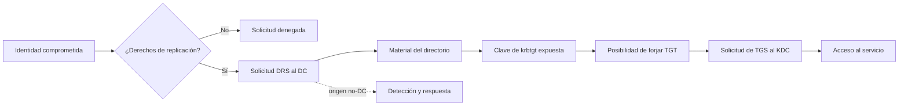

# Clase 174 — Compromiso total de dominio: DCSync y Golden Ticket

> Parte: **7 — Red Team y operaciones ofensivas** · Fuente: *The Hacker Recipes / MITRE ATT&CK T1003.006, T1558.001*
> ⏱️ Duración estimada: **110 min** · Nivel: **Experto**

---

## 🎯 Objetivo

Ejecutar las técnicas que representan el "game over" de un dominio: DCSync (replicar el directorio para robar todos los hashes, incluido el de `krbtgt`) y Golden Ticket (forjar un TGT válido para cualquier usuario). El alumno comprenderá por qué estas técnicas otorgan control total y persistente, y cómo se detectan pese a su sigilo.

## 📚 Resultados de aprendizaje

Al finalizar, el alumno podrá:

1. **Demostrar** en un dominio desechable cómo una identidad con derechos de replicación puede solicitar material de `krbtgt`, limitando y registrando el alcance.
2. **Forjar** un Golden Ticket y usarlo para acceso arbitrario.
3. **Explicar** por qué `krbtgt` es la clave maestra del dominio.
4. **Distinguir** Golden Ticket de Silver Ticket.
5. **Detectar** DCSync y tickets forjados con la telemetría adecuada.

## 🗺️ Temas

| # | Tema | Por qué importa |
|---|------|-----------------|
| 1 | Derechos de replicación | Base del abuso DCSync |
| 2 | DCSync (`T1003.006`) | Abusar de replicación sin una extracción local convencional en el DC |
| 3 | El hash de krbtgt | Clave para forjar TGTs |
| 4 | Golden Ticket (`T1558.001`) | Un TGT forjado compromete la confianza del dominio |
| 5 | Silver Ticket | TGS forjado para un servicio |
| 6 | Persistencia y peligro | Sobrevive a cambios de contraseña |
| 7 | Detección | DCSync y tickets anómalos |

## 🧠 Explicación en profundidad

### DCSync abusa de autorización de replicación

Los controladores de dominio replican cambios para mantener copias coherentes del directorio. DCSync imita solicitudes de replicación con una identidad que posee derechos suficientes, como `DS-Replication-Get-Changes` y derechos adicionales según los datos pedidos. No explota una contraseña por sí mismo: explota una **delegación de alto impacto** o una identidad ya privilegiada.

La consecuencia es grave porque puede exponer material de credenciales sin una extracción convencional dentro de LSASS del DC. Pero decir que «parece totalmente legítimo» es excesivo. La defensa puede identificar solicitudes desde equipos que no son controladores, revisar quién posee derechos de replicación y correlacionar cambios de ACL previos con actividad de red y directorio.



### Golden Ticket es una consecuencia, no el primer paso

ATT&CK define `T1558.001` como la forja de un TGT mediante material de `krbtgt`. También se necesita contexto correcto del dominio. El ticket permite representar identidades y solicitar tickets de servicio; comprometer `krbtgt` transforma así un incidente de cuenta en un incidente de confianza de dominio.

Un **Silver Ticket** usa la clave de una cuenta de servicio para forjar un ticket destinado a ese servicio. Su alcance es menor y la ruta puede evitar parte de la interacción normal con el KDC, lo cual cambia la detección. TGT y TGS no son intercambiables: el secreto empleado determina alcance y observabilidad.

### Recuperar confianza requiere coordinación

Microsoft indica que, durante la recuperación de un bosque, la contraseña de `krbtgt` debe restablecerse dos veces y entre ambos cambios se debe esperar más que la vida máxima configurada de los tickets —diez horas con los valores predeterminados citados—. «Dos resets inmediatos» no es una receta válida. Antes se comprueba salud de replicación, control de los DC, alcance del compromiso y continuidad; de lo contrario pueden producirse fallos de autenticación o reintroducirse claves comprometidas.

El cambio de `krbtgt` tampoco limpia cuentas persistentes, ACL maliciosas, claves de servicio ni endpoints comprometidos. La respuesta revisa derechos de replicación, administradores, confianzas, GPO, cuentas de equipo y servicios. Si queda una ruta privilegiada, las nuevas claves pueden volver a exponerse.

### Qué demuestra el laboratorio

El resultado debe probar la cadena causal: derecho de replicación observado, solicitud desde origen no esperado, material afectado, consecuencia sobre tickets y señales disponibles. La restauración revierte delegaciones, rota secretos en el orden documentado y verifica que la hipótesis ya no funciona. Esa comparación produce conocimiento defensivo, no solo una captura de «Domain Admin».

## 📖 Definiciones y características

- **DCSync**: abusar de derechos de replicación para solicitar datos sensibles al DC. Característica: usa operaciones de replicación, pero el origen no-DC y las delegaciones anómalas pueden detectarse.
- **krbtgt**: cuenta cuyo hash cifra todos los TGT del dominio. Característica: quien lo tiene, forja identidad de cualquiera.
- **Golden Ticket**: TGT forjado con material de clave de `krbtgt`. Característica: permite representar identidades; el acceso real depende de servicio, conectividad y controles.
- **Silver Ticket**: TGS forjado con material de clave de una cuenta de servicio. Característica: alcance limitado al servicio y una secuencia de telemetría distinta, no invisibilidad garantizada.
- **Derechos de replicación**: permisos que normalmente tienen los DCs (y DA). Característica: si un usuario los obtiene, puede DCSync.
- **KRBTGT reset**: rotación coordinada de las claves de `krbtgt` según la guía de recuperación. Característica: dos cambios separados por la vida configurada de tickets retiran claves anteriores, pero no erradican otras persistencias.

## 📔 Glosario

- **Replicación de directorio:** intercambio de cambios entre controladores para mantener AD DS coherente.
- **DRS:** protocolos y operaciones empleados en la replicación de Active Directory.
- **Derecho extendido:** permiso específico que autoriza operaciones más allá de lectura o escritura genérica.
- **DCSync:** solicitud de datos de replicación abusando de derechos equivalentes a los necesarios para replicar.
- **krbtgt:** cuenta especial cuyas claves usa el KDC para proteger TGT.
- **Golden Ticket:** TGT forjado con material de `krbtgt`.
- **Silver Ticket:** ticket de servicio forjado con la clave de una cuenta de servicio.
- **Vida máxima del ticket:** periodo configurado durante el cual un ticket puede aceptarse.
- **Rotación de claves:** sustitución controlada de secretos y retirada de valores anteriores.
- **Salud de replicación:** estado que confirma que los DC intercambian cambios correctamente.
- **Compromiso de confianza:** incidente que afecta la base criptográfica o administrativa del dominio.

## 🧰 Herramientas y preparación

- AD lab / GOAD con una cuenta que tenga (o a la que hayas concedido, vía una ruta de BloodHound) derechos de replicación.
- **Impacket** `secretsdump.py` para DCSync; **Mimikatz** para DCSync y forja de tickets; **Rubeus** como alternativa.
- Acceso previo con privilegios altos (DA o equivalente) obtenido en las clases anteriores.

> ⚠️ Estas son las técnicas más críticas del curso: se practican **exclusivamente** en tu AD lab / GOAD. Un Golden Ticket real es un compromiso catastrófico. Nunca las uses fuera de un laboratorio propio o un engagement con autorización escrita explícita.

## 🧪 Laboratorio guiado

1. **Verifica los derechos.** Confirma que tu cuenta (o una ruta de BloodHound) tiene `DS-Replication-Get-Changes-All`.
2. **DCSync con Impacket:**

   ```bash
   secretsdump.py lab.local/dauser:pass@10.10.10.10 -just-dc-user krbtgt
   ```

   Extrae el hash NTLM de `krbtgt` (y de cuentas objetivo).
3. **Anota el SID del dominio:** `Get-DomainSID` o con `lookupsid.py`.
4. **Forja el Golden Ticket (Mimikatz):**

   ```text
   kerberos::golden /user:Administrator /domain:lab.local /sid:<DOMAIN_SID> /krbtgt:<HASH> /ptt
   ```

5. **Usa el ticket.** Con el TGT forjado inyectado, accede al DC: `dir \\dc01.lab.local\C$` o `psexec.py` sin credenciales adicionales.
6. **Silver Ticket (comparación).** En el dominio desechable, compara un TGS de prueba para un servicio concreto con el flujo normal. Observa qué solicitud al KDC falta y qué telemetría permanece en servicio, host y red; no concluyas sigilo solo por ausencia de un evento.
7. **Detección.** Revisa el evento `4662` (acceso a objeto con GUID de replicación) para DCSync y anomalías en la vida/PAC de los tickets para Golden Ticket.

## ✍️ Ejercicios

1. Explica por qué el hash de krbtgt permite forjar identidad de cualquier usuario.
2. Ejecuta DCSync y extrae el hash de krbtgt del lab.
3. Forja un Golden Ticket y accede al DC.
4. Forja un Silver Ticket y compáralo con el Golden en sigilo.
5. Explica por qué hay que resetear krbtgt dos veces.
6. Escribe la lógica de detección basada en el evento 4662.

## 📝 Reto verificable

Demuestra en un **dominio desechable** la cadena DCSync → compromiso de `krbtgt` → ticket forjado contra un recurso marcador preparado por la white cell, y restaura después el snapshot.
**Criterio de aceptación:** documentas el derecho que habilitó la replicación, la identidad y origen de la solicitud, el ticket observado con `klist`, las señales defensivas y un plan de recuperación que respeta la espera indicada por Microsoft. No se usan datos reales ni se deja persistencia.

## ⚠️ Errores comunes

| Síntoma / mensaje | Causa y cómo arreglar |
|-------------------|-----------------------|
| DCSync `access denied` | Falta el derecho de replicación; usa una cuenta/ruta que lo tenga |
| Golden Ticket no funciona | SID o hash de krbtgt incorrectos; verifica ambos |
| El ticket expira raro | Vida por defecto muy larga delata; ajusta tiempos realistas |
| Silver no accede | Hash o SPN equivocado; usa el hash de la cuenta correcta |
| Detectado por 4662 | DCSync desde un host no-DC es anómalo; asúmelo como telemetría |

## ❓ Preguntas frecuentes

**❓ ¿Por qué DCSync no "toca" el DC como un dump?**
Porque usa el protocolo de replicación legítimo (MS-DRSR): pide los datos como lo haría otro DC. Por eso es sigiloso, aunque el evento 4662 lo revela.

**❓ ¿Cambiar la contraseña de Administrator invalida el Golden Ticket?**
No. Solo resetear krbtgt (dos veces) invalida los golden tickets. Por eso es la peor persistencia posible.

**❓ ¿Golden o Silver Ticket?**
Golden afecta la confianza de emisión de TGT del dominio; Silver se limita a la clave y servicio asociados. Su detectabilidad depende de la telemetría y del procedimiento: que una ruta no solicite un TGS al KDC no la vuelve invisible en el servicio o endpoint.

## 🔗 Referencias

- MITRE ATT&CK — *DCSync* (`T1003.006`). <https://attack.mitre.org/techniques/T1003/006/> — requisitos de replicación, mitigaciones y detección.
- MITRE ATT&CK — *Golden Ticket* (`T1558.001`). <https://attack.mitre.org/techniques/T1558/001/> — relación entre clave de `krbtgt`, TGT forjado y solicitudes TGS.
- Microsoft — *AD Forest Recovery: Reset the krbtgt password*. <https://learn.microsoft.com/en-us/windows-server/identity/ad-ds/manage/forest-recovery-guide/ad-forest-recovery-reset-the-krbtgt-password> — procedimiento oficial, doble restablecimiento y espera basada en la vida de tickets.
- Microsoft — *Best Practices for Securing Active Directory*. <https://learn.microsoft.com/en-us/windows-server/identity/ad-ds/plan/security-best-practices/best-practices-for-securing-active-directory> — protección de controladores, cuentas privilegiadas y recuperación.
- Impacket. <https://github.com/fortra/impacket> — documentación de `secretsdump` utilizada solo para la demostración controlada.

## 📥 Material descargable

- 📄 [Guía en PDF](./clase-174-guia.pdf) — versión imprimible de esta clase.
- 🎞️ [Presentación (PPTX)](./clase-174-presentacion.pptx) — deck para proyectar en clase.

## ⬅️ Clase anterior

[Clase 173 — BloodHound y análisis de rutas de ataque](../173-bloodhound-y-analisis-de-rutas-de-ataque/README.md)

## ➡️ Siguiente clase

[Clase 175 — Persistencia en Active Directory](../175-persistencia-en-active-directory/README.md)
