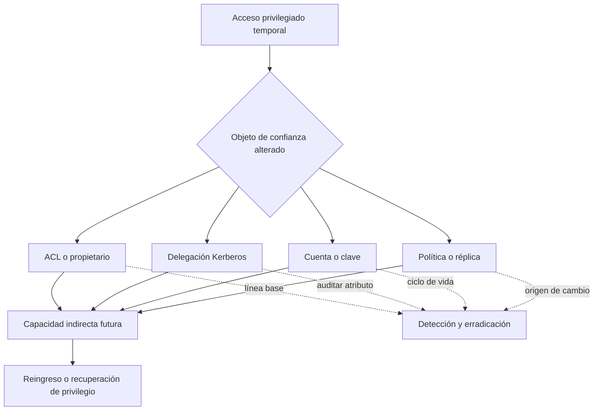

# Clase 175 — Persistencia en Active Directory

> Parte: **7 — Red Team y operaciones ofensivas** · Fuente: *The Hacker Recipes / MITRE ATT&CK Persistence (TA0003)*
> ⏱️ Duración estimada: **100 min** · Nivel: **Experto**

---

## 🎯 Objetivo

Estudiar las técnicas para mantener el acceso a un dominio comprometido a lo largo del tiempo, sobreviviendo a reinicios y remediaciones parciales: DCShadow, AdminSDHolder, delegación abusiva, ACLs persistentes, Golden/Diamond Ticket y cuentas ocultas. El alumno aprenderá a instalar y, sobre todo, a **detectar y erradicar** persistencia en su AD lab.

## 📚 Resultados de aprendizaje

Al finalizar, el alumno podrá:

1. **Instalar** persistencia basada en ACLs (AdminSDHolder, DCSync rights) en el lab.
2. **Explicar** DCShadow y por qué es difícil de detectar.
3. **Abusar** de delegación (constrained/unconstrained) como persistencia.
4. **Comparar** técnicas por sigilo y durabilidad.
5. **Diseñar** un plan de erradicación tras un compromiso.

## 🗺️ Temas

| # | Tema | Por qué importa |
|---|------|-----------------|
| 1 | AdminSDHolder / SDProp | Reinyecta permisos cada hora |
| 2 | ACLs persistentes | DCSync rights a un usuario "normal" |
| 3 | DCShadow | Registrar un DC falso para escribir cambios |
| 4 | Delegación abusiva | RBCD, unconstrained como backdoor |
| 5 | Diamond/Golden Ticket | Persistencia por tickets forjados |
| 6 | Cuentas y credenciales ocultas | Shadow admins, DSRM |
| 7 | Erradicación | Cómo el Blue Team limpia de verdad |

## 🧠 Explicación en profundidad

### Persistir en AD significa modificar relaciones de confianza

La persistencia de dominio no se limita a crear una cuenta. Puede esconderse en permisos, delegaciones, políticas, cuentas de equipo, claves de servicio o configuraciones que sobreviven al cierre de sesión. Su rasgo común es conservar capacidad de acceso después de perder el camino inicial. Por eso revisar solo `Domain Admins` deja fuera a los **shadow admins**: identidades con control equivalente mediante relaciones indirectas.

Cada cambio tiene tres dimensiones: objeto modificado, autoridad necesaria y proceso que vuelve efectivo el cambio. Documentarlas permite detectar y revertir sin depender del nombre de una herramienta.



### AdminSDHolder y SDProp: plantilla y propagación

Microsoft describe `AdminSDHolder` como el objeto cuya ACL sirve de plantilla para cuentas y grupos protegidos. `SDProp`, ejecutado por defecto cada 60 minutos en el DC con rol de emulador PDC, compara y restablece sus descriptores de seguridad. Alterar la plantilla puede propagar permisos no deseados; modificar una cuenta protegida directamente puede ser revertido por el proceso.

Esto explica además un problema legítimo: al retirar una cuenta de un grupo protegido, `adminCount` y la herencia pueden no volver automáticamente al estado esperado. La respuesta no borra permisos a ciegas; compara una línea base, determina si la cuenta aún requiere protección y restaura herencia de forma controlada.

### Delegación y control de recursos

En RBCD, el recurso destino define qué principal puede actuar en nombre de usuarios frente a él mediante un atributo de la cuenta de equipo. El riesgo no es que la característica sea maliciosa, sino que una identidad no prevista pueda modificar ese objeto. La mitigación revisa derechos de escritura sobre cuentas de equipo y monitoriza cambios del atributo, además de proteger las identidades delegadas.

DCShadow pertenece a otra categoría: introducir cambios mediante el flujo de replicación. La detección mira registro de controladores, topología y origen de replicación, no solo modificaciones LDAP. DSRM es una capacidad de recuperación del DC; su configuración y uso remoto deben restringirse y auditarse. Son mecanismos distintos y no una sola «técnica invisible».

### Erradicar exige demostrar que la capacidad desapareció

Se parte de una instantánea de objetos privilegiados, ACL, propietarios, delegaciones, GPO, cuentas de equipo y derechos de replicación. Después se revoca la relación persistente, se rotan secretos afectados y se repite el análisis de rutas. El cierre requiere evidencia de que la identidad ya no conserva un camino y no existe una modificación equivalente. Restaurar solo el indicador visible deja intacta la causa.

## 📖 Definiciones y características

- **AdminSDHolder**: objeto cuya ACL se propaga a cuentas protegidas cada ~60 min (SDProp). Característica: modificarla reinyecta permisos aunque los borren.
- **DCShadow**: registrar temporalmente un DC ilegítimo para inyectar cambios replicados. Característica: evita muchos logs de modificación.
- **RBCD (Resource-Based Constrained Delegation)**: delegación configurable por el objeto destino. Característica: abusable como puerta trasera de acceso.
- **DSRM**: cuenta local de recuperación del DC. Característica: su posibilidad de inicio de sesión y uso remoto depende de configuración y debe restringirse y auditarse.
- **Diamond Ticket**: TGT legítimamente emitido cuyo contenido se modifica usando material de `krbtgt`. Característica: cambia algunos artefactos frente a un Golden Ticket, pero no garantiza menor detección.
- **Shadow admin**: cuenta sin membresía obvia pero con permisos equivalentes vía ACLs. Característica: invisible a auditorías superficiales.

## 📔 Glosario

- **Persistencia:** capacidad de conservar acceso tras perder el vector inicial.
- **Shadow admin:** principal con capacidad administrativa indirecta sin membresía privilegiada evidente.
- **AdminSDHolder:** objeto que contiene la plantilla de permisos para objetos protegidos.
- **SDProp:** proceso que compara y propaga descriptores de seguridad a objetos protegidos.
- **adminCount:** atributo asociado a protección administrativa que debe interpretarse con herencia y membresías.
- **RBCD:** delegación Kerberos donde el recurso destino especifica principales autorizados.
- **Cuenta de equipo:** principal de seguridad que representa un sistema unido al dominio.
- **DCShadow:** abuso del flujo de replicación para introducir cambios desde un controlador no autorizado.
- **DSRM:** modo y cuenta de recuperación local para mantenimiento de un DC.
- **Línea base de privilegios:** inventario aprobado de permisos, propietarios y delegaciones sensibles.
- **Erradicación:** eliminación de la capacidad persistente y de la causa que permitió establecerla.

## 🧰 Herramientas y preparación

- AD lab / GOAD con acceso previo de alto privilegio (de la Clase 174).
- **Mimikatz** (DCShadow, DSRM), **PowerView**/`Set-DomainObjectOwner`, **Impacket**, **Rubeus** para tickets.
- Sysmon + auditoría de cambios en AD (Parte 8) para la fase de detección.

> ⚠️ Instalar persistencia se practica **solo** en tu AD lab. En un engagement real, toda persistencia debe registrarse meticulosamente y **retirarse** al finalizar; dejar puertas traseras es negligente e ilegal. El foco pedagógico aquí es la erradicación tanto como la instalación.

## 🧪 Laboratorio guiado

1. **ACL DCSync persistente.** Concede a un usuario de bajo privilegio los derechos de replicación:

   ```text
   Add-DomainObjectAcl -TargetIdentity 'DC=lab,DC=local' -PrincipalIdentity lowuser -Rights DCSync
   ```

   Verifica que ahora puede hacer DCSync.
2. **AdminSDHolder.** Añade una ACE a `CN=AdminSDHolder,CN=System,...` para tu usuario y espera al ciclo SDProp; comprueba que recupera permisos sobre cuentas protegidas.
3. **DCShadow (estudio).** Con Mimikatz, comprende cómo `lsadump::dcshadow` registra un DC falso para escribir un atributo (ej. SID History) evitando logs habituales.
4. **RBCD como backdoor.** Configura delegación basada en recursos sobre una máquina para poder impersonar administradores hacia ella.
5. **DSRM.** Estudia cómo habilitar el logon de red con la cuenta DSRM del DC y por qué es persistencia sigilosa.
6. **Detección.** Audita cambios de ACL (evento `5136`), la cuenta AdminSDHolder y objetos con delegación inusual.
7. **Erradicación.** Escribe y ejecuta un checklist: revisar ACLs, resetear krbtgt dos veces, revisar delegaciones, DSRM y cuentas ocultas.

## ✍️ Ejercicios

1. Instala persistencia por ACL DCSync y demuéstrala.
2. Explica por qué AdminSDHolder es tan resistente a la limpieza.
3. Describe el flujo de DCShadow y qué lo hace sigiloso.
4. Configura RBCD y úsalo para impersonar a un admin en el lab.
5. Compara Golden vs Diamond Ticket en detectabilidad.
6. Redacta un checklist de erradicación de persistencia en AD.

## 📝 Reto verificable

Instala **dos técnicas de persistencia distintas** en tu AD lab, luego cambia de rol y **detéctalas y erradícalas** documentando cómo lo harías como Blue Team.
**Criterio de aceptación:** demuestras que ambas persistencias otorgan acceso tras un "reinicio" o cambio de contraseña de la cuenta original, y luego presentas los eventos/consultas que las detectan y el procedimiento que las elimina por completo. Todo en tu laboratorio.

## ⚠️ Errores comunes

| Síntoma / mensaje | Causa y cómo arreglar |
|-------------------|-----------------------|
| La persistencia por ACL se borra | No usaste AdminSDHolder; SDProp la reinyecta si la pones ahí |
| DCShadow falla | Requiere privilegios altos y condiciones específicas; revisa requisitos |
| RBCD no impersona | msDS-AllowedToActOnBehalfOfOtherIdentity mal configurado; corrige el descriptor |
| Erradicación incompleta | Olvidaste resetear krbtgt (x2) o revisar delegaciones; usa el checklist |
| Persistencia detectada al instante | Cambios de ACL auditados (5136); es telemetría esperable |

## ❓ Preguntas frecuentes

**❓ ¿Por qué basta un reset simple de contraseñas para NO limpiar el dominio?**
Porque la persistencia moderna vive en ACLs, delegaciones y krbtgt, no en contraseñas de usuario. La erradicación exige revisar el directorio, no solo credenciales.

**❓ ¿DCShadow deja rastro?**
Menos que una modificación normal, pero el registro efímero del DC falso y ciertos eventos de replicación pueden delatarlo con la auditoría adecuada.

**❓ ¿Cuándo se retira la persistencia en un engagement real?**
Siempre al cierre, con inventario completo de lo instalado. Dejar persistencia es una falta grave: se documenta y se elimina.

## 🔗 Referencias

- Microsoft — *Protected Accounts and Groups in Active Directory*. <https://learn.microsoft.com/en-us/previous-versions/windows/it-pro/windows-server-2012-r2-and-2012/dn535499%28v%3Dws.11%29> — fuente principal para AdminSDHolder, SDProp, herencia e intervalo predeterminado.
- Microsoft — *Accounts security posture assessments*. <https://learn.microsoft.com/en-us/defender-for-identity/security-posture-assessments/accounts> — referencia defensiva para permisos sospechosos sobre AdminSDHolder, DCSync y `krbtgt`.
- MITRE ATT&CK — *Domain or Tenant Policy Modification* (`T1484`). <https://attack.mitre.org/techniques/T1484/> — clasificación de cambios de GPO, delegación, confianzas y controladores no autorizados.
- MITRE ATT&CK — *Account Manipulation* (`T1098`). <https://attack.mitre.org/techniques/T1098/> — base para persistencia mediante cuentas y material de autenticación.
- Microsoft — *Best Practices for Securing Active Directory*. <https://learn.microsoft.com/en-us/windows-server/identity/ad-ds/plan/security-best-practices/best-practices-for-securing-active-directory> — sustenta línea base, mínimo privilegio y protección administrativa.

## 📥 Material descargable

- 📄 [Guía en PDF](./clase-175-guia.pdf) — versión imprimible de esta clase.
- 🎞️ [Presentación (PPTX)](./clase-175-presentacion.pptx) — deck para proyectar en clase.

## ⬅️ Clase anterior

[Clase 174 — Compromiso total de dominio: DCSync y Golden Ticket](../174-compromiso-total-de-dominio-dcsync-y-golden-ticket/README.md)

## ➡️ Siguiente clase

[Clase 176 — OPSEC ofensiva](../176-opsec-ofensiva/README.md)
