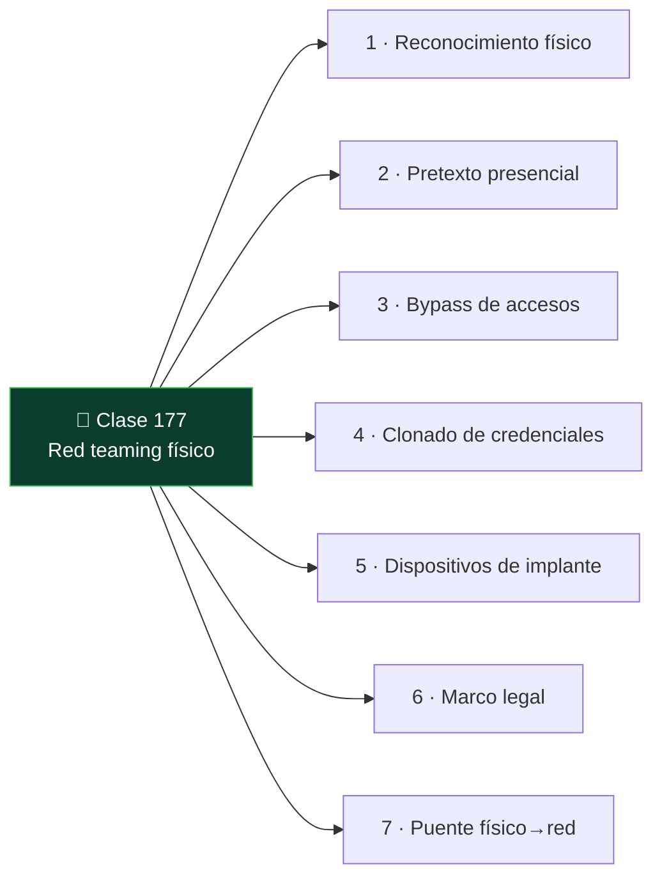

# Clase 177 — Red teaming físico

<!-- cabecera:inicio -->

> 🗂️ Parte: **7 — Red Team y operaciones ofensivas** · 📖 Fuente: *Operator Handbook (T. Bryant) / literatura de physical pentesting*
> ⏱️ Duración estimada: **90 min** · 🎚️ Nivel: **Intermedio**

<!-- cabecera:fin -->

---

## 🎯 Objetivo

Comprender la dimensión física del Red Team: cómo un atacante entra a un edificio, elude controles de acceso, clona credenciales, coloca dispositivos y usa ingeniería social presencial para lograr un foothold. El alumno aprenderá el proceso, las herramientas y —de forma central— el marco legal y ético estricto que hace posible este trabajo.

## 📚 Resultados de aprendizaje

Al finalizar, el alumno podrá:

1. **Planificar** un ejercicio físico con reconocimiento y pretexto.
2. **Explicar** técnicas de bypass de accesos (tailgating, clonado RFID, LPE física).
3. **Describir** dispositivos de implante (dropbox, keyloggers, HID injection).
4. **Redactar** un "get-out-of-jail-free letter" y las RoE físicas.
5. **Integrar** el acceso físico con la operación de red.

## 🗺️ Temas

<!-- mapa:inicio -->

<!-- mapa:fin -->

| # | Tema | Por qué importa |
|---|------|-----------------|
| 1 | Reconocimiento físico | Horarios, accesos, uniformes, badges |
| 2 | Pretexto presencial | Ingeniería social cara a cara |
| 3 | Bypass de accesos | Tailgating, cerraduras, RFID |
| 4 | Clonado de credenciales | Tarjetas RFID/NFC |
| 5 | Dispositivos de implante | Dropbox, HID, keylogger |
| 6 | Marco legal | Autorización, carta de permiso |
| 7 | Puente físico→red | De estar dentro a un foothold |

## 📖 Definiciones y características

- **Tailgating / piggybacking**: entrar detrás de un empleado autorizado. Característica: explota la cortesía humana, no un fallo técnico.
- **Clonado RFID**: copiar una tarjeta de acceso (125 kHz / 13.56 MHz). Característica: posible con lectores portátiles a corta distancia.
- **Dropbox**: dispositivo (ej. una mini-PC) dejado en la red interna con conectividad C2. Característica: convierte el acceso físico en foothold remoto.
- **HID injection**: dispositivo que se hace pasar por teclado (Rubber Ducky) para ejecutar comandos. Característica: rápido y difícil de bloquear por USB storage policies.
- **Get-out-of-jail letter**: carta firmada que autoriza al operador y evita consecuencias legales si es descubierto. Característica: imprescindible; se lleva siempre encima.
- **RoE físicas**: reglas de qué edificios, horarios y métodos están permitidos. Característica: delimitan el ejercicio físico.

## 🧰 Herramientas y preparación

- Herramientas de estudio: Proxmark3/Flipper Zero (RFID), Rubber Ducky/O.MG cable (HID), lockpicks (donde sea legal), una mini-PC como dropbox.
- Cámara y libreta para el reconocimiento; ropa/props para el pretexto.
- La **carta de autorización** firmada y las RoE físicas del engagement.
- Conectividad C2 preparada para el dropbox (Clases 164–165).

> ⚠️ **Marco legal crítico.** El red teaming físico sin autorización escrita es allanamiento y puede acarrear detención. Nunca practiques bypass de accesos, clonado de tarjetas o lockpicking en propiedades que no sean tuyas o sin permiso explícito por escrito. En esta clase practicamos en tu propio entorno (tu tarjeta, tu cerradura, tu lab) y estudiamos el proceso; el resto es teoría.

## 🧪 Laboratorio guiado (entorno propio)

1. **Reconocimiento simulado.** Sobre un edificio ficticio, documenta accesos, horarios, tipos de badge y puntos ciegos que observarías (ejercicio en papel/mapa).
2. **Diseña el pretexto.** Elige uno (técnico de mantenimiento, repartidor) y prepara props y una historia coherente.
3. **Clonado RFID (tu propia tarjeta).** Con un lector, lee y clona **una tarjeta que te pertenezca** para entender el proceso; nunca la de un tercero.
4. **HID injection (tu equipo).** Programa un Rubber Ducky para abrir una shell C2 en **tu** máquina de laboratorio y mide cuánto tarda.
5. **Prepara un dropbox.** Configura una mini-PC/VM que, al conectarse a la red del lab, establezca C2 saliente por el redirector.
6. **Documenta la carta de autorización.** Redacta una plantilla de get-out-of-jail letter con los campos esenciales.
7. **Puente a la red.** Explica cómo el dropbox o el HID te dan el foothold que continuaría en las técnicas de AD ya vistas.

## ✍️ Ejercicios

1. Redacta un plan de reconocimiento físico para un edificio ficticio.
2. Diseña dos pretextos presenciales y evalúa sus riesgos.
3. Explica el clonado RFID y sus límites según la frecuencia.
4. Programa un payload HID que lance una shell en tu lab.
5. Configura un dropbox que llame a casa por C2.
6. Escribe una plantilla de carta de autorización con 8 campos.

## 📝 Reto verificable

Prepara un **kit de operación física (teórico + práctico en tu entorno)**: plan de recon, pretexto, un HID que lanza C2 en tu equipo, un dropbox que establece C2 en tu lab y una carta de autorización.
**Criterio de aceptación:** demuestras el HID abriendo una sesión C2 en tu propia máquina y el dropbox estableciendo C2 en tu lab; entregas el plan de recon, el pretexto y la carta de autorización completa. Nada se prueba fuera de tu propiedad.

## ⚠️ Errores comunes

| Síntoma / mensaje | Causa y cómo arreglar |
|-------------------|-----------------------|
| Sin carta de autorización | Riesgo legal enorme; nunca operes sin ella firmada |
| El clonado RFID no lee | Frecuencia equivocada (125 kHz vs 13.56 MHz); identifica el tipo de tarjeta |
| HID no ejecuta | Layout de teclado distinto; ajusta el mapeo de teclas |
| Dropbox no llama a casa | Egress filtrado; usa un canal permitido (HTTPS por proxy) |
| Pretexto poco creíble | Falta recon; adapta props y discurso al entorno real |

## ❓ Preguntas frecuentes

**❓ ¿El red teaming físico es legal?**
Solo con autorización escrita del propietario y dentro de RoE claras. Sin eso, es allanamiento. La carta de autorización es innegociable.

**❓ ¿Por qué combinar físico y red?**
Porque un atacante real no respeta la frontera: un dropbox o un badge clonado puede saltarse todo el perímetro de red. El ejercicio evalúa esa realidad.

**❓ ¿Puedo practicar lockpicking?**
Solo en cerraduras propias y donde sea legal poseer las herramientas. Varían las leyes por país; infórmate antes.

## 🔗 Referencias

- Bryant, T. — *Operator Handbook*.
- MITRE ATT&CK — *Hardware Additions* (`T1200`). <https://attack.mitre.org/techniques/T1200/>
- TOOOL — *The Open Organisation Of Lockpickers* (recursos educativos). <https://toool.us/>
- Documentación de Proxmark3 y Hak5 (Rubber Ducky) como referencia técnica.

## 📥 Material descargable

- 📄 [Guía en PDF](./clase-177-guia.pdf) — versión imprimible de esta clase.
- 🎞️ [Presentación (PPTX)](./clase-177-presentacion.pptx) — deck para proyectar en clase.

## ⬅️ Clase anterior

[Clase 176 — OPSEC ofensiva](../176-opsec-ofensiva/README.md)

## ➡️ Siguiente clase

[Clase 178 — Purple teaming](../178-purple-teaming/README.md)
